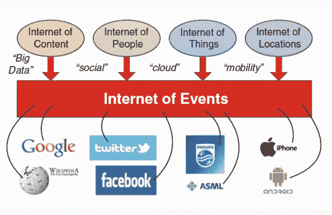

# 你认为数据科学的未来会怎样？

> 原文：<https://towardsdatascience.com/what-does-the-future-of-data-science-hold-for-you-7ae47861dc22?source=collection_archive---------28----------------------->

## 如果我可以用两个词来回答这个问题，那就是——闪亮和有前途。

# 介绍

看看你的周围，到处都是数据。**“每天创建的数据超过 2.5 万亿字节。”**在不久的将来，预计地球上每个人每秒将产生 1.7 Mb 的数据。没错，这个数据是我们产生的，但是你知道这么多数据是怎么分析出来的吗？数据科学家是这一过程的幕后推手。

世界上很多公司都在寻找数据科学家。他们收到的数据既有结构化的也有非结构化的。因此，要使用非结构化数据并从其中获得洞察力，就需要使用数据科学。组织开始意识到管理这些数据的必要性，因此对数据科学家的需求也在增加。

## 现实生活中的用例

现在你可能会想，这些公司可以从客户那里获得反馈，通过满足客户需求来改进他们的服务。那么，他们为什么要为此付出如此巨大的代价呢？他们这样做是因为他们与世界同行，他们已经意识到“变化是唯一不变的”。这不仅仅是分析数据，而是以一种甚至客户都没有意识到的方式来理解客户，是理解市场需求、模式和趋势。你喜欢喜剧节目，但你不会要求网飞专门为你制作。当你开始看一部喜剧时，网飞会自动向你推荐另一部你可能会喜欢的喜剧。所有这一切之所以成为可能，是因为网飞大学的数据科学及其推荐系统。 聪明！不是吗？

我们还可以在这里谈论一些**不令人寒心的项目**，其中使用了数据科学，科学家甚至能够在很大程度上预测未来事件。不相信我？看看这个例子:

在飓风**【Fani】**袭击**印度奥里萨邦海岸**的 13 天前，IMD(印度气象部门)有迹象表明可能会有一场大规模的风暴，他们开始为风暴的爆发做准备。

Image Source:Google

4 月 21 日，基于各种来源的数据，他们预测，条件正在导致低压区的形成。他们收集了降雨量、海面以下和海面以上的温度、风速等数据，并对其进行分析，以预测飓风的强度。

创纪录的**120 万人**(相当于毛里求斯的人口)在不到 48 小时内被疏散，仅仅是因为数据科学家。这是过去 20 年来袭击印度的最强飓风之一。这就是数据科学的力量。您还可以了解 [**数据科学如何用于医疗保健**](https://data-flair.training/blogs/data-science-in-healthcare/) 以及它如何改善患者的生活方式并在早期预测疾病。

现在想象一下这 120 万人克服的灾难。在这里，我可以自豪地说，如果你能拯救别人的未来，你就拯救了自己的未来。这是 2019 年，这一切都是可能的，向前一点，让我们谈谈未来，以及他们在 2020 年和 2025 年的作用。如果他们现在有如此大的需求，那么他们未来的需求会是怎样的呢？毫无疑问，他们是当今世界上收入最高的职业之一。有没有想过他们未来的工资会是多少？

## 数据科学家在 2020 年的角色

到 2020 年，印度将面临数据科学专业人员短缺的问题。这是因为他们需要分析大量数据，做出决策和预测。为此，他们确实需要掌握与统计、数学、数据可视化、机器学习、编码等相关的技能。我们很少发现有如此高水平技能的人。根据 IBM 进行的一项调查，到 2020 年，数据科学家的职位空缺将增加 36.4 万到 272 万。

Image Source: Google

## **根据 LinkedIn，数据科学家的工作简介如下:**

信息技术和服务- *29，300*

计算机软件-*19800*

研究-*13200*

互联网-*7700*

金融服务-*6500*

管理咨询-*3600*

高等教育- *3，000 人*

银行业-*2800*

营销和广告-*2500*

保险-*2200*

## 数据科学家根据他们拥有的技能获得巨额报酬。连 IBM **做的** [**调查都这么说。平均工资为:**](https://data-flair.training/blogs/data-scientists-demand-predictions/)

地图减少- *$115，900*

猪-114，500 美元

机器学习-*11.27 万美元*

阿帕奇蜂房-*11.22 万美元*

Apache Hadoop-*110，600 美元*

大数据-*10.99 万美元*

数据科学-*10.73 万美元*

NoSQL-*:10.5 万美元*

预测分析-*103，200 美元*

MongoDB-*101300 美元*

**未来几年，印度各行各业对数据科学家的需求将增长 400%以上。数据科学家在未来必不可少，因为:**

**有一船的数据**——正如我们在本文第一段中读到的关于定期生成的数据量。需要管理和分析这些数据。通过汲取洞察力，可以做出对业务增长有效的决策。有可能发生的预测或事件在收集的数据的帮助下被识别。

**技能无法匹配** -未来的数据科学家将能够处理最关键和最复杂的业务挑战。他们之所以能够做到这一点，是因为他们拥有为组织带来变革所需的正确技能和技术知识。你不可能在任何其他职业中找到这些独特的技能和天赋。查看掌握这门艺术必须具备的顶级 [**数据科学技能**](https://data-flair.training/blogs/top-data-science-skills/) (哎呀..理科:P)。

**应用数量将会增加** —数据科学家的工作包括从原始数据中提取有意义的信息。这个过程看起来花费的时间较少，但实际上它需要大量的工具和技术，而这些工具和技术会占用大量的时间。数据科学最近探索了许多应用，并将在不久的将来继续探索更多应用。

## 结论

最后我想说的是，改变是不可避免的，但你的成长是可选的。因此，如果你想跟上快节奏的世界和不断变化的技术，那就与世界携手共进吧。相反，我想说的是，往前走一步，因为这是数据科学家的工作。