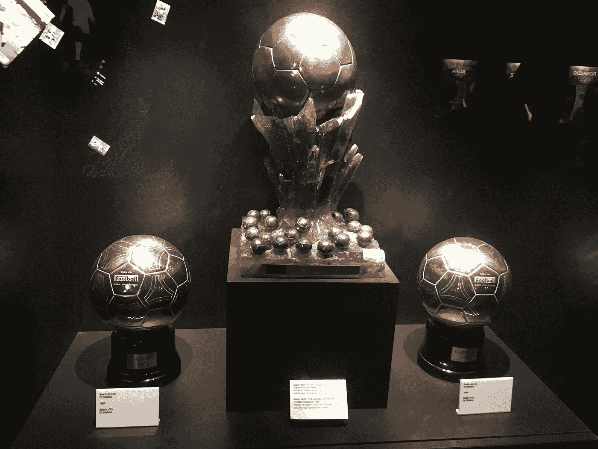
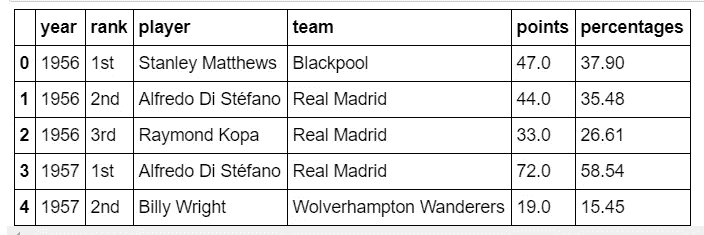
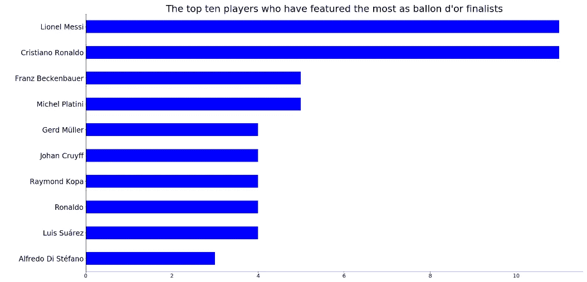
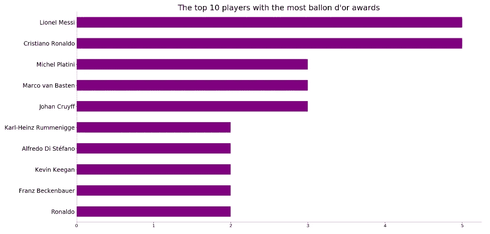
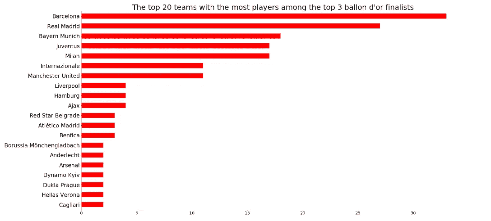
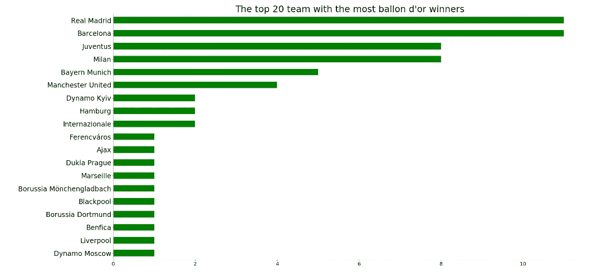
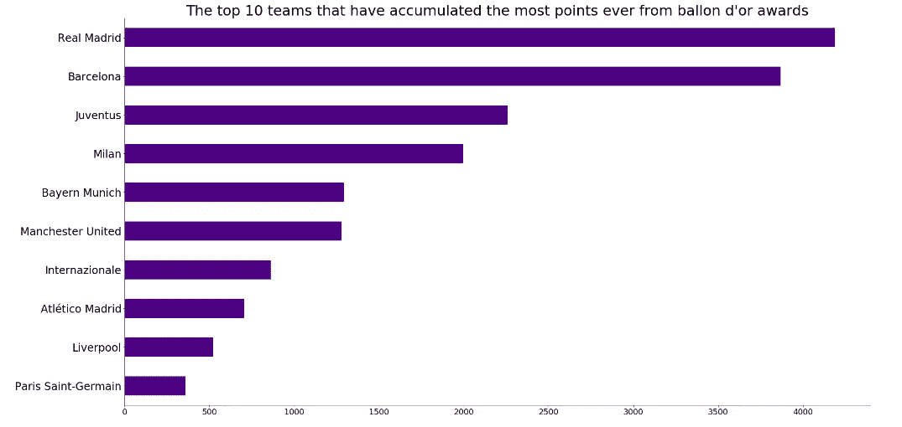
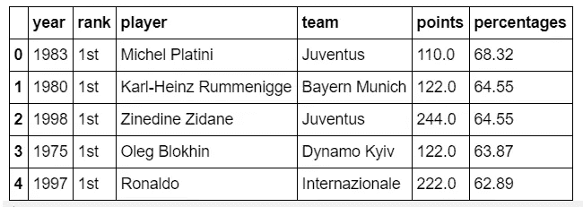
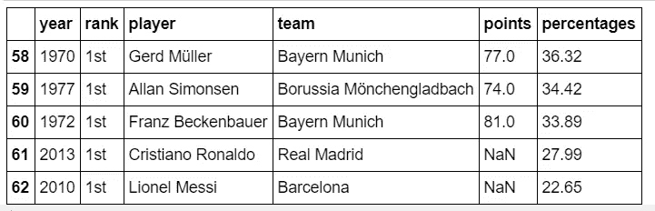

# 巴隆多尔的历史告诉了我们什么

> 原文：<https://towardsdatascience.com/what-does-the-history-of-ballon-dor-tell-us-97c0c744a916?source=collection_archive---------11----------------------->

Photo credit: [https://commons.wikimedia.org/wiki/File:Super_Ballon_d%27Or_and_Ballon_d%27Ors.jpg](https://commons.wikimedia.org/wiki/File:Super_Ballon_d%27Or_and_Ballon_d%27Ors.jpg)

## 对往届金球奖得主的深入分析

我坐在后面，看着克里斯蒂亚诺·罗纳尔多如何赢得 2013 年金球奖。我很生气。我认为弗兰克·里贝利应该赢得它。毕竟，拜仁慕尼黑通过赢得他们争夺的每一座奖杯，全年表现得比皇家马德里更好。

回顾那一刻，我意识到金球奖有时可以公正地颁发，而在其他时候则可以公平地颁发，就像莱昂内尔·梅西在 2015 年赢得它一样。

金球奖是一项非常有声望的奖项，根据上一赛季的表现授予世界最佳足球运动员。因此，我对这个奖项的痴迷让我对 Ballon d'or 的历史进行了分析，找出谁是最大的赢家，以及哪些球队产生了最多的赢家。

# 获取数据集

用于进行这项研究的数据集是通过这个[链接](https://www.kaggle.com/seriadiallo1/ballon-dor)从 Kaggle 获得的。该数据集包含精确的列，显示自 1956 年开始以来金球奖是如何授予的。

数据集被加载到 Jupyter Notebook 上，并被清理以便执行某些任务。数据集中的特征有:年份、排名、球员、球队、分数和百分比。

A snapshot of the first five rows of the dataset.

# 分析和探索数据集

## 十佳金球奖演员

在金球奖颁奖典礼之前，首先绘制了一张图表，以突出显示进入决赛的前三名球员。

The top ten players who have featured as Ballon d’or finalists

根据图表，不出所料，莱昂内尔·梅西和克里斯蒂亚诺·罗纳尔多并列第一，因为他们都创纪录地 11 次入围决赛。

然后，绘制了另一个图表来描绘赢得最多金球奖的球员。

The top ten players with the Ballon d’or awards

众所周知，梅西和罗纳尔多各获得 5 个奖项。米歇尔·普拉蒂尼、约翰·克劳夫和卡尔·海茵茨·鲁梅尼格各获得三个金球奖，并列第三。

## 贡献最多金球奖的球队

绘制了三张图来显示哪些球队经常为金球奖做出贡献。

第一张图显示了哪支队伍产生了最多的决赛选手。

The top 20 teams with the most finalists

图表显示巴塞罗那拥有最多的决赛席位。他们的球员已经 33 次入围金球奖决赛。皇家马德里以 27 次位居第二。拜仁慕尼黑以大约 18 次排名第三。

第二张图显示了获得最多金球奖的球队

The top 20 teams with the most Ballon d’or winners

皇家马德里和巴塞罗那都有他们的球员 11 次赢得这个美丽的奖项。尤文图斯的球员和 AC 米兰的球员获得了 8 次，拜仁慕尼黑的球员获得了 5 次。

第三张图显示了自金球奖开始以来积分最高的球队。分数是根据谁投票给一个玩家以及有多少人投票给一个玩家来决定的。

The top 10 teams that have accumulated the most points from Ballon d’or

根据图表，最终进入决赛的皇家马德里球员以创纪录的 4190 分获得了最多的分数。巴塞罗那以 3869 分位居第二。尤文图斯以 2258 分排在第三位。

## 历史上命中率最高的球员

在金球奖颁奖仪式上，俱乐部队长和教练会为他们认为应该获奖的球员投票。决赛选手中得分最高的选手获胜。

The top five players with the most percentages in the history of Ballon d’or

The last five players with the most percentages in the history of Ballon d’or

第一张表中，米歇尔·普拉蒂尼以 68.32 %的得票率成为 1983 年的最大赢家。有史以来最小的赢家是莱昂内尔·梅西，他在 2010 年获得了 22.65 %的选票。

# 结论

金球奖揭晓后，足球迷们在谁应该获奖的问题上产生了分歧。c 罗还是梅西？根据我的看法，今年将会是维吉尔·范·迪克。然而，我们必须等待，看看谁会赢得 2019 年 9 月 23 日的金球奖。

**用来构建这些图的完整版本代码可以在** [**这里**](https://github.com/MUbarak123-56/DataBEL/blob/master/Ballon%20D'or%20Analysis.ipynb) **看到。**