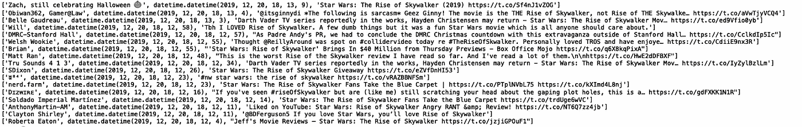
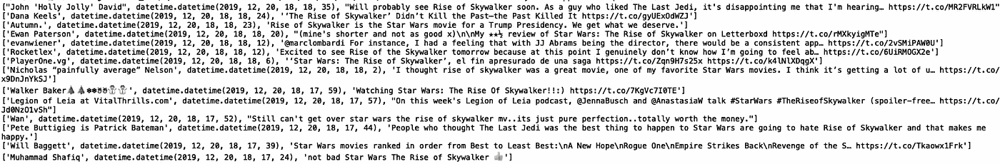
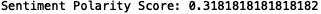
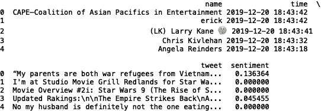
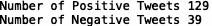
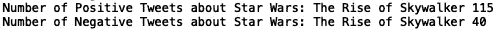
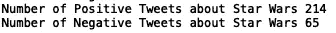
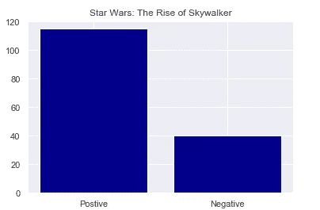
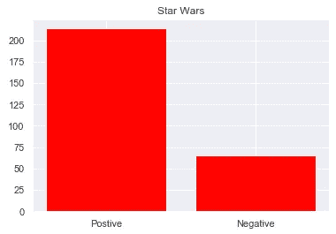

# 推特是如何看待星球大战：天行者崛起的？Python 中的情感分析

> 原文：<https://towardsdatascience.com/what-does-twitter-think-of-star-wars-the-rise-of-skywalker-sentiment-analysis-in-python-45a865d84049?source=collection_archive---------29----------------------->


Photo by [Craig Adderley](https://www.pexels.com/@thatguycraig000) on [Pexels](https://www.pexels.com/photo/shallow-focus-photo-of-stormtrooper-3526022/)

《星球大战：天行者崛起》最近在影院上映。迪士尼报告说，这部新电影的预告片获得了 4000 万美元的票房，这使它成为有史以来第五高的预告片。首映周末的票房收入在 1.7 亿到 2 亿美元之间。从这些数字来看，很明显这部新电影是票房成功的。我在这篇文章中试图回答的问题是:twitter 用户对这部电影的普遍看法是什么？

在这篇文章中，我们将使用 twitter python API tweepy 来获取与新的《星球大战》电影相关的 Twitter 消息。然后，我们将使用 TextBlob，一个用于处理文本数据的 python 库，来为与电影相关的推文生成情感分数。最后，我们将使用 python 可视化包 seaborn 和 Matplotlib 来可视化我们的结果。

首先，你需要申请一个 Twitter 开发者账户:


[Source](https://projects.raspberrypi.org/en/projects/getting-started-with-the-twitter-api/3)

在您的开发人员帐户获得批准后，您需要创建一个 Twitter 应用程序:


[Source](https://projects.raspberrypi.org/en/projects/getting-started-with-the-twitter-api/4)

申请 Twitter 开发者账户和创建 Twitter 应用程序的步骤在[这里](https://projects.raspberrypi.org/en/projects/getting-started-with-the-twitter-api/4)有概述。

为了访问 Twitter API，我们将使用免费的 python 库 tweepy。tweepy 的文档可以在[这里](https://tweepy.readthedocs.io/en/latest/getting_started.html)找到。

1.  **安装**

首先，确保您已经安装了 tweepy。打开命令行并键入:

```
pip install tweepy
```

2.**导入库**

接下来，打开您最喜欢的编辑器，导入 tweepy 和 pandas 库:

```
import tweepy
import pandas as pd
```

3.**认证**

接下来，我们需要我们的消费者密钥和访问令牌:


[Source](https://projects.raspberrypi.org/en/projects/getting-started-with-the-twitter-api/4)

请注意，该网站建议您保持您的密钥和令牌私有！这里我们定义了一个假的密钥和令牌，但是在创建 Twitter 应用程序时，您应该使用真正的密钥和令牌，如上所示:

```
consumer_key = '5GBi0dCerYpy2jJtkkU3UwqYtgJpRd' 
consumer_secret = 'Q88B4BDDAX0dCerYy2jJtkkU3UpwqY'
access_token = 'X0dCerYpwi0dCerYpwy2jJtkkU3U'
access_token_secret = 'kly2pwi0dCerYpjJtdCerYkkU3Um'
```

下一步是创建 OAuthHandler 实例。我们传递上面定义的消费者密钥和访问令牌:

```
auth = tweepy.OAuthHandler(consumer_key, consumer_secret)
auth.set_access_token(access_token, access_token_secret)
```

接下来，我们将 OAuthHandler 实例传递给 API 方法:

```
api = tweepy.API(auth)
```

4. **TWITTER API 请求**

接下来，我们为我们有兴趣分析的字段初始化列表。现在，我们可以查看推文字符串、用户和推文时间。接下来，我们在一个 tweepy“Cursor”对象上编写一个 for 循环。在“Cursor”对象中，我们传递“api.search”方法，为我们想要搜索的内容设置查询字符串，并设置“count”= 1000，这样我们就不会超过 Twitter 的速率限制。在这里，我们将搜索关于“星球大战”的推文。我们还使用“item()”方法将“Cursor”对象转换为 iterable。

为了简化查询，我们可以删除转发，只包含英文推文。为了了解该请求返回的内容，我们还可以打印附加到每个列表的值:

```
twitter_users = []
tweet_time = []
tweet_string = []
for tweet in tweepy.Cursor(api.search,q='Star Wars', count=1000).items(1000):
            if (not tweet.retweeted) and ('RT @' not in tweet.text):
                if tweet.lang == "en":
                    twitter_users.append(tweet.user.name)
                    tweet_time.append(tweet.created_at)
                    tweet_string.append(tweet.text)
                    print([tweet.user.name,tweet.created_at,tweet.text])
```



为了实现可重用性，我们可以将它封装在一个函数中，该函数将关键字作为输入。我们还可以将结果存储在数据帧中并返回值:

```
def get_related_tweets(key_word):twitter_users = []
    tweet_time = []
    tweet_string = [] 
    for tweet in tweepy.Cursor(api.search,q=key_word, count=1000).items(1000):
            if (not tweet.retweeted) and ('RT @' not in tweet.text):
                if tweet.lang == "en":
                    twitter_users.append(tweet.user.name)
                    tweet_time.append(tweet.created_at)
                    tweet_string.append(tweet.text)
                    print([tweet.user.name,tweet.created_at,tweet.text])
    df = pd.DataFrame({'name':twitter_users, 'time': tweet_time, 'tweet': tweet_string})

    return df
```

如果用关键字“星球大战:天行者崛起”调用函数，我们会得到:

```
get_related_tweets("Star Wars: The Rise of Skywalker")
```



为了获得情感分数，我们需要导入一个名为 textblob 的 python 包。textblob 的文档可以在这里找到[。要安装 textblob，请打开命令行并键入:](https://textblob.readthedocs.io/en/dev/)

```
pip install textblob
```

下次导入 textblob:

```
from textblob import TextBlob
```

我们将使用极性得分作为积极或消极感觉的衡量标准。极性得分是一个从-1 到+1 的浮点数。

例如，如果我们定义一个 textblob 对象并传入句子“我喜欢新的星球大战电影”,我们应该得到一个正值的极性分数:

```
sentiment_score = TextBlob("I love the new Star Wars movie").sentiment.polarity
print("Sentiment Polarity Score:", sentiment_score)
```



让我们给关于“星球大战：天行者崛起”的推文打分:

```
df = get_related_tweets("Star Wars: The Rise of Skywalker")
df['sentiment'] = df['tweet'].apply(lambda tweet: TextBlob(tweet).sentiment.polarity)
print(df.head())
```



我们也可以计算积极和消极情绪的数量:

```
df_pos = df[df['sentiment'] > 0.0]
df_neg = df[df['sentiment'] < 0.0]
print("Number of Positive Tweets", len(df_pos))
print("Number of Negative Tweets", len(df_neg))
```



同样，对于代码重用，我们可以将其全部封装在一个函数中:

```
def get_sentiment(key_word):
    df = get_related_tweets(key_word)
    df['sentiment'] = df['tweet'].apply(lambda tweet: TextBlob(tweet).sentiment.polarity)
    df_pos = df[df['sentiment'] > 0.0]
    df_neg = df[df['sentiment'] < 0.0]
    print("Number of Positive Tweets about {}".format(key_word), len(df_pos))
    print("Number of Negative Tweets about {}".format(key_word), len(df_neg))
```

如果我们用“星球大战：天行者崛起”调用这个函数，我们得到:

```
get_sentiment("Star Wars: The Rise of Skywalker")
```



我们也可以试试《星球大战》:

```
get_sentiment("Star Wars")
```



如果我们能以编程方式可视化这些结果，那将会很方便。让我们导入 seaborn 和 matplotlib 并修改我们的 get _ 情操函数:

```
import seaborn as sns
import matplotlib.pyplot as plt
def get_sentiment(key_word):
    df = get_related_tweets(key_word)
    df['sentiment'] = df['tweet'].apply(lambda tweet: TextBlob(tweet).sentiment.polarity)
    df_pos = df[df['sentiment'] > 0.0]
    df_neg = df[df['sentiment'] < 0.0]
    print("Number of Positive Tweets about {}".format(key_word), len(df_pos))
    print("Number of Negative Tweets about {}".format(key_word), len(df_neg))
    sns.set()
    labels = ['Postive', 'Negative']
    heights = [len(df_pos), len(df_neg)]
    plt.bar(labels, heights, color = 'navy')
    plt.title(key_word)

get_sentiment("Star Wars: The Rise of Skywalker")
```



而对于《星球大战》:

```
get_sentiment("Star Wars")
```



如你所见，关于*星球大战：天行者崛起*的推文正面情绪多于负面情绪。我知道我很期待这个周末自己去看。收集几天的数据来观察情绪如何随时间变化会很有趣。也许我会把它留到以后的文章里。

感谢您的阅读。这篇文章的代码可以在 [GitHub](https://github.com/spierre91/medium_code) 上找到。祝好运，机器学习快乐！