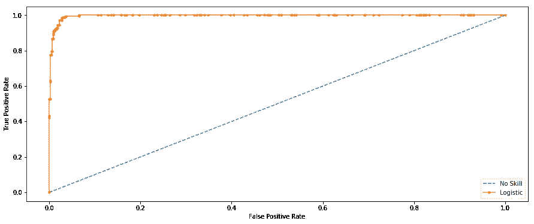

# 你的分类标准告诉了你的数据什么？

> 原文：<https://towardsdatascience.com/what-does-your-classification-metric-tell-about-your-data-4a8f35408a8b?source=collection_archive---------6----------------------->

## 分类度量的评价策略及结果评价研究


Photo by [M. B. M.](https://unsplash.com/@m_b_m?utm_source=unsplash&utm_medium=referral&utm_content=creditCopyText) on [Unsplash](https://unsplash.com/s/photos/statistics?utm_source=unsplash&utm_medium=referral&utm_content=creditCopyText)

有没有想过为什么会有很多性能指标告诉你你的分类技能？是的，他们会评估一个模型的性能，并告诉你分类的好坏，但每个人的评估方式都不一样。

把它想象成你的高中老师，有些人可能会给你高分，尽管你的答案是狗屎，因为你是一个马屁精，有些人可能会给你低分，尽管你的答案很贴切。将准确性作为你分类的主要标准也是一种犯罪！

然而，这个博客不是让你熟悉度量标准，而是如何有效地使用它们。

# **先决条件**

*   你知道混淆矩阵是什么吗
*   你熟悉第一类和第二类错误

# 假设

*   零假设 H⁰=“个人有癌症”。(通常，零假设是出于拒绝它的动机)
*   以下混淆矩阵作为参考和示例。


Note: Box values depend on H0

我将在本博客中介绍以下与在线数据科学竞赛重要性相关的指标:

*   精确度和召回率
*   f1-分数
*   受话者工作特性范围

> 注意:我采用 [UCI 乳腺癌](https://archive.ics.uci.edu/ml/datasets/Breast+Cancer+Wisconsin+(Diagnostic))数据集来表示不同的值。为此，我故意移动超参数来表示某些条件和结果。

用于计算混淆矩阵值的 Python 辅助函数:

```
def find_TP(y, y_hat):
    # counts the number of true positives (y = 1, y_hat = 1)
    return sum((y == 1) & (y_hat == 1))
def find_FN(y, y_hat):
    # counts the number of false negatives (y = 1, y_hat = 0) Type-II error
    return sum((y == 1) & (y_hat == 0))
def find_FP(y, y_hat):
    # counts the number of false positives (y = 0, y_hat = 1) Type-I error
    return sum((y == 0) & (y_hat == 1))
def find_TN(y, y_hat):
    # counts the number of true negatives (y = 0, y_hat = 0)
    return sum((y == 0) & (y_hat == 0))
```

我用逻辑回归的两组超参数做了一个分类模型。这样做是为了在两种不同的情况下测试模型预测。

```
from sklearn.linear_model import LogisticRegressionclf_1 = LogisticRegression(C=1.0, class_weight={0:100,1:0.2}, dual=False, fit_intercept=True,
                   intercept_scaling=1, l1_ratio=None, max_iter=100,
                   multi_class='auto', n_jobs=None, penalty='l2',
                   random_state=None, solver='lbfgs', tol=0.0001,       verbose=0,
                   warm_start=False)clf_2 = LogisticRegression(C=1.0, class_weight={0:0.001,1:900}, dual=False, fit_intercept=True,
                   intercept_scaling=1, l1_ratio=None, max_iter=100,
                   multi_class='auto', n_jobs=None, penalty='l2',
                   random_state=None, solver='lbfgs', tol=0.0001, verbose=0,
                   warm_start=False)
```

# 精确

精度是真阳性和预测的总阳性的比率。


0

精度指标关注第一类误差(FP)。当我们拒绝一个真的空 Hypothesis(H⁰时，一个第一类错误发生。因此，在这种情况下，第一类错误是错误地将癌症患者标记为非癌症患者。精度分数接近 1 将意味着您的模型没有遗漏任何真正的阳性，并且能够很好地分类正确和错误标记的癌症患者。*它不能测量的是 II 型错误的存在，即假阴性，即当非癌症患者被识别为癌症患者时的情况。*

低精度分数(< 0.5)意味着您的分类器有大量的假阳性，这可能是不平衡的类或未调整的模型超参数的结果。在不平衡类问题中，为了抑制 FP/FN，你必须事先准备好数据，包括过采样/欠采样或焦点损失。

对于第一组超参数:

```
TP = find_TP(y, y_hat)
FN = find_FN(y, y_hat)
FP = find_FP(y, y_hat)
TN = find_TN(y, y_hat)print('TP:',TP)
print('FN:',FN)
print('FP:',FP)
print('TN:',TN)precision = TP/(TP+FP)
print('Precision:',precision)
```


Output for the above code snippet

通过查看混淆矩阵值，您可能已经猜到 FP 为 0，因此对于给定超参数设置的 100%精确模型来说，该条件是完美的。在这种设置下，没有报告 I 型错误，即模型在抑制错误地将癌症患者标记为非癌症患者方面做了大量工作。

对于第二组超参数:

```
TP = find_TP(y, y_hat)
FN = find_FN(y, y_hat)
FP = find_FP(y, y_hat)
TN = find_TN(y, y_hat)print('TP:',TP)
print('FN:',FN)
print('FP:',FP)
print('TN:',TN)precision = TP/(TP+FP)
print('Precision:',precision)
```


Output for the above code snippet

由于在这种设置中只剩下第一类误差，因此尽管第二类误差为 0，但精度会下降。从我们的例子中我们可以推断出，只有精度不能告诉你你的模型在各种情况下的性能。

# 回忆或敏感度或命中率

一个 ***回忆*** 本质上是真实肯定与地面真相中所有肯定的比率


0 <r>召回指标侧重于第二类错误(FN)。当我们接受一个假的空 Hypothesis(H⁰).时，就会出现第二类错误因此，在这种情况下，第二类错误是错误地将非癌症患者标记为癌症患者。回忆分数接近 1 将意味着您的模型没有错过任何真正的阳性，并且能够很好地分类正确和错误标记的癌症患者。
*它不能测量的是 I 型错误的存在，即误报，即癌症患者被识别为非癌症患者的情况。*</r>

低召回分数(< 0.5)意味着您的分类器有大量的假阴性，这可能是不平衡的类或未调整的模型超参数的结果。在不平衡类问题中，为了抑制 FP/FN，你必须事先准备好数据，包括过采样/欠采样或焦点损失。

对于第一组超参数:

```
TP = find_TP(y, y_hat)
FN = find_FN(y, y_hat)
FP = find_FP(y, y_hat)
TN = find_TN(y, y_hat)print('TP:',TP)
print('FN:',FN)
print('FP:',FP)
print('TN:',TN)recall = recall_score(y, y_hat)
print('Recall: %f' % recall)
```


Output for the above code snippet

从上述混淆矩阵值来看，第一类错误的可能性为 0，而第二类错误的可能性很大。这就是低召回分数背后的原因。它只关注第二类错误。

对于第二组超参数:

```
TP = find_TP(y, y_hat)
FN = find_FN(y, y_hat)
FP = find_FP(y, y_hat)
TN = find_TN(y, y_hat)print('TP:',TP)
print('FN:',FN)
print('FP:',FP)
print('TN:',TN)recall = recall_score(y, y_hat)
print('Recall: %f' % recall)
```


Output for the above code snippet

这个集合中唯一持久的错误是 I 类错误，没有报告 II 类错误。这意味着这个模型在遏制错误地将非癌症患者标记为癌症方面做了很大的工作。

> 以上两个度量标准的主要亮点是它们都只能在特定的场景中使用，因为它们都只能识别一组错误。

# 精确-召回权衡

要改进你的模型，你可以提高精度或召回率，但不能两者都提高。如果您试图减少非癌症患者被标记为癌症(FN/II 型)的病例，对被标记为非癌症的癌症患者不会产生直接影响。

这里有一个描绘同样权衡的图。

```
from sklearn.metrics import plot_precision_recall_curvedisp = plot_precision_recall_curve(clf, X, y)
disp.ax_.set_title('2-class Precision-Recall curve: '
                   'AP={0:0.2f}'.format(precision))
```


这种权衡对现实世界的场景有很大影响，因此这意味着仅仅依靠精确度和召回率并不是很好的衡量标准。这就是为什么你会看到许多公司报告和在线竞赛敦促提交指标是精确度和召回的结合。

# f1-分数

F1 得分指标结合了精确度和召回率。事实上，F1-score 是两者的调和平均值。这两个公式本质上是:


现在，高 F1 分数象征着高精确度和高召回率。该算法在查准率和查全率之间取得了很好的平衡，在不平衡分类问题上取得了很好的效果。

F1 分数低(几乎)说明不了什么——它只能告诉你在某个阈值时的表现。低召回率意味着我们没有尽力在整个测试集的大部分上做得很好。低精度意味着，在我们确定为阳性的病例中，我们没有得到很多正确的结果。但是低 F1 没说是哪个。高 F1 可能意味着我们可能对大部分决策具有高精确度和高回忆性(这是信息性的)。F1 较低时，不清楚问题是什么(低精度还是低召回率？)，无论模型遭受 I 型还是 II 型误差。

所以，F1 是噱头？不完全是，它已经被广泛使用，并被认为是一个很好的指标，可以收敛到一个决策(业务)中，但也不是没有一些调整。将 FPR(假阳性率)与 F1 一起使用将有助于抑制 I 型错误，并且您将了解在您的低 F1 分数背后的坏人。

对于第一组超参数:

```
# F1_score = 2*Precision*Recall/Precision+Recall 
f1_score = 2*((precision*recall)/(precision+recall))
print('F1 score: %f' % f1_score)
```


如果你还记得我们在 set-I 参数中的得分，P=1，R=0.49。因此，通过使用这两个指标，我们得到了 0.66 的分数，这并没有给你什么类型的错误是显著的信息，但在推断模型的性能时仍然是有用的。

对于第二组超参数:

```
# F1_score = 2*Precision*Recall/Precision+Recall 
f1_score = 2*((precision*recall)/(precision+recall))
print('F1 score: %f' % f1_score)
```


对于第二组参数，P=0.35，R=1。f1 分数排序再次总结了 P 和 r 之间的间断，但是低 F1 也不能告诉你存在哪个错误。

# 受话者工作特性范围

更好地称为 AUC-ROC 评分/曲线。它利用真阳性率(TPR)和假阳性率(FPR)。


*   直观上，TPR/召回对应于相对于所有阳性数据点被正确认为是阳性的阳性数据点的比例。换句话说，TPR 越高，我们错过的正面数据点就越少。
*   直观上，FPR/辐射对应于所有负数据点中被错误地认为是正的负数据点的比例。换句话说，FPR 越高，我们错误分类的负面数据点就越多。

为了将 FPR 和 TPR 合并成一个单一的指标，我们首先用许多不同的逻辑回归阈值来计算前两个指标，然后将它们绘制在一个单一的图表上。得到的曲线称为 ROC 曲线，我们考虑的度量是这条曲线的 AUC，我们称之为 AUROC。

```
from sklearn.metrics import roc_curve
from sklearn.metrics import roc_auc_score
from matplotlib import pyplotns_probs = [0 for _ in range(len(y))]
# predict probabilities
lr_probs = clf_1.predict_proba(X)
# keep probabilities for the positive outcome only
lr_probs = lr_probs[:, 1]# calculate scores
ns_auc = roc_auc_score(y, ns_probs)
lr_auc = roc_auc_score(y, lr_probs)# summarize scores
print('No Skill: ROC AUC=%.3f' % (ns_auc))
print('Logistic: ROC AUC=%.3f' % (lr_auc))# calculate roc curves
ns_fpr, ns_tpr, _ = roc_curve(y, ns_probs)
lr_fpr, lr_tpr, _ = roc_curve(y, lr_probs)# plot the roc curve for the model
pyplot.plot(ns_fpr, ns_tpr, linestyle='--', label='No Skill')
pyplot.plot(lr_fpr, lr_tpr, marker='.', label='Logistic')pyplot.xlabel('False Positive Rate')
pyplot.ylabel('True Positive Rate')pyplot.legend()
pyplot.show()
```



No Skill: ROC AUC=0.500
Logistic: ROC AUC=0.996

无技能分类器是一种不能区分类别的分类器，它在所有情况下都会预测随机类别或恒定类别。无技能线的变化是基于积极类和消极类的分布。它是一条水平线，带有数据集中阳性案例的比率值。对于平衡数据集，这是 0.5。

该面积等于随机选择的正面例子排名在随机选择的负面例子之上的概率(被认为正面的概率高于负面的概率)。因此，高 ROC 仅仅意味着随机选择的正面例子的概率确实是正面的。ROC 高也意味着你的算法在测试数据的排序方面做得很好，大多数负面情况在一个范围的一端，而正面情况在另一端。

当你的问题存在巨大的阶级不平衡时，ROC 曲线不是一个好的选择。其中的原因并不简单，但可以通过公式直观地看出，你可以在[这里](http://ftp.cs.wisc.edu/machine-learning/shavlik-group/davis.icml06.pdf)了解更多信息。在处理不平衡设置或使用焦点损失技术后，您仍然可以在这种情况下使用它们。

除了学术研究和不同分类器的比较之外，AUROC metric 没有找到其他位置。

## 还有，很多人在论坛上问过这个 F1 分数低但是 AUC 分数高的问题。

正如你现在已经猜到的，两者有不同的评估策略。对于特定的 ROC，您可以有一个 F1 分数范围(取决于阈值参数)。