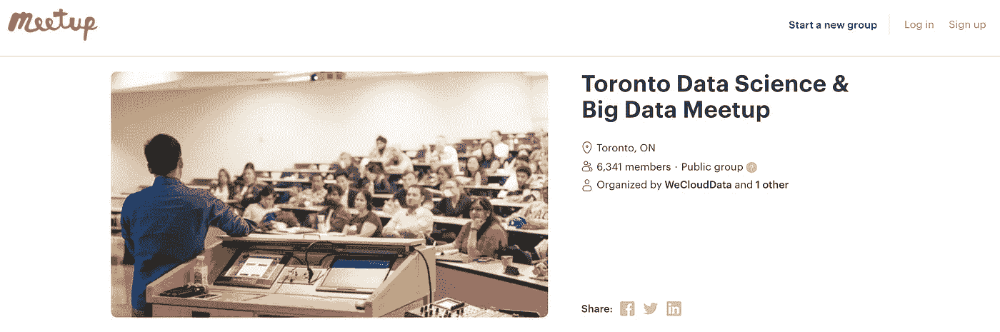
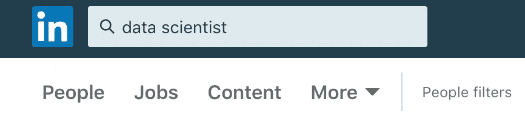

# 每个有抱负的数据科学家需要了解的网络知识

> 原文：<https://towardsdatascience.com/what-every-aspiring-data-scientist-needs-to-know-about-networking-475cfaac15f8?source=collection_archive---------15----------------------->

Image: [https://zipinternationalinc.ca/zip-international-importance-networking/](https://zipinternationalinc.ca/zip-international-importance-networking/)

一个典型的数据科学职位发布可以吸引数十甚至数百份申请。因此，在申请过程中要克服的最重要的障碍通常是找到吸引公司注意的方法。

因此，求职不仅仅是技能的竞争:在很大程度上，这也是带宽的竞争。申请过程越早，竞争对手就越多，吸引眼球就越困难。

但是，当决策时刻到来时，您如何确保您的应用程序得到第二次检查呢？我可能会想到两个选择:

1.  优化你的简历。
2.  试着完全跳过简历筛选这一步。

老实说，我认为在这里讨论第一点没有多大价值。一些原因:

*   这是一个我在之前已经[谈到过的话题，而且已经有很多很棒的“如何打造一份完美简历”的帖子了。](/the-4-fastest-ways-not-to-get-hired-as-a-data-scientist-565b42bd011e)
*   除非你的简历是一个真正的垃圾箱火，它是不可能优化很多，因为每个招聘人员都喜欢不同的格式，和不同的内容。
*   发送简历而不被邀请参加面试是一个零反馈的过程，所以如果你所做的只是一次又一次地把简历扔进空白，你就不会了解到你可以从每份申请中改进什么。

出于这些原因，我们在 [SharpestMinds](http://sharpestminds.com) 非常重视战略 2。因此，在接下来的内容中，我将重点关注这一点:找到避开传统简历筛选过程的方法。

*提示*:答案是网络。

# 如何跳过这条线

极不相称的雇佣人数是由已经在一家公司工作的员工推荐的。因此，你最好的进入途径，十有八九是通过与在你的目标公司工作的人的关系，而不是普通的渠道，比如求职板(这不可避免地会导致可怕的简历筛选)。

关系很重要，因为它们会给你一个信号提升，但也让你更有可能在申请中得到反馈。即使你的申请被拒绝了，你也可以向你的联系人询问如何改进。

但是，如何与成熟的数据科学家建立有意义的关系呢？我们通过两种方式成功地做到了这一点:

## 1.通过聚会

毫无疑问，聚会是你获得入门级数据科学职位的最佳途径。但是你必须选择正确的。

最好的聚会有以下三个特征:

1.  它们是技术性的，不适合新手(好公司不会出现在“数据科学入门”聚会上进行招聘)
2.  他们经常重复，至少一个月一次(理想的是每周一次或更频繁)。这可以让你了解当地社区的人，让他们了解并认可你。
3.  他们不是太大(超过 100 人定期参加)，也不是太小(开始参加)。第一次去的时候，你不必与任何人交谈，但很快你就会想通过在演讲后提问，并努力与其他与会者聊天来让别人知道你的存在。随着时间的推移，这种活动会越来越多，让你成为所有 Meetup 参与者的熟悉面孔。

**为每次聚会设定具体的目标。**每次去的时候，争取和其他与会者进行至少 3 次实质性的对话，或者在演讲后强迫自己至少问一个问题。

*   一个伟大的、高影响力的活动是**邀请 Meetup 组织者做一个演讲**。这有助于提升你在社区中的形象，也迫使你在演讲前提升你的技术水平。
*   你可以**在 LinkedIn** 上添加你在 Meetup 上交谈过的任何人。如果你以这种方式将某人添加到你的网络中，并且他们是一个特别有前途的潜在客户(即，你们有相似的技术或行业兴趣，或者在数据科学社区有非常好的人脉)，你可以请他们喝杯咖啡，谈谈他们的工作和经历。从这里开始，按照下面 LinkedIn 行动手册中的后续步骤进行操作。
*   2.通过 LinkedIn
*   好吧，这个很系统也很乏味。但这正是其他人不这么做的原因，也是为什么这是一种脱颖而出并给自己一个信号提升的好方法:

## 去 LinkedIn

在你的区域搜索“数据科学家”、“机器学习工程师”、“数据分析师”，或者任何最合适的搜索术语。

*   找到至少 20 个知名数据科学家的资料(拥有 6 个月以上的经验)，他们似乎与你*和*有相似的技术兴趣，他们在目前正在招聘的公司工作(你可以查看他们公司的网站，看看是否是这样)。理想情况下，你应该与他们有更多的共同点，而不仅仅是你们都喜欢数据科学:NLP、大数据/数据工程、计算机视觉、金融等都是额外共同点的巨大来源。
*   向每个人发送一个连接请求，并附上以下消息的适当定制版本:
*   嗨[他们的名字]，
*   我刚刚看了你的简介，发现你在[零售数据分析/房地产数据可视化等]方面的工作非常引人注目(这是我特别感兴趣的领域)。我很乐意连接！

> 谢谢，
> 
> [您的姓名]
> 
> 大部分都不会连接。有些人会的。跟踪你的联系人(我推荐 [Trello](https://trello.com/) )。跟进那些接受您的连接请求的人:
> 
> 嗨[他们的名字]，

*   感谢连接！我真的很想更多地了解您在[公司名称]所做的工作。我希望在一个类似的领域工作，并且很乐意向你请教在这个领域工作的挑战。

> [您的姓名]
> 
> 如果他们回复了，而且看起来很开放，接着发第三条信息，问他们是否愿意一起喝杯咖啡[在离他们工作的地方近的地方！].
> 
> 你可能会被多处咬伤。如果你这样做了，很好:分别与每个人建立关系。在每一个案例中，你的目标应该是尽可能多地了解他们在日常工作中面临的技术问题，这样你就可以确定作为一名员工，你是否有能力为他们的公司增加价值。如果你不这么认为，在试图利用你的新关系进入面试之前，集中精力提高你的技能。

*   如果你在与新关系的交谈中觉得你能够胜任他们与你讨论的角色，这是一个好迹象，你应该直接问他们——不要给他们压力——你是否是一个合适的人选。仔细听他们的回答:如果这不是申请邀请，你可以问(不要咄咄逼人)为什么你还不适合。
*   一个好办法是:“谢谢你澄清了这一点，对我来说，在我继续提高技能的时候，知道自己的位置是非常有帮助的。你认为我最需要改进的地方是什么，以便更好地定位自己，在未来担任类似的角色？”这里的目标是表现出对知识的渴望，而不是对工作的渴望。
*   如果事情进展顺利，询问你的新联系人，一旦你取得了更多的进展，他们是否愿意再次与你见面，并请求他们允许你在达到一些关键技能发展里程碑时随时更新他们的信息(但只有在你打算这样做的情况下:没有什么比承诺做某事但不坚持到底更糟糕的了)。
*   当你运用这些策略时，一个总的忠告是:要真诚，不要把你的新联系人当作垫脚石。他们慷慨地自愿成为你网络中的节点，你应该尊重他们。数据科学社区(以及更广泛的技术社区)已经形成了一种强大的“向前支付”精神，正是为了帮助有抱负的开发人员克服他们在试图进入该领域时所面临的高技术壁垒。
*   这是一件伟大的事情，我们应该彼此保持良好的氛围。

因此，适用于这些情况的最佳心态是，将你的联系人的时间视为对你的投资，并尽一切努力回报这种投资，并在你在 LinkedIn 上受到曾经顶替你的人冷遇的那一天支付这笔投资。

如果你想联系，你可以在 Twitter 上找到我，地址是 [@ **jeremiecharris！**](https://twitter.com/jeremiecharris)

So the best mindset to apply to these situations is to treat your contacts’ time as an investment in you, and to do everything you can to reward that investment and pay it forward the day you get a cold reach-out on LinkedIn by someone whose shoes you once filled.

If you want to connect, you can find me on Twitter at [@**jeremiecharris!**](https://twitter.com/jeremiecharris)