# 每个人都忘记了机器学习

> 原文：<https://towardsdatascience.com/what-everyone-forgets-about-machine-learning-974752543849?source=collection_archive---------28----------------------->

## [机器学习的安全性](https://towardsdatascience.com/tagged/security-for-ml)

## 闪亮的新功能不是免费的

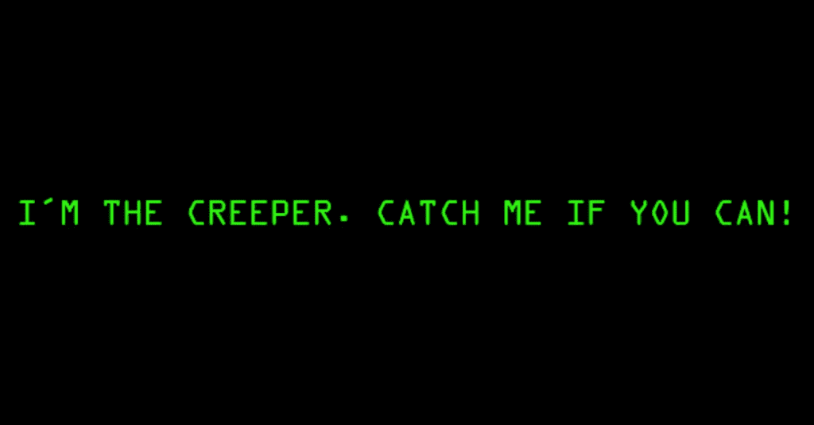

[Source.](http://blog.lenovo.com/en/blog/inventing-x1-security/)

我们生活在疯狂的时代。我记得小时候看《星球大战》的时候，想知道要多久我们的厨房里才会有会说话的机器人。事实证明，时间并不长。事实上不到十年。

人工智能，更具体地说是机器学习，正在真正将科幻小说带入现实——没有其他方式可以表达。每当我翻阅 Tech Review 或 TechCrunch 时，我都会被我们现在可以“随意”做的事情震惊。

[看穿墙壁？](http://rfpose.csail.mit.edu/)容易。[从视频中猜测材料的物理属性？](https://news.mit.edu/2015/visual-microphone-identifies-structural-defects-0521)搞定。[从键盘声音估计击键？](https://www.sigmobile.org/mobicom/2015/papers/p142-liuA.pdf)小菜一碟。如何生成逼真的[人脸](https://arxiv.org/abs/1812.04948)、[身体](https://carolineec.github.io/everybody_dance_now/)或[诗歌](https://boingboing.net/2019/03/15/digital-lit.html)？还是[教机器画](https://ai.googleblog.com/2017/04/teaching-machines-to-draw.html)？还是一款[星际争霸](https://deepmind.com/blog/alphastar-mastering-real-time-strategy-game-starcraft-ii/)的游戏？

哦，你见过这些东西四处游荡吗？

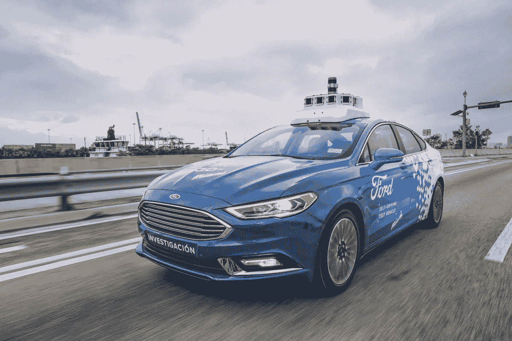

[Source.](https://www.theverge.com/2018/8/16/17693866/ford-self-driving-car-safety-report-dot)

疯狂。

现在，如果你真的去和从事 AI/ML 工作的人交谈，你可能会得到两种回答中的一种。要么他们对人工智能/人工智能能做什么感到兴奋不已，并正在研究下一个大的视觉/自然语言处理/强化学习问题——要么——他们对我们这些愚蠢的人类正在建造的东西感到绝对恐惧，并相信人工通用智能很快就会把人类变成一堆无用的回形针。在我看来，这就像当今社会的普遍分裂——50%的人认为人工智能是我们的未来，50%的人认为这是我们的灭亡。

关于人工智能和机器学习是什么，我想提供第三个——也许是更平凡的——视角:**对手的新攻击面。**

我们来探索一下。

# 新发明的阴阳两极

每当一项新发明问世，大多数人都会想到这项发明带来的令人惊叹的新功能。但是，哪里有光，哪里就有阴影，所以新的能力会不经意地与新的**漏洞**打包在一起，供黑客利用。他们确实剥削他们。

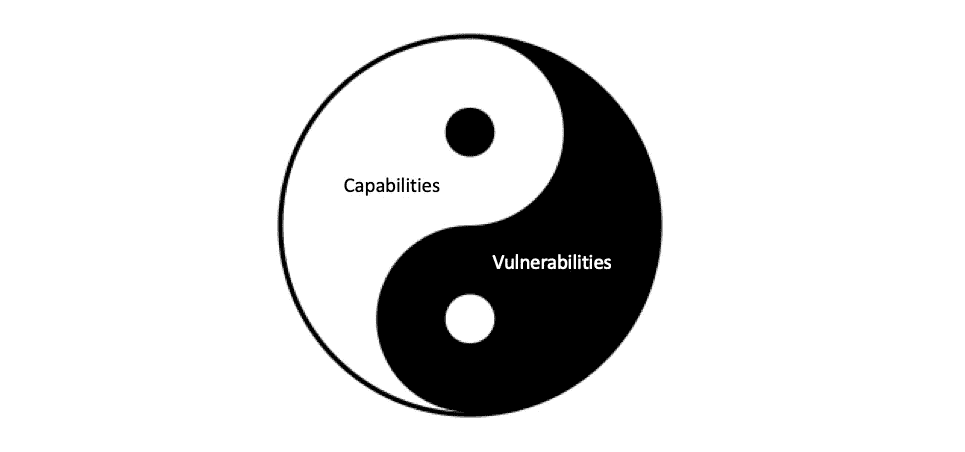

让我们上一堂历史课，重温一下 PC 市场。第一台个人电脑(Altair 8800)于 1975 年发布，随后在接下来的 10 年里进行了一系列创新，最终在 1984 年推出了现在看起来太熟悉的鼠标“苹果麦金塔”。随之而来的是持续了整个 20 世纪 90 年代和 21 世纪初的爆炸式采用浪潮:

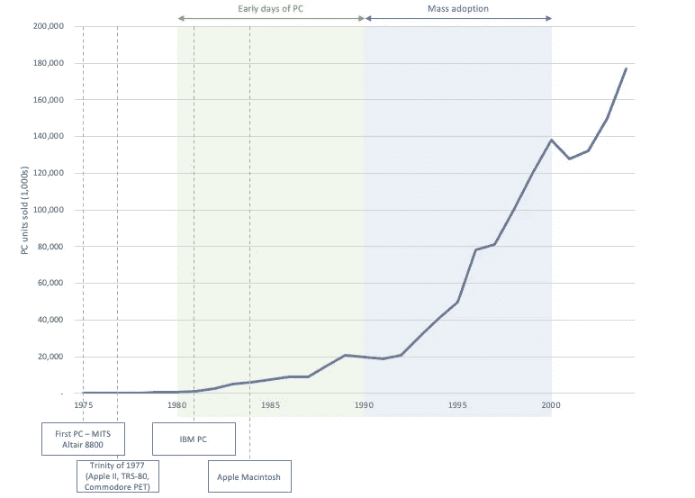

Source: [retrocomputing](http://www.retrocomputing.net/info/siti/total_share.html) + wiki.

然而，大多数用户不知道的是，恶意软件或“恶意软件”市场正在发生类似的爆炸。

1989 年，罗伯特·莫里斯用 Unix sendmail 做实验，制造了一种自我复制的蠕虫病毒，并将其发送到互联网上。最初只是一个实验，最终变成了第一次 DoS 攻击，造成的损失估计在 100，000 美元到 10，000，000 美元之间，并使整个互联网慢了好几天(当然现在是不可想象的)。

随后是 1989 年第一次勒索病毒攻击，1996 年第一次 Linux 病毒(“Staog”)，1998 年第一次 AOL 木马。

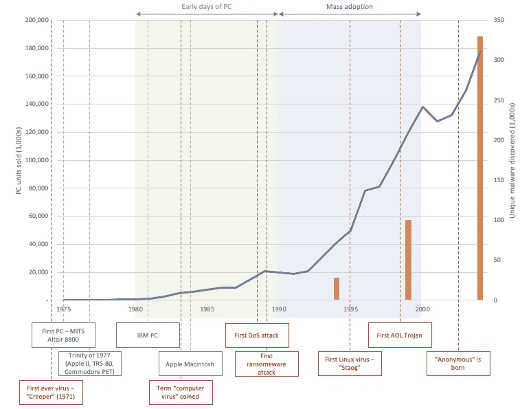

Malware stats source: [av-test (through wiki)](https://en.wikipedia.org/wiki/Antivirus_software).

后来，在移动领域也发生了同样的事情:2007 年的 iPhone 时刻，智能手机的采用出现了爆炸性增长:

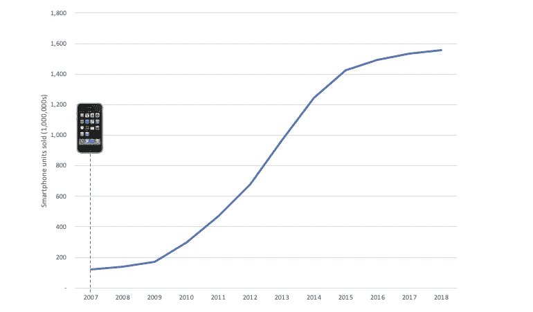

Source: [statista](https://www.protocol.gr/2019/04/21/number-of-smartphones-sold-to-end-users-worldwide-from-2007-to-2018/).

…随之而来的是移动恶意软件的爆炸式增长:

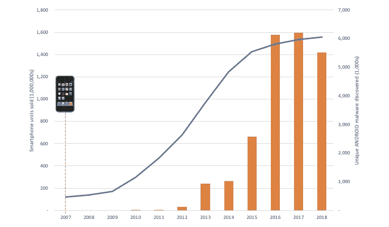

Malware stats source: [av-test](https://www.av-test.org/en/statistics/malware/).

那么，机器学习呢？

尽管有各种议论，[机器学习的产品化仍处于萌芽状态](https://speakerdeck.com/mmcventures/the-state-of-ai-2019-divergence?slide=9)。许多真正前沿的工作仍然局限于研究实验室和大学——但即使看看研究，我们也可以开始看到一些相同的趋势出现。

按年份和地区统计的机器学习研究论文数量:

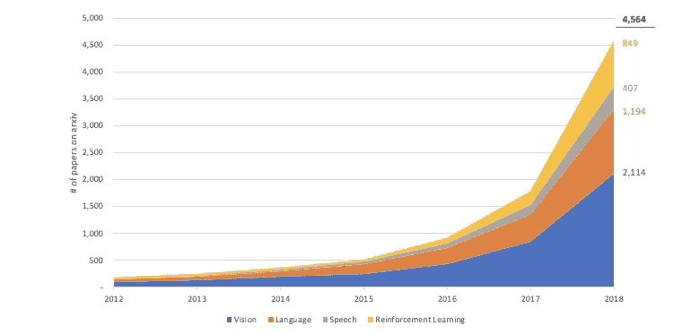

Source: [arxiv](https://arxiv.org/search/advanced?advanced=&terms-0-operator=AND&terms-0-term="reinforcement+learning"&terms-0-field=all&terms-1-operator=AND&terms-1-term="machine+learning"&terms-1-field=all&classification-computer_science=y&classification-mathematics=y&classification-physics_archives=all&classification-statistics=y&classification-include_cross_list=exclude&date-filter_by=specific_year&date-year=2018&date-from_date=&date-to_date=&date-date_type=submitted_date_first&abstracts=show&size=200&order=-announced_date_first).

……vs**“对抗性机器学习”** (ML 的恶意软件版本)研究论文数:

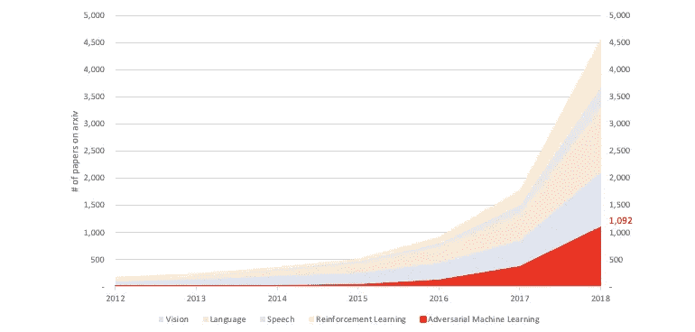

Source: [arxiv](https://arxiv.org/search/advanced?advanced=&terms-0-operator=AND&terms-0-term=adversarial&terms-0-field=all&terms-1-operator=AND&terms-1-term=%22machine+learning%22&terms-1-field=all&classification-computer_science=y&classification-physics_archives=all&classification-statistics=y&classification-include_cross_list=exclude&date-filter_by=specific_year&date-year=2018&date-from_date=&date-to_date=&date-date_type=submitted_date_first&abstracts=show&size=200&order=-announced_date_first).

所以事情来了。恐慌的时候到了？

# 安全事务

没那么快。好消息是，随着个人电脑接管了我们的日常生活，黑客们开始入侵，另一个市场也同时发展起来——安全解决方案市场。

第一个反病毒产品是由 Andreas Lüning 和 Kai Figge 在 1987 年为 Atari ST 平台开发的。同年，McAffee、NOD、流感疫苗和 Anti4us 都诞生了——在接下来的 20 年里，更多的产品也诞生了:

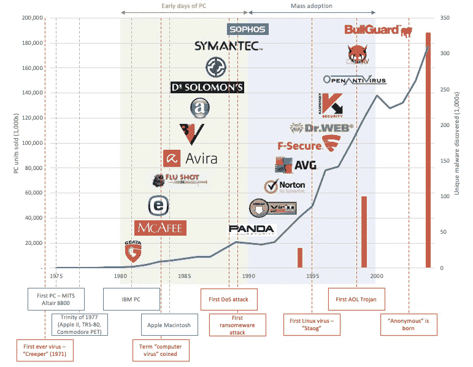

Companies source: wiki + news + [crunchbase](https://crunchbase.com).

很快，风投们意识到网络安全的重要性，资本开始涌入:

*   [凯鹏华盈向赛门铁克投资 300 万美元](https://symantecweblog.blogspot.com/2007/12/history-of-symantic.html)
*   [麦卡菲向峰会合作伙伴募集资金](https://www.summitpartners.com/companies/mcafee)
*   [BitDefender 筹集了 700 万美元](https://www.crunchbase.com/funding_round/bitdefender-series-unknown--c53718a6)

…随后是数百万美元的收购:

*   [麦卡菲以 7 亿美元收购索罗门博士](https://web.archive.org/web/20101030025249/http://www.pcworld.com/article/7883/network_associates_plans_to_integrate_dr_solomons_tools.html)
*   [赛门铁克同意以 7.688 亿美元的股票交易收购 Axent](https://www.wsj.com/articles/SB964713859399871269)
*   [微软将从 GeCAD 软件获得防病毒技术](https://web.archive.org/web/20090426010633/http://www.microsoft.com/presspass/press/2003/jun03/06-10GeCadPR.mspx)

随着移动恶意软件的快速增长，移动安全领域也出现了类似的爆炸式增长:

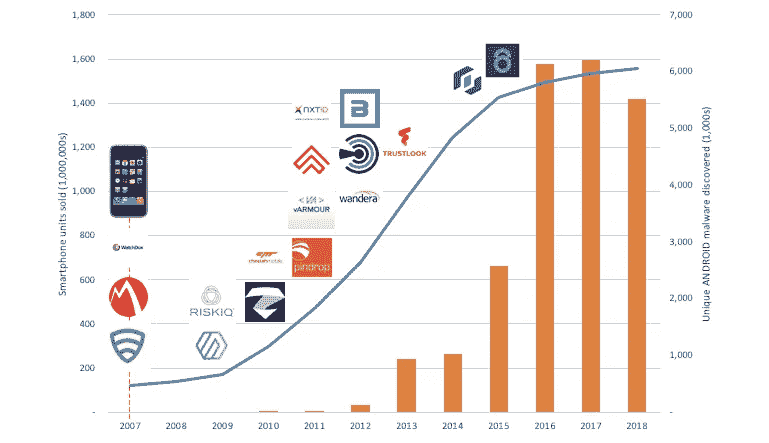

Companies source: wiki + news + [crunchbase](https://crunchbase.com).

…安全费用:

*   [Bluebox 从 Andreessen Horowitz 获得 950 万美元](https://techcrunch.com/2012/06/19/bluebox-raises-9-5-million-from-andreessen-horowitz-others-for-its-stealthy-disruptive-mobile-security-solution/)
*   [法国电信向 Lookout 投资高达 2000 万美元](https://techcrunch.com/2012/12/04/france-telecom-invests-up-to-20m-in-lookout-preloads-its-mobile-security-solutions-on-to-android-handsets/)
*   [Zimperium 为移动安全募集 800 万美元](https://techcrunch.com/2013/12/20/zimperium-raises-8m-for-mobile-security-that-turns-the-tables-on-attackers/)

…最终，安全收购:

*   [移动安全初创公司 Mobilisafe 被 Rapid7 收购](https://www.geekwire.com/2012/mobile-security-startup-mobilisafe-acquired-rapid7/)
*   [苹果以 3.56 亿美元收购三星的安卓安全合作伙伴 AuthenTec](https://techcrunch.com/2012/07/27/apple-buys-samsungs-android-security-partner-authentec-for-365m/)
*   [AVG 以 2 . 2 亿美元收购移动安全公司 Location Labs](https://techcrunch.com/2014/09/03/avg-buys-location-labs/)

那么机器学习呢？

# ML 需要安全吗？

在过去的某个时候，我曾为英国最大的金融科技公司之一 [GoCardless](https://gocardless.com) 负责反欺诈和反洗钱[。我的团队每年监管超过 100 亿美元的交易量，我们一直在努力将骗子排除在 GC 的循环系统之外。很自然——在某个时候，我们屈服于炒作，决定尝试机器学习。](https://medium.com/@iljamoisejevs/why-the-future-of-finance-is-decentralized-a58ab38e6800)

令我当时感到惊讶的是，它居然有效。事实上，效果很好。我们摆脱了传统的启发式方法，成功地将欺诈造成的资金损失减少了 80%,并将可疑洗钱账户的检测率提高了 20 倍。

只有一个问题。

我们以我认为的“关键”能力部署机器学习。我们交给算法一项任务，不允许它失败——如果它失败了——我们要么损失一大笔钱，要么被吊销金融执照。对于我这个直接负责 GC 安全的产品经理来说——这两个听起来都不是特别令人兴奋。

所以我需要知道曼梯·里会在什么时候以什么方式失败。我们的模式如何被利用？它固有的弱点在哪里？我如何知道 GoCardless 是否受到攻击？

在花了太多的深夜阅读军情六处的文件并在暗网上搜寻之后，我终于找到了我一直在寻找的东西。我了解到 ML 上的[中毒攻击](https://medium.com/@iljamoisejevs/poisoning-attacks-on-machine-learning-1ff247c254db)，攻击者能够通过在训练期间注入损坏的数据来影响模型的思维。我发现了[对立的例子](https://medium.com/@iljamoisejevs/evasion-attacks-on-machine-learning-or-adversarial-examples-12f2283e06a1)，以及模型如何容易被测试时小心扰乱的输入误导。最后，我了解到[隐私攻击](https://medium.com/@iljamoisejevs/privacy-attacks-on-machine-learning-a1a25e474276)以及底层数据和模型本身都没有那么隐私。

然后，我发现了这个…

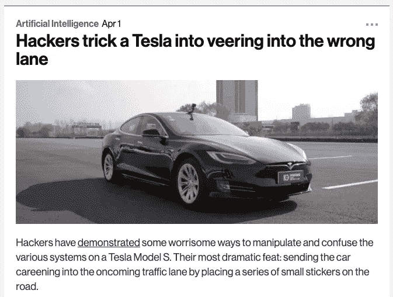

Source: [MIT tech review](https://www.technologyreview.com/f/613254/hackers-trick-teslas-autopilot-into-veering-towards-oncoming-traffic/).

…我吓坏了。

到 2019 年底，1/3 的企业将部署机器学习。这是你、我、我们的朋友和爱人每天使用的所有产品的 1/3——完全暴露在任何对 ML 工作原理有一丁点了解的攻击者面前。

是的，机器学习需要安全。

# 婴儿第一步

ML 安全是一个非常新兴的领域，目前基本上还不存在。如果说我从上面的研究中学到了什么，那就是任何没有数学博士学位的人都很难弄清楚如何让他们的 ML 安全(今天实际上没有解决方案，只有大量数学研究论文)。

考虑到我们的生活中有多少要托付给算法——我认为这是我们的责任——你的，我的，以及整个 ML 社区的责任，以确保安全性不会被抛在脑后。正如我在关于[逃避](https://medium.com/@iljamoisejevs/evasion-attacks-on-machine-learning-or-adversarial-examples-12f2283e06a1)、[中毒](https://medium.com/@iljamoisejevs/poisoning-attacks-on-machine-learning-1ff247c254db)和[隐私](https://medium.com/@iljamoisejevs/privacy-attacks-on-machine-learning-a1a25e474276)攻击的帖子中所解释的那样，我们今天可以做很多事情来构建更健壮的 ML 模型。但更重要的是，我们需要转变思维方式——从“不惜一切代价保证准确性”转向更平衡的准确性和稳健性方法:

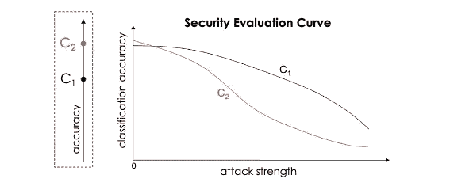

[Source.](https://arxiv.org/pdf/1712.03141.pdf) C1 and C2 are two models. C1 clearly starts off as less accurate, but as the attack strength increases, it also does a better job at withstanding it. Would you pick C1 or C2 as your ML model?

这篇文章和上面的文章是我朝着更强大的 ML 未来迈出的第一小步。如果你觉得它很有见地，一定要分享你的见解。

确保每个人的安全。