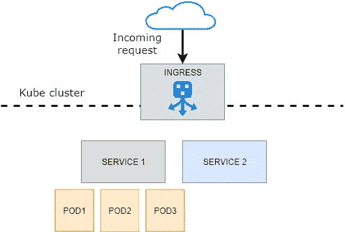

# Kubernetes 到底是什么？

> 原文：<https://towardsdatascience.com/what-exactly-is-kubernetes-52c9f1c4990b?source=collection_archive---------6----------------------->

## 我在 Azure Kubernetes 上部署了一个 web 应用程序，这是一个非常好的旅程，我想告诉你这个有趣世界的所有秘密。

# 我的 Kubernetes 路线图

自从我在 2015 年末发现 Docker 以来，我对部署可以像源代码一样处理的事实印象深刻。是的，我认为这就是容器填补的空白:制作源代码并提供同样的服务。当您在订单控制器上提交您的更改时，您可以提交托管订单控制器的新服务器。这是一场革命，想想开发人员手动上传文件到生产环境，或者幸运的话用 DevOps 工具移动文件。这开启了新的场景，其中基础架构也是由 DevOps 工具部署的。老实说，并不是所有的应用程序都需要一个点击一下就可以复制的基础设施。这是 Saas 软件的一个需求，但是对于大多数 simples 业务用例来说，这是一个昂贵的附加需求。然而，回到 Docker，仍然需要一些努力来部署和扩展它。我在开发、测试和生产环境中使用了它，不怪 docker。我喜欢它。但是，它需要转换开发人员在开发中使用容器的旧方式，以便在生产环境中获得精益流程的所有好处。我们这样做是为了让大多数开发人员在他们的 PC 上有 docker，可以运行容器或运行“docker-compose up”并使用服务器集群。

这太好了，许多在不同环境中开发的问题或开发人员的设置成本都被砍掉了。生产部署仍然完全由 DevOps 流程管理，那么还有什么呢？在我内心深处，我发现少了些什么。仍然有一些部分困扰着我…拉容器，运行容器，暴露体积，这很好，docker 本身给了我们解决方案，但我缺少一些东西。我不知道当时到底发生了什么，但可以肯定的是。后来有一天我发现了 Kubernetes。有效载荷是“生产级容器编制器”。我不记得当时是什么了，但是相信我……管弦乐队这个词打开了我的思路。我需要一些东西来编排容器，协调它们的工作:Kubernetes 是我所怀念的。自从我在生产环境中测试它之后，开发过程中的摩擦减少了，设置时间减少了，开发工作也减少了。

Kubernets is the revolution in containers!

# 什么是 Kubernetes

我已经非常肯定地谈到了容器。我希望所有这些容器都是运输和运行我们的应用程序的好方法。在生产环境中，我们也有许多要求，首先，您希望部署时不停机，或者在负载增加时不扩展。也许你会想，如果一个容器倒了，另一个会启动。把 Kubernetes 想象成一个弹性运行分布式系统的框架。它可以满足您的扩展需求、故障转移、部署模式等。

Kubernetes 提供的开箱即用功能:

*   **服务发现和负载均衡:** Kubernetes 提供了一个名为“ingress controller”的瑞士工具。它可以由不同的附加组件管理，但基本上，使用 DNS 或 IP 地址公开一个容器。这很酷，因为如果流量很高，Kubernetes 会平衡流量并进行分配。此外，这可以实现 HTTPS 到 HTTP 的机制，这样内部容器就可以用 HTTP 进行通信，而不必担心每个容器上的运输证书。如果你愿意的话，你也可以进行某种 URL 重写，将许多应用托管到一个域中，例如，你可以在 www.mysite.com 的[使用 angular SPA，在 www.mysite.com/api/的](http://www.mysite.com)[使用 REST API app](http://www.mysite.com/api/)
*   **存储协调:**如果您还记得 docker 卷的话，这个概念是相同的，但是有所改进。您可以将存储链接到 Kubernetes 集群，然后归咎于容器中的卷。非常酷的是，“存储”可能意味着本地驱动器是一种基于云的服务。
*   **自动推出和回滚:**你可以通过在某个地方添加一些 YAML 文件来自动创建容器。你只需要描述你的平台如何伸缩以及你的容器如何相互作用。
*   **自动装箱:**最终，Kubernetes 也需要物理资源来工作。这意味着您仍然需要 CPU、RAM 和磁盘来让容器工作。好消息是您可以指定每个容器的资源需求。这将有助于 Kubernetes 在扩展方面做出更好的决策。
*   **自愈:** Kubernetes 是容器保姆。他照顾一切。如果容器出现故障，它会尝试替换它。如果容器没有反应，它就杀了他，以此类推。
*   **秘密和配置管理:【Kubernetes 非常好的一点是可以将配置从容器中分离出来。这有点像环境变量，但是更酷。每个配置都可以被全局管理，附加到一个或多个容器。此外，一些称为“秘密”的变量被加密以确保安全。这对于敏感信息非常有用，比如密码、认证令牌或 ssh 密钥。**

# Kubernetes 不是什么

Kubernetes 是很多好东西，我希望已经明确揭露所有 Kubernetes 的好处。Kubernetes newbie 的主要问题是，他们发现这并不像他们想象的那样是一个 PaaS(平台即服务)系统。Kubernetes 是很多东西，但不是一个“全包”服务。它很棒，减少了工作量，特别是在系统管理员方面，但是除了基础设施之外，它没有为您提供任何东西。

他说，您在完全托管的系统中寻找的大部分东西都在那里:简化的部署、扩展、负载平衡、日志记录和监控。通常，你会从你的主机上得到一个标准配置，但是如果你真的需要的话，理论上你可以自定义它。

Kubernetes 的局限性:

*   它不限制支持的应用程序类型。所有的东西都被写入容器中，所以每个容器应用程序，无论在技术上，都可以运行。与之相对应的是，您仍然需要手工定义容器。
*   *它不提供自动化部署。*您只需将构建的图像推送到 docker 存储库中，仅此而已。如果您已经在持续集成、交付和部署(CI/CD)的过程中工作，这是非常容易的，但是考虑到没有它将是非常棘手的。
*   它不提供任何应用级服务，只提供基础设施。如果你需要一个数据库，你必须购买一个服务或者在一个专用的容器中运行它。当然，负责备份等等。
*   大多数与系统的交互都是通过包装 API 的命令行进行的。这非常好，因为它允许自动化每个设置。命令的语法非常简单，但是，如果您正在寻找一个完全由 UI 管理的系统，那么您正在寻找最糟糕的地方。

# Kubernetes 如何工作

让我们开始对技术部分进行更深入的研究。现在不是全面概述组件的时候，我也不想吹毛求疵。我的目的是描述最重要的组成部分，并弄清楚所有这些将在本文的后续部分中出现。当然，如果你打算自学 Kubernetes，开始知道你在哪里是一个很大的优势。

**吊舱**

将 Pod 视为容器的高级抽象。在这个抽象中，pod 可以是一个单独的容器实例或一个组。Pod 由一个或多个容器组成，这些容器共享资源并位于主机上。每个 pod 都分配有一个唯一的 IP 地址，这意味着一个 pod 可以像 docker 环境中的传统容器一样相互通信。pod 内的每个容器可以到达虚拟网络中的所有其他 pod，但是不能深入到其他 pod 上的其他容器。这对保证 pod 抽象很重要:没有人必须知道 pod 在内部是如何组成的。此外，分配的 IP 是易变的，因此您必须始终使用服务名(直接解析到正确的 IP)。像 Docker 容器一样，POD 可以定义可以与共享网络驱动器进行比较的卷。这对于保存数据或在 pod 之间共享文件很有用。

您可以使用 API 或者只是在 shell 上点击命令来管理 pods。

**服务**

信息学中的“服务”这个名称被滥用了。在 Kubernetes scope 中，把服务想象成你想提供的东西。Kubernetes 服务涉及一组 Pod，可能提供复杂的功能，或者只是用一个容器公开一个 Pod。因此，您可以拥有一个提供 CMS 功能的服务，其中包含数据库和 web 服务器，或者两个不同的服务，一个用于数据库，一个用于 web 服务器。这取决于你。

**入口控制器**

服务是您可以对外公开的组件。为此，有一个入口控制器做一些类似于负载平衡器的事情。它实际上将来自外部的流量转发给服务。在此步骤中，根据您选择的入口实施，您可以添加 HTTPS 加密，根据主机名或 URL 段路由流量。唯一的服务可以链接到入口控制器，而不是 pod。

**卷**

默认情况下，Pod 存储是不稳定的。知道这一点很重要，因为在第一次重启时，你会失去一切。Kubernetes 卷允许将容器硬盘的某个部分映射到一个安全的地方。该空间可以在容器之间共享。装载点可以是容器的任何部分，但是一个卷不能装载到另一个卷中。

**命名空间**

把名称空间想象成使 Kubernetes 成为多租户的特性。名称空间是租户级别的。每个名称空间可以划分资源以隔离服务、入口和许多其他东西。这个特性有助于在应用程序之间进行强有力分离，安全地委托给不同的团队，并在单个基础设施中拥有独立的环境。

**秘密和配置**

可以通过配置图进行全局配置。这种机制以这种方式工作。首先，您有一个或多个配置清单，然后您将容器的环境变量链接到全局变量。好处显而易见。如果一个变量改变了，你只需要改变它一次。而且对于一些敏感信息，有一个很酷的机制叫做“秘密”。Secrets 变量加密存储在系统中，任何人都无法访问。秘密只被送到需要它的舱里

# Kubernetes 即服务

作为每个非系统管理员，我讨厌戴上系统管理员的帽子。或者更好…一切都很有趣，直到事情打破。也许我反应过度了，或者这只是嫉妒，但有一点是神圣的不要做别人的工作。现在有这么多的服务给你免费的 Kubernetes，不使用它是如此愚蠢，我不想谈论它。我们说的不是手工制作的果酱，而是软件。如果可以的话，就从更好的玩家那里买。谷歌、亚马逊、微软、IBM……它们都有自己的 Kubernetes 服务，并且都采用相同的定价模式:来找我吧，所有的 Kubernetes 服务都是免费的，你只需为你要使用的资源付费。许多供应商给你一个免费层或信用试用期，所以很容易开始玩它。我选择 Azure 撰写本文是因为在源代码集成过程中有一些便利，但是您将在本系列文章中学到的大部分内容将适用于所有内容。Kubernetes 即服务的另一个伟大概念是，这不需要您的应用程序与云耦合。由于你的应用程序只是一个原始容器，并且这是由一些符合 Kubernetes 的配置文件编排的，你将能够轻松地从 azure 迁移到 google，反之亦然(至少不需要改变源代码)。

因此，Kubernetes 服务是免费的，你只需为它支付硬件费用，这里的“硬件”指的是 Kubernetes 使用的虚拟机。

# 带什么回家

Kubernetes 是一个非常棒的平台，可以安全地退出传统的虚拟机保护，转向云。它带来了活力，降低了系统管理员的成本，并提高了服务的质量水平，这是很难保证的。许多传统问题，如网络和数据保护，都可以通过 Kubernetes 本身的高级配置来解决。

我不能说 Kubernetes 适合你所有的项目，但是相信我，如果我告诉你*你必须考虑*你所有新项目的选择。

## 准备好下一步了吗？[刚刚阅读了如何在实践中使用 Kubernetes 部署 web 应用程序！](https://medium.com/swlh/how-to-deploy-an-asp-net-application-with-kubernetes-3c00c5fa1c6e)

觉得这篇文章有用？在 Medium 上关注我([丹尼尔·丰塔尼](https://medium.com/@daniele.fontani))，看看我下面最受欢迎的文章！请👏这篇文章分享一下吧！

*   [Docker 到底是什么？](https://medium.com/swlh/what-is-docker-28bd2b618eee)
*   [TDD(测试驱动开发)举例说明](/tdd-explained-with-an-example-738d702f87e)
*   [无开发者宣言:编写软件的道德方式](https://medium.com/@daniele.fontani/developerless-manifesto-the-ethical-way-to-build-software-4743bae04319?source=---------7------------------)