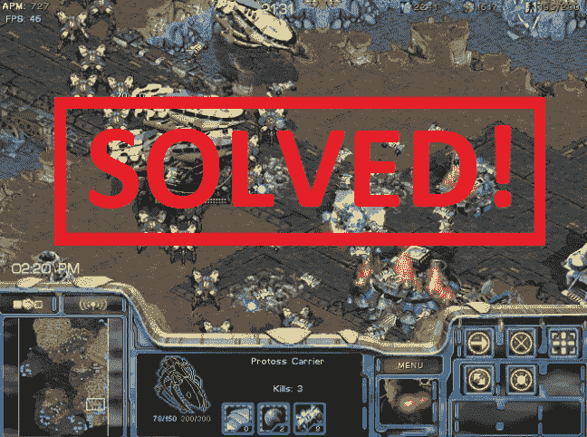
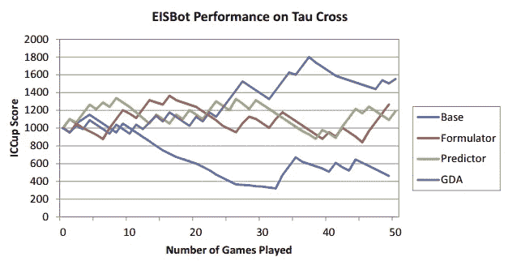

# 学术人工智能研究人员遵循 AlphaStar 的是什么？

> 原文：<https://towardsdatascience.com/what-follows-alphastar-for-academic-ai-researchers-befe0fc66d39?source=collection_archive---------14----------------------->

## DeepMind 继续取得进展，但学术界人工智能研究人员的前进道路尚不明朗。

十年前，我向全球人工智能研究人员发出挑战，要他们为《星际争霸 1》打造一个专业级机器人。[育雏战争 API](https://github.com/bwapi/bwapi) 最近发布，学者和专业人士首次可以在竞争激烈的 RTS 游戏上测试人工智能系统。在接下来的几年里，一些[人工智能比赛](http://www.cs.mun.ca/~dchurchill/starcraftaicomp/history.shtml)举行了，虽然机器人开始进入更高的等级，但要达到专业水平的游戏还有很大的差距。当 DeepMind 宣布我们将在 2016 年推出星际争霸 2 时，我预计将需要几年的时间来改进现有的方法，并达到专业水平的游戏性。但我错了，AlphaStar 上周展示了深度强化学习可以用来训练一个与职业游戏玩家竞争的机器人。

虽然许多人对比赛的限制表示担忧，神族在一张地图上镜像比赛有很高的 APM 限制，但我预计 AlphaStar 可以通过额外的训练克服这些限制。也有人担心 AlphaStar 是在与一名职业选手而不是星际争霸的大师竞争。无论这种批评是否成立，AlphaStar 能够击败专业水平的玩家这一点仍然成立。鉴于演示的强大效果，我认为星际争霸是一个已经解决的问题，并建议我们转向新的人工智能挑战。

但对人工智能研究人员来说，尤其是在学术界，最大的问题是我们如何在 AlphaStar 展示的进展基础上继续发展？首先，大多数学术研究人员不会获得 DeepMind 可以获得的资源类型:

*   **大规模计算:** DeepMind 利用一个 TPU 农场来训练 AlphaStar 玩上百年的游戏。同样，OpenAI 在为 Dota 2 构建 [OpenAI Five](https://blog.openai.com/openai-five/) 时也使用了大量计算资源。
*   **开放 API:**deep mind 团队可以接触到暴雪的工程师，确保 API 按预期运行，而 BWAPI 由于被逆向工程而出现问题。
*   **训练数据集:** DeepMind 能够在职业选手的匿名回放上进行训练，以引导学习过程。

我之前[写了](/the-end-of-open-ai-competitions-ff33c9c69846)关于 OpenAI Five 与专业人士竞争时的这些限制，尽管 DeepMind 在第二和第三点上有了显著改善，但事实仍然是学术界在资源方面有巨大的劣势。另一个问题是缺乏可用于建设 AlphaStar 进展的材料。例如，直到其他研究人员可以测试他们的机器人与这个系统。

AlphaStar 对人工智能来说是一个巨大的进步，但对于希望致力于大型公开挑战的人工智能研究人员来说，在这些类型的问题上取得进展的最佳机会是离开学术界，加入 DeepMind 或 OpenAI 等公司。短期内这可能不是太大的问题，但它确实为建立长期的[人工智能人才管道](https://medium.com/@mark_riedl/supporting-the-ai-talent-pipeline-5ae0fc67a4f6)制造了一个问题。

对于学术界的 AI 研究人员来说，我们需要重新思考我们可以取得进展的问题类型。如果问题可以通过投入大量计算资源来解决，那么对 AI 基准进行增量改进就不再可行。以下是我对从事游戏人工智能研究的学术界人工智能研究人员的建议:

*   确定较小规模的问题:我把星际争霸作为一项重大的人工智能挑战，因为它有太多的人工智能系统需要解决的问题。虽然这些类型的问题可能是获得资金的有用环境，但较小的挑战也可以取得进展。例如，King 一直在使用深度学习为 Match 3 游戏执行[自动化游戏测试](https://medium.com/techking/human-like-playtesting-with-deep-learning-92adafffe921)，这比《星际争霸》容易控制得多。
*   **构建可复制的人工智能:**为了鼓励增量研究，为已发表的论文发布源代码和数据集是很有用的。我采用了这种方法，并为[构建顺序预测](https://games.soe.ucsc.edu/project/starcraft-data-mining)发布了一个数据集，但没有发布代码。我后来复制了这个作品，[写了](/reproducible-research-starcraft-mining-ea140d6789b9)关于这个过程。
*   为了评估人工智能系统的性能，经常与人类对手进行测试是很有用的。这是我在论文项目中采用的一种方法，我进行了一项消融研究，其中不同的推理组件被禁用，生成的机器人与人类进行了对比测试，如下图所示。如有必要，确保获得 IRB 的批准。
*   **探索用更少的计算进行学习:**强化学习的一个问题是学习策略所需的培训量。研究人员可以在不使用大量计算资源的情况下在这一领域取得潜在进展。
*   **重温迁移学习:**早期 RTS 研究探索的方法之一是迁移学习，有 [TIELT](http://www.aaai.org/Papers/Workshops/2004/WS-04-04/WS04-04-011.pdf) 等系统。鉴于训练网络需要大量计算，迁移学习似乎是研究人员取得进展的一个好领域。

学术界仍然需要探索重大的人工智能挑战，但解决方案可能来自私营公司。

Testing my bot versus human opponents on ICCup.

我发现 AlphaStar 最吸引人的一点是，随着越来越多的计算投入到问题中，它会继续学习。这并不是说问题很容易，而是说 DeepMind 构建的系统很新颖，并且可以通过额外的经验继续学习，这对 AI 来说是一个巨大的进步。DeepMind 无法解决星际争霸仅仅是因为资源，而是通过巧妙的设计和大规模的计算。我之前在[的博客](https://www.gamasutra.com/blogs/BenWeber/20160314/267956/DeepMind_Challenges_for_StarCraft.php)中谈到了 DeepMind 必须克服的一些挑战，其中许多问题似乎都由 AlphaStar 解决:

*   **战争迷雾:** AlphaStar 执行类似于职业玩家的侦察行为，不断与对手交战以获取情报。然而，由于 AlphaStar 专注于跟踪者的构建，尚不清楚该机器人是否对对手的构建顺序进行正向推理。
*   **决策复杂性:**从演示视频中还不清楚 AlphaStar 如何将建造顺序决策从微观管理中分离出来，但看起来机器人在决定下一步建造哪个单元或结构时会使用尽可能多的信息。AlphaStar 已经通过构建推理系统解决了这个问题，该系统可以很好地处理星际争霸问题空间的分解。
*   观看演示时需要了解的一件很酷的事情是，AlphaStar 正在对不同的机器人联盟进行训练，这些机器人不断尝试新的策略。这种方法应该有助于游戏中的小变化，但当新地图引入机器人时，可能不会翻译得很好。
*   **奶酪:**机器人侦察得很好，并在最初的比赛中派出额外的工人调查侦察单位，这表明机器人可能已经学会适应早期的冲刺策略。然而，奶酪往往是地图特定的，不清楚 AlphaStar 将如何概括。
*   **模拟环境:**我的一个假设是，AlphaStar 必须进行正向建模，才能在专业水平上玩游戏，但目前还不清楚机器人是否做了任何明确的规划。这对于职业比赛的目标来说并不是必须的，但我认为这是一个先决条件。
*   **实时:** AlphaStar 似乎对游戏性有很好的分解，当意味着一旦进行训练，在任何给定时间采取的行动都不会占用大量资源。

所有这些训练的结果是一个给对手施加很大压力的机器人，并且在整场比赛中表现出不同的策略。但是有一个批评仍然存在，那就是 AlphaStar 正在以一种人类不可能的方式开发单位(潜行者)。这与第一届星际争霸 AI 比赛的结果类似，伯克利的 Overmind 以一种新颖的方式使用了飞龙。虽然当目标是通过图灵测试时，这是一个有效的批评，但这不是我为星际争霸 AI 设定的目标，我希望 DeepMind 正在进行的工作能够超越这一策略。

AlphaStar 是 RTS AI 向前迈出的一大步，我很高兴看到今年暴雪展示了什么。然而，对于学术人工智能研究人员来说，这是人工智能需要巨大计算才能进步的另一个证明。我的建议是探索可以取得进展的较小问题，并在扩大规模之前展示学习和转移学习。

本·韦伯是 Zynga 的首席数据科学家。我们正在[招聘](https://www.zynga.com/careers/positions/categories/data-analytics-user-research)！这篇文章是基于我在学术界的经验，不代表 Zynga