# 你应该使用什么形式的交叉验证？

> 原文：<https://towardsdatascience.com/what-form-of-cross-validation-should-you-use-76aaecc45c75?source=collection_archive---------9----------------------->

## [优化和机器学习](https://towardsdatascience.com/tagged/optimization-and-ml)

## 优化样本外预测误差的正确代理

Photo by [Josh Calabrese](https://unsplash.com/@joshcala?utm_source=unsplash&utm_medium=referral&utm_content=creditCopyText) on [Unsplash](https://unsplash.com/s/photos/spin?utm_source=unsplash&utm_medium=referral&utm_content=creditCopyText)

C 通过对整个数据集的样本外预测误差进行平均，我们希望交叉验证误差可以作为模型在未知测试数据上表现的代理。如果它作为一个准确的代理，那么我们可以使用交叉验证作为指导来调整模型，以便在一般情况下实现更好的性能。

[K 重交叉验证](https://en.wikipedia.org/wiki/Cross-validation_(statistics)#k-fold_cross-validation)将数据集随机划分为 K 个不重叠的子集。模型被训练 k 次，每个子集依次被排除并用作样本外测试数据。对于较小的 k 值，k 倍的计算成本可能较低，但它具有不吸引人的特性，即它将随机性引入交叉验证结果。

[留一交叉验证](https://en.wikipedia.org/wiki/Cross-validation_(statistics)#Leave-one-out_cross-validation) (LOOCV)是一种 k 折形式，其中 k 等于数据集的大小。与常规 k-fold 相比，LOOCV 结果没有随机性，因为每个数据点总是被划分到自己的子集。虽然在一般情况下这可能很昂贵，需要模型适合数据集中的每个点，但对于某些模型，如[岭回归](https://en.wikipedia.org/wiki/Tikhonov_regularization)，LOOCV 可以有效地计算和优化，以找到最佳的模型参数。

如果可行，LOOCV 应优先于其他形式的 k 倍；但是它仍然有一些不理想的特性。让 **X** 和 **y** 代表数据集的 n×p 特征矩阵和目标值。如果 **Q** 是一个 n×n[正交矩阵](https://en.wikipedia.org/wiki/Orthogonal_matrix)，则放

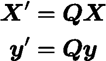

假设我们用岭回归模型来拟合数据集。如果 **b** 代表模型的回归变量，那么 **b** 在旋转回归问题上的误差与在原始问题上的误差相同

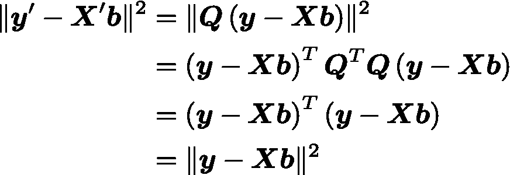

因此，回归问题**X’，y’**和 **X，y** 之间是等价的，然而 LOOCV 对于旋转不是不变的。

此外，当一个特征的方差只集中在几个数据点时，LOOCV 的表现尤其差。在最极端的情况下，假设

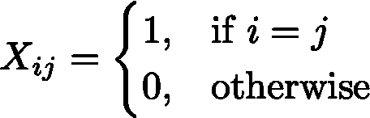

当排除第 I 个数据向量(i ≤ p)时，剩余数据集中没有方差来拟合第 I 个回归系数，因此 LOOCV 为

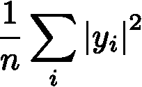

并且独立于正则化矩阵。

## 广义交叉验证

广义交叉验证(GCV)背后的思想是修改 100c v，以便它是在原始回归问题的旋转上计算的，其中旋转矩阵是以非常特殊的方式选择的，以便 1) GCV 对于原始回归问题的旋转是不变的，以及 2)特征向量的方差在变换矩阵**x’**⁴.上均匀地“展开”

设 **U** 、 **S** 、 **V** 代表 **X** 的[奇异值分解](https://en.wikipedia.org/wiki/Singular_value_decomposition)

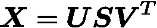

其中 **S** 为矩形对角矩阵 **U** 和 **V** 为正交矩阵。让 **W** 代表一个[酉矩阵](https://en.wikipedia.org/wiki/Unitary_matrix) (GCV 使用复数旋转)。放

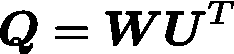

设**X′**，**y′**表示这个矩阵的旋转回归问题。然后

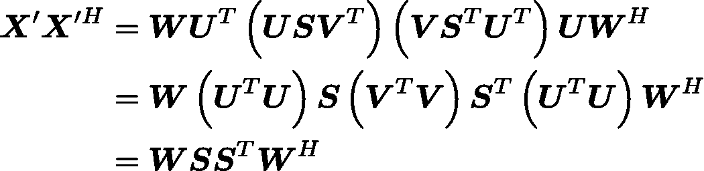

现在，准备

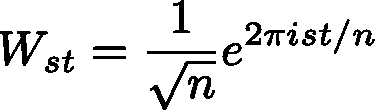

**W** 的列是 n×n[个循环矩阵](https://en.wikipedia.org/wiki/Circulant_matrix)的公共特征向量，因此对于任意对角矩阵 **D**

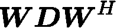

是一个循环矩阵，其形式为

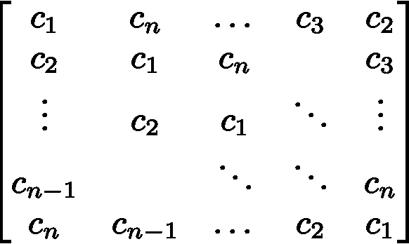

因此，

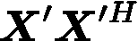

是对角线上有常数的循环矩阵。另外，对于**x′**的任意一行，它与**x′**的其他行的协方差由相同的移位 vector⁵.表示

## 计算 GCV

设**γ**表示岭回归的正则化矩阵。那么回归问题 **X** ， **y** 的 LOOCV 可以用 equation⁶有效地计算

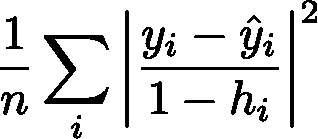

在哪里

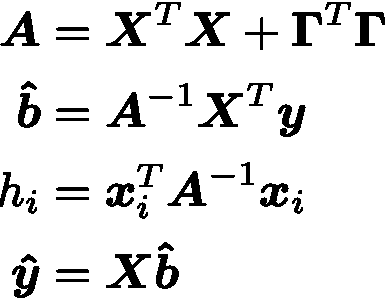

相同的等式可以用于旋转回归问题**X’，y’**来计算 GCV，只是我们需要考虑到**X’，y’**是复数值的事实。那么，GCV 方程就变成了

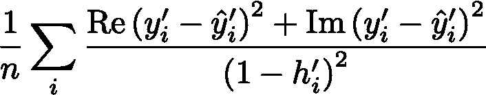

在哪里

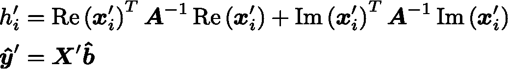

(注意: **A** 和 **b̂** 对于旋转是不变的，因此它们保持不变)

我们还可以对 LOOCV 的导数方程进行同样的修改，以计算 GCV 导数，这使得应用优化器来最小化关于**γ**的 GCV 成为可能。

## 一个特例

假设我们用单个变量来参数化我们的正则化矩阵**γ**

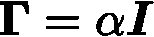

那么**h′**就是的对角线

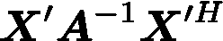

和

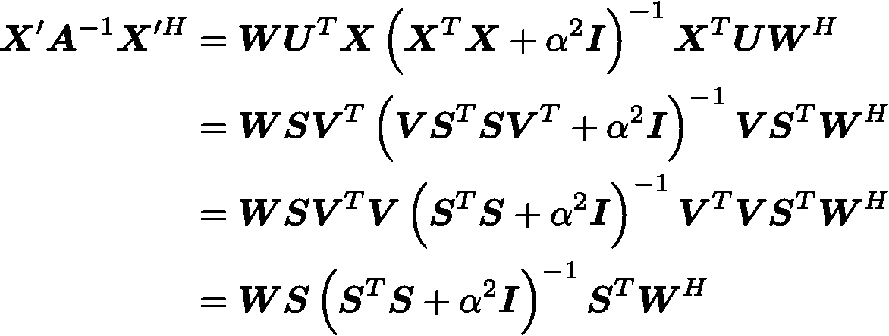

现在，因为

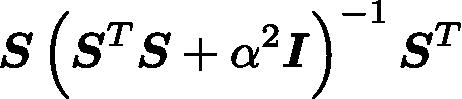

是一个对角矩阵，由此可见

是循环矩阵。因此，**h′**是一个常数值向量，等于

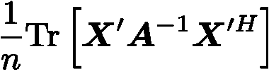

或者，由于轨迹对于旋转是不变的，

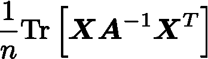

将其代入 LOOCV 方程，并利用旋转回归问题具有相同误差平方和的特性，单变量正则化的 GCV 为

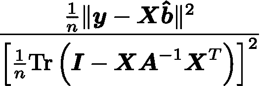

这是 GCV 最常见的表现形式。但是注意:对于由多个变量参数化的**γ**的一般情况，这个简化的方程不会计算出正确的 value⁷.

## 现实世界的问题

我们将在一个示例问题上比较设置正则化参数的不同方法的性能。数据取自 1974 年美国杂志《汽车趋势》,任务是从其他给定的属性预测车辆的燃油效率。我们将在数据的留一交叉验证中比较以下模型:

*   **最小二乘回归**
*   **RR-LOOCV-1:** 通过二阶优化器设置单个正则化参数的岭回归，以最小化训练数据上的 LOOCV 误差。
*   **RR-LOOCV-p:** 与 RR-LOOCV-1 相同，但对于每个[主分量](https://en.wikipedia.org/wiki/Principal_component_analysis)具有单独的正则化参数。
*   **RR-GCV-1:** 通过二阶优化器设置单个正则化参数的岭回归，以最小化训练数据上的 GCV 误差。
*   **RR-GCV-p:** 与 RR-GCV-1 相同，但对每个主成分使用单独的正则化参数。

注意:在这个实验中有两个水平的交叉验证。在最高层，我们为每个数据点形成一对训练数据和测试数据来训练模型；在较低层次，岭回归模型对训练数据执行另一个交叉验证，以设置它们的正则化参数。

下表显示了从 best 到 worse⁸.订购的每个型号的 LOOCV 的均方根误差(RMSE)

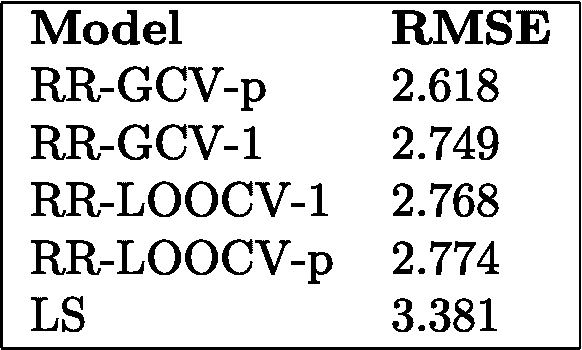

## 结论

岭回归是机器学习中最常用的模型之一。通过正确的正则化矩阵，它经常优于最小二乘法。使用优化器，我们可以设置正则化参数来最大化某些形式的交叉验证的性能；但是为了获得良好的样本外性能，我们需要使用交叉验证作为样本外预测误差的准确代理。我们看到了 LOOCV 在某些情况下会有问题，并且有一个不受欢迎的特性，就是它对旋转很敏感。我们引入 GCV 作为旋转不变的替代方案，并通过展开特征矩阵的方差来处理 LOOCV 的问题情况。我们比较了不同岭回归模型在一个示例问题上的表现，发现 GCV 给出了最好的结果。

*要找到优化留一交叉验证或广义交叉验证的正则化参数，请查看*[*building block . ai*](https://buildingblock.ai)*。*

脚注

[1]:参见[如何更好地进行岭回归](/how-to-do-ridge-regression-better-34ecb6ee3b12)，了解如何将优化器与 LOOCV 一起使用以找到正则化参数的详细信息。

[2]:请参见[https://github . com/rn burn/ridge-regression-doc/blob/master/notebooks/loo cv-rotations . ipynb](https://github.com/rnburn/ridge-regression-doc/blob/master/notebooks/loocv-rotations.ipynb)了解 loocv 如何对旋转敏感的示例。

[3]:GCV 作为 LOOCV 在旋转回归问题上的问题案例和表述摘自

> Golub G .、Heath M .和 Wahba G .，[广义交叉验证作为选择良好岭参数的方法](http://pages.stat.wisc.edu/~wahba/stat860public/pdf1/golub.heath.wahba.pdf) (1979 年)，《技术计量学》，第 21 卷，第 2 期

[4]:为了使“分散方差”的概念更精确，让 **K** 表示数据向量的协方差矩阵

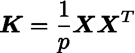

其中我们假设 **X** 的列居中，p 是特征向量的长度。注意到 **K** 的 [Frobenius 范数](https://en.wikipedia.org/wiki/Matrix_norm#Frobenius_norm)对于 **X** 的旋转是不变的；并且在 GCV 旋转之后，协方差矩阵**K′**是循环的，因此每一列对 Frobenius 范数的贡献相等。

[5]:[https://github . com/rn burn/ridge-regression-doc/blob/master/notebooks/gcv-rotation . ipynb](https://github.com/rnburn/ridge-regression-doc/blob/master/notebooks/gcv-rotation.ipynb)验证 GCV 旋转矩阵是否循环

[6]:参见[如何更好地做岭回归](/how-to-do-ridge-regression-better-34ecb6ee3b12)高效 LOOCV 方程的推导

[7]:参见[https://github . com/rn burn/ridge-regression-doc/blob/master/notebooks/gcv-formulas . ipynb](https://github.com/rnburn/ridge-regression-doc/blob/master/notebooks/gcv-formulas.ipynb)单变量 GCV 方程的验证

[8]:完整实验可在[https://github . com/rn burn/ridge-regression-doc/blob/master/notebooks/motor-trends-regression . ipynb](https://github.com/rnburn/ridge-regression-doc/blob/master/notebooks/motor-trends-regression.ipynb)获得