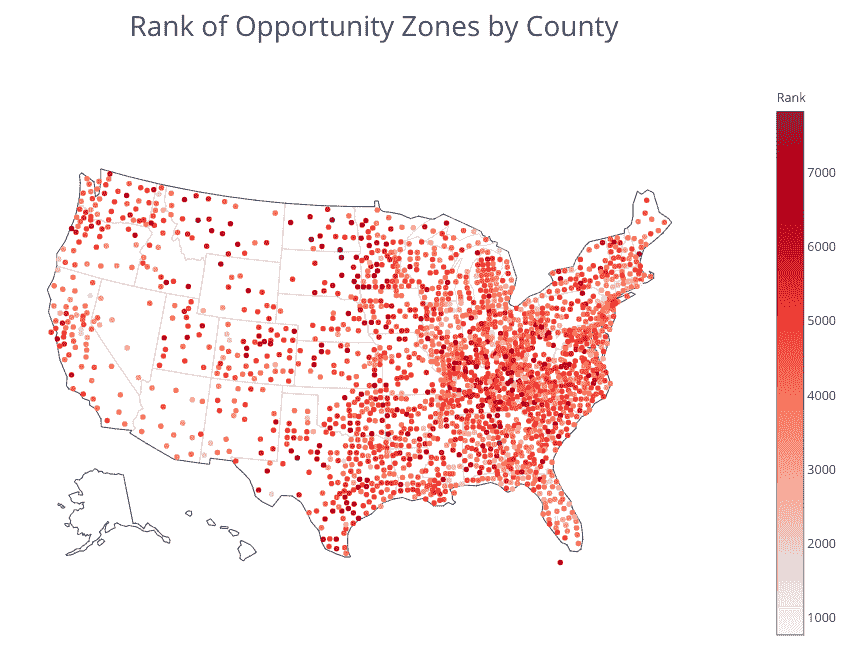
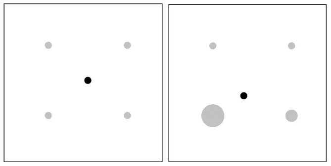
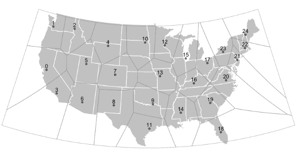
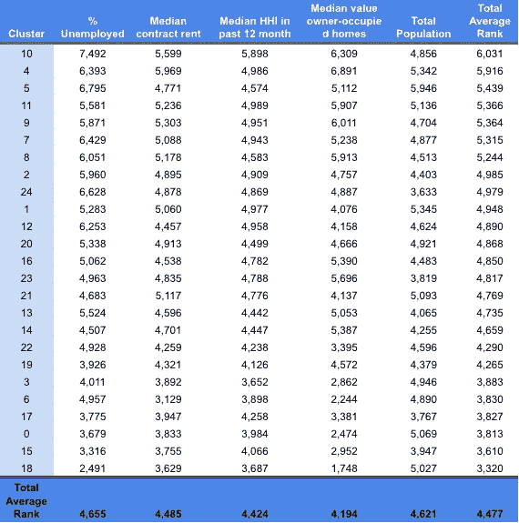
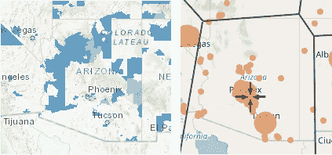
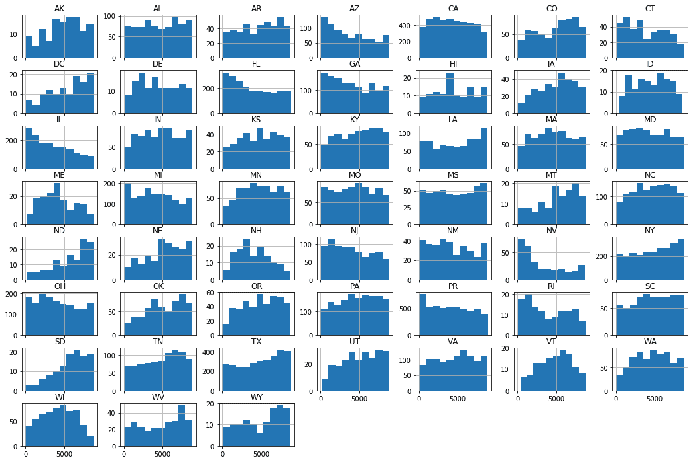

# 通过分析 50 万个数据点，我发现了机会区域

> 原文：<https://towardsdatascience.com/what-i-discovered-about-opportunity-zones-from-analyzing-half-a-million-data-points-3dd5a9eebb97?source=collection_archive---------42----------------------->

最近有很多关于机会区的讨论，这是可以理解的；这是联邦政府为低收入城市和农村人口普查区创造长期投资的最新举措。一旦被指定为合格的机会区，这些地方就能够通过专门为投资这些地区而设立的机会基金获得投资。

然而，尽管美国 12%的人口普查区域中共有 8700 个机会区，但令人惊讶的是，几乎没有分析来确定投资的“理想”区域。迄今为止发表的许多文章包括推荐美国主要大都市地区的前 10 名名单，任何人都可能猜到，这似乎是对大量地区被选为合格机会区的一种伤害。

我的分析试图为基于 5 个经济指标的所有机会区开发一个排名系统，并查看是否有通常不讨论的高于平均水平的增长领域。我相信结果表明，美国有许多机会区在所有 5 个指标上都排名很高，其中许多实际上并不位于沿海地区。

总的来说，我们发现美国东北部和南部地区的整体表现最好，而中西部和西部地区的表现明显好于其他类似地区。我们还发现，失业率和自有住房的中值是我们数据集中最大的差异，排名偏差几乎是其他 3 个指标的两倍。

## 疯狂的方法

从一开始，我就采用了一种更具分析性的方法来考察机会区域，并确定是否有潜在的高度可取的投资领域未被发现。首先，我选择从美国人口普查局发现的 5 个数据集提取 5 年(2011-2016)的估计值:

1.  总人口
2.  16 岁及以上人口的失业率%
3.  房主自住住房的中值
4.  合同租金中位数
5.  过去 12 个月的家庭收入中位数(HHI)

在此分析中，每个数据集的重要性是未加权的，这意味着每个普查区域的所有 5 个排名在每个机会区域的最终“排名”中同等重要。对属性进行加权和/或调整所包含的属性可能会导致完全不同的结果。根据所检查的属性，确实有许多机会区显示出这些属性的有利趋势，这些机会区可能存在于整个美国。

## 结果呢

提取数据后，我为每个属性的每个机会区域指定了一个等级，8，700 为“最好”，1 为“最差”。一旦每个机会区域都有了所有 5 个属性的等级，我将所有 5 个等级平均为每个机会区域的“总平均等级”:

在对所有的机会区域完成这些操作后，我想看看它在地图上的样子。由于人口普查区域在地理上非常小，我将结果汇总到美国各县，这将数据集减少到看起来更合理的 2000 个左右的点。结果是:

看着这个图像，我们可以看到……嗯，什么都没有。有太多的事情正在发生，无法从这张地图中获得有意义的见解。看到这一点也让我质疑缺乏考虑的区域性——“最好的”人口普查区域可能会受到邻近地区 5 年时间框架内的经济趋势的影响。

在此基础上，我编写了代码来自动将相似地区的人口普查区域组合在一起。K-means 聚类是实现这一点的一个很好的方法，在阅读了[卡尔·安德森关于加权 K-means 分析的](/clustering-the-us-population-observation-weighted-k-means-f4d58b370002)帖子后，我将它应用到我的用例中。我的目标是使用每个机会区域的“总平均等级”来影响每个聚类的中心在地图上的位置。

用 Carl 的例子来解释，如果地图上有 4 个点，其中一个点的“总平均排名”比其他点高得多，那么创建的新点将倾向于排名最高的点:

Unweighted vs. Weighted

我需要做的最后一件事是弄清楚我想要创建多少个“集群”。确定簇的“正确”数量在很大程度上仍然是一门艺术而不是科学，依靠人对问题的知识和定性的洞察力来确定理想的数量。我选定了 25——它提供了视觉消化性的最佳权衡，同时也将美国均匀地分割成足够大的区域，以产生宏观的区域洞察力。这里是一个覆盖了 Voronoi 可视化的最终输出，以更好地“显示”区域是如何划分的:

所以我们现在只剩下地图告诉我们两件事:

1.  8700 个机会区如何划分为 25 个区域
2.  每个区域的中心点向高排名机会区的集中加权

为了提供更多的背景信息，下面是每个聚类的总体评分和每个数据集分析的最终细目分类，等级越高表示“最好”:

分析中有许多有趣的见解，总结如下:

*   在最高水平上，东北部和南部地区(美国人口普查定义的[)的整体表现最好(平均 4683)，中西部和西部地区平均排名约为 4216](https://www2.census.gov/geo/pdfs/maps-data/maps/reference/us_regdiv.pdf)
*   尽管地区平均水平较低，中西部和西部声称在地图上排名前 3 位的集群(10/4/5)，平均排名几乎是表现最差的集群区域的两倍(15/18)
*   影响排名的最重要因素似乎是失业率——第 5 类和第 10 类的失业率分别为 8.56%和 6.65%，几乎是所有 25 类平均失业率(13.70%)的一半
*   群组 4 和群组 5 的平均 5 年人口增长率也最高(0.46%和 0.58%)，而所有群组的平均增长率为 0.16%
*   第 4 类也有最高的自有住房中值，为 1.10%，这更令人印象深刻，因为 13 类都有负值升值，最低的是第 18 类(-2.22%)
*   集群 10 中的 HHI 中值增长最快，为 1.02%，轻松超过第二好的集群(南部的集群 9，为 0.58%)，几乎是所有集群平均值(0.26%)的 4 倍
*   集群 4 的平均合同租金涨幅最高(1.53%)，紧随其后的是集群 8/10/9/11(均在 1.32-1.22%之间)。
*   将这些发现与其他数据集(如美国主要城市)叠加，可以了解主要大都市对每个地区“中心”的影响程度。例如，集群 6 的中心几乎直接落在凤凰城的顶部，尽管周围有大片区域符合机会区的条件。

*Opportunity Zone regions(left) vs cluster w/ major city pops in orange (right)*

查看各州的综合统计数据，我们还可以收集各州选择指定机会区的不同策略。例如，下面的图表显示了每个州的机会区域的数量(Y 轴)以及每个州的“总平均排名”(X 轴)。一半的机会区位于 8 个州内(加利福尼亚州/纽约州/德克萨斯州/佛罗里达州/伊利诺伊州/俄亥俄州/宾夕法尼亚州/密歇根州)，这些机会区往往高度集中在这些州内的主要城市周围。美国中西部各州倾向于选择更少的机会区，尽管与沿海地区相比，机会区的面积更大。东南部地区倾向于在城市和非城市地区跨州选举大量的地区。

Histogram per state of count of Opportunity Zones (Y-Axis) and Total Average Rank (X-Axis)

像纽约这样的州也惊人地集中了大量的高评级区域，如上图中的倾斜所示。总的来说，ND 和 WY 是排名最高的地区，而 IL 和 NV 的排名最低。

## …更多数据和地图？！

最后，本文有意简要介绍了生成最终数据集的技术步骤。管理数据集中的缺失数据(插补)、创建等级、聚类汇总等步骤。，但它们是最终分析的主要组成部分。如果有足够的兴趣，我很乐意在未来的帖子中深入探讨这些机制。同时，我在下面提供了一个交互式 ARCGIS 地图，以便您进一步探索聚类和其他数据集图层，从而为进一步分析提供一个切入点！

**带 VORONOI 和图层的交互式 ARCGIS 地图** [http://arcg.is/1zu14z](http://arcg.is/1zu14z)