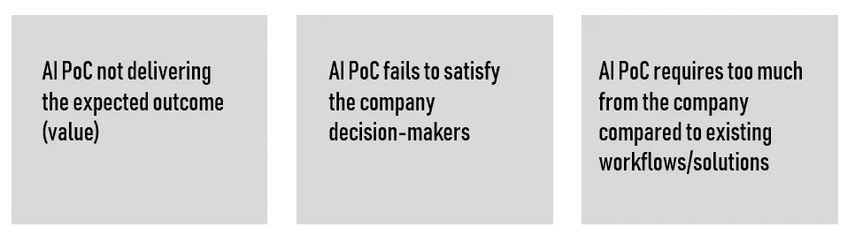
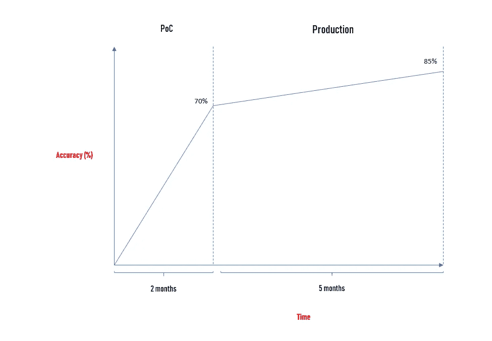
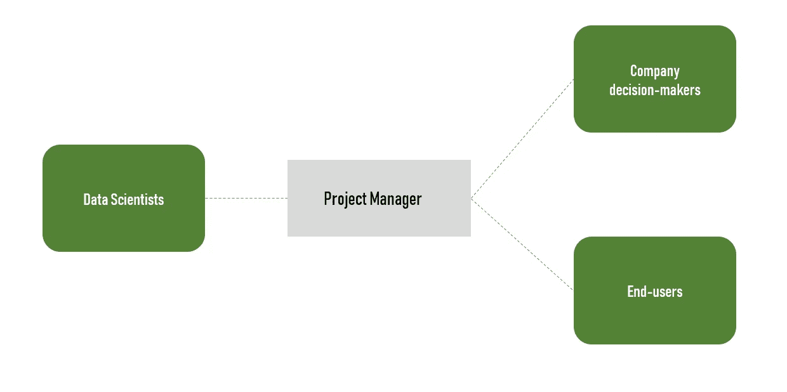
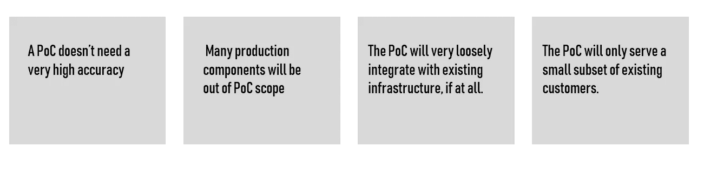

# 构建成功的 AI PoC 后我学到了什么

> 原文：<https://towardsdatascience.com/what-i-have-learned-after-building-a-successful-ai-poc-3bd24efea4e2?source=collection_archive---------18----------------------->

[Source](https://bdtechtalks.com/2019/01/14/what-is-computer-vision/)

我最近完成了一个已经投入生产的人工智能概念验证，我想分享一下我所学到的如何提高人工智能概念验证的机会。

只有少数公司开始了他们的人工智能之旅。事实上，基于人工智能的解决方案仍处于早期阶段。因此，决策者通常倾向于首先依赖 PoC。冷酷的事实是，它们中的大多数都没有进入生产阶段。

> 简而言之，概念验证的目标是测试是否值得在技术解决方案上投入时间和金钱。不用说，构建一个 AI PoC 很难，因为它需要大量的技能。

在实施人工智能以获得竞争优势的竞赛中，公司执行的概念验证的数量不断增加。人工智能行业可能预示着非常高的“成功率”。然而，当我们看到已经成功转化为产品的概念验证的数量时，这些数字和观点并不那么明显。

根据我的经验，我可以告诉你，POC**失败主要是因为以下原因:**

# 公司需要人工智能概念证明

我注意到，大多数公司仍然没有足够的内部人工智能技能。事实上，对于处于人工智能之旅早期阶段的公司来说，这无疑是最大的挑战之一。

此外，人工智能工作流可能会变得技术性，公司将不得不应对一系列与硬件、数据安全和大量新数据相关的问题，以进行训练。因此，相当多的公司会倾向于外包人工智能解决方案的开发。

**对于公司来说，评估模型效率和人工智能解决方案成熟度的最便捷方式是首先依赖概念验证。一次成功的概念验证并不能保证解决方案能够扩展，但这是一个良好的开端！**

PoC 将涵盖许多元素。它涉及数据科学家使用训练数据和管理参数来进行迭代测试运行。通过这种方法，数据科学家和技术团队可以在分派模型进行更广泛的培训和调整之前，检查模型的初始准确性。

训练和调整人工智能模型的过程是人工智能工作流程中计算最密集的部分。作为这一过程的一部分，数据科学家在处理与基础架构管理相关的传统 IT 问题时，会根据可用的训练数据确定他们的模型在哪些参数下收敛最有效。

# 在开始 AI PoC 之前

我见过太多 AI PoCs 因为各种原因失败。首先也是最重要的一点，我建议公司确保成功的重点是价值证明和与公司战略的一致性。找到合适的执行发起人并让他们参与进来至关重要。概念验证的目的是让愿景成为现实，并克服困难，让决策者相信这一愿景是有帮助的。

以下元素可用作公司决策者考虑 AI PoC 的清单:

这可能是显而易见的，但你应该怀疑你的项目在技术上是否可行。我建议你咨询专家来验证项目的整体复杂性。在我最新的项目中，我们认为深度学习将帮助我们识别特定的包装，但这并不那么容易……其次，对 AI 开发的投资往往只是整体解决方案的一部分，组织应该计算解决方案的总成本(包括运行成本)。

**在构建 PoC 时，确定业务价值是关键。例如，这个解决方案将如何改善你的品牌形象？**我个人认为，如果商业价值很小，那么我会建议看看非 AI 选项，因为尝试机器学习或其他 AI 子领域的成本相当高。

**概念验证与您拥有的数据一样好。你有足够的数据吗？你能用这些数据吗？等等。**简单来说，如果你没有数据或者它的质量需要提高，那么你应该推迟你的 AI 项目，甚至在考虑一个 AI PoC 之前。

不要期望概念验证达到 100%的准确率。决策者需要提前知道什么样的准确度足以说服他们继续进行概念验证。我的经验表明，概念验证的准确性水平不应该太高，这在很大程度上取决于项目的性质。准确性的水平也与投资水平有关...
概念验证的目的是产生附加值。您不能试图让模型达到部署它所需要的可信度。

对于我最新的项目(使用迁移学习识别包装的深度学习)，我们花了大约 5 个月的时间达到 85%的准确率，我们不得不使用数据增强技术，因为公司无法为我们提供足够的数据。

PoC 项目需要一个多元化的团队。为了优化您的 PoC 成功机会，我建议决策者建立一个由技术和业务专家/用户组成的多元化团队。人工智能开发不可能不涉及终端用户。我从来没有见过一个人工智能概念验证不需要因为商业专家和数据科学家之间的讨论而改变方法。

**成功的概念验证需要时间。通常，我们在这样的项目中使用敏捷技术。决策者往往会低估交付特定 PoC 所需的时间。**

> 所有的概念验证都是不同的，但是一个普通的概念验证项目需要大约 1-2 个日历月才能完成。

确定一个人来弥合决策者、数据科学家和最终用户之间的差距。事实上，从技术角度来看，人工智能需要在选择算法、配置和调整网络、提高数据质量、优化基础设施和验证结果方面进行实验。然而，一个成功的概念验证还必须涉及多个利益相关方。我意识到，有一个项目经理可以缩小这些不同项目成员之间的差距，促进合作，这是一个真正的项目附加值。

# 构建可靠的概念证明

再次，确保你的商业案例可以通过使用机器学习或任何其他人工智能子领域来解决。我的意思是，数据科学家可以从他们处理的数据中找到**相关模式，并从中做出足够好的预测或聚类模型。**

> 所有的概念证明都是不同的，但是一个普通的概念证明项目大约需要 1-2 个月才能完成。

**在我看来，对概念验证进行深度投资是没有意义的。**在某些情况下，使用现成的算法、查找开源训练数据、购买样本数据集、创建自己的功能有限的算法和/或标记自己的数据就足够了。

目标是找到对你有效的方法来证明你的项目将实现公司的目标。

> **最终，一个成功的 POC 是获得项目其余部分资金的必要条件。**

我建议你从收集所有你怀疑有能力完成任务的数据开始，选择那些在大多数情况下**能够自给自足的数据**。

我意识到，在一个人工智能项目中，很容易变得贪婪，并考虑包含大量输入的解决方案:例如，用户的位置可能会让我洞察他们的下一次购买是什么。现实情况是，很容易迷失在混合不同意义/性质的各种输入中，最终什么也没有提供。

> **在构建您的 AI PoC 时，关注简单、自给自足的输入。**

PoC 的成功在很大程度上取决于您所掌握的数据。随着你进一步训练你的算法来提高准确性，复杂度将会不断上升。使您的系统投入生产所需的模型准确性的预期改进将需要大量的新训练数据。

# 扩展成功的人工智能概念验证概念验证

PoC 通常通过做出某些假设来简化解决方案:

**构建 AI PoC 只是开发的一个方面。**例如，要将机器学习模型投入生产，您需要花时间构建 PoC 本身不需要的组件，如 API 或重新训练模型的过程等。您还需要确保模型在客户子集上的性能可以推广到更广泛的人群。

基础设施在这类项目中很重要。在低于标准的基础架构上和与生产环境不一致的环境中执行的概念验证很少在实际项目部署期间得到扩展。

最后，你需要为最终用户建立一个接口，潜在地与人工智能交互，并将你的人工智能组件与公司更广泛的基础设施集成，因为其他服务将必须收集输入，发出 API 请求，等等。

# **走向生产**

***更高的精度需要更多的数据……***

在人工智能开发中，我可以提到很多可能的问题，但我想集中讨论其中的几个。让我们假设，根据您在项目早期定义的标准，您的 PoC 是成功的。实际上，让我们想象一下，您使用预先标记的数据的概念验证使您的模型达到了 70%的准确率。你能考虑上线一个只有 70%准确率的解决方案来展示你的品牌吗？很多时候，决策者会因为显而易见的原因而拒绝。因此，团队必须想出一个如何达到更高精确度的计划。嗯，答案往往是一样的……更多的训练数据！

决策者倾向于认为，如果我们在两个月内达到 70%的准确率，那么我们只需要几周就可以达到可以接受的程度(大约 95%)。这是一个错误，因为事实是模型对训练数据有贪得无厌的胃口，从 70%到 90%的准确率可能需要更多的训练数据才能达到最初的 70%。需求成指数增长，显然更多的时间意味着需要更多的钱来资助项目。

还有不断出现的边缘情况，每种情况都需要训练数据。

正如我们所见，数据的缺乏对公司来说是一个巨大的挑战。然而，其他陷阱也确实存在，比如偏见。

> **机器学习偏差**，也称为算法**偏差**或 AI **偏差**，是一种由于**机器学习**过程中的错误假设而导致算法产生系统性偏差的现象

事实上，你的团队监控并消除训练数据中的任何样本、算法或偏见是非常关键的。在这一步，我建议您依靠敏捷实践来尽早识别这些事情并做出调整。

最后，我想提一下一个 AI 项目的成本。这不应该是一个惊喜，但人工智能团队和训练数据的过程是昂贵的。我很少见过在上线前不需要额外预算的项目… **我们越接近生产，你需要额外预算的机会就越大。就我而言，与最初的预算相比，经常会有 10-20%的额外预算。**

虽然人工智能概念验证通常需要相当大的预算，但要获得批准会有一些障碍，利益相关方可以设计一种机制，让解决方案提供商对成功负责并获得奖励，而不是让组织承担前期投资的负担。

虽然并非所有 POC 都能成功地在实际环境中复制项目，但利益相关方(包括公司和解决方案提供商)之间的协作可以确保 POC 实现预期的投资回报(ROI)。

公司必须努力避免概念验证陷阱。对我来说，这是一个公司建立奇妙的原型来评估它们并开始投资人工智能，但却无法部署它们的时刻，因为它没有合适的基础设施、业务流程或文化来支持它。

不幸的是，当决策者没有看到人工智能集成的全貌时，就会发生这种情况。在我看来，在花了无数时间工作和改进人工智能之后，该公司发现在实施人工智能解决方案之前，它需要首先升级基础设施。

> 不用说，在开始 AI PoC 之前，您的公司需要支持实验、质疑、支点、学习和失败。

我希望这篇文章能够帮助您更好地理解如何让 AI PoC 取得成功。如果你有问题，我很乐意帮助你。