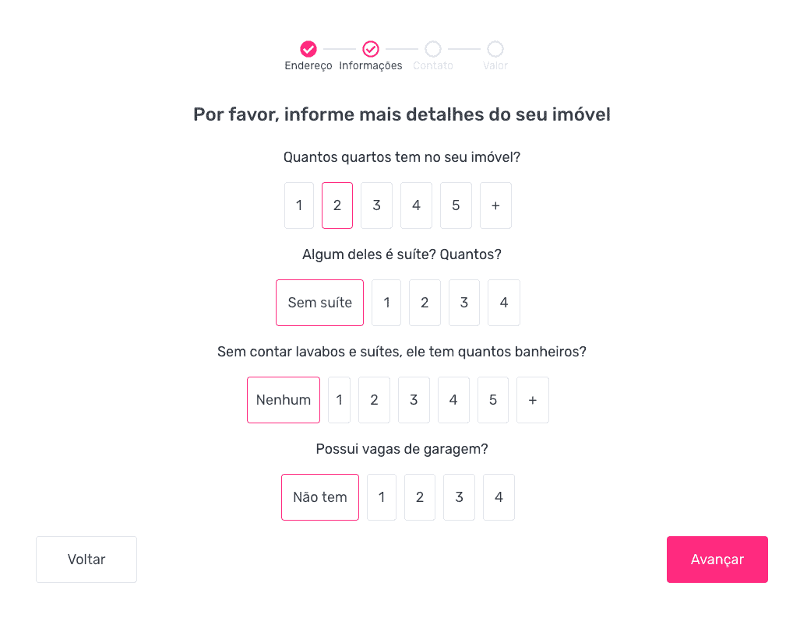
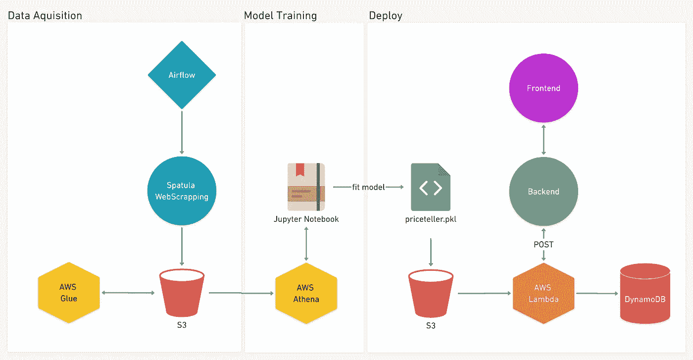
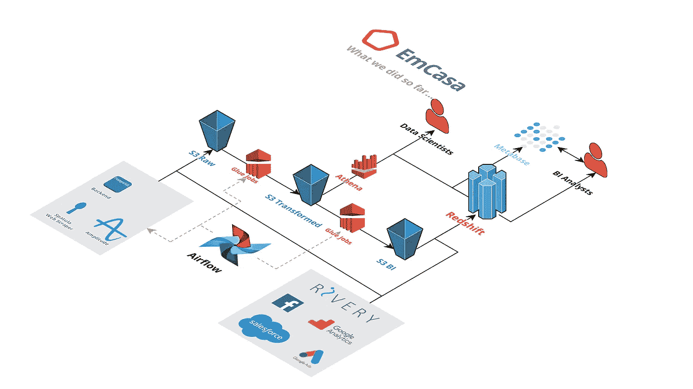

# 作为初创公司的第一个数据工程师，我学到了什么

> 原文：<https://towardsdatascience.com/what-i-learned-from-being-a-startups-first-data-engineer-f19cd71d3f31?source=collection_archive---------2----------------------->

## 作为一家初创公司的第一位数据工程师，而不是以前的数据工程师，是一项挑战，但也是值得的。以下是我从中学到的东西。

面试不仅仅是寻找适合我们公司的人，还要让他们相信我们值得他们花时间——对于技术职位来说尤其如此。上个月，当我们在 EmCasa 面试一个数据工程师职位的时候，我们意识到我们已经做了很多事情。我们简要地向他解释了我们在数据基础设施方面所做的工作，他对此印象深刻。但事情并不总是这样。在这篇文章中，我将解释我们已经做了什么，我们从中学到了什么。

当我接到 [EmCasa](https://www.emcasa.com) 数据工程面试的电话时，我是另一家公司的数据科学家。他们在找人开始组织他们的数据。当我问他们已经有哪些数据时，回答很诚恳:“只有我们后端 PostgreSQL 数据库中的几个表。我们还尝试了 BI 工具，仅此而已。”当我听到这一点时，我不得不非常清楚地告诉他们:我没有学位，我以前从未做过数据工程师，不知道 Spark，不知道 flow，我不是 ETL 专家，我不知道测试，不知道 git，顺便说一下，我也不是开发人员。但是我有一些过去的经验，我看到了一些行之有效的东西，一些行之有效但可以改进的东西，还有很多根本行不通的东西。我的想法是**尽量不要做**我已经知道行不通的事情。我不知道他们到底是怎么决定的，也不知道为什么，但我被聘为他们的第一个数据工程师。

当我加入公司时，我注意到向我描述的情景是真实的。看起来我有足够的空间以我认为最好的方式做每件事。在我工作的第一周，我们定义了本季度的一些 okr:

*   从脸书广告、谷歌广告、SalesForce 和其他第三方服务中提取和存储数据
*   选择并实施商务智能平台
*   将财产估价算法的精确度提高 20%
*   将估价模型设计为独立的 API
*   更新/改进网页抓取

为了从第三方服务中提取数据，我们开始寻找一些集成/ETL 服务，如 StitchData、Fivetran、Segment、Alooma、Rivery 等。这里的决定是我们需要尽快开始工作。为每个服务 API 构建一个定制集成会花费太多时间。使用 ETL 服务将为我们节省几个月的开发时间和大量的维护时间。我们决定继续使用 Rivery，在两周内，我们有了一个红移集群，所有来自第三方服务的数据每天都在更新。此时，Luca 加入了我们，成为我们的商业智能分析师。他已经有足够的数据可以利用。那时，我们还决定为我们的仪表板使用元数据库。到目前为止一切顺利。我们正式拥有了数据，它不再是 PostgreSQL 上的几个表了！

接下来的事情是改进我们的财产估价模型，使它作为一个独立的 API 工作(以前的模型绑定到后端)。但是我们没有数据来创建一个新的模型，实际上我们有，但是还不够好。所以我看了看我们正在使用的网络抓取工具。它是用 Elixir 写的(我们的后端运行在 Elixir 上)，我不知道 Elixir。所以我决定用 Python 从头开始构建另一个刮刀。为了完成这个任务，我创建了一个名为 Spatula 的私有 Python 包，它从其他网站收集列表并保存到 S3。这个时候我们已经雇佣了 Priscila，我们的数据科学家，她正在和旧数据做斗争。我在本地运行了 Spatula，她有大量的好数据可以用 Athena 查询并开始建模。

当她在研究数据科学时，我开始研究气流。哦，天啊！我被卡住了。一件事是学习如何编写 Dag，另一件事是学习如何以可靠的方式将气流部署到 AWS。我花了很多时间来学习足够的 Airflow、Terraform、Docker 和 AWS ECS，以进行第一次部署(我们分叉了 Nicor88 的[这个 repo)。然后花了更多的时间按照我们需要的方式定制它。我开始害怕花太长时间来完成这项任务，所以我问我的经理我是否应该推迟它，并以另一种方式安排任务(错误的方式，我知道这种方式从长远来看行不通)。答案是:“安德烈，当我们雇用你时，我们知道你不懂很多东西。所以，花点时间去学习它，并让它以正确的方式工作。”嗯……这是一种管理姿态和对做正确事情的承诺，我在我工作过的任何其他公司都没有过。所以为了完成气流的配置，我们又多费了一点力气，然后我们设置了刮铲刮泥机，从那里每周运行一次。](https://github.com/nicor88/aws-ecs-airflow)

One of our frontend screens that collects information from users to predict a property sale price. At this screen we ask property details such as how many rooms, suites bathrooms and garage spots.

此时，我们由 Priscila 制作的新估价模型已经准备就绪。但是还没有准备好生产。所以我的方法是和她一起做一些结对编程，展示我在改变什么，为什么以及如何改变。然后我们一起部署了 Priceteller，这是我们的第一个机器学习模型。它作为一个 Flask API 运行在 AWS Lambda 和 API gateway 上。它响应来自这个通量的请求[。在部署它之前，我们还与我们的开发团队讨论了许多代码质量、测试和文档。他们不想从生产向不可靠的 API 提出请求——他们这样提高标准是绝对正确的。当我们最终达到他们的标准时，我们的第一个机器学习模型就可以在线提供给我们的客户了。最近，我们还部署了第二个名为 Selekta 的实时模型，我们使用它根据用户的偏好向他们推荐列表。](https://www.emcasa.com/vender)

Diagram showing our first Machine Learning Model, from data acquisition to deploy.

Priscila 还告诉我他们在她之前的公司是如何使用气流的。因为我以前从未使用过它，所以我试图通过反复试验来学习最佳实践。她提出了一系列改进措施，我全都接受了。从那时起，我们开始在 AWS Glue 上运行一些 Spark 任务，由一个气流任务触发和监控。我们每小时运行一次作业来从后端提取数据，同时运行其他任务来保存用户日志事件。我们还创建了一个推荐模型，每天在气流上批量运行。我确实需要提到一个副作用:现在我们在 S3 上有一个超过 2 Tb 数据的数据湖。

That’s how our data infrastructure looks like so far.

这发生在短短六个月内。我们已经建立了我们公司的数据基础。我们正在使用强大的工具和技术。我们以正确的方式处理数据。

# 但是，我从中学到了什么？

## 如果你有目标，学起来并不复杂

对于数据科学出身的人来说，做数据工程并不复杂。作为一名数据科学家，我们感受到没有正确的数据或工具来完成工作的痛苦。所以你对事物应该是什么样子有一种直觉。**你要怎么做**可以学习。气流，AWS，Spark，Git，Python，你能想到的，如果你知道你要去哪里，可以在短时间内学会。学习没有目标(也没有薪水)的东西更难。

## 面试公司

知道需要做什么和 T2 能够执行这些有很大的不同。而这和你公司的文化有关。我在面试的时候就注意到，我加入了一个地方，在那里我可以自主地以我认为正确的方式解决问题。你可以通过在面试时询问数据对公司有多重要来注意到这一点。是支持区吗？还是公司成长战略的一部分？他们对你真诚吗？如果数据不是增长战略的真正组成部分，那么很可能你不会花时间去计划和做正确的事情。

## 数据是一种产品

构建作为独立产品工作的 API、模型和仪表板为数据团队提供了极大的灵活性。但是必须满足标准才能将这些部分连接到工作的产品代码。通过创建数据作为产品文化，我们可以保护团队免受日常业务问题的困扰——有很多分析师可以回答这些问题。我们有一个保护我们不受无关需求影响的经理，所以我们可以专注于学习和做正确的事情。

## **寻求他人帮助**

有些山你将不得不独自攀登，但是问一个以前见过最佳路径的人会节省你很多时间。如果你和一个高层团队一起工作，问问他们在其他公司看到了什么。即使他们不知道怎么做，他们也会知道什么可行，什么不可行。寻求指导肯定会给你指明正确的方向。

## 不要浪费时间学习，直到真的有必要

有些事情可以通过第三方工具轻松完成，比如我在本文开头描述的 ETL 服务。如果您的数据仓库中没有任何来自脸书的数据，就没有必要浪费时间学习如何连接到脸书洞察 API。如果没有在 EMR 上运行的作业，您不需要学习如何用 EC2 设置 Spark 集群，如果没有任何粘合作业，您也不需要使用 EMR，如果没有在 Athena 上编写任何查询，您也不需要粘合作业。

首先尝试使用最简单的健壮解决方案(不需要持续维护的解决方案)。当该解决方案不再满足您的需求时，开始研究其他工具。从最复杂的开始会浪费你的时间。专注于用最简单、最强大的解决方案尽可能快地交付商业价值。

## **建造不需要维护的东西**

可能发生的最糟糕的事情是花半天时间修理坏掉的东西。如果它经常出错，那么要么是你没有做好，要么是你用错了工具，或者两者都有。从一开始就做正确的事情会花费更长的时间，但会为你将来节省很多时间和负担。

## 永远真诚

如果你不知道什么，那就说出来，但是也要证明你可以并且愿意学。通过这种方式，你或许可以利用一些工作时间来学习新东西。

## 分享你的知识

教给其他团队成员他们不知道的东西。这将有助于你专注于学习，也可以避免不同立场之间的摩擦。如果每个人都在同一页上，那么数据工程、数据科学和机器学习工程之间的工作将变得更加流畅。结对编程是分享知识和获得实时输入的好方法。花些时间分享你的知识，看看你能给别人什么。

> 当别人寻找他们能拿走的东西时，一个真正的国王寻找他能给予的东西。 -木法沙。《狮子王》

The Lion King — Disney

## **在项目之间休息一段时间**

如果您刚刚完成一个大项目，比如部署一个新的 ETL 管道，那么花一些时间在次要任务上是一个好主意，比如编写一些文档或修复遗留的 bug。试图马上开始另一个大任务可能会让你慢下来。