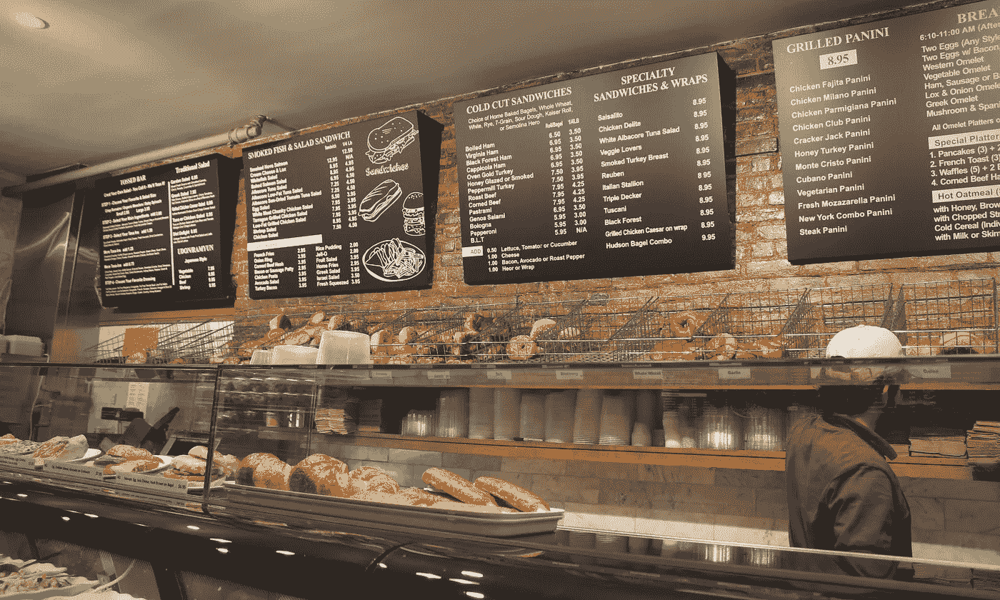
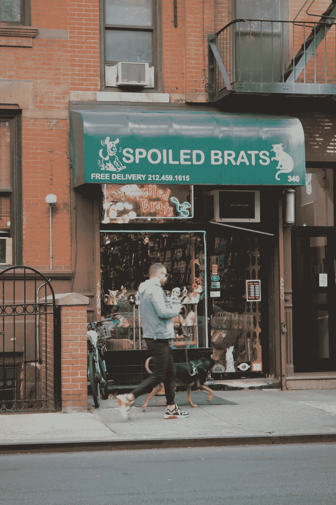

# 我从 2019 年纽约数据展中学到了什么

> 原文：<https://towardsdatascience.com/what-i-learned-from-datax-new-york-2019-1a8baa2de97a?source=collection_archive---------44----------------------->

上周二晚上，坐在从范库弗峰飞往纽约的红眼航班上，我的脑海里开始响起艾丽西亚·凯斯和 Jay Z 的《帝国精神状态》:

> 在纽约，
> 混凝土丛林里，梦想是由
> 做成的，没有什么是你做不到的

Probably one of my most favorite songs of all time!

我下了飞机，感觉筋疲力尽(‘因为经过一夜的飞行，谁不累呢？)，却又很兴奋。透过我从 JFK 到曼哈顿下城的 Lyft 车窗，我意识到它并没有多大变化！它仍然给我留下了我在 2016 年 11 月第一次旅行时的确切印象——忙碌却充满活力，小却如此大。

这是我第四次来纽约。这一次，不是和大学朋友去公司旅游，也不是毕业后和家人度假。是为了 DataX 大会，这是我从市场营销转行到数据科学后参加的第一个数据大会。通过这次会议，我学到了很多东西，我很乐意与你们分享！

# 最重要的数据科学技能可能不是我们期望听到的

New York City Subway — C Line on Fulton Street. New York City. November 2019

当我们在互联网上搜索进入数据科学并成为一名优秀的数据专业人员所需的技能时，我们经常会发现这些关键词:统计学、编程、数据可视化和机器学习。这些绝对是我们进入数据科学的一大基础。

在 DataX 期间的多次会谈和讨论中，这两项技能被强调为与上述基础技能同等重要。对我来说，他们将数据科学家/分析师与**优秀的**数据科学家/分析师区分开来。

## **1。讲故事**

*   这是一个具有挑战性的问题。但是你可以通过阅读《纽约时报》、《哈佛商业评论》或其他许多知名杂志来获得数据故事的灵感，从而开始积累

## **2。领域知识或业务知识**

*   为了收集这种技能，我们可以阅读公司网站和报纸。也有来自不同公司的数据团队的博客文章和采访视频，你可以查看更多
*   与来自不同团队的同事一起喝咖啡也是扩展您的网络和了解更多关于数据团队可以支持的正在发生和即将发生的事情的好方法

# 有效的数据沟通是很多公司的通病，即使是顶级公司也不例外！

Hudson Bagel on 9th Ave because I want that salmon bagel so bad. This place was recommended by Tommy, my New Yorker colleague. New York City. November 2019

## **1。呈现 A/B 测试结果**

我记得我第一次向我的利益相关者，一群 UX 设计师展示 A/B 测试结果。我把最喜欢的关键词扔给了会议:“这里是 *p 值*和*置信区间。*看到这些，我们知道我们的测试是*统计显著的*。”肖娜在那里打断了我:“这些是什么意思？”。多亏了肖娜，我被拉回到了现实中，我在和设计师交谈，而不是和数据窥视者。我想让他们带走的不是 p 值，而是我们是否应该使用新的设计！

猜猜看，Valerie Kroll 发表了一篇关于模板的演讲，我们可以用这个模板向商业利益相关者展示 A/B 测试结果。我多么希望早点遇见她啊！

如果我的情况听起来和你一样，你可以在这里下载她的模板[，然后开始你的下一次测试结果演示！](http://bit.ly/DATAx-templates)

## **2。增强数据理解**

Eli Brumbaugh 和 Marie Sbrocca 发表了一篇关于 AirBnB 如何利用数据用户体验的演讲。他们提到了一个让我印象深刻的公式:

> 明智的决策=对数据的理解+领域知识+对分析工具的理解+适当的信任+对不确定性的认识

我在 Eli 和 Marie 的演讲后见到了他们，问他们 Airbnb 是如何处理这个公式的第一部分的，即*对数据的理解*。随着产品的增长，这家公司拥有庞大的数据生态系统。因此，除了有效地交流分析结果，他们还致力于改进他们的数据字典——考虑人们在查看表格时搜索的流行元数据，或者考虑表格的数据质量分数的想法。

# 您是否缺少数据科学项目？一些想法开始

Hudson Bagel on 9th Ave — So many choices of cream cheese. This place was recommended by Tommy, my New Yorker colleague. New York City. November 2019

如果你想知道个人或专业项目的下一步该做什么，你并不孤单！在一些演讲和观众的提问中，缺乏对数据科学项目的想法是主题之一。以下是给你的一些建议:

*   **早**投资干净的数据。验证数据，找出丢失数据的来源等等。非常重要，因为这一过程可以为您的下一个数据项目节省时间，让人们信任您的工作，并且(最重要的是)在您的数据生态系统增长时，将您从一场巨大的灾难中解救出来
*   自动化简单的事情和重复的事情。我一直遵循受[大卫·罗宾逊](http://varianceexplained.org/r/ds-ml-ai/)启发的*三*法则——“当你写了三次相同的代码，就写一个函数”。所以写函数，做包，致力于自动化你的过程

# 那么下一步是什么？要注意的应用和职业趋势

Spoiled Brats Pet Store on W 49th Street made me think of my dog, Guava. New York City. November 2019

随着数字、文本、图像和视频形式的数字足迹时代的到来，在产品和职业角色方面，有几个趋势值得关注。

1.  我最喜欢的演讲嘉宾之一希拉里·梅森谈到了随着技术的进步，更多数据产品的趋势，这些产品利用了**视频和图片分析**和**自然语言处理**。这已经通过纽约时报和 Vox 关于他们如何应用 NLP 来建议在他们的文章上放置广告的谈话得到了证明。
2.  希拉里还提到了随着越来越多的数据产品被开发出来，需要提防的一种新型角色，那就是**数据产品经理**。这些人是目前拥有基本机器学习知识的项目经理，或者是希望将自己的角色扩展为项目经理的数据专业人士。
3.  [Courtney Harding](https://www.linkedin.com/in/cortneyharding/),*Friends With Holograms*的创始人讲述了他们在培训公司**的虚拟现实应用**关于工作场所的性别歧视和性骚扰——培训主题需要深切的同情和情感投入才能取得成功。这让我大吃一惊，我相信这将是一个很好的工具，可以用来训练任何需要涉及情感的话题
4.  [JT·科斯特曼](https://www.linkedin.com/in/jtkostman/)，前*时代公司*首席数据官，现任 *ProtectedBy 首席执行官。AI* 围绕网络犯罪发表了令人印象深刻的演讲。他说:*“恶意软件攻击增加了 2000%，到 2021 年网络犯罪的成本将超过每年 6 万亿美元。”*想想我们所有的数据，无论是在线还是离线收集的。它随时都有或将会有危险。然而，我们可以使用数据科学来保护自己，JT 建议关注一种趋势，包括安全领域的**数据科学应用**和安全数据科学家。

# 结束了

Gyro stall in front of Central Park. New York City. November 2019

在飞回温哥华之前，我在中央公园走了一圈,*帝国心态*又开始在我脑海中播放。如果你在这个公园的边缘漫步，你会看到树木和…许多建筑！看着眼前的*混凝土丛林*，一个有趣的想法冒了出来:“也许今晚我会*做一个*数据梦，因为我在两天内学到了这么多。”

那天晚上我没有做数据梦，但是我确实有很多来自 DataX 的想法，我需要在忘记之前写下来。