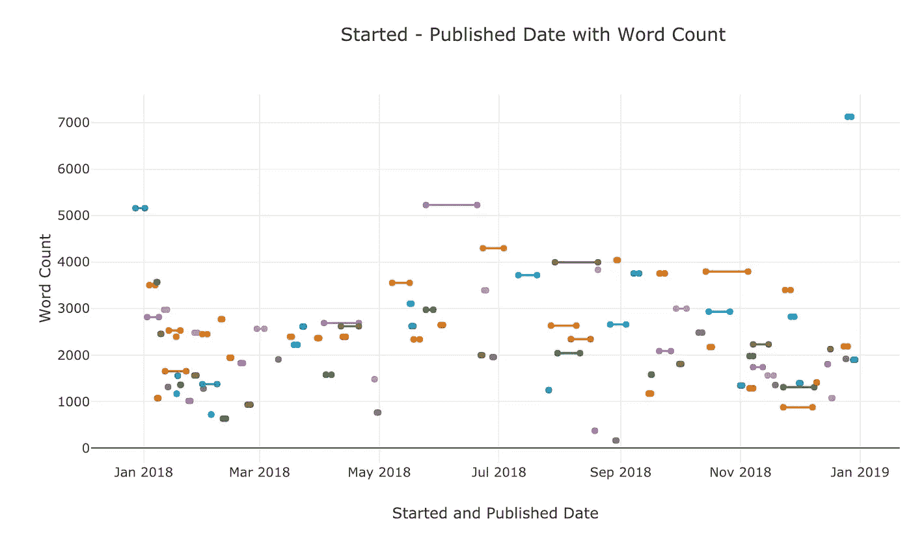
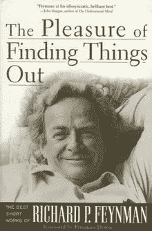
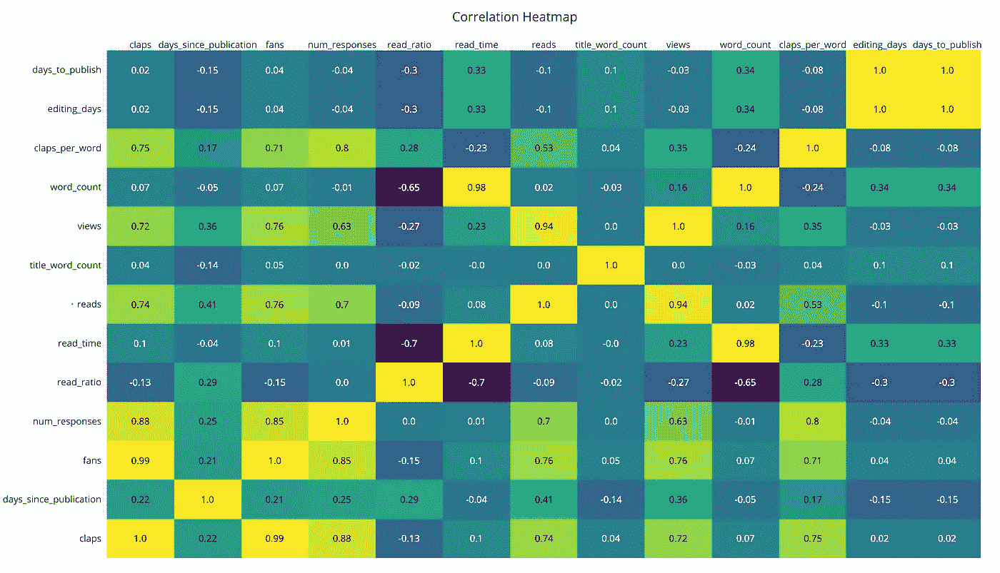
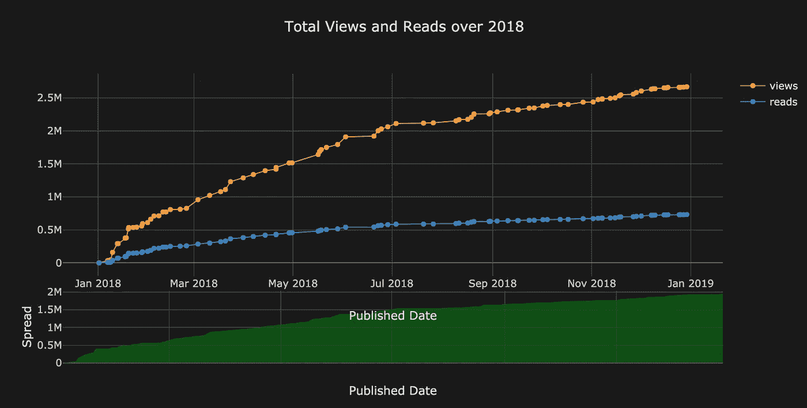
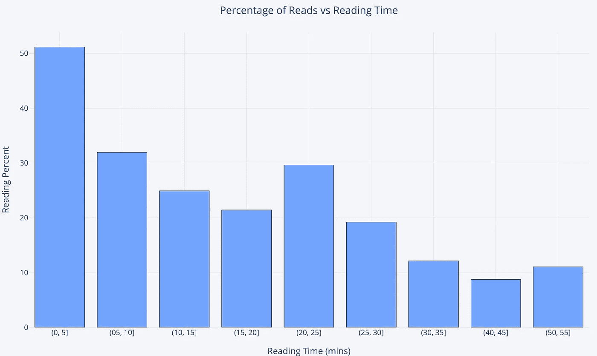

# 我从一年来每周写一篇数据科学文章中学到了什么

> 原文：<https://towardsdatascience.com/what-i-learned-from-writing-a-data-science-article-every-week-for-a-year-201c0357e0ce?source=collection_archive---------3----------------------->

School of Athens by Raphael ([Source](https://steemit.com/life/@eileennadine/the-parables-of-youth))

## 数据科学写作改变生活的力量

应该有一条法律限制人们只能用“改变生活”这个词来描述生活事件。今早喝了一杯改变人生的咖啡。嗯，希望它是好的，因为这是你得到的一个使用！如果这项立法得以通过，那么我会用我的配额来决定写关于数据科学的文章。这篇文章直接带来了两份数据科学的工作，改变了我的职业规划，让我穿越了整个国家，最终让我比我还是一名可怜的机械工程大学学生时更加满意。

2018 年，我做出了写数据科学的承诺，每周至少发表[篇文章，共 98 篇](https://medium.com/@williamkoehrsen)。对我来说，这是变化的一年:大学毕业，4 份工作，5 个不同的城市，但唯一不变的是数据科学写作。作为一种文化，我们[痴迷于条纹](http://www.sportsretriever.com/stories/29-impressive-streaks-sports/)，并确信那些完成条纹[的人一定获得了渊博的知识](https://medium.com/@robewawebdesign/how-100-days-of-code-changed-my-life-37cdc891db73)。与其他迷恋不同，这一点可能是有意义的:长期坚持做一件事，无论是编码、写作还是维持婚姻，都需要令人印象深刻的承诺。做一件新的事情很容易，因为我们的大脑渴望新奇，但是一旦新鲜感消失，重复做同样的事情需要不同程度的投入。现在，为了延续 streak completers [写下他们获得的智慧](https://www.huffpost.com/entry/5-things-i-learned-from-a-50-day-meditation-streak_b_9548922)的伟大传统，我将描述在“数据科学写作年”中学到的经验教训。

每周数据科学写作的五个收获是:

1.  **不需要正式的指导** ，你就可以学到在数据科学领域取得成功所需的一切
2.  ***数据科学由*好奇心*驱动***
3.  ****一致性*是任何追求中进步的最关键因素***
4.  ***数据科学是*经验性的*:你必须通过实验来找出可行的方法，而不是依赖已被证实的最佳方法***
5.  ***写关于数据科学或任何东西的文章是一种互利的关系，因为它*有利于你和整个社区****

*每份外卖都附有我的中等文章统计图表。你可以在这里找到 [Jupyter 笔记本](https://github.com/WillKoehrsen/Data-Analysis/blob/master/medium/data-science-writing-2018.ipynb)或者通过[这篇文章](/analyzing-medium-story-stats-with-python-24c6491a8ff0?source=user_profile---------12------------------)获得你自己的统计数据。*

**

*Started and Published Date of All Articles*

## *1.数据科学的一切都可以不用上学就能学会*

*机械工程，我很不幸在大学学的，要在一个机构教。一个人(至少一个有正常资源的人)不可能收集“机电”教育所需的设备——实验室、原型机、风洞、制造车间。幸运的是，数据科学没有类似的限制:无论该领域的主题多么先进，对于世界上任何一个有互联网连接并愿意学习的人来说,*都不是禁区。**

*虽然我在大学里确实上过一些有用的统计学课程(注意:这些课程中的所有内容都包含在免费的[统计学习介绍](http://www-bcf.usc.edu/~gareth/ISL/)中)，但我大学里的数据科学课程已经过时了。我们被教导的工具和技术在几年前就已经失宠了。有几次，我向教授展示了这方面的证据，结果却被告知:“好吧，我要教我所知道的东西，因为它对我有用。”更重要的是，这些课程是面向研究的，这意味着编写低效、混乱的代码，只运行一次就能得到论文的结果。从来没有提到过为产品编写代码:像单元测试、可重用功能，甚至[代码标准](https://www.python.org/dev/peps/pep-0008/)之类的东西。*

*我没有依赖大学课堂，而是从书籍和在线课程/文章中自学(并继续学习)数据科学/机器学习。我选择通过示例教学的资源，并关注当今数据科学实践中实际使用的内容。(根据这些标准，最好的课程来自 [Udacity](https://www.udacity.com/courses/all) ，最好的书是[Aurelien Geron 的《通过 Scikit-Learn 和 TensorFlow 进行机器实践学习》](http://shop.oreilly.com/product/0636920052289.do)。)不用花钱买素材: [fast.ai](http://fast.ai) 免费提供深度学习上最前沿的课程；Kaggle 让您有机会处理真实世界的数据，并向数千名数据科学家学习；而且，像《Python 数据科学手册》这样的书不需要任何费用！([对数据科学](https://towardsdatascience.com)也有用)。*

*最初，我不确定这些资源是否足以在数据科学领域取得成功，但进入该领域后，我发现这些资源绰绰有余。当谈到数据科学时，很少有人知道他们在谈论什么，如果你已经研究了网上可用的最新资料，你将领先于大多数其他人。事实上，我认为你最好从不断更新的在线资源/课程中学习，而不是从每年最多修改一次课程的教育机构中学习。*

*所有这些并不是说学习数据科学很简单:你仍然需要意志力和毅力来日复一日地学习(详见 3 中关于一致性的内容。).也就是说，我发现当使用通过实践例子教授的材料时，更容易保持动力和理解概念。我没有先研究理论，然后再看应用，而是使用 fast.ai 的杰瑞米·霍华德所说的[自上而下的方法](https://medium.com/@georgezhang_33009/how-to-make-the-most-of-the-top-down-fast-ai-courses-ae70814c736f):从解决问题的概念的实现开始，最好是用代码。然后，有了一个框架，根据需要回去学习理论。*

*最后，我学会了不要让数据科学/机器学习词汇吓倒你。进入这一领域最困难的部分可能是学习术语，因为当人们使用你从未听说过的词汇时，你很难找到方向。不要害怕要求澄清你不知道的单词，一旦你知道了一个长单词的意思，不要只是为了显得聪明而使用它。如果你使用容易理解的语言，你会听起来更聪明，更有帮助。(如果你需要一些帮助，这里有一个有用的[机器学习词汇](https://developers.google.com/machine-learning/glossary/))。*

**

*Scatterplot Matrix of Variables*

## *2.好奇心推动数据科学*

*如果你看我 2018 年的文章，有一个模式立刻凸显出来:没有模式！这些文章从一个话题——[Python 中的随机森林](/improving-random-forest-in-python-part-1-893916666cd?source=user_profile---------100------------------)——突然转向另一个话题——[贝叶斯回归](/introduction-to-bayesian-linear-regression-e66e60791ea7?source=user_profile---------68------------------)——转向第三个话题——[古德哈特定律](/unintended-consequences-and-goodharts-law-68d60a94705c?source=user_profile---------76------------------)——转向第四个话题——[递归神经网络](/recurrent-neural-networks-by-example-in-python-ffd204f99470?source=user_profile---------30------------------)——没有任何趋势。这是我无法满足的好奇心的直接结果:如果我在有声读物的脚注中听到一些奇怪的东西，阅读一篇晦涩的参考论文，或者看到一条奇怪的推文，我必须获得一些数据，编写一些代码，并做一些分析。这可能是福也可能是祸，但幸运的是，数据科学是一个值得好奇的好领域:数据科学奖励好奇心:你必须愿意探索新的方法和技术，以便随着该领域的发展保持相关性。*

*此外，对新工具保持好奇有助于避免依赖一个库，这是我从惨痛的教训中学到的。我花了太多时间使用 matplotlib，因为在我[切换到 plotly](/the-next-level-of-data-visualization-in-python-dd6e99039d5e) 之前，我花了太多时间学习它。不到 30 分钟，我就像花了 50 个小时学习 matplotlib 一样熟练了，这表明我应该更快地做出改变！在寻找新工具或使用你已经知道的工具之间的平衡在[探索-利用问题中有一个形式化。](https://joshkaufman.net/explore-exploit/)你可以花时间探索——利用你已经知道的东西——或者探索——寻找一种可能比现有方法更好的新方法。*

> *目前，数据科学的回报在于探索方面:那些能够寻找和学习新工具的人处于优势，因为该领域的变化速度很快。*

*当你实际从事数据科学时，好奇心也是有帮助的:探索性数据分析的目标是在数据中发现有趣的模式。一个有点相关的话题是，[理查德·费曼，可以说是 20 世纪最聪明的人](http://www.feynman.com/stories/the-smartest-man-in-the-world/)，可能是好奇心态好处的最佳支持者。作为一名理论物理学家，他因学习技能(如破解保险箱)或恶作剧而闻名，正如他在量子力学方面的工作一样。根据他的作品，这种好奇心是他作为一名科学家不可或缺的，也让他的生活更加愉快。*

**

*One of several enjoyable books by Feynman ([source](https://en.wikipedia.org/wiki/The_Pleasure_of_Finding_Things_Out)).*

*费曼不是被对荣誉或财富的渴望所驱使，而是因为他真诚地想把事情搞清楚！这也是我在数据科学项目中采取的态度:我做这些项目不是因为它们是必须的，而是因为我想找到隐藏在数据中的难题的答案。这种基于好奇心的态度也让我的工作变得愉快:每当我开始做一些数据分析时，我都把它当作一项令人满意的任务。*

**

*Rolling Average of Words Per Week*

## *3.一致性是关键因素*

*我 2018 年发表的 98 篇文章，共计 264894 字。每发表一个词，至少有一个词没有通过编辑。这相当于每天 53 万字或 1500 字。全职学习和工作的唯一可能方式是确保我每天都在我的项目上写作和取得进展。我的观点很简单:任何努力最难的部分都是开始，所以一旦你度过了这一关，为什么要停下来呢？*

*持续写作/工作的回报的最佳类比是定期向储蓄账户存款。日复一日，你不会注意到太多的变化，但有一天你醒来，你的初始投资增加了两倍(或者你已经写了 100 篇数据科学文章)。如果你只看昨天到今天的进步，可能很难看到好处，但是如果你能退一步，从长远来看，你就会看到每天取得一点进步的价值。*

*实际上，你不需要每天写 1500 字。为了达到这一点，我不得不做出牺牲(我平均每周花 20 个小时写文章——没有报酬，所以谢谢你的鼓励)。尽你所能，不管是 300 个单词，还是写几行代码。关键是你创造了一种心态，在这种心态下，写作或从事兼职项目不是额外的麻烦，而是每天的一部分。*

> *写作和做数据科学项目是习惯，像任何习惯一样，随着足够的重复，它们变得根深蒂固。*

*此外，写作不一定要在媒体上，甚至不一定要写博客。所有的写作(甚至推文)都有助于你提高。从在你的笔记本上写更多开始。笔记本环境是数据科学的一个伟大工具，但当人们忘记了它的预期目的时，它被滥用了([看看这个演示](https://www.youtube.com/watch?v=7jiPeIFXb6U&t=0s&index=32&list=PL055Epbe6d5b572IRmYAHkUgcq3y6K3Ae))[**有文化的编程**](https://en.wikipedia.org/wiki/Literate_programming) **)。Donald Knuth 提出的文化编程意味着在同一个文档中混合文本、代码和输出，遵循将思想转化为产生结果的代码的自然过程。***

> *除了用注释完整地记录代码之外，使用文本单元格(你可以得到无限的数量，所以可以随意制作更多)来解释你的思维过程。文档对于确保其他人能够理解你的所作所为是至关重要的，也是通过写作来解释自己的一个很好的练习。*

*写作很难，但却是一项有益的活动。作为一个好的规则，生活中最困难的事情——锻炼、教育、写作——也是那些带来最大长期利益的事情。此外，所有这些努力都会随着常规练习而提高。现在就开始在你的空闲时间定期捐款，你未来的自己会感谢你的远见。*

**

*Heatmap of Correlations within Data*

## *4.数据科学是经验性的，而不是理论性的*

*随机森林中的最佳树数是多少？梯度助推机应该跑几轮助推？哪个优化器最适合你的卷积神经网络？对于高度相关的特征，最有效的降维技术是什么？*

*所有这些问题的答案都是一样的:你必须自己去试验和发现。在数据科学中，仍然很少有一成不变的规则可以遵循，对于事情为什么会如此顺利的解释就更少了。这意味着数据科学/机器学习几乎完全是经验性的:结果不是通过理论而是通过实验产生的。*

*这种缺乏公认解决方案的情况令人沮丧。我应该如何设置我的随机森林的超参数？与此同时，它也可能是有利的:没有“正确”的答案，这对于喜欢试验的修补者来说是非常好的。至少，你需要准备好问一个问题，然后被告知你必须写代码自己去发现。*

*(注意，我认为有必要将*最佳实践*——比如代码[评审](/how-to-write-a-production-level-code-in-data-science-5d87bd75ced)和遵循 pep8 的代码风格——与用于回归或降维等任务的*最佳方法*分开。有[最佳实践可以遵循](https://drivendata.github.io/cookiecutter-data-science/)，但方法仍在整理中。)*

*研究数据科学的一个好方法是将自己视为一个永远的初学者。知道得多总比知道得少好，但这也可能是一种限制。你看不到过去你一直使用的方法，而是刚刚发明的更好的选择(还记得探索/利用吗？).接受你永远不会到达“数据科学知识的尽头”的事实，即使没有其他人到达，也要愿意尝试新技术。此外，当有人告诉你在机器学习中只有一种正确的方法时，要非常怀疑。数据科学仍然是一个公平的领域，专家不一定是解决特定问题的最佳人选；如果你认为有人(尤其是我)在做一些次优的项目，指出来！*

**

*Total Views and Reads in 2018*

## *5.写作给作者和读者带来了真正的好处*

*互利共生是一种[共生](https://en.wikipedia.org/wiki/Symbiosis)的形式，在这种形式中，双方都从某种关系中受益。我们的[肠道细菌](https://linkinghub.elsevier.com/retrieve/pii/S1075996405000685)就是一个完美的例子:当我们享受健康益处时，它开始以我们的消化产物为食。将这与数据科学联系起来，写作也是一种共生关系，因为作者和读者都走在前面。当我完成一篇关于数据科学的文章时，我不知道是我还是那些阅读这篇文章的人获得了更大的利益。*

*写作就是字面上的思考。它迫使你理清思路，向别人解释概念——尤其是用简单的语言——需要深刻的理解。写作不仅驱使我学习更多的东西，这样我就知道我写的是什么，而且它还让我形成简单的解释，我可以在工作中用这些解释向广大(非技术)观众解释概念。*

*我从写作中获益的另一个方式(除了挣两份工作)是成为一个更大的社区的一部分。写作和看到其他人从我的文章中受益比我每天做的任何事情都给我更大的成就感。不要太多愁善感，但作为一名“作家”是我现在自我定义的一部分，它给了我周末早起为社区做贡献的动力。*

*在这种关系的另一方面，我当然希望人们从这种写作中受益。在我向数据科学转型的过程中，我从社区获得了大量的帮助，而写作是我向前回报的小小方式。此外，我的文章可以免费阅读，因为我相信当知识被允许无障碍地传播时，一个领域中的每个人都会受益。*

*除了免费知识，当更多不同的人被吸引到数据科学领域时，它会变得更好。一个领域因其多样化而受益，因为不同的个人带来了处理和解决问题的新方法([这不仅听起来不错，而且已经被证明](https://journals.sagepub.com/doi/abs/10.1177/000312240907400203))。数据科学是一个伟大的领域，我不想看到它被同质化所削弱。如果我的文章可以帮助将数据科学扩展到更广泛的受众，那么整个社区将会更加丰富。*

> *我经常看到这样的想法，如果有人在他们的领域取得了成功——例如他们已经获得了一份稳定的工作——他们的工作就完成了。相比之下，我认为一旦你进入一个领域，你就有义务回头帮助下一个人。更好的是，建造一部电梯，让尽可能多的人进入这个领域。*

**

*Percentage of reads (reads / views) by Reading Time Binned*

# *结论*

*总而言之，这些是“数据科学写作年”的收获*

1.  ***数据科学不需要正规教育***
2.  ***好奇心驱动数据科学***
3.  ***数据科学和写作是随着实践变得更好的习惯***
4.  ***需要数据科学方面的实验***
5.  ***写作会让你和社区受益***

*虽然我可以用时间做很多其他事情，但很难想象还有什么事情能像写数据科学这样给自己和他人带来如此多的好处。尽管我今年已经转向数据新闻业([减少对数据世界的误解](/announcing-the-reality-project-e16cc71abb64?source=user_profile---------11------------------))，但我将继续撰写标准数据科学:项目、工具和技术，您可能会发现它们很有用。*

*作为最后一点，请考虑这一点:写作是我们生活中能完全控制的少数活动之一。从一张空白页开始，经过几天或几周的时间，把你的想法写在纸上，最终，你会有一个完全由你自己的想法创作的作品，它可以在几秒钟内传遍世界，带给数百万人，可能会改善你和他们的生活。这就是魔法的定义——现在出去练习数据科学写作吧。*

*一如既往，我欢迎建设性的批评和反馈。可以在 Twitter [@koehrsen_will 上找到我。](http://twitter.com/@koehrsen_will)*