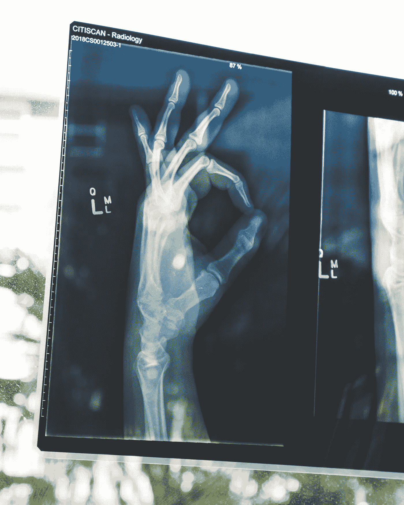
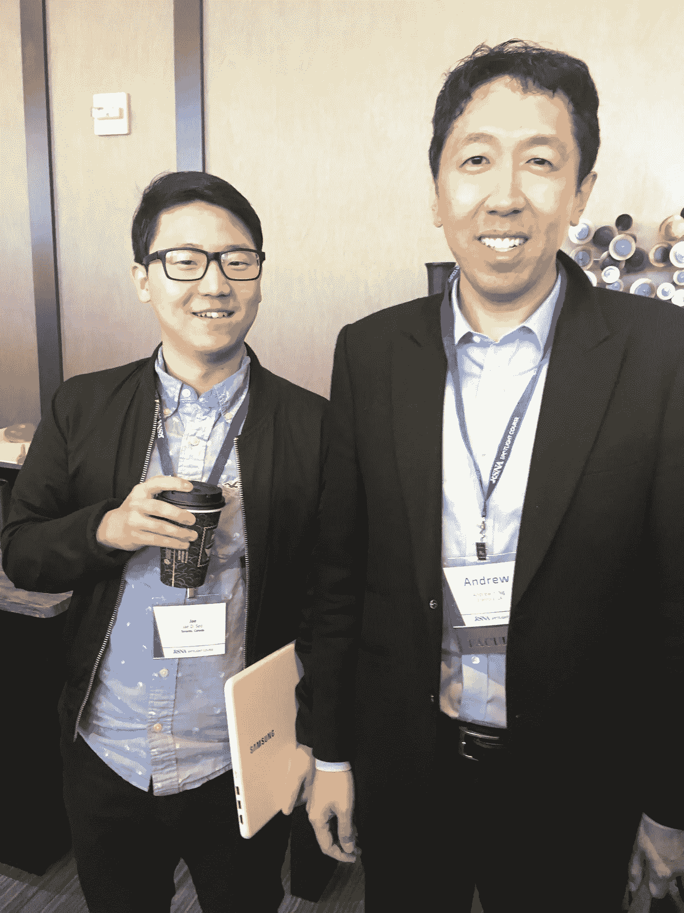
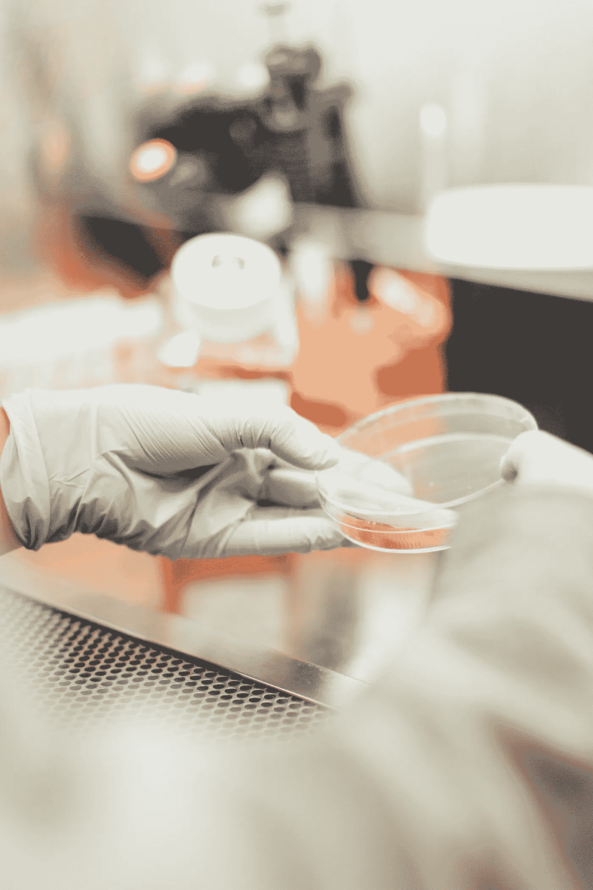
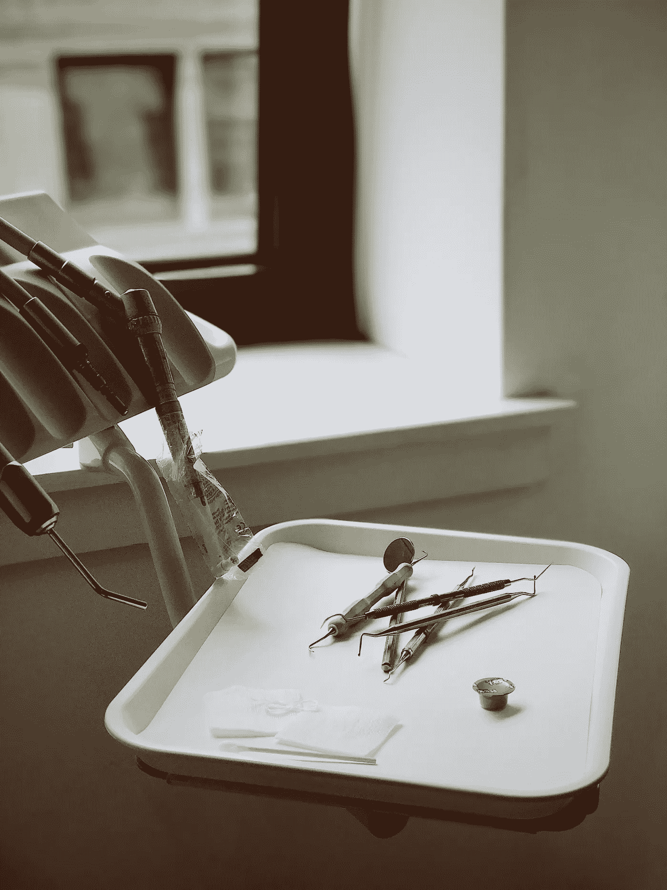

# 我在人工智能时代的 RSNA 放射学聚焦课程中学到了什么

> 原文：<https://towardsdatascience.com/what-i-learned-in-rsna-radiology-in-the-age-of-ai-spotlight-course-52f0c5662631?source=collection_archive---------15----------------------->

## 人工智能将如何影响放射学？

Photo by [Owen Beard](https://unsplash.com/@owenbeard?utm_source=unsplash&utm_medium=referral&utm_content=creditCopyText) on [Unsplash](https://unsplash.com/search/photos/radiology?utm_source=unsplash&utm_medium=referral&utm_content=creditCopyText)

**简介**

大约一个月前，我有机会参加 RSNA 聚焦课程“人工智能时代的放射学”，在那里，甚至吴博士也发表了他对这个主题的看法。(而且我居然有机会和他合影！:D)。

在这里，我将总结一下我在每一次会议中学到的一些材料，不幸的是，我不能参加每一次演讲，但我希望我将要讨论的一些材料也能对你有所帮助。

# **人工智能是新的电力:人工智能在医学成像应用中的颠覆性力量—** [**Andrew Y. Ng 博士**](http://ai.stanford.edu/~ang/originalHomepage.html)

Can’t believe I actually got to meet Dr. Ng

吴博士受他父亲的影响很大。他的父亲创造了一个机器学习算法(很久以前)来帮助医生。

如今，机器学习的大多数好处都来自监督学习设置。由于大量的数据，人工智能现在可以自动化许多不同的任务。

这很好，但是，没有大量的数据，今天的学习方法就不会成功。尤其是在我们没有很多数据的医疗行业。

在研究实验室中运行良好的模型在现实世界中可能不太适用，因为数据分布是不同的。这种分布上的变化很成问题。

那么问题来了，如何保持模型的泛化能力？可能还没有一个明确的答案，但最好的做法需要建立在放射学上，作为一种监管形式。

此外，人工智能将用于增强临床医生的能力，而不是取代他们。计算机科学家和放射学家必须一起工作。

> 炉边聊天和问答

对放射学家和计算机科学家进行教育，开一个课程或训练营是个好主意。创新的关键是将人们聚集在一起，解决我们今天在放射学中面临的一些严重问题。

其中一个问题是数据标记，以及如何从放射学报告中提取信息。(更多与 NLP 任务相关)。

# **破解艾(XAI)黑匣子之谜——**[**萨夫万·哈拉比，医学博士**](https://www.stanfordchildrens.org/en/doctor/default?id=safwan-safar-halabi)

我们如何解释模型的决定？我们拥有的大多数方法都是强黑盒模型(以及弱黑盒模型)。

神经网络很难理解和审计，因为它有太多的参数。从系统的角度来看，我们不知道一个神经元扮演什么样的角色，也不知道每个连接是如何建立的。

提出这个问题的另一种方式是维度问题，因为我们有如此多的参数，理解具有如此多参数的模型超出了人类的能力。解释“什么导致了什么”是一个很难解决的挑战。

最后，还有一个透明度问题。(模型查看的是输入数据的哪一部分？).当然，我们有反褶积、积分梯度、深度提升等方法，但我们能说这个问题已经解决了吗？

# **放射科医生需要了解的数据科学知识—** [**休·哈维，MBBS 理学学士**](https://www.linkedin.com/in/dr-hugh-harvey-58a470112/?originalSubdomain=uk)

Photo by [Drew Hays](https://unsplash.com/@drew_hays?utm_source=unsplash&utm_medium=referral&utm_content=creditCopyText) on [Unsplash](https://unsplash.com/search/photos/data-science-medical?utm_source=unsplash&utm_medium=referral&utm_content=creditCopyText)

作为一名放射科医生(或研究人员)如果你想使用数据科学(机器学习)，你应该建立自己的算法还是应该与一家公司合作？数据有多干净？

这些都是值得思考的有趣想法，他们还开发了从 D 级到 a 级的数据清洁度。

**D 级** →原始数据
**C 级** →数据去标识，访问数据需要伦理批准。最后，它是非结构化的。
**B 级** →结构化数据和质量控制，无标签
**A 级** →清理和标记数据

在所有这些步骤中，获得数据的伦理批准需要花费最多的时间。

# **医学人工智能的偏见与启示—** [**医学博士、公共卫生硕士**](https://www.linkedin.com/in/mattlungrenmd/)

以一个关于使用神经网络对坦克进行分类的城市传说开始这个话题。

当计算机系统出现意外结果时，我们需要知道这些错误发生在哪里，为什么会发生。

在医学领域，可以有三种类型的偏见医院，计算和认知。

> 医院偏见→不同的医院使用不同的机器以不同的方式采集数据。从一个医院数据源训练的模型在另一个数据源中可能表现不佳。
> 
> 计算偏差→对手攻击。
> 
> 认知偏差→这更像是人类的偏差，因为人类在不同的情况下会有不同的表现。

# **乳房成像中的人工智能— Hugh Harvey，MBBS 理学学士**

Photo by [Jon Tyson](https://unsplash.com/@jontyson?utm_source=unsplash&utm_medium=referral&utm_content=creditCopyText) on [Unsplash](https://unsplash.com/search/photos/data-cleaning?utm_source=unsplash&utm_medium=referral&utm_content=creditCopyText)

有趣的是，许多与乳腺癌相关的数据都来自欧洲。

这一研究领域的一些问题包括不同的公司使用不同的机器和预处理方法来创建乳腺摄影图像，我们如何才能使它们标准化？

这种不同的来源会产生偏差，并且基于补片的分析对于乳腺癌乳房 x 线照相术图像来说是不成功的。即使是细分，数据标注也是关键。因为分段是许多不同过程的支柱，如果我们不能正确地做到这一点，可能会导致一些问题。

# **艾在人体成像—** [**巴维克·n·帕特尔，医学博士，MBA**](https://profiles.stanford.edu/bhavik-patel)

CT 图像广泛用于医疗环境，当与人工智能配对时，从分割和分类开始，有很多潜力。

然而，也有很多挑战，在诸如肺癌或前列腺癌分类的诊断中，信噪比非常关键。克服数据分布的严重不平衡是另一个挑战。(加上少量的训练数据，就变得更难了)。

即使模型可能是在自然图像上训练的，使用预先训练的模型也是一个非常好的主意。

**最后的话**

这是一个令人惊叹的会议，我见到了吴博士！那是改变我一生的时刻。请点击[此处](https://www.rsna.org/spotlight/ai-san-francisco/Course%20speakers)，查看计划详情及更多内容。我希望这里的一些信息也能帮助你。