# 如果人工智能模型很容易理解会怎样？

> 原文：<https://towardsdatascience.com/what-if-ai-model-understanding-were-easy-57ba21163d0e?source=collection_archive---------10----------------------->

## **当我带你浏览谷歌的假设分析工具**时，你会看到人工智能分析的实际应用

让我们来谈谈[假设工具](http://bit.ly/whatiftool)，就像在*“****假设工具*** *看看你的模型性能和* [*数据*](http://bit.ly/quaesita_hist) *在 ML/AI 开发过程中不是一件如此令人头疼的事情吗？”*(或者忽略我的喋喋不休，直接滚动到下面的穿越截图！)

# 为什么要为人工智能的分析而烦恼？

能够掌握你的进展是快速迭代到一个令人敬畏的 [ML/AI](http://bit.ly/quaesita_emperor) 解决方案的关键，所以为在[机器学习](http://bit.ly/quaesita_simplest)领域工作的[分析师](http://bit.ly/quaesita_analysts)设计的好工具帮助他们帮助你满足[雄心勃勃的目标](http://bit.ly/quaesita_dmguide)并在伤害你的用户之前抓住像 [AI 偏见](http://bit.ly/quaesita_aibias)这样的问题。

> *[*假设分析工具*](http://bit.ly/whatiftool) *是用于快速机器学习分析，旨在加速迭代模型开发和训练。**

*[分析](http://bit.ly/quaesita_history)不是为了证明什么，所以这个工具帮不上忙。相反，它将帮助您更快地发现数据中未知的未知部分。在这里了解更多关于可解释人工智能( [XAI](http://bit.ly/quaesita_xai) )及其局限性[。](http://bit.ly/quaesita_xai)*

# *关于假设工具*

*[假设工具](http://bit.ly/whatiftool)用于快速机器学习分析，旨在加速迭代模型开发和训练。第一个版本(2018 年末发布)很漂亮，但除非你全押在 [TensorFlow](http://bit.ly/quaesita_tf) 上，否则你无法使用它。作为欣赏像 [Scikit Learn](http://bit.ly/scikitlearn) 这样的工具的便利性的人，我很高兴[假设工具](http://bit.ly/whatiftool)现在面向所有使用 [Python](http://bit.ly/pyisfun) 中的模型的分析师。*

> **不再有 TensorFlow 独享！**

*我们一直在整合来自内部和外部用户的反馈，以使该工具对[数据科学家](http://bit.ly/quaesita_datasci)、[研究人员](http://bit.ly/quaesita_fail)和公司的大团队等来说都非常棒。点击了解更多关于我们的 UX 之旅[。事不宜迟，让我给自己做一个 hexpresso，用最新的版本来告诉你我对什么是好什么是坏的看法。](http://bit.ly/quaesita_ux)*

# *假设工具有什么了不起的？*

## ***易于使用且功能多样***

*在当前版本的[假设分析工具](http://bit.ly/whatiftool)中，我们扩展了对 [*TensorFlow*](http://bit.ly/quaesita_tf) 爱好者之外的魔法的访问。是的，没错——不再有 TF-exclusive！这是用于特征选择/预处理洞察*的模型理解和快速数据探索，即使你对*[*tensor flow*](http://bit.ly/quaesita_tf)*过敏。*想对比 Scikit Learn 或 PyTorch 制作的模型？站起来！它能与标准的 [Jupyter](http://bit.ly/jupyter_try) 笔记本兼容吗？你打赌！它也适用于[合作实验室](http://bit.ly/colabwit)，因为我们知道你更喜欢[选择你的武器](http://bit.ly/choosefl)。该工具旨在减少您查看数据所需编写的代码量，因此它是为易于使用而构建的。*

*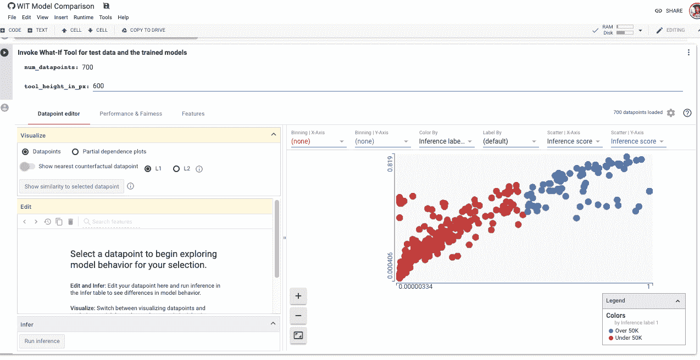*

*In this screenshot, we’re using the tool to compare two classifiers (deep [neural network](http://bit.ly/quaesita_emperor) on the x-axis, [linear model](http://bit.ly/mfml_regression) on the y-axis) trained on the [UCI Census Income Dataset](http://bit.ly/ucicensus) to predict whether someone will earn more than $50,000 a year. Numbers closer to 1 indicate that a model is giving a stronger YES vote. The scatterplot shows the votes of one model versus the other. See the notebook [here](http://bit.ly/ucinotebook) and play with it yourself if you’re feeling curious — no install required.*

*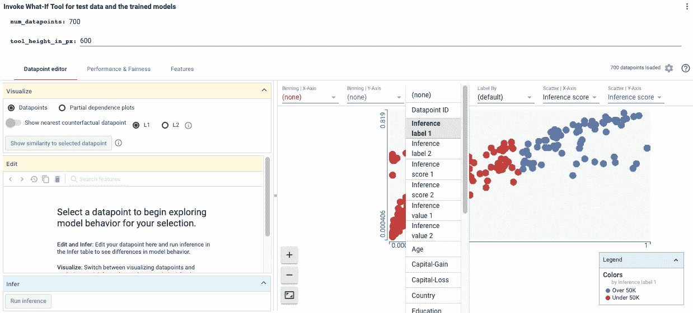*

*As expected, there’s a positive correlation but the models don’t give identical results. (Working as intended! They’re different models, after all.) If I’m curious about how the model votes are related to, say marital status, it’s very easy to find out — simply select that feature from the dropdown menu.*

*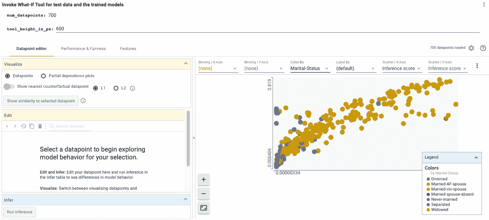*

*Voilà! Most of our dataset shows civil marriages and we see an interesting preponderance of other statuses where the models disagree with one another or both vote a strong no. Remember, this is [analytics](http://bit.ly/quaesita_datasci), so [don’t jump to conclusions](http://bit.ly/quaesita_analysts) beyond our current dataset!*

*[假设分析工具](http://bit.ly/whatiftool)不会为您提供您可能想要探索数据的每种方式的每个视图的每个片段。但是它的设计很棒:第一次开始时不费力。它也适用于子样本，这意味着你可以快速浏览，而不必支付内存成本来摄取和处理你所有的[数据](http://bit.ly/quaesita_hist)。为[速度](http://bit.ly/quaesita_analysts)欢呼！*

> *它的设计非常棒:第一眼看起来不费吹灰之力。*

## ***战斗 AI 偏向***

**[*假设工具*](http://bit.ly/whatiftool) *也是你对抗* [*AI 偏见*](http://bit.ly/quaesita_aibias) 的秘密武器。要了解原因，请在此查看我对 [*AI 偏见*](http://bit.ly/quaesita_aibias) 的讨论。它捕捉偏见的功能并不是偶然的——该项目的核心团队有很大一部分来自谷歌大脑的 [PAIR](http://bit.ly/pairbrain) 倡议，旨在以人为中心的研究和设计，使人工智能伙伴关系富有成效，令人愉快，并且公平。**

**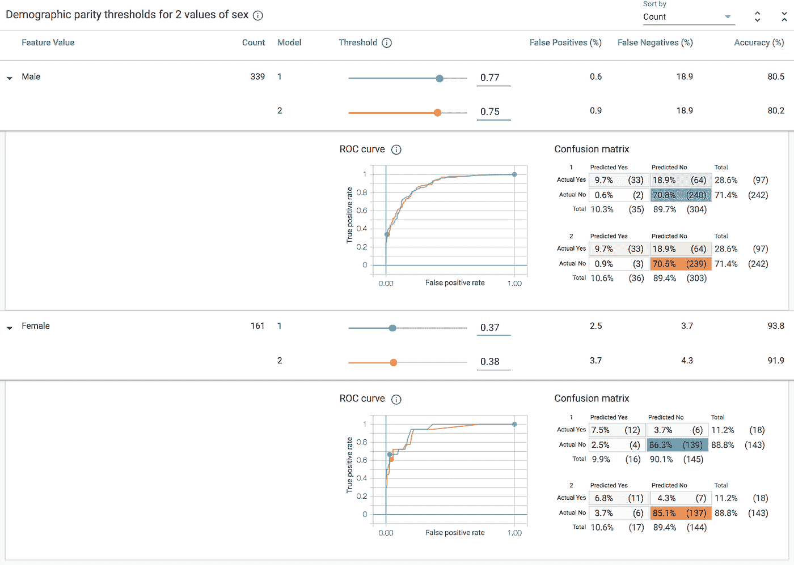**

**In the fairness tab, we can play with all kinds of uncomfortable questions. For example, we can find out where we’d have to set our classification thresholds (the ones you’d naively want to put at 50%) for males vs females in our test set to achieve demographic parity between them. Uh-oh.**

## **更智能的 ML/AI 迭代**

**[*假设分析工具*](http://bit.ly/whatiftool) 整合了[刻面](http://bit.ly/facetstool)工具，该工具在没有模型理解组件的情况下处理[数据分析](http://bit.ly/quaesita_analysts)部分。**

**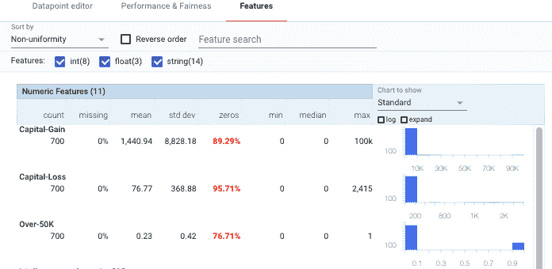**

**In the features tab, I can get a quick look at [histograms](http://bit.ly/quaesita_hist) to show me how my features are [distributed](http://bit.ly/quaesita_hist). Oh my goodness, capital loss is a super imbalanced feature with only ~4% nonzero values. I’m already itching to try dropping it and rerunning both models. If you’ve been around the block a few times (or studied the math) you’ll know that putting something like that in a [linear model](http://bit.ly/mfml_regression) is bad news indeed. I see similar trouble with capital gains. (If you insist on using ’em, how about doing some light feature engineering to combine them? Minuses are awesome.) Ah, and here’s a question for the more advanced analysts among you: can you see why optimizing for accuracy should make us very nervous?**

**[*What-If*](http://bit.ly/whatiftool) 把两者放在一起，帮你智能迭代。你可以这样想:要想知道在[厨房](http://bit.ly/quaesita_fail)下一步该做什么，你需要一种简便的方法来比较几种潜在食谱的美味度(通过模型理解)，还需要了解你的购物袋里有什么(通过[数据分析](http://bit.ly/quaesita_analysts)，这样你就不会不小心使用[烂番茄](http://bit.ly/quaesita_fail)。 [Facets](http://bit.ly/facetstool) 让你看到你的配料，而 [*What-If 工具*](http://bit.ly/whatiftool) 更进一步，提供了*加*食谱对比。如果你一直在盲目地烹饪，你会喜欢这个用于[迭代模型开发和训练](http://bit.ly/quaesita_history)的工具。**

## **探索反事实**

**永远不要低估问自己假设问题的能力，比如*“如果我们延长这个人的工作时间并改变他们的性别会怎么样？模型如何反应？”* *T* he [假设分析工具](http://bit.ly/whatiftool)是专门为让你更好地理解假设分析/ [反事实问题](https://arxiv.org/abs/1711.00399)而设计的。该工具可以很容易地看到，如果你改变一个变量(最后！)并向您显示是否存在某个预测行为可疑的值，并让您看到分类从“否”到“是”的确切变化。尝试使用反事实选项，在不同的预测类别中找到一个数据点的最相似对应项。这是查看细微差异对模型输出的影响的好方法。**

**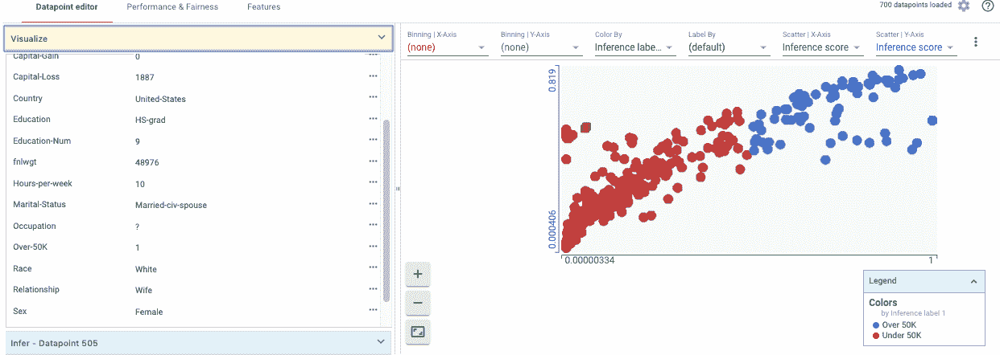**

**Back to our first tab. That red point I’ve selected is one where the models are having an argument: [neural network](http://bit.ly/quaesita_emperor) says nah, but [linear model](http://bit.ly/mfml_regression) says a gentle yes to high income. What-If… I want to do a quick deep dive into that point off the diagonal? I simply click on it and there’s the info. Turns out the linear model is right, this is a high income earner. Moreover, it’s a married woman who works 10 hours per week. I love how quickly I could see that.**

**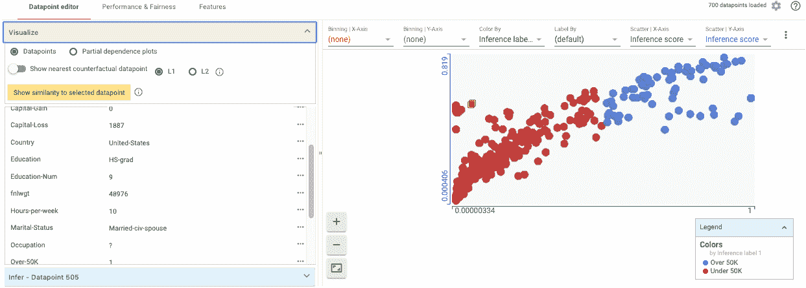**

**What’s this “visualize” thing on the left? Let’s see what happens if we try toggling the “counterfactual” setting.**

**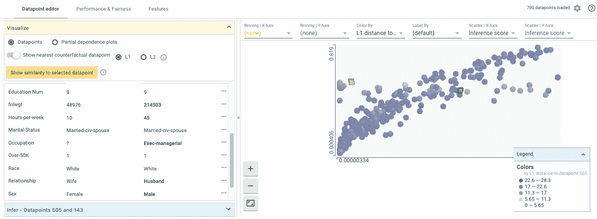**

**Aha! Here’s the nearest buddy where neural network changes its mind and correctly predicts a large salary. And it is a buddy indeed: this is a male executive who works 45 hours a week. What-If… we do a deep dive and see which of these differences the models are most sensitive to?**

**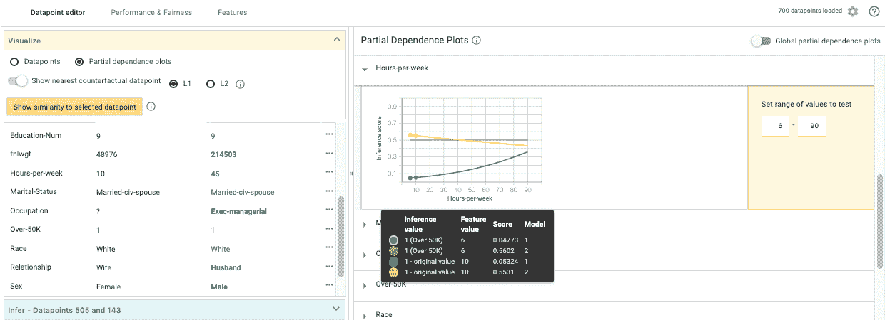**

**Looking at the partial dependence plots, we can see that the [neural network](http://bit.ly/quaesita_emperor) (blue) seems to expect pay to go up with hours worked, while the [linear model](http://bit.ly/mfml_regression) (orange) slopes down. Curious. The [statistician](http://bit.ly/quaesita_statistics) in me is shouting at all of us not to get excited — they’re probably [both wrong](https://en.wikipedia.org/wiki/All_models_are_wrong) in their own way, so we shouldn’t learn anything grand about the universe, but seeing how models react to inputs is very valuable for picking approaches to try next. Our mystery candidate’s lower hours worked look more compelling to the linear model (yeah, quiet down friends, obviously the economist in me is just as suspicious as the statistician). I bet we also want to take a quick look at other features here — how about gender…?**

**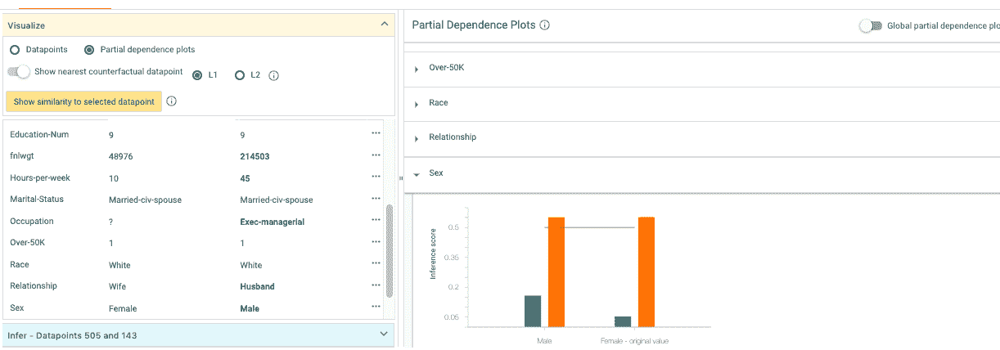**

**Interestingly, the [linear model](http://bit.ly/mfml_regression) (orange) is not getting itself too excited about gender, but the [neural network](http://bit.ly/quaesita_emperor) (blue) seems more reactive to it. How about our mystery woman’s question-mark of an occupation? Could that be contributing to her lower score by the neural network?**

**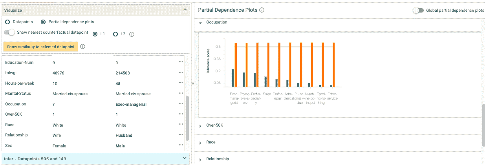**

**Whoa, while the [linear model](http://bit.ly/mfml_regression) (orange) is stoic again, the [neural network](http://bit.ly/quaesita_emperor) (blue) gives execs a pretty big prediction boost relative to those with missing occupation information. Now isn’t the time to say [that snarky thing](http://bit.ly/quaesita_emperor) about [linear models](http://bit.ly/mfml_regression) versus [neural networks](http://bit.ly/quaesita_emperor), is it? Well, maybe I’ll restrain myself… the whole point of the tool is to give you eyes on your data so you can iterate wisely, not let [biases](http://bit.ly/quaesita_aibias) take you by surprise, and create a more awesome model faster. We’re not done yet! (But I sure have a few ideas I’m [inspired](http://bit.ly/quaesita_analysts) to try next.)**

****

**Learn more about our two model types [here](http://bit.ly/quaesita_emperor).**

# **假设分析工具有什么烦人的地方？**

## ****正在进行的工作****

**这个工具还不完善。例如，你偶尔会无意中发现一些肯定会让 [Tufte](http://bit.ly/tuftefans) 粉丝皱眉的事情——例如，下面的截图让我在最近的一次会议上咆哮。(如果你看不出为什么，这是一个很好的机会来上一堂数据 viz 课:为什么文本标签“年轻”和“不年轻”是唯一的视觉线索？为什么不塑形？因为我们正努力在这方面和其他方面做得更好，但是[完美需要时间](http://bit.ly/quaesita_ux)。作为合作的一部分，我代表你们大声疾呼，以帮助这些问题迅速消失。)**

****

**还有…那些轴标签呢？**

## ****无制导探索****

**这个工具会跟随你的好奇心，但是如果你没有创造力，你会怎么做呢？也许你希望这个工具更加规范，引导你的眼睛去关注什么是重要的？你的反馈在我们的雷达上，我们正在努力，但对于那些认为如果你的探索受到限制，美好的东西可能会丢失的人，不要害怕！我们相信选择，也明白不是每个人都想要事物的规定性，就像不是每个人都想玩有固定故事情节的电子游戏，而不是开放的世界。**

## ****限量定制****

**你想要阳光下的每一个定制，这是一个数据科学的说法。我也说过类似的话——我记得在统计学博士生的强制 SAS 培训中，我问的第一个问题是:*“我如何自己编写这些函数，以便它们准确地完成***我想要的功能？”*。***

***所以当你问关于假设工具的同样问题时，我会告诉你那天我的教授告诉我的:这就是原始的 T2 Python 和 T4 R T5 的用途！(或者，如果你真的要走那么远，上帝会帮助我们的，C/C++。)像[假设工具](http://bit.ly/whatiftool)这样的可视化工具不是替代品，它们是[加速器](http://bit.ly/quaesita_history)。他们用最少的努力给你第一眼，所以你知道在哪里挖掘，但是一旦你选择了你的位置，你可能会想要写你自己的代码去完全按照你喜欢的方式挖掘**。如果你是一名专家分析师，有自己令人敬畏的做事方式，我们的目标是帮助你缩小搜索范围，这样以后就可以少写代码，而不是取代你的整个方法。*****

## ******张量流术语******

****另一件让我恼火的事情(我敢肯定，还有其他类似于[统计学家的](http://bit.ly/quaesita_statistics))是，为了我们的 [TensorFlow](http://bit.ly/quaesita_tf) 用户群，我们不得不在术语上做出妥协，保留了一些 [TensorFlow](http://bit.ly/quaesita_tf) 遗留的行话，这让传统的[数据科学家](http://bit.ly/quaesita_datasci)想要敲打一些东西。是啊，那个“推论”不是 [*推论*](http://bit.ly/quaesita_fisher) 。TensorFlow 是一个热闹的词汇桶，被挪用并迅速被误用——各位书呆子，甚至不要让我开始使用它的“实验”、“验证”、“估计器”或批量与小批量之类的东西……就让这成为一个教训，当只有你和你的朋友在车库里蹦出一些想法时，要仔细思考你叫什么。如果项目成功了，每个人都必须接受你的选择，那该怎么办？叹气。****

# *****判决*****

***总而言之，这些抱怨是微不足道的。总的来说，我真的很喜欢[假设工具](http://bit.ly/whatiftool)，我希望你也会喜欢。***

# *****看它在行动！*****

***虽然[假设分析工具](http://bit.ly/whatiftool)不是为新手设计的(你需要知道你的基本方法，如果这不是你第一次使用 [Python](http://bit.ly/pyisfun) 或[笔记本](http://bit.ly/jupyter_try)的话最好)，但它对执业分析师和 ML 工程师来说是一个令人敬畏的催化剂。***

***如果你渴望看到运行中的[假设分析工具](http://bit.ly/whatiftool)，你不需要安装任何东西——只需点击[这里](http://bit.ly/whatiftool)。我们有大量令人眼花缭乱的演示和文档。如果你想真正开始使用它，你甚至不需要安装 [TensorFlow](http://bit.ly/quaesita_tf) 。简单地 *pip 安装 witwidget* 。***

***如果你是谷歌云平台的粉丝，你可能会对刚刚宣布的新集成感到兴奋。现在，您只需调用一个方法就可以将您的 AI 平台模型连接到假设工具！在这里查看[如何](http://bit.ly/aiplatform_whatif)。***

# ***感谢阅读！人工智能课程怎么样？***

***如果你在这里玩得开心，并且你正在寻找一个为初学者和专家设计的有趣的应用人工智能课程，这里有一个我为你制作的娱乐课程:***

***Enjoy the entire course playlist here: [bit.ly/machinefriend](http://bit.ly/machinefriend)***

# ***喜欢作者？与凯西·科兹尔科夫联系***

***让我们做朋友吧！你可以在 [Twitter](https://twitter.com/quaesita) 、 [YouTube](https://www.youtube.com/channel/UCbOX--VOebPe-MMRkatFRxw) 、 [Substack](http://decision.substack.com) 和 [LinkedIn](https://www.linkedin.com/in/kozyrkov/) 上找到我。有兴趣让我在你的活动上发言吗？用[这个表格](http://bit.ly/makecassietalk)联系。***