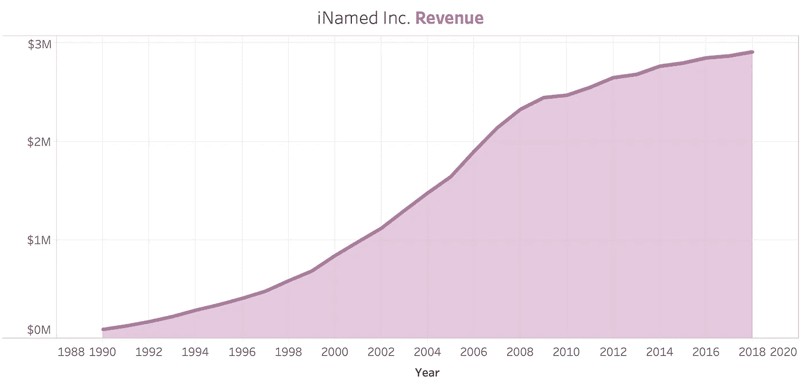
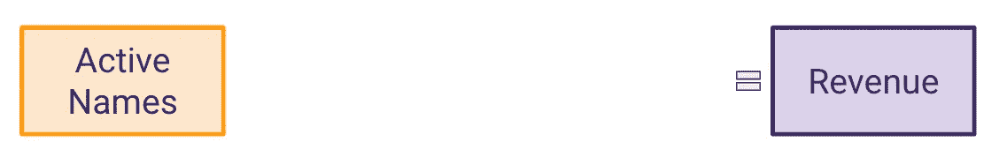
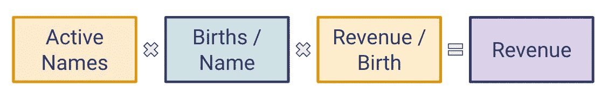
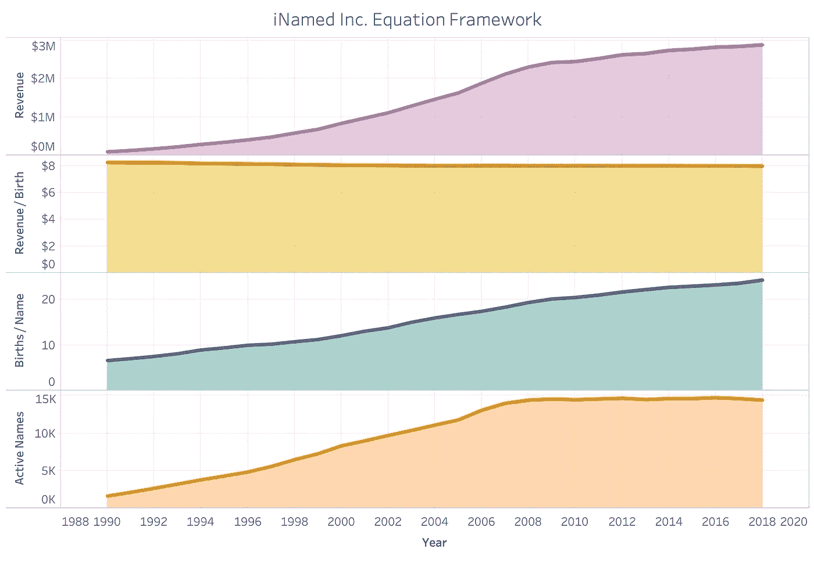
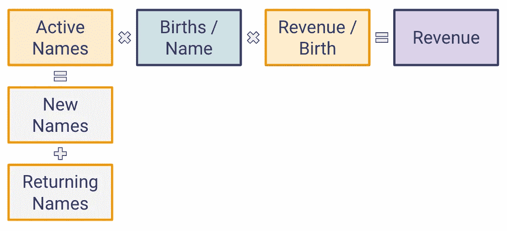
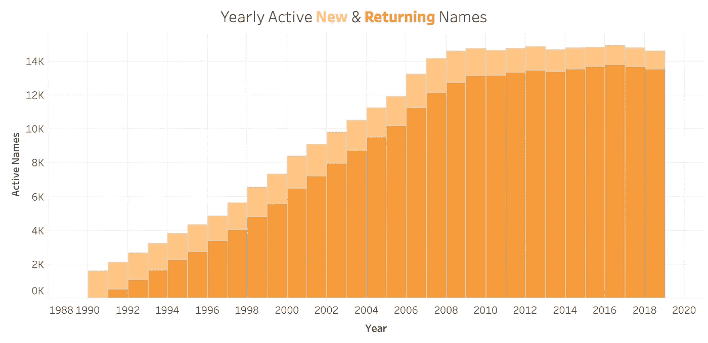
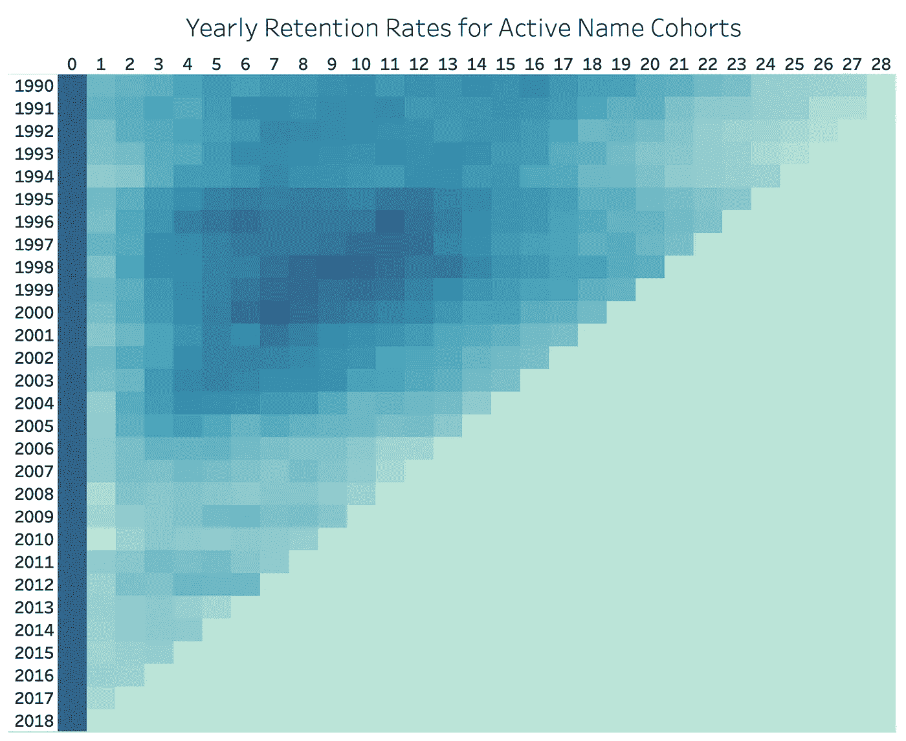
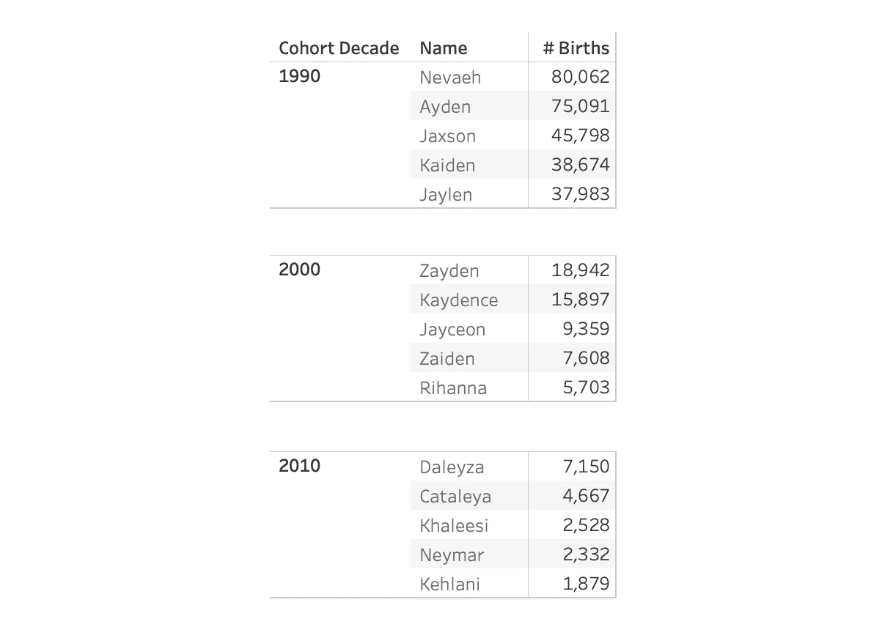

# 如果我们的名字是由企业产生的会怎么样？

> 原文：<https://towardsdatascience.com/what-if-our-first-names-were-generated-by-corporations-9c1109b13dd7?source=collection_archive---------39----------------------->

## 一个真实的业务测量框架，使用一个虚构公司的真实数据

美国婴儿名字数据集([来自社会保障管理局(SSA)网站](https://www.ssa.gov/oact/babynames/background.html))包含了每年出生的婴儿名字的总数。它一直是我最喜欢探索的数据集之一，这一次我发现了一个非常独特的用例。

在领导 Eventbrite 的分析时，我们使用一个相当简单的框架来帮助我们定义成功、诊断问题和识别机会。虽然我不能分享我在 Eventbrite 做了什么，但我发现我可以使用婴儿名字数据来模拟一个虚构的公司，并使用它来演示测量框架。我们走吧！

## 在命名的行业中

为了使婴儿姓名数据集达到可用状态，我们必须用一些虚构的背景上下文来设置舞台。假设 1990 年成立了一家名为 iNamed Inc .的公司，他们想出名字，并向未来的父母推销。然后他们可以从给新生儿起的每个名字中获得版税。

名字的现行价格是每个新生儿用他们的名字命名 5 美元。除了这一固定费率之外，iNamed Inc .还获得该名称中每个字母 0.50 美元的额外费用(这增加了一个可变部分)。最重要的是，他们只有在一个名字在任何给定的一年中至少被 5 个婴儿使用过的情况下才能得到报酬(原始数据集删除了任何出现少于 5 次的名字，以防止被识别)。

在这种情况下，我们可以将每个独特的名字视为一个独特的客户或用户，他们为公司带来的价值是出生时带有该名称的婴儿数量。例如，Ayden、Jaxson、Kaydence、Jayceon 和 Zayden 都是 iNamed Inc .在 1990 年至 2010 年间创造的热门名字(你可以说他们有相当独特的风格)。这些名字总共创造了 16.5 万个新生儿和 130 万美元的收入。看起来命名是笔好生意！

## 按编号命名的公司

运行这些数字，我们可以画出 iNamed 公司的收入。从 1990 年不到 10 万美元的年收入开始，iNamed Inc .在 2001 年增长到 100 万美元，在 2006 年翻了一番，达到 2M 美元，最近在 2018 年底达到 300 万美元(如下图所示)。尽管最初有所增长，但收入增长在过去十年中一直在下降。

这种 s 形曲线在很多行业都很常见。收入开始很低，然后随着坡度的快速变陡而加速。然后出现拐点，斜率开始下降。这种下降起初是渐进的，但随后突然迅速开始变平，收入逐年仅略有增加。

iNamed Inc .也不例外，这条 s 曲线在过去十年几乎没有增长。在接力棒传递给新的域名生成公司之前，他们只有一年的时间来想出好名字，可以理解的是，iNamed Inc .希望这最后一批名字是一个好名字。

那么在 iNamed 公司发生了什么？增长放缓的根本原因是什么？基于这些，我们可以向名称设计师提出什么建议，以便他们在 2019 年更好地集中精力？使用一个框架可以帮助我们回答这些问题。

## 一个框架

为了理解这个行业及其变化，让我们从构建一个简单的框架开始。从我的经验来看，使用一个类似数学的等式通常是理解一个企业成功的最快和最简单的方法。

说到底，iNamed Inc .是一家营利性公司，关心的是营收；因此，让我们从等式右端的 it 开始我们的框架。接下来，我们将在等号左边填入所有收入的总和。

接下来，我们有名字本身——没有它们，iNamed Inc .就赚不到钱。我们将在等式的最左端添加名字作为一个术语。在这种情况下，一个活动名称是一个符合至少出现 5 次的定义的名称，因此有资格获得版税。

为了填补中间的空白，我们需要把名字公司赚钱的两种方式结合起来:按出生和按字母。

为了使我们的方程在数学上稳定，我们需要稍微调整这两个指标。将每名出生人数和每名出生人数的收入相加，既能增加收入，又能让单位发挥作用。在这种情况下，我们假设每封信的收入没有变化，也没有必要明确加入等式。

## 给我看看数字！

下面我们将看到这些年来我们的每个框架指标。

通过查看这四幅图，我们已经了解了很多关于业务的信息:

*   每胎收入非常平稳。这表明名称的平均长度变化很小。
*   **在企业的整个生命周期中，人均出生人数似乎以相对稳定的速度增长。**仔细观察，我们还可以看到这一指标中有一条非常轻微的 s 形曲线，表明我们名字的出生人数最多有一点点下降。
*   **活跃域名的数量从 2007 年左右开始稳定下来。**在时间和上述各点之间，活跃名称的数量可能是影响收入的最大因素。

## 一头扎进框架

我们将深入研究这三个术语，并了解它们是如何随着各自的子指标而变化的。为了更深入地挖掘我们每年活跃的名字，让我们回到我们的框架，并添加另一层。

活动名称可以分为两种不同的策略:创建(或获取)新名称和保留返回的名称。新名称被定义为当年第一次被视为活动名称的活动名称。返回的名称由前一年第一次出现的任何活动名称定义。

这里我们有两个主要趋势:

*   新名字的数量在 2007 年达到顶峰后开始下降。名字设计师在 20 世纪 90 年代平均每年创造约 16k 个新名字，2000 年代为 18k，2010 年代仅为 11k。
*   **自 2007 年以来，回归名字的增长基本持平。**鉴于 2006 年后，85%的活跃域名首次出现在上一年，这一回归变化对活跃域名总数有较大影响。

因此，虽然 iNamed Inc .无法像过去那样推出新名字，但过去名字的受欢迎程度似乎有了更大幅度的下降。我们可以对每年的新名字进行分组，并绘制出 1 年、10 年或 15 年后仍在使用的名字的百分比。下面的热图描述了这一点，有助于理解新名字群体的受欢迎程度这些年来是如何变化的。

Darker = higher retention

如果你以前没有看过这样的剧情，可能会有点让人不知所措，所以让我们一个一个来看。

*   在图的左侧向下增加的年份表示每个新的名称群组(这相当于较早的新的和返回的图中的新名称)。
*   顶部增加的数字表示自队列开始以来已经过去了多少年(即自 1990 年队列开始以来已经过去了 10 年)。
*   每个方块的颜色表示该群体的活跃名称在下一年回归的百分比。最左边的列(0)中的细胞都是 100%,因为该列指示群组的开始。
*   一般来说，颜色越深，保留率越高，对 iNamed Inc .越好。

> 例如，2000 年的一批域名中有 1931 个新的活跃域名。一年后，这些名字中的 33%(1931 个中的 634 个)仍然有效，四年后只有 48%(1931 个中的 935 个)，15 年后只有 38%(1931 个中的 734 个)。

## 保留趋势

*   **第一年的续读率几乎总是低于第二年。也许父母需要一些时间来“热身”新名字。我们在第三年的保留率中看到了类似但不太一致的效果。除此之外，我们看不到任何其他季节性趋势——更高或更低保留率的垂直线(例如十年后保留率的持续增长)。**
*   在 1995 年和 2000 年之间创造的名字比其他的名字保持的时间更长。这五年对名字设计师来说一定是个好时光。理解为什么这些名字受欢迎并模仿它们是 iNamed Inc .的一个机会。
*   从 1990 年到 1994 年和 2001 年到 2005 年的队列中的名字都有很好的记忆。他们只是不如上述队伍强大或持续时间长。
*   **到目前为止，2006 年及以后的队列保持性非常差。这些名字的某些部分没有像以前的名字那样流行起来。了解原因将有助于我们防止将来出现糟糕的名字。**
*   **2012 年的毕业生，虽然是最近的，但保留率越来越高。这可能预示着未来流行名字的趋势。**
*   **最后，在 2004 年到 2006 年间，我们看到了一种微妙的高保留率趋势，这种趋势影响了所有珍贵的群体。这种与时间相关的特定事件可能是一种多年的营销推动或出生潮。**

## 最后

使用这个框架和仅仅 6 个图，我们现在对 iNamed 公司的业务、历史和潜在的改进机会有了相当深刻的理解。此外，使用这些相同的图表，我们现在可以设定目标并监控业务的成功发展。

请注意，框架的主动创建者方面本身假设每个名称都值相同的值。事实上，我们都知道这不是真的——因为 80/20 法则告诉我们，20%的名字导致了 80%的出生。该框架在我们的第二个术语(按姓名出生)中考虑到了这一点。对每个名字的出生驱动因素及其与活跃名字的互动进行类似的深入探讨，可以帮助我们进一步了解业务并发现机会。

总的来说，在浏览这些数据时，我惊喜地发现名字数据与一家成熟公司的数据如此接近。通过使用这个虚构的公司作为例子，我希望你能看到建立这样一个框架对于诊断和理解任何真实的业务是多么有价值。此外，由于每个指标都是数学等式的一部分，因此很容易从一个指标深入到另一个指标，从而全面了解我们为什么要制定目标，以及这些目标如何影响整个公司。

作为 Eventbrite 的首席产品分析师，我在我们的产品团队中建立了一个非常相似(也更复杂)的该框架版本，帮助我们监控产品健康状况、量化成功、诊断问题和识别机会。

这不仅是一个有用的框架，也是一个真正的战略。让团队专注于改善等式中的选择术语(即每个名字的出生人数)，可以实现各种战略方向，这些方向都很容易与收入相关联。这些团队可以用他们自己的子术语进一步定义框架。在实践中，这些子术语通常表示关于他们为什么认为他们的用户会这样做的假设。当团队进行实验时，这些假设会根据焦点的度量是否移动而得到验证。

请欣赏 iNamed Inc .在以下十年中排名前五的名字。

感谢阅读。📈

# Births counted at the end of 2018