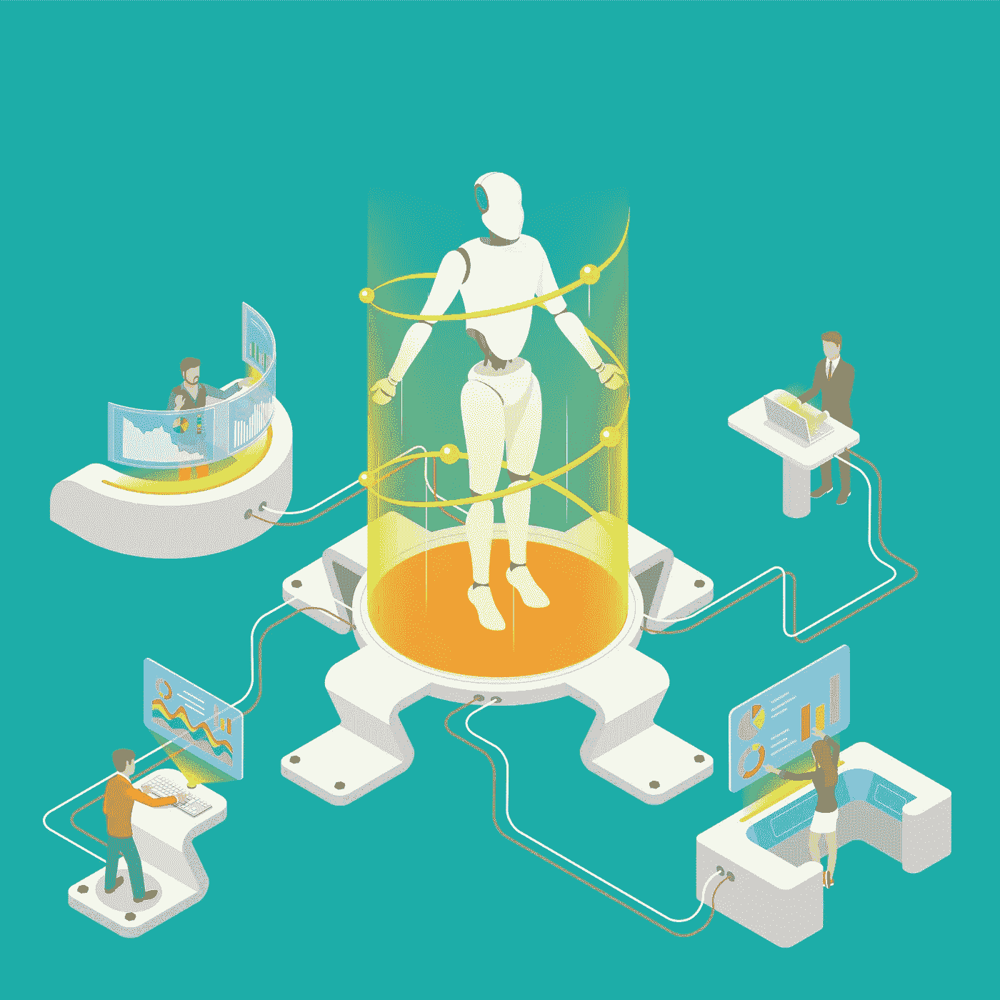
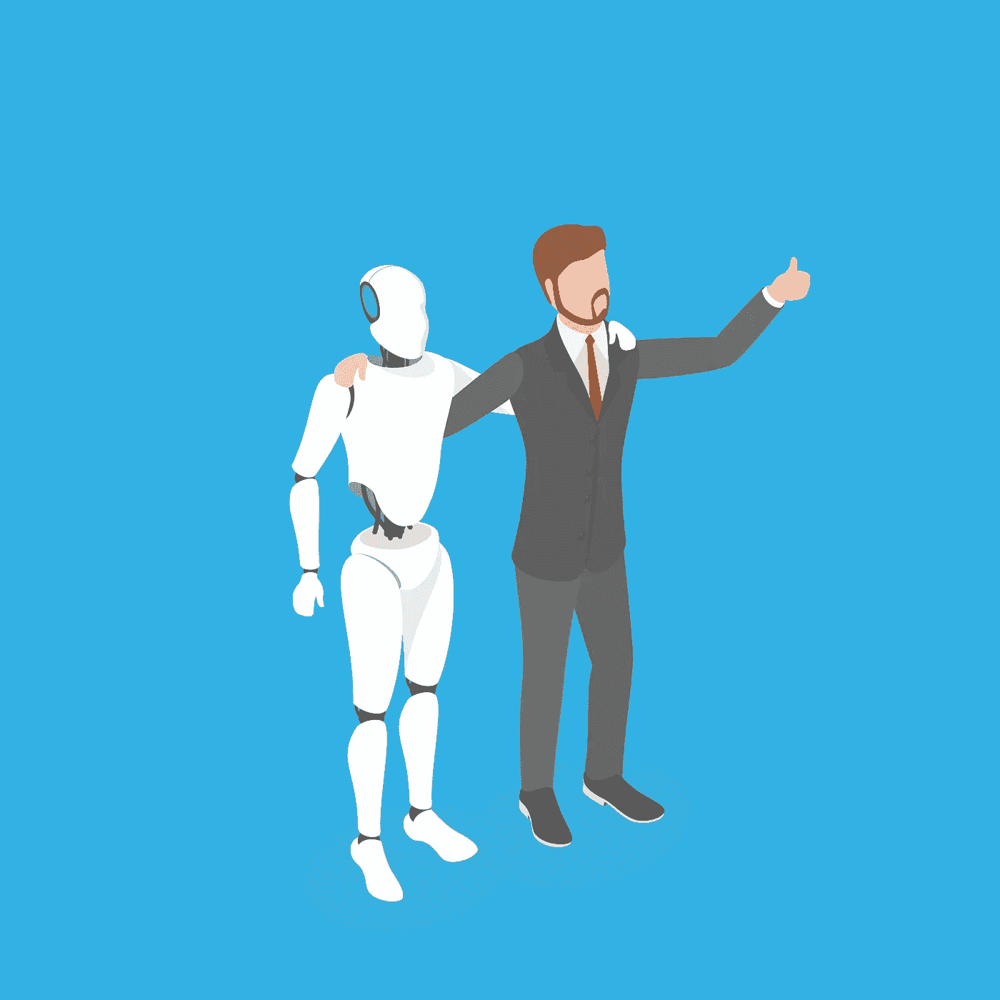

# 如果你的同事是机器人呢

> 原文：<https://towardsdatascience.com/what-if-your-colleague-is-a-robot-e1256b3e2c94?source=collection_archive---------31----------------------->

## 人工智能、机器人和合作的奇异未来

SOURCE: © ADOBE STOCK

纵观历史，我们已经看到了整个行业的组织是如何接受机器人技术的，以及今天，这些组织中的一些是如何在没有机器人技术的情况下运作的。每一天，我们都见证了技术是如何融入我们工作生活的几乎每一个方面的，并且在许多情况下，我们依赖它来执行我们的大多数日常任务。

几十年来，组织一直在使用机器人来自动化日常流程。事实上，每天我们都被它们包围着，无论是在家里，在街上还是在办公室——从自动取款机和自动售货机到更复杂的手术机器人和自动驾驶汽车。这些机器人有不同的形式和形状，也许它们看起来不像人类，但企业喜欢它们，它们肯定是大规模生产力的关键驱动力。

现在，想象一个正常的一天——早上醒来，去你的工作场所，喝一杯咖啡，开始与你的同事交谈……一切看起来都很正常，你参与到对话中，交流想法和新想法，然后结束，走到你的办公桌前开始工作。一小时后，你的经理要求你分析和比较五份长篇报告。你没有时间做那件事，那需要太多的工作时间和太多的精力；另外，你还有其他事情要做。因此，你向你的同事寻求帮助，并在一个小时内惊人地得到了结果。

这听起来很不现实吧？没有一个普通的同事会为你做这项工作，甚至这么快就完成。但是如果我告诉你，你的同事是一个**机器人呢？一个外表和行为都和其他人一样的机器人。它可以像你一样说话，像你一样思考，几乎像你一样推理。但它仍然是一个机器人。你会有什么感觉？**

SOURCE: © ADOBE STOCK

# 人工智能、机器学习和机器人技术:

许多机器人不是人工智能的，它们被编程来执行重复的任务或运动，以操纵现实世界中的物体。然而，一些专家提出，构成机器人的是它的思考和决策能力，但这难道不意味着使用 AI 吗？

另一方面，人工智能(AI)旨在通过解决问题、学习、感知和推理等技能来复制人类的智能行为。它可能涉及某种程度的机器学习(ML)，这是基于授权机器访问数据的想法，这将允许它们自学。

AI 与 ML 和 Robotics 打算创造一个具有人类智能的人造机器/机器人，它能够自己表达原始想法。我们还没有做到这一点，但我们已经取得了很大进展。

你可能已经听说过[索菲亚](https://www.hansonrobotics.com/sophia/)，看起来像人类的社交机器人。如果你知道我在说什么，想想一个更复杂的索菲亚版本，与人类一起工作和协作。

其他重大进展包括所谓的“T4”机器人流程自动化(RPA)。这些软件机器人通过复制人类互动来帮助企业和员工做简单的工作。它只是一个软件，而不是一个物理的人工智能机器人，但这绝对是一个重大突破。

真正的挑战是让 AI 理解自然智能是如何工作的，因为我们知道我们的大脑是如何运作的，我们可以教会 AI 如何思考和学习，但我们仍然不知道所有这些联系如何才能引导 AI 使用抽象推理或“常识”。

SOURCE: © ADOBE STOCK

# 我的同事是一个机器人:

回到我们开始的地方——机器人旨在通过执行体力和智力任务，与人类一起建立想法，从我们的环境中学习，质疑决策，并一起找到解决方案，来与人类共享工作空间，这将降低许多风险，并成倍提高生产率。

机器人已经可以比人类做得更好，但它仍然需要人类来解释他们的工作，并以战略性和创造性的方式应用结果。出于这个原因，我们需要确保机器人被视为互补而非竞争，并分配给它们没有人愿意做的工作，即紧张而重复的工作；把涉及判断和专业知识的工作留给人类。

再想象一次，同样的场景，你和你的同事进行对话，但是现在你从一开始就确定那是一个机器人。**会不会感觉怪怪的？**

可能吧，我知道这听起来也很可怕，但是如果我们更深入地思考一下，想想拥有一个人工智能同事的好处而不是坏处，这可能会改变我们的观点。这些优势包括:

安全:涉及使用重型机械、尖锐物体、极高或极低温度、化学品等的任务将由机器人执行。这将保护在危险和不健康工作条件下的工人。

**速度和一致性:**人工智能机器人工作速度快，没有任何干扰，它们不需要休假，全天候可用。

没有错误:机器人几乎没有犯错的余地，它们精确而优质。

**快乐&生产力:**最重要的是，**所有这些福利都是为了提高员工的快乐和生产力。如前所述，这些机器人将接管那些我们不喜欢的任务。从危险、乏味和重复的基本任务到需要高度分析技能的更复杂的任务。**

SOURCE: © ADOBE STOCK

# 可以由人工智能机器人完成的工作示例:

数据记者:这类记者是那些专注于分析数据的人。人工智能机器人可以更快更有效地完成这些工作。

**秘书:**像接电话、发邮件、安排会议等行政任务(包括体力、手工任务)，都可以由人工智能机器人来完成。

**文档审查(律师):**许多律师不得不在成千上万的文档中搜寻特定的信息。人工智能机器人可以瞬间过滤信息，还可以分析信息并生成报告。这项工作也适用于其他相关领域。

药剂师:当你去药店时，人工智能机器人可以扫描你的处方并拿到你的药。对于非处方药，你可以指出你的症状，机器人会给出建议。此外，这些机器人可能会访问医院的数据和你的健康记录，以提供更准确的建议。

**人工智能警察和情报助理:**人工智能机器人可能会通过收集、存储、整理和强调调查所需的关键数据来帮助警察和中情局等机构。他们也可以执行一些体力任务，如巡逻，逮捕，甚至指挥交通。

机器人可以被教会如何混合和提供饮料。从啤酒到招牌鸡尾酒，应有尽有。他们可以在几分钟内制造数百个。

人们对机器人取代人类和消除工作岗位有很多担忧，但这些机器人可能会与人类并肩工作，合作并补充我们的工作，而不是接管工作。事实上，[技术创造的就业机会将比它淘汰的](/the-next-generation-of-workers-4df1e29f0195)多。许多工作将会改变，新的工作将需要一套新的技能，我们必须通过人工智能推动的高级教育和培训系统来获得这些技能。

如果我们打算与机器人共享一个工作空间，并将它们视为合作伙伴而非对手，它们必须首先以人类的身份体验这个世界，这意味着它们需要能够了解我们。这将使人类和机器人之间的互动更加容易，也可以让他们更快地学习。

# 道德与人工智能同事

> 就道德而言，我们对人工智能同事有什么期望？

SOURCE: © ADOBE STOCK

人工智能和机器人将对社会、价值观和人权产生巨大影响。

如果我们希望机器自主运行，在某一点上，它们将需要收集大量数据。但是我们希望与机器人分享多少这些数据呢？如果机器人造成事故，谁来负责？我们愿意放弃自己的隐私去和机器人互动吗？我们能相信机器人吗？

随着技术的发展，更多的问题将会不断出现，而我们有责任通过共同努力来实施一个规范和保护这些创新轮廓的结构来回答这些问题。

每个故事都有两个方面，不确定的时代会到来，技术如果出错，会变得危险。因此，我们必须小心管理机器人，最终，人类将负责控制、检查和运行机器人。

人工智能和机器人不应再被恐惧，而应被视为一种合作工具。