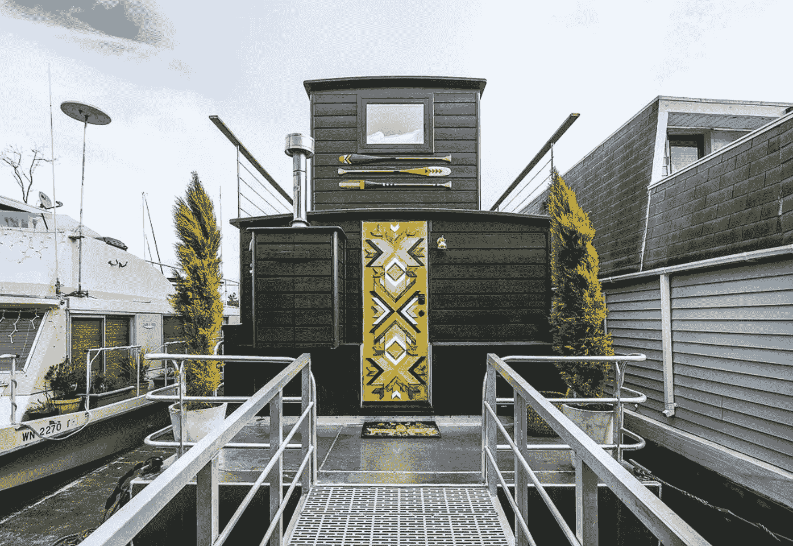
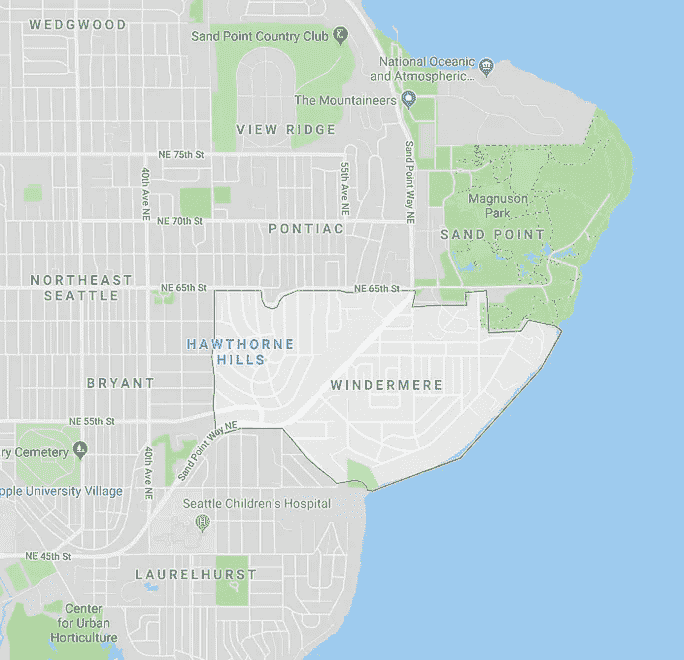
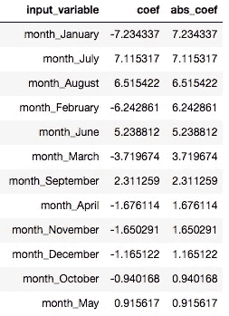

# 是什么影响了 Airbnb 上西雅图的房产预订价格？

> 原文：<https://towardsdatascience.com/what-influences-the-booking-price-of-properties-in-seattle-on-airbnb-32e274ffcfac?source=collection_archive---------38----------------------->

A view of Seattle Skyline with the snowy mountain in the backdrop

Airbnb，一个预订住宿房产的在线市场，发布了一个关于 [Kaggle](https://www.kaggle.com/airbnb/seattle/data) 的数据集。它包含 2016 年西雅图的房产列表数据及其可用性和预订价格。

带着好奇的心，我决定探索数据集。经过一番探索，我想通了这个数据集能回答什么样的问题。

在这里我分享一些我从中发现的感悟。

你可以查看我的[项目笔记本](https://nbviewer.jupyter.org/github/patelatharva/Analysis_of_Airbnb_property_listings_dataset/blob/master/analysis.ipynb)和 [Github](https://github.com/patelatharva/Analysis_of_Airbnb_property_listings_dataset) 库，看看我是如何得出这些见解的。

# 今年可供使用的房产数量趋势如何？

2016 年初，从 1 月到 3 月，西雅图 Airbnb 上首次提供的房产数量急剧增加。三月份之后，增长就不那么快了，尽管全年都在稳步增长。

Vacation rental in Seattle listed on Airbnb

# 过去一年，酒店入住率的趋势如何？

这有助于我们了解 2016 年西雅图上市酒店的预订比例。它可以被看作是通过 Airbnb 对所列房产的使用率。

入住率在 1 月和 3 月之间波动很大，因为在此期间有大量新物业首次推出。从 4 月到 7 月，入住率为 22-25%。7 月份是西雅图的夏季，所有列出的酒店的最高入住率都超过了 30%。7 月之后，入住率从 30%下降到年底的 23%。

A view of cozy kitchen and dining area from a property in Seattle

# 这一年有多少房产被占用？

入住的房产数量与 2016 年西雅图选择在 Airbnb 上预订房产的人数成正比。

1 月至 4 月期间，有 400 至 500 处房产被占用。从 4 月份开始，这个数字跃升至近 600。7 月份，又有一波上涨，700 多处房产被占用。入住率在 7 月后接近年底时逐渐下降，2016 年底有近 650 家酒店入住。

An aesthetic house boat property found in Seattle

# 2016 年房地产的平均价格趋势如何？

从 1 月到 7 月，预订价格总体稳步上升。7 月，平均预订价格超过 150 美元，并保持在 150 美元以上，直到 8 月底。从 9 月份开始，平均价格开始下降。临近年底圣诞节期间，价格略有上涨。

平均价格每月大致有 4 次上涨，你能猜到原因吗？让我们放大到七月。

Celebration of 4th July in Seattle [[Image Source](https://www.shutterstock.com/image-photo/4th-july-celebrations-fireworks-over-seattle-37019929)]

# 平均价格在七月的一周中是如何变化的？

周五和周六的价格往往高于其他时间。也许，这可以归因于更多的人选择在周末而不是工作日通过 Airbnb 上市的物业住宿。

## 2016 年西雅图有哪些类型的房产上市？

大多数房产都是公寓或房子类型。还有大量的公寓、联排别墅和阁楼。

A view of Seattle tower from apartment

回到我开始这篇文章时提出的问题。

# 影响房产预订价格的因素有哪些？

我们能根据它的位置、大小和便利设施预测房产的预订价格吗？

数据集具有包含属性列表属性的文件。它包含的属性包括位置、邻里关系、便利设施、大小、浴室和床位数量、物业类型等。我们的常识表明，这些属性在决定 Airbnb 上预订的房产价格时起着重要作用。

我创建了热图，以可视化的数字属性之间的关系，包括他们一年来的预订价格。列和行相交处的单元格中的数字表示数据集中两个属性之间的相关性。数字越接近 1，两个属性之间的相关性越高。

从这张热图中可以明显看出，预订价格与酒店可容纳的人数、卧室数量、床位和平方英尺大小等属性高度相关。正如预期的那样，酒店可以容纳的人数与卧室和床位的数量高度相关。

我在这个方向上做了进一步的研究，用岭回归技术训练了一个统计模型，看看这些属性是否可以用来猜测一个房产的价格。

按照训练机器学习模型的标准过程，我首先通过执行以下步骤来准备数据集。

1.  连接两个数据框，其中一个数据框包含一年中不同日期的列表价格，而另一个数据框包含该物业的属性，如位置、大小、设施等。这有助于我在估算预订房产的价格时考虑到星期几和月份。
2.  消除目标可变价格中缺少值的行
3.  将分类变量转换为每个分类级别都有二进制数值的列
4.  用列的平均值填充数字列的缺失值。我选择不填充分类变量的缺失值。
5.  从数据框中选择的列将作为输入变量 X 和目标变量 y。
6.  将 X 和 y 数据集分成训练数据集和测试数据集。
7.  在训练数据集上拟合岭回归模型。
8.  预测测试数据集中的房产价格。
9.  通过计算价格的测试值和预测值之间的 r 值来评估模型的性能，该值大约为 0.63。
10.  解释训练回归模型中每个输入变量的系数，以了解其对价格预测的影响。

以下是训练模型中系数绝对值最高的输入变量列表。它们可以被认为是一年中对预测酒店预订价格具有最大意义的酒店和时间的属性。与`input_variable`相关联的`coef`列中的正值和负值分别表示输入变量对房产预订价格的估计的正面和负面影响的量。

正如您所注意到的，对价格估计影响最大的前两个输入变量与房地产的类型有关。另一个重要的影响因素是房产的位置和邻近区域。根据这个统计模型，酒店中浴室的数量也是价格的一个重要影响因素。

让我们深入挖掘不同类型的输入变量的系数，以了解它们对估计价格的影响有多大。

## 财产类型对价格估算的影响

*   类型船的属性很可能有更高的预订价格。
*   宿舍，共用房间或帐篷类型的财产很可能有。更低的预订价格

Boat house barges, a unique type of properties found in Seattle

## 物业邻近对价格估计的影响

根据这些表格，包括东南木兰、温德米尔、西湖、派克市场和先锋广场在内的邻近地区列出的物业更有可能有高预订价格。然而，位于 Crown Hill 和 Laurelhurst 的酒店可能会有较低的预订价格。

Maps of Seattle highlighting Southeast Magnolia neighbourhood on the left and Windermere neighbourhood on the right

## 一年中月份对价格估计的影响

在六月、七月和八月；该资产可能具有较高的预订价格，而在一月和二月，该资产可能具有较低的预订价格。

**The** [**Washington State International Kite Festival**](https://www.thestranger.com/events/37178072/washington-state-international-kite-festival) **in Summer 2019**

## 星期几对价格估计的影响

该房产在周六和周五可能会有较高的价格，而在其他日子可能会有较低的价格。

Tourists enjoying during weekends near Seattle

## 便利设施对价格估算的影响

配有便利设施的物业，如门卫、游泳池、空调、有线电视、适合活动、热水浴缸、健身房等。很可能会有更高的预订价格。允许吸烟的酒店可能会有较低的预订价格。

A pool house property at Seattle

## 结论和见解

观察经过训练的模型的系数，可以得出几个结论，我在这里重申。

1.  类型船的属性很可能有更高的预订价格
2.  宿舍、共享房间或帐篷类型的酒店很可能有较低的预订价格
3.  准确的位置和物业所在的社区在决定其预订价格方面起着非常重要的作用。
4.  该物业的浴室和卧室数量与预订价格成正比。
5.  价格也与它能容纳的人数成正比。
6.  对预订价格有积极影响的便利设施包括门卫、游泳池、有线电视、热水浴缸、健身房和电梯。
7.  7 月和 8 月的预订价格往往较高，而 1 月和 2 月的预订价格往往较低。
8.  周五和周六的预订价格往往会比其他日子高。
9.  允许吸烟作为一种礼仪对价格有很大的负面影响。
10.  根据现有数据的训练模型，位于菲尼里奇西雅图市的房产不太可能有高价格。
11.  由于数据集中的所有属性都位于西雅图，因此市场和辖区等属性在确定价格时不起任何作用，因为它们不会在输入数据中添加任何差异。但是，在对包含美国多个城市的列表的数据集训练相同的统计模型时，他们可能会成为重要的影响者

我希望你觉得这篇文章很有见地。你可以查看我的[项目笔记本](https://nbviewer.jupyter.org/github/patelatharva/Analysis_of_Airbnb_property_listings_dataset/blob/master/analysis.ipynb)和 [Github](https://github.com/patelatharva/Analysis_of_Airbnb_property_listings_dataset) 库，看看我是如何得出这些见解的。