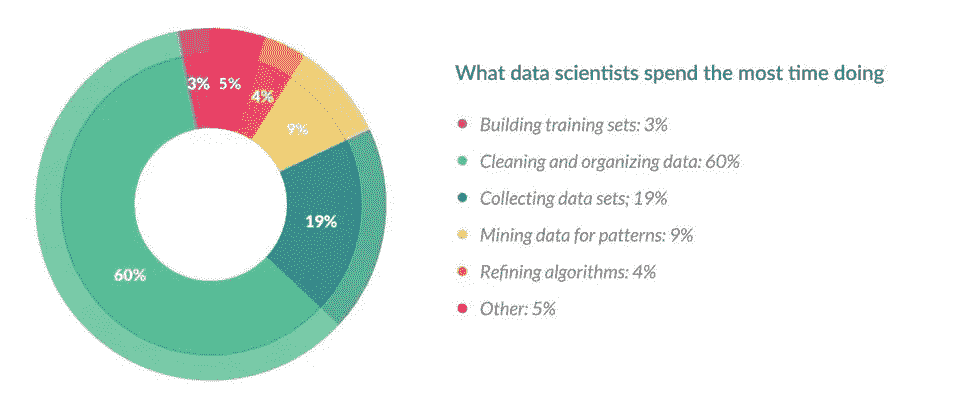

# 什么是数据工程师？

> 原文：<https://towardsdatascience.com/what-is-a-data-engineer-8084680048?source=collection_archive---------15----------------------->

## 线索:我们是数据科学推动者！

Photo by [Franck V.](https://unsplash.com/@franckinjapan?utm_source=medium&utm_medium=referral) on [Unsplash](https://unsplash.com?utm_source=medium&utm_medium=referral)

数据工程师这个职位并不总是和数据科学家这样的职位有着相同的性感内涵。然而，外表并不代表一切，数据工程师的工作实际上构成了数据科学家工作的重要部分。

可以理解的是，像机器学习和人工智能这样的话题总是会赢得流行度竞赛，特别是当它们在主流媒体上越来越受欢迎的时候。然而，这些概念背后的大部分工作源于数据工程工作。

这不是一篇关于数据工程师与数据科学家之战的文章，这里没有牛肉。相反，这篇文章来自于我最近看到的关于这一点的文章海洋:数据科学家 80%的工作是数据准备和清理。

因此，我将谈谈为什么我认为数据工程是一个重要的领域，这是基于它能够实现什么，以及它如何与数据科学一起为行业中的最新技术提供支柱。

## 人工智能和机器学习模型需要数据

与任何一位数据科学家交谈，他们都会告诉你，获取数据，尤其是拥有他们的模型所需的一切的数据源，是一个遥远的梦想。

在现实世界中，如此有用的数据集非常罕见，这也是数据工程师的第一项技能发挥作用的地方。我们花费大量时间从一系列来源中提取数据集，大部分时间都集中到一个中心来一起使用。

Image Source: [https://i.redd.it/2c2megoon2411.jpg](https://i.redd.it/2c2megoon2411.jpg)

现在任何人都可以从网站上下载静态数据集。数据工程师的好处就是:工程。他们不仅可以从不同的来源为你提供大量的数据，而且可以以一种可重复的方式，频繁地更新，如果需要的话，甚至可以实时更新。

## 干净的数据=更好的模型

构建 AI 或 ML 模型所需的所有数据现在都频繁地进入你的中央数据中心(如果你想了解更多细节，我最近写了一篇关于如何构建完美数据仓库的文章**)。**

**让你的人工智能和人工智能模型起飞前的下一步是准备数据。这就是我这篇文章的来源。我看到的关于这一点的文章数量，甚至是 2016 年《福布斯》的一项[调查](https://www.forbes.com/sites/gilpress/2016/03/23/data-preparation-most-time-consuming-least-enjoyable-data-science-task-survey-says/)，简直是疯了。**

****

**[Image Source: Forbes](https://www.forbes.com/sites/gilpress/2016/03/23/data-preparation-most-time-consuming-least-enjoyable-data-science-task-survey-says/)**

**福布斯调查表明，80%的数据科学工作是数据准备，75%的数据科学家认为这是工作中最无聊的部分。**

**👋你猜怎么着，这也是数据工程师蓬勃发展的地方。我们花了太多时间处理数据，以至于很多工作已经成为我们的第二天性。无论是将数据集连接在一起，清除空值和错误值，将字符串处理成特征，还是聚合数据，我们都能为您提供帮助。**

**作为免费赠品，所有这些都将以可重复的方式构建，因此随着数据的更新，它也会被清理，从而提供一个一致的新鲜、干净的数据源。**

**作为二对一，您还可以获得额外的好处，解放您的数据科学家，让他们从模型中挤出每一寸空间，并保持更高的士气，因为他们工作中最无聊的部分现在已经消失了。**

## **最后建立一个模型**

**我们终于到了，在模型的所有前期工作终于可以开始之后，你可能会认为这是数据工程师消失在深渊中的地方。**

**然而，任何构建过人工智能和人工智能模型的人都会知道，生活并没有那么简单。在构建模型的过程中，随着更多问题的提出和答案所需的额外数据的增加，上述问题将会多次重复。**

**这是数据科学家真正闪光的地方，让他们在这里做他们的事情是多么重要，我怎么强调都不为过。到目前为止，我所谈论的一切并不是我想说数据工程师更好或更有价值，而是要展示他们如何能够为数据科学家提供更高效的工作流，以深入了解本质。**

## **一个模型只有在有人要用的时候才是有用的**

**模型的第一次迭代工作已经完成。我们可以打包回家，对吗？正如你们大多数人已经知道的，事实并非如此。模型可能会建立起来，但需要考虑的事情很少:它将如何在现实世界中使用，以及它多久会变得陈旧。**

**人工智能或 ML 模型的目的是解决现实世界中的问题，所以现在需要应用它。通常这意味着在应用程序中实现，或者用于细分或预测营销。**

****

**[Image Source](https://cdn-images-1.medium.com/max/1600/1*jBjJw7jq71pw4iZkqyp2Uw.jpeg)**

**数据工程师将能够将模型添加到数据管道中，该数据管道根据模型处理您的整个用户群，并相应地对他们进行细分。他们可以利用这一点来触发自动通信或将细分发布到数据层，以便在您的网站上启用细分目标内容。**

**如果你担心这个模型会在几个月后变得陈旧，不要担心。一个好的数据工程师将能够与数据科学家一起工作，并将他们的工作转化为可以不断更新的东西。输入新数据，重建模型并自动发布。**

## **那么我在暗示什么呢？**

**无论你是在考虑聘请一名数据工程师，还是想进入数据领域，但不知道从哪里开始，数据工程显然是一个需要考虑的重要领域。**

**您可以看到构建一个数据模型并使其生效背后有多少工作可以由数据工程师来完成。**

**获得的效率意味着建立模型的速度会更快，模型无疑会更好，因为数据科学家有更多的时间来调整和改进它们。**

**寻找更多伟大的数据工程内容？然后 [**注册我的简讯**](http://eepurl.com/b8r2XH) 学习现实世界的数据工程技术，并接收个人策划的内容。我还经常在时事通讯中刊登订阅者的文章，以**增加你的影响力**。**