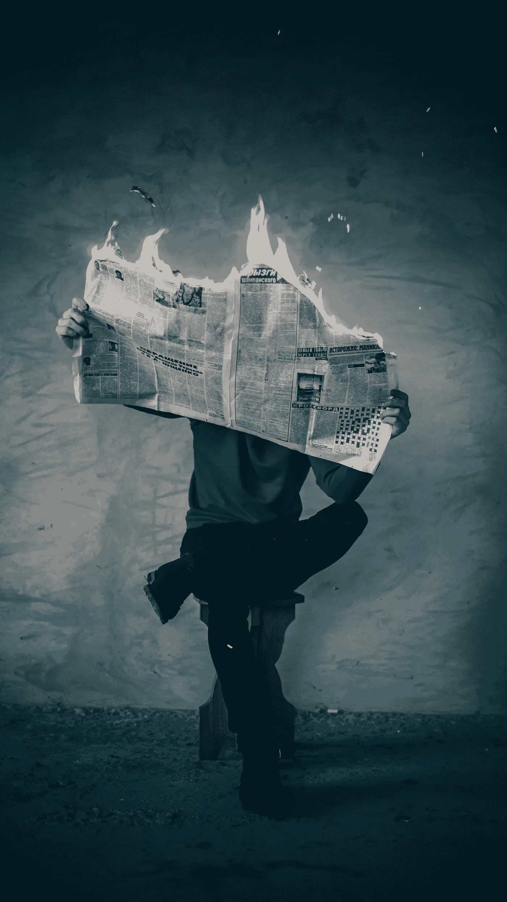
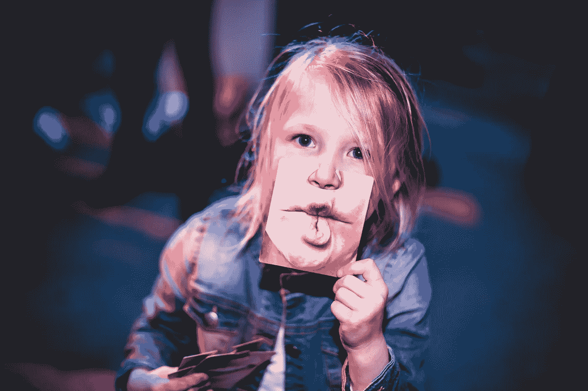
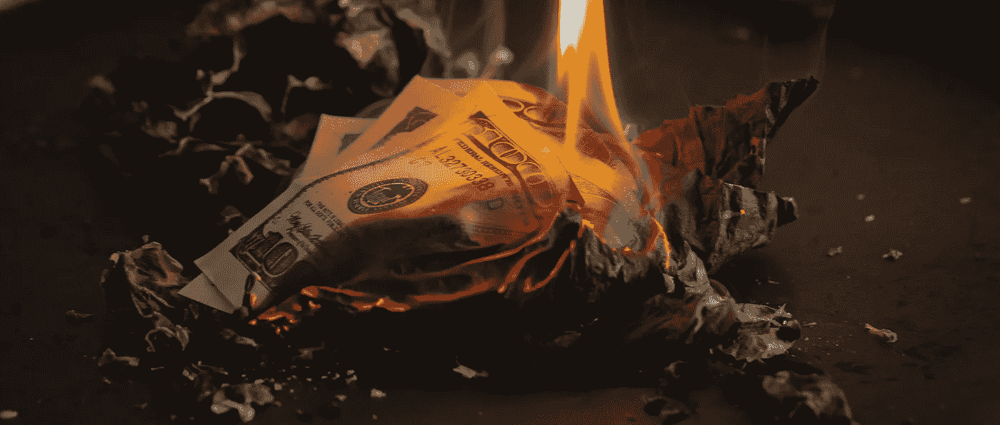
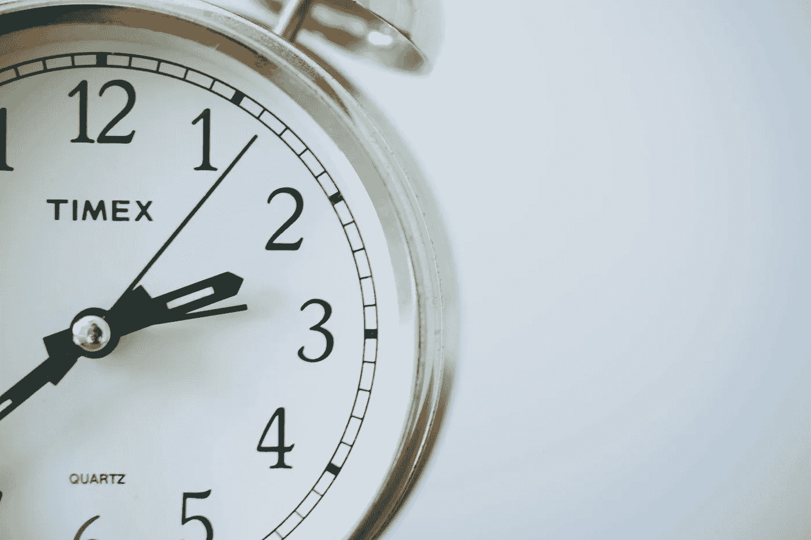

# 什么是 Deepfake，为什么要关注它？

> 原文：<https://towardsdatascience.com/what-is-a-deepfake-and-why-should-you-care-763f667321d0?source=collection_archive---------23----------------------->

## Deepfakes 篡改我们的眼睛、耳朵和真实感。我们准备好阻止它摧毁我们对真理的观念了吗？

Photo by [Elijah O’Donnell](https://unsplash.com/@elijahsad?utm_source=unsplash&utm_medium=referral&utm_content=creditCopyText) on [Unsplash](https://unsplash.com/search/photos/fake?utm_source=unsplash&utm_medium=referral&utm_content=creditCopyText)

deepfake 是一种使用人工智能和机器学习技术篡改的图像、视频或音频。尽管 deepfakes 被用于偶尔的搞笑模因，但在错误的人手中，它可能会导致公共危机和金融危机。

# 第一:deepfakes 是如何产生的？

Deepfakes 是生成式对抗网络(GAN)和无监督机器学习的结果。获得初始数据后，计算机会使用生成器和鉴别器进行自我学习。

发生器生成初始的假图像、音频或视频，并将其发送给鉴别器进行检查。如果它确定图像是假的，生成器根据鉴别器的反馈修改文件。然后，使用提供的数据，生成器再次修改文件，并将其发送回鉴别器进行评估。这种情况会持续下去，直到它骗过鉴别者，让他们认为假文件是真的。

然而，这个过程可能会有问题。如果鉴别器很弱，它可能会过早地将假图像标记为“真实”图像，从而产生不合格的深度假图像。这被称为“肤浅的假动作”，在媒体上经常使用。

Photo by [Christian Gertenbach](https://unsplash.com/@kc_gertenbach?utm_source=unsplash&utm_medium=referral&utm_content=creditCopyText) on [Unsplash](https://unsplash.com/search/photos/fake?utm_source=unsplash&utm_medium=referral&utm_content=creditCopyText)

# 什么是浅薄的假货？

浅假不如深假有说服力。因为它缺乏同样深度的真实感，所以用你的感官来检测一个肤浅的赝品要容易得多。

一个肤浅的假图像的例子是一个拙劣的 PS 面部交换。或者视频中的浮动剪切头。或者是一个伪装成人类的机器人声音(就像 robocalls cams 中经常使用的那些)。

浅层假货可能比深层假货更容易被发现，但这并不会降低它们的危害性。

CNN 记者吉姆·阿科斯塔(Jim Acosta)是一个流行的浅薄的假视频的受害者。在视频中，有人看到阿科斯塔“攻击”一名白宫实习生。但在真正的无导演版本中，阿科斯塔没有这样做——是实习生试图从阿科斯塔手中夺走麦克风。

尽管不被认可，这个肤浅的赝品仍然产生了影响。阿科斯塔的粉丝仍然支持他，但任何不喜欢他的人都更可能相信他有能力攻击无辜的人——即使他一开始就没有。盲目相信一个来源，不管是真是假，都是一个确认偏差的问题。这也是浅层假货和深层假货迅速传播的主要原因之一。

# 确认偏差如何确认 deepfakes 的有效性

虽然用我们的眼睛和耳朵很难发现 deepfake，但这不是 deepfakes 的主要问题。

一项涉及 3000 多名成年人的新研究揭示了我们如何感知数据的主要问题。在向参与者展示了带有虚假文本的虚假图像后，结果显示确认偏差影响了他们(以及我们作为人)对深度虚假的看法。

这意味着，如果它强化了我们的信念，我们更有可能分享信息(比如 deepfakes)，而不管来源的有效性。它会迅速传播开来，对公众舆论产生影响(就像 Acosta 事件一样),或者对公司造成财务损失。

Photo by [Jp Valery](https://unsplash.com/@jpvalery?utm_source=unsplash&utm_medium=referral&utm_content=creditCopyText) on [Unsplash](https://unsplash.com/search/photos/burning-money?utm_source=unsplash&utm_medium=referral&utm_content=creditCopyText)

# deepfakes 是如何影响公众的

网络安全公司赛门铁克称，三家公司已经陷入了[深度假音频骗局](https://www.fastcompany.com/90379001/criminals-are-using-deepfakes-to-impersonate-ceos)。在骗局中，攻击者通过使用 deepfake 音频伪装成 CEO。然后，作为首席执行官的“代言人”，他们给高级财务官打电话，要求紧急转账。

数百万美元就这样没了。

Deepfakes 不仅用于经济利益，也用于报复。这款名为 deepnude 的应用程序将女性的衣服与人工开发的裸体身体互换。未经女方同意创作和传播这些图像被称为报复色情。它已经促使新的立法反对[数字篡改图像和视频](https://www.bbc.com/news/technology-48839758)。

前提是你能识别出一个深度假货，这对于我们的眼睛和耳朵来说是非常困难的。那么我们怎么才能找到他们呢？使用制造 deepfakes 所需的相同类型的算法。

# 如何检测 deepfakes

新算法可以检测 deepfakes，但不幸的是，这不是一个快速的过程。

[一个成功的检测算法的一个方面](https://spectrum.ieee.org/tech-talk/computing/software/a-twotrack-algorithm-to-detect-deepfake-images)涉及到一个像素一个像素地研究 deepfake 图像。为了做到这一点，递归神经网络必须研究数以千计的真实和深度伪造图像，以解读其中的差异。

其中一个区别是深度伪造图像的平滑边缘。当插入新图像时，它会使边缘变得不清晰。计算机会使边缘变得稍微平滑一点，但太多了，无法补偿。因此，这种不自然的平滑可以显示图像是一个深度赝品，而不是伪装它。

这种算法可能适用于视频，但现在，它并不完全符合标准。它需要逐帧分析视频，并检查每一帧的像素。当算法完成并确定这是一个深度假视频时，损害可能已经造成了。

Photo by [Sonja Langford](https://unsplash.com/@sonjalangford?utm_source=unsplash&utm_medium=referral&utm_content=creditCopyText) on [Unsplash](https://unsplash.com/search/photos/clock?utm_source=unsplash&utm_medium=referral&utm_content=creditCopyText)

# 时间在流逝…

技术每天都在进步，deepfakes 也不例外。每天坏演员都在学习新的方法来创造高度逼真的深度赝品。我们目前的检测算法可能会在一天内过时。

*Kiesha Frue 是一名* [*专业文案、编辑、*](https://twitter.com/kieshafrue) *校对。她沉迷于文字、澄清信息和法国香草卡布奇诺(最后一点可能没那么重要。除非那是你的事！).*