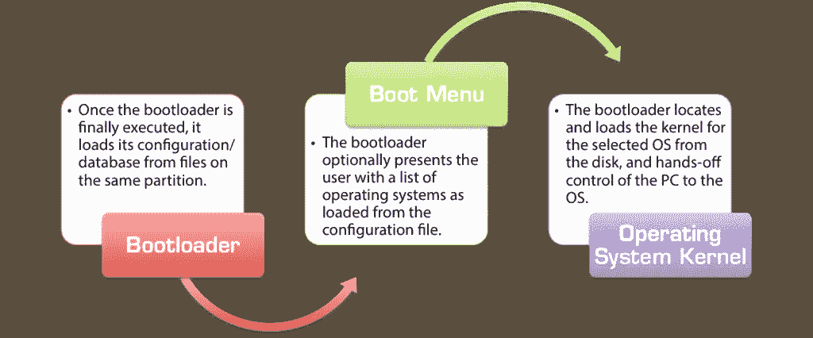
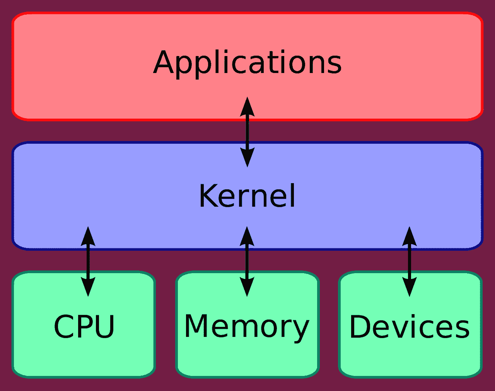
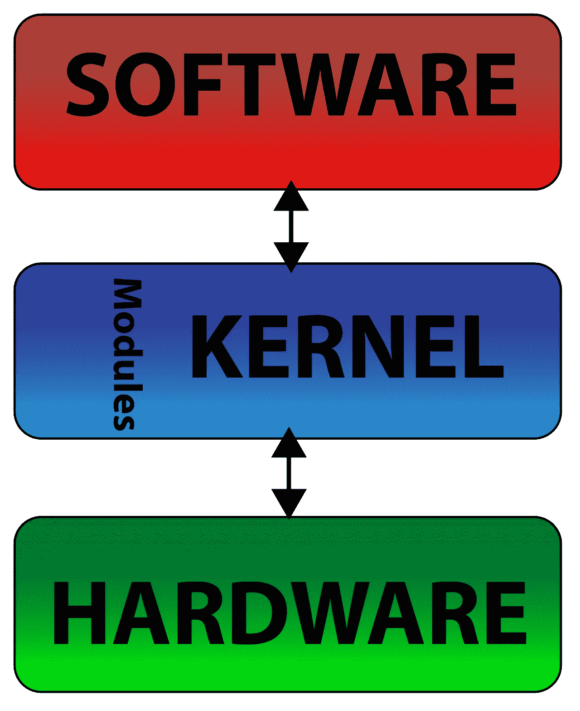
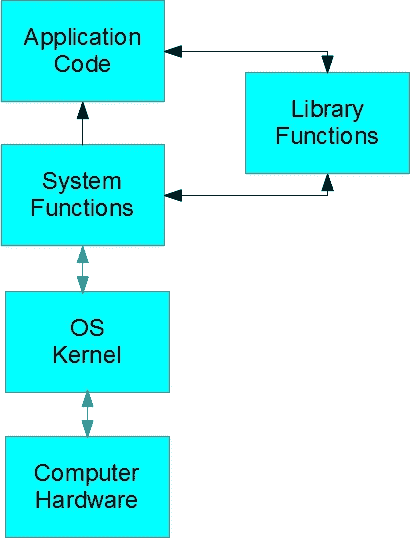
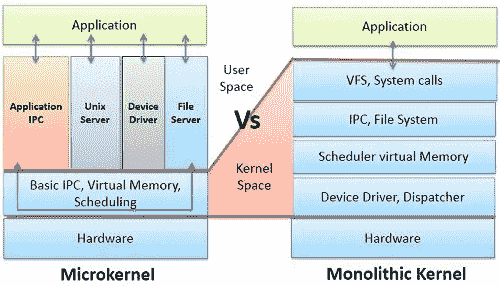

# 内核是什么？

> 原文：<https://towardsdatascience.com/what-is-a-kernel-7c532d5d3e56?source=collection_archive---------12----------------------->

## 探索整体内核与微内核之间的差异或细微差别

在字典中，果仁是坚果、种子或果核中较软的、通常可食用的部分，包含在外壳中，如“核桃仁”。它也可以是某事的中心或最重要的部分“这是争论的核心”。

内核是一个计算机程序，是计算机操作系统的核心，完全控制系统中的一切。

内核通常是在 ***引导加载程序*** 之前启动时加载的第一批程序之一。

*“引导加载程序是一种加载并启动操作系统或计算机系统的引导时间任务和进程的程序。它能够在计算机启动或引导时将操作系统加载到计算机内存中。引导加载程序也称为引导管理器或引导加载程序。【*[*1*](https://www.techopedia.com/definition/3324/boot-loader)*】*

你可能听过“启动”一个系统的说法。引导装载程序为中央处理器翻译数据处理指令。引导加载程序处理内存和外围设备，如键盘、显示器和扬声器。

The boot system for all standard computers and operating systems — image by [Neosmart](https://neosmart.net/wiki/mbr-boot-process/) retrieved the 27th of September.

我隐约感觉到内核作为计算机系统操作的一部分很重要，但是我不确定它是如何操作的。因此，我找到了更多关于 Linux 内核的信息。

Demystifying the Linux Kernel from [Digilent blog](https://blog.digilentinc.com/demystifiying-the-linux-kernel/) retrieved the 27th of September.

*“…内核是应用程序、CPU、内存和设备之间的屏障。从视频游戏到互联网，应用程序是人们一直在使用的东西*

Linux 内核是一个免费的、开源的、单片的、类似 Unix 的操作系统内核。这可以这样表示。

当然可能简化的优点如下。

*   因为涉及的软件较少，所以速度更快。
*   因为它是一个单一的软件，所以它的源代码和编译形式都应该更小。
*   更少的代码通常意味着更少的错误，这可以转化为更少的安全问题。

所有操作系统服务都与主内核线程一起运行，因此也驻留在同一个内存区域。

单片内核的主要缺点是:

*   系统组件之间的依赖关系— *设备驱动程序中的错误可能会导致整个系统崩溃*
*   大型内核可能变得非常难以维护。

单片内核中的大多数工作都是通过系统调用来完成的。

****系统调用*** *是程序与操作系统交互的一种方式。当计算机程序向操作系统的内核发出请求时，它就发出了一个系统调用。系统调用通过应用程序接口(API)向用户程序提供操作系统的服务。**

*在一篇关于[极客素材](https://www.thegeekstuff.com/2012/07/system-calls-library-functions/)的文章中，计算机硬件、OS 内核、系统功能、应用程序代码和库函数之间的交互:*

**

*在计算机科学中，**库**是计算机程序使用的非易失性资源的集合，通常用于软件开发。*

*什么是应用程序代码和库代码。更重要的是，两者之间有什么区别？根据对编码的热情，这些可以定义为:*

***库代码**意味着在不同的环境下，可以在不同的应用程序中重用——无需修改代码即可扩展和适应。*

***应用代码**在一个环境中使用，可以改变其行为。作为区别的一个例子，我将实现一个示例日志记录机制。一个编写为应用程序代码，一个编写为库代码。*

*因此，微内核和单片内核的区别在于系统调用以及**‘内核空间’**。*

**

*Image retrieved from Tech Difference on the 28th of September. A more detailed explanation can be found at [https://techdifferences.com/difference-between-microkernel-and-monolithic-kernel.html](https://techdifferences.com/difference-between-microkernel-and-monolithic-kernel.html)*

*主要区别如下:*

1.  **微内核和单片内核的基本区别在于，微内核在不同的地址空间实现用户服务和内核服务，单片内核在同一地址空间实现用户服务和内核服务。**
2.  *微内核的大小很小，因为只有内核服务驻留在内核地址空间中。然而，由于内核服务和用户服务驻留在同一个地址空间中，所以单片内核的大小相对比微内核要大。*
3.  *由于应用程序和硬件之间的通信是使用系统调用建立的，因此单片内核的执行速度更快。另一方面，由于应用程序和系统硬件之间的通信是通过消息传递建立的，所以微内核的执行是缓慢的。*
4.  *由于新的服务将被添加到与内核空间隔离的用户地址空间中，所以微内核的扩展很容易，因此不需要修改内核。与单片内核的情况相反，如果要在单片内核中添加新服务，则需要修改整个内核。*
5.  *微内核比单片内核更安全，就好像微内核中的服务出现故障时，操作系统不受影响。另一方面，如果一个服务在单内核中失败，整个系统都会失败。*
6.  **单片内核设计需要更少的代码，这进一步导致更少的错误。另一方面，微内核设计需要更多的代码，这进一步导致更多的错误。**

*这可能导致一个粗略的概括。*

*微内核更慢更安全。*

*单片内核速度更快，安全性更低。*

*然而，这并不简单。举例来说，macOS 内核结合了微内核(Mach)和单片内核(BSD)的特性，而 Linux 只是一个单片内核[2]。单片内核负责管理 CPU、内存、进程间通信、设备驱动程序、文件系统和系统服务器调用。*

*话说回来，**内核空间**是什么？*

*在 Linux 系统中，系统内存可以分为两个不同的区域:内核空间和用户空间。内核空间是内核(即操作系统的核心)*执行*(即运行)并提供其*服务*的地方[3]*

*你可能已经听过人们谈论这与机器学习的关系。在机器学习中，核方法是一类用于模式分析的算法。这就是我们谈论关系研究的地方，然而我们将在另一个时间回到这一点。*

## ***参考文献:***

1.  *[https://www.techopedia.com/definition/3324/boot-loader](https://www.techopedia.com/definition/3324/boot-loader)*
2.  *[https://itsfoss.com/mac-linux-difference/](https://itsfoss.com/mac-linux-difference/)*
3.  *[http://www.linfo.org/kernel_space.html](http://www.linfo.org/kernel_space.html)*

*这是第 500 天的第 116 天。我目前第 101-200 天的重点主要是编程。如果你喜欢这篇文章，请给我一个答复，因为我确实想提高我的写作或发现新的研究，公司和项目。*