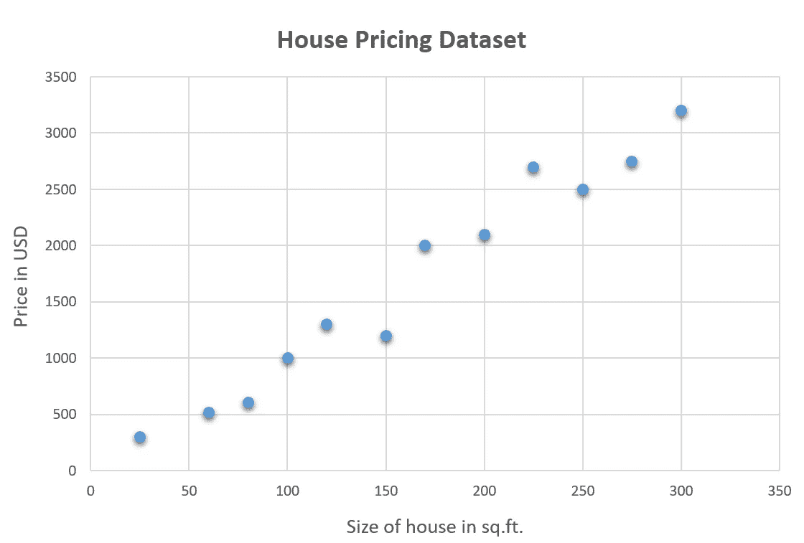
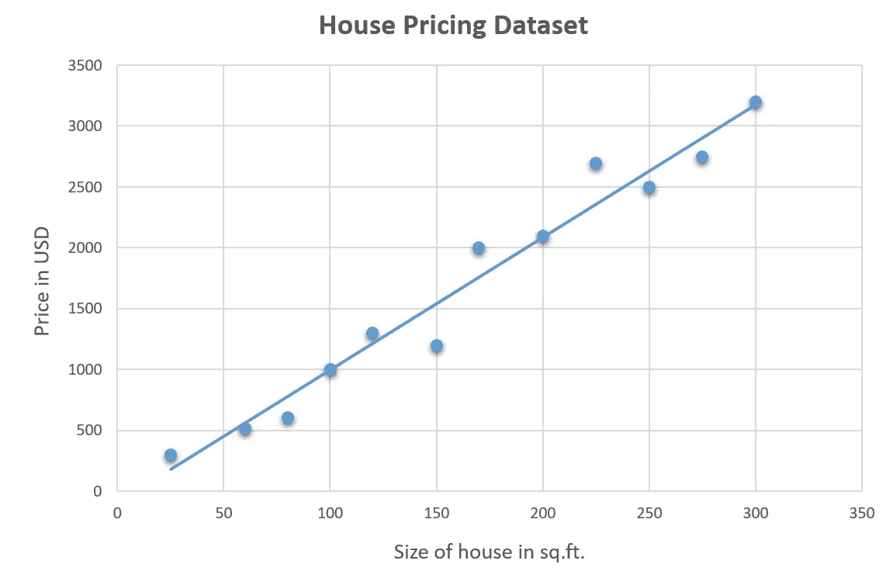
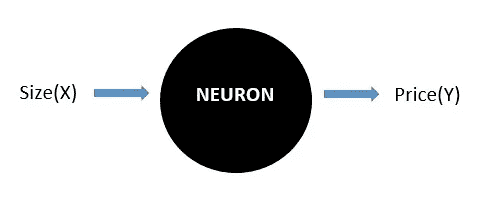
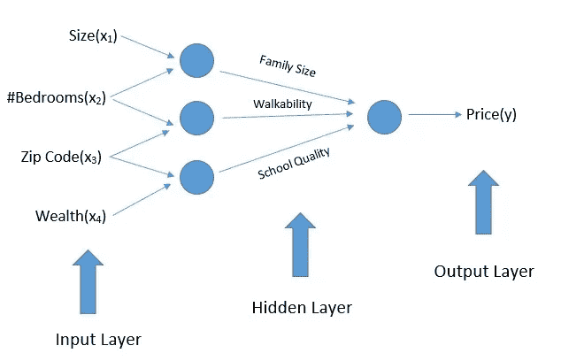
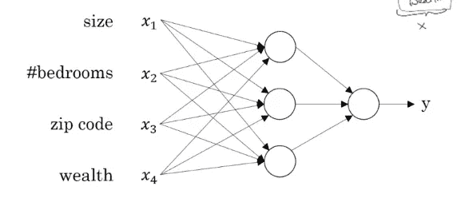
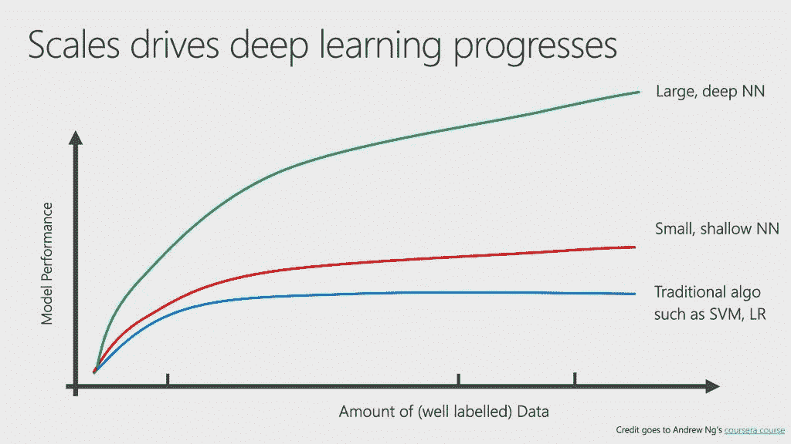

# 什么是神经网络？

> 原文：<https://towardsdatascience.com/what-is-a-neural-network-a02b3c2fe3fa?source=collection_archive---------36----------------------->

## 神经网络的基本概念

神经网络是一组算法，大致模仿人脑，用于识别模式。他们通过一种机器感知、标记或聚类原始输入来解释感官数据。它们识别的模式是数字的，包含在向量中，所有现实世界的数据，无论是图像、声音、文本还是时间序列，都必须转换成向量。

先说房价预测例子。

假设我们有一些房子及其价格的数据集。我们想拟合一个函数来预测房价。

这里，房子的大小是输入数据( *x* ) &价格是输出( *y* )。

所以， *y = f(x)* 表示房价( *y* )是房子大小( *x* )的函数。

如果我们绘制价格和大小的数据，我们会得到这样一个图表-

Fig-1: Housing Price Dataset

现在，让我们使用图表中的这些数据画一条直线，以直观显示数据的趋势。看起来像这样-

Fig-2: Housing Price Dataset with trendline

这条直线代表了与面积相关的房价趋势。如果房子的大小已知，我们可以通过把大小画到那条直线上来求出它的价格。

现在，为了获得完美代表数据集的完美直线，我们使用由神经网络中的神经元计算的[线性回归](https://www.deep-learners.com/machine-learning)。

## 什么是神经网络中的神经元？

我们前面说过，房子的大小是输入数据( *x* 数据&价格是输出数据( *y* )。

我们上面所做的是，我们给出了一些关于房屋大小的价格示例，在这些数据的帮助下，我们可以预测上面示例中没有列出的任何大小的任何房屋的价格。

这里神经元开始发挥作用。我们将输入数据( *x* )提供给神经元，并从中获得输出( *y* )。

Fig-3: Neuron in a Neural Network

这是最简单的神经网络例子。

让它变得稍微复杂一点，让我们假设房子的价格也取决于其他因素。比如家庭规模、卧室数量、步行能力、邮政编码、学校质量和财富。

所有这些因素都是相互关联的，就像-

*   从一个地方到另一个地方的“可步行性”取决于这个地方的地址(邮政编码)。
*   “学校质量”也取决于地址。像好的知名学校更有可能在富人区和城市地区。

因此，我们将这些因素中的一部分放入输入层，另一部分放入隐藏层。

因此，总体而言，现在的“房价”取决于所有这些因素。

在上图中，

*   由“大小”、“卧室数量”、“邮政编码”、“财富”创建的层被称为这个神经网络的**输入层。**
*   由“家庭规模”、“可步行性”、“学校质量”创建的层被称为神经网络的**隐藏层。**
*   “价格”是神经网络的**输出。**

因此，我们实现了以下内容:

Fig-4: Neural Network Representation

因此，举例来说，不是说第一个节点代表“家庭规模”，它只取决于特征“x1”和“x2”，我们会说，“好吧，神经网络，你决定你想知道什么，我们会给你所有的四个特征来完成你想要的”。

每个输入特征都与这些圆(神经元)中的每一个相连，神经网络的显著之处在于，给定足够多的带有“x”和“y”的训练示例，神经网络非常善于计算出从“x”到“y”的精确映射函数。

## 深度学习为什么会腾飞？

深度学习优于传统机器学习算法的原因有很多。

从上图中，我们可以看到，

*   对于传统的学习算法来说，随着数据量的增加，性能在某一点后会饱和。因此，从机器学习模型中获得的最高性能不可能那么高。
*   但是对于神经网络来说，随着我们不断增加数据量，性能也会变得更好。因此，为了利用深度学习实现最佳性能，我们需要向神经网络提供大量数据。

这就是深度学习的闪光点。当涉及到大量数据的培育时，它可以比传统的机器学习算法表现得更好。