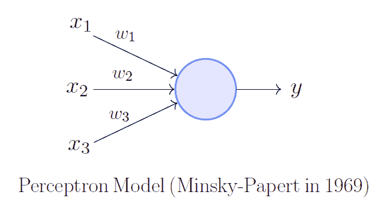

# 什么是感知器？

> 原文：<https://towardsdatascience.com/what-is-a-perceptron-210a50190c3b?source=collection_archive---------10----------------------->

神经网络是一个由感知器组成的互联系统，所以可以说感知器是任何神经网络的基础。感知器可以被视为神经网络中单层的构建模块，由四个不同部分组成:

1.  输入值或一个输入图层
2.  权重和偏差
3.  净和
4.  激活功能

一个由感知器组成的神经网络，可以被感知为由非常简单的逻辑语句(感知器)组成的复杂逻辑语句(神经网络)；“和”和“或”的陈述。一个陈述只能为真或为假，但不能同时为真或为假。感知器的目标是从输入中确定它正在识别的特征是否是真的，换句话说，输出是 0 还是 1。复杂语句仍然是语句，其输出只能是 0 或 1。

遵循感知器如何工作的图并不十分困难:对加权输入(来自前一层的每个输入乘以它们的权重的乘积)求和，并加上偏差(隐藏在圆圈中的值)，将产生加权净和。输入可以来自输入层或前一层的感知器。然后，加权的净和被应用于激活函数，该激活函数然后标准化该值，产生 0 或 1 的输出。由感知器做出的这个决定然后被传递到下一层，供下一个感知器在他们的决定中使用。

这些部分一起构成了神经网络层中的单个感知器。这些感知器一起工作，通过传递它看到的特征是存在(1)还是不存在(0)，成功地对输入进行分类或预测。感知器本质上是信使，传递与分类相关的特征与分类所具有的特征总数的比率。例如，如果这些特征中有 90%存在，那么输入可能就是分类，而不是只有 20%分类特征的另一个输入。就像海伦·凯勒曾经说过的，“独自一人，我们能做的很少；我们一起可以做很多事情。”这对周围的感知机来说都是如此。