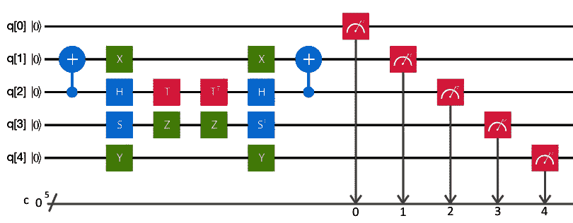
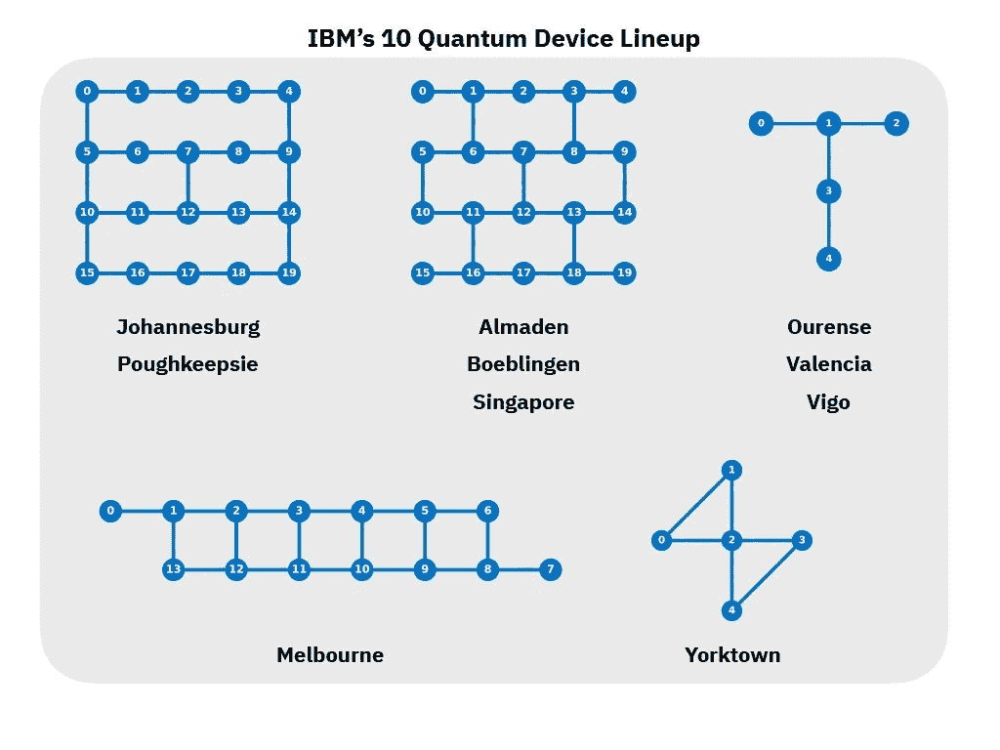

# 什么是…量子电路传输器？

> 原文：<https://towardsdatascience.com/what-is-a-quantum-circuit-transpiler-ba9a7853e6f9?source=collection_archive---------15----------------------->

## [奇点研究](https://towardsdatascience.com/tagged/the-singularity-research)

## 优化量子电路

## 量子电路和门

量子电路是程序在量子计算机上表达的方式。简而言之，量子电路是在量子位上执行的一系列矩阵运算，量子位是位的量子版本。量子电路将一些量子位作为输入，对它们进行矩阵运算，然后作为输出，我们进行测量并得到某些状态向量。一个*门*只是对一个或多个量子位进行矩阵运算的另一个术语。

## 减少门数

为什么要减少门数？目前，量子计算硬件通常被约翰·普雷斯基尔等专家认为是“[噪声中等规模量子](https://www.cornell.edu/video/john-preskill-quantum-computing-nisq-era-beyond)硬件，或“NISQ”级硬件。保持量子硬件隔离和足够冷以消除来自环境的干扰是极其困难的。目前用于量子计算的大多数硬件都必须隔离在一个接近零开尔文(即 F 或 C)的大型超冷却室中……这太冷了！如果不明显的话，保持如此寒冷的东西，比外层空间的平均温度更冷，是极其困难的，但为了防止任何类型的热量(或其他形式的光)与量子计算机芯片相互作用，这也是必要的。

所有这些和门数有什么关系？嗯，保持量子计算机的硬件足够冷是保持其稳定和防止所谓的*退相干*的一部分。如果光(例如热)与芯片相互作用，就会导致计算错误，并扰乱极其脆弱的量子位。程序运行的时间越长，也就是说，应用于量子电路的门越多，量子位的退相干和环境干扰的机会就越大。因此，减少电路中的门的数量意味着缩短程序的运行时间，这意味着在运行代码时由于故障门或环境干扰导致的去相干和错误的机会更低。

因此，减少门数是研究人员目前的一个巨大焦点。如果我们能减少量子计算机上运行的程序的门数和运行时间，我们就能得到更精确、更高效的算法。

## 运输工人

Transpilers，或[源到源编译器](https://en.wikipedia.org/wiki/Source-to-source_compiler)是一个古老的概念，应用于经典计算和量子计算。它们本质上是采用一个版本的代码，以某种方式优化它，也许是通过缩短代码，减少运行代码所需的内存量，或者减少代码的运行时间，新优化的代码是 transpiler 的输出。transpiler 输出的新代码执行相同的任务，并且是等价的，但是在某些方面比原始代码更有效。

量子传输器仍处于起步阶段。它们对于提高 NISQ 类硬件的性能至关重要，因为它们通过减少门数来减少运行时间，正如我们已经知道的，减少门数和运行时间可以减少量子计算机上的计算错误。

## 基本门和硬件

transpilers 的另一个用途是构建与硬件无关的程序和软件。与大多数笔记本电脑和个人电脑不同，你运行的硬件是一个普通的程序！对于经典计算机来说，这在一定程度上是正确的，但与量子计算机不同。我们实际上可以在特定硬件设置上执行的门操作受到硬件架构和量子位连接拓扑的限制。每个量子位只能与其他几个量子位相互作用，有些门操作根本无法在任何给定的硬件上执行。所有硬件都是如此。当我们为量子计算机编写代码时，有一个执行一组等价的门操作而不引起错误的 transpiler 是必要的。由于已经提到的涉及导致退相干的门误差和环境干扰的原因，具有以最少的方式有效地实现这一点的传输器是非常有用的。

## 量子复杂性和 QMA 难题

优化一个量子电路有多难？嗯，那要看情况，但是有一些解决方案看起来非常有效。如果我们只想要*近乎完美的*优化，机器学习是寻找最优线路的一种非常有效的方式。量子电路学习如何优化自己的一个例子可以在论文[量子电路结构学习](https://arxiv.org/abs/1905.09692)中找到。量子机器学习软件 Penny Lane 有一个这个模型的[实现，以及一个为好奇者编写的很好的教程](https://pennylane.ai/qml/app/tutorial_rotoselect.html)。该实现最小化了 [*变分量子本征解算器*](https://grove-docs.readthedocs.io/en/latest/vqe.html) *(VQE)问题的哈密顿量，并改进了初始电路结构。*

如果我们想要尽善尽美，这是一个[*【QMA】*](https://en.wikipedia.org/wiki/QMA)*的难题。这就是著名的* [*P vs 克莱数学学院*](https://www.claymath.org/millennium-problems/p-vs-np-problem)*NP 千年奖问题的 NP-Hard 问题的量子等价。*

## 自动定理证明

*LEAN，*一款由微软开发的[自动化定理证明软件，得到了数字理论家](https://leanprover.github.io/theorem_proving_in_lean/)[凯文·巴扎德](https://www.microsoft.com/en-us/research/video/the-future-of-mathematics/)诙谐幽默的大力支持，可能*会证明*(抱歉，我忍不住了)是优化量子电路和为量子计算构建高性能编译器和传输器的重要下一步。

如果你有想法要分享，有问题，或者你需要量子机器学习的咨询服务，请通过 [LinkedIn](http://linkedin.com/in/amelie-schreiber-694481181) 联系作者，访问奇点[网站](https://thesingularityrese.wixsite.com/singularity/hacking-the-universe)，或者查看 Github [教程](https://github.com/The-Singularity-Research)。