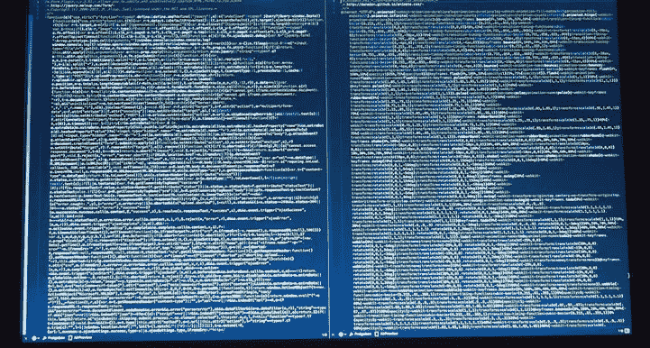
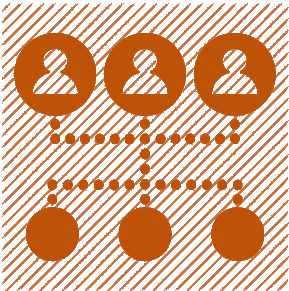
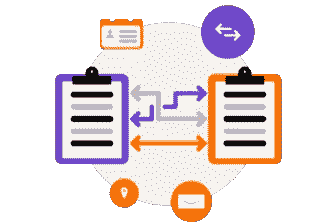

# 主数据管理中实际发生了什么？

> 原文：<https://towardsdatascience.com/what-is-actually-happen-inside-your-master-data-management-369222a14e43?source=collection_archive---------29----------------------->

让我们来看看通往“单一版本的真理”的简单而复杂的过程

当您读到本文时，数据管理社区已经就主数据管理(MDM)是任何组织的数据治理实践中最重要的部分之一达成了多年的一致意见。成为数据驱动型组织不仅仅是获取大量数据。相反，它要求数据以“最干净”的形式用于分析，然后支持决策过程。

通向最干净的数据的道路充满了挑战和困难。举例来说，我们必须能够通过确定哪个来源最可信，并确保不存在重复，使来自各种来源的数据足够可靠，从而成为分析的原材料。有许多工作要做，这正是 MDM 正在做的，不是在一次扫描中，而是在一系列复杂的过程中，需要有史以来最先进的技术。在本帖中，每一个 MDM 过程都将用简单的语言解释，而不会破坏其复杂性。只有理解了 MDM 背后的东西，我们才能开始理解 MDM 在数据治理实践中的重要性。

**数据分析**

在使用 MDM 创建单一真实来源的过程中，最早的阶段是理解数据源的质量。这项工作正在通过数据分析进行。数据概要分析是审查数据源以了解数据的结构、内容、质量和相互关系的过程。

在这一过程中开展的活动可能包括:

1.  统计描述的集合，如最小值、最大值、计数和总和。
2.  数据类型、数据长度和循环模式的集合。
3.  用关键字、描述和类别等信息标记数据
4.  评估数据质量和数据合并时可能出现的风险
5.  收集元数据并评估其准确性
6.  确定分布、候选键(候选键)、候选外键(候选外键)、函数依赖、嵌入值依赖(嵌入值依赖)以及表间分析的过程。

此外，分析数据可以分为 3 种类型，即:

1.结构发现
通过对数据(如最小或最大数量)进行数学检查，执行验证过程以确保数据一致且格式正确。结构发现有助于我们了解数据的组织情况，例如，以错误格式输入的 ID 号的百分比。

2.内容发现
这是一个逐个检查数据记录以识别错误的过程。内容发现帮助我们发现数据内容中的系统性问题，例如没有区号的电话号码。

3.关系发现发现数据片段如何相互关联的过程。理解数据之间的关系非常重要，因为相互关联的数据可以放在一起以减少重复，或者在不破坏其相关性的情况下进行传输。

**数据标准化**

数据集成过程是 MDM 实现中非常关键的过程。为了实现有效的数据集成，有必要同步定义、表示和数据结构。这可以通过数据标准化阶段来实现，数据标准化阶段是促进连通性、一致性和信息同步的重要数据质量技术。

数据标准化不仅包括从数据的结构或内容中制定规则，还包括定义需要如何改变数据以适应企业范围的数据定义的规则。组织应该拥有标准的数据规则，这些规则既要健壮又要足够灵活，以适应信息结构的任何变化。

在标准化过程中，原始数据被转换成标准格式，目的是该数据可以被组织中的所有过程、系统和应用程序使用，具有已被标准化和一致的实体的类型和属性。一致的数据格式和值对于简化数据清理过程、识别重复项以及改进系统或部门之间的业务通信非常有用。

数据标准化过程中的一些活动可能包括:

1.  消除外来标点符号和空格—一些字符串字符有额外的标点符号或空格需要删除，例如通过字符修剪。
2.  数据重新排列—在某些情况下，需要根据标准格式重新组织名字和姓氏等个别标记。
3.  数据重新排序-以隐含的顺序重新排列数据，例如邮政地址。
4.  消除域值冗余—强化来自不同来源的数据(或来自相同来源的数据),这些数据仍然使用不统一的度量单位。例如，在测量距离时使用公里和英里。
5.  不一致格式的对齐—电话号码、邮政编码和其他数据元素等数据可以用不同的方式进行格式化。这种不一致的格式会造成重复，并使数据分析变得困难，因此需要对其进行标准化。
6.  数据映射——识别独立数据模型之间相关性的过程。

**数据匹配**

通过整合来自各种系统和应用程序的信息，MDM 系统将成为组织中可靠和可信的主数据源。但是，在实现这些目标之前，必须确信整合的数据具有正确的相关性，并且没有重复。这可以通过数据匹配或身份解析来实现

数据匹配基本上是在大型数据集中识别重复项的过程。由于实际数据代表相同的项目，但在多个系统中输入或生成，因此可能会出现重复。另一件同样重要的事情是识别非重复数据，因为通常有两个相似的数据表示本质上不同的东西。

数据匹配过程需要唯一的标识符，该标识符可以从不随时间变化的数据属性中获得，例如:姓氏、出生日期、颜色或体积。值得注意的是，匹配过程对数据质量非常敏感。因此，要链接的数据必须首先经过标准化过程，以便具有相同的质量。

至少有两种数据匹配方法，即:

1.  确定性匹配—在这种方法中，将比较每个数据记录的唯一标识符，以确定正确的匹配。这种方法并不完全可靠，因为在某些情况下，很难找到能够在两个记录之间提供可靠的兼容性级别的标识符。
2.  概率匹配—在这种方法中，比较两个记录之间的几个标识符，并给每个标识符一个权重，以表明匹配的显著性。然后将权重相加，值越高，两个记录匹配的可能性越大。

**存活率**

在经过匹配阶段并识别出重复数据后，下一步是通过重复数据消除形成黄金记录，这是一项确定哪些数据将保留下来的活动。这个黄金记录将是代表最完整、一致和最新信息的“最佳数据”。

重复数据消除的过程必须经过一组特定的规则，这些规则通常称为生存规则。生存规则的确定有其自身的挑战，因为它必须考虑各种方面，如数据结构、数据源、如何构建数据以及每个组织中存在的业务规则。

一般来说，有三种基本方法用于确定存活率，即:

1.  最近—这种方法从最早到最近跟踪数据创建日期，并自动将稍后创建的数据作为幸存者。
2.  最频繁—这种方法分析信息出现的频率。重复出现的信息表明数据是持久可靠的。
3.  最完整—这种方法将元素的完整性视为决定数据正确性和可靠性的主要因素。填充了最完整元素的数据将被视为最合适的幸存者候选。

即使您处理的数据量不是很大，上面所有的过程听起来也不那么简单。现在，您可以想象一旦处理企业级数据，它会变得多么复杂。因此，这篇文章前面说的 MDM 过程需要大量最先进的技巧和技术来实现并不夸张。到目前为止，我希望我们现在都一致认为 MDM 是数据治理计划中极其重要的元素。

下次见！