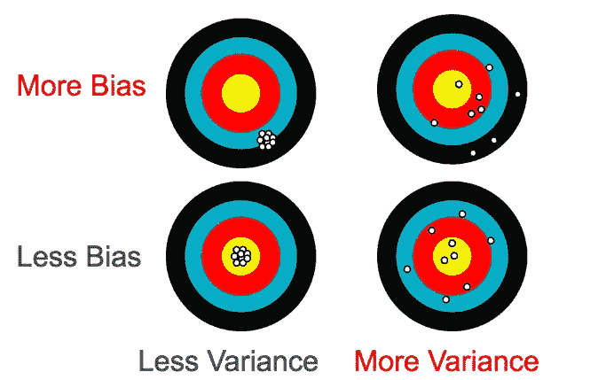

# 什么是偏见？

> 原文：<https://towardsdatascience.com/what-is-ai-bias-6606a3bcb814?source=collection_archive---------8----------------------->

AI 偏见的麻烦从定义开始，但不会结束。“偏见”是一个被过度使用的术语，在不同的上下文中，它的意思是非常不同的。

Image: [source](https://www.pcmag.com/article/361661/artificial-intelligence-has-a-bias-problem-and-its-our-fau).

这里有一些偏见的定义供你参考。

*   **统计学中:**偏差是估计量的期望值与其估计量之差。那太专业了，所以请允许我翻译一下。偏见是指*结果系统地偏离了目标。*想想射箭时，你的弓没有被正确瞄准。高偏差并不意味着你射得到处都是(这是高方差)，但可能会导致一个完美的射手一直击中靶心以下。在这种用法中，这个词没有多少感情内涵。

*   **在数据收集(以及统计)中:**当您摸索您的数据收集时，因此您的 [*样本*](http://bit.ly/quaesita_statistics) *不能代表您的* [*感兴趣人群*](http://bit.ly/quaesita_popwrong) 。“抽样偏差”是这里的正式名称。这种偏见意味着你不能相信你的统计结果。跟随[这个链接](http://bit.ly/quaesita_bias)看我的文章。
*   **在认知心理学中:**对理性的系统性偏离。在这个简洁的定义中，除了“from ”,每个词都有特定领域的细微差别。翻译成外行话？令人惊讶的是，你的大脑进化出了一些对事物做出反应的方式，心理学家最初发现这些反应令人惊讶。分类的认知偏见清单令人瞠目结舌。
*   **在神经网络算法中:**本质上是一个*截距*项。(偏见听起来比那个高中数学单词更酷，对吧？)
*   **在社会和自然科学中:**任何一系列现象，包括*过去/不相关的条件对现在决策的过度影响*。例子包括[文化偏见](http://bit.ly/cultural_bias)和[基础设施偏见](http://bit.ly/infrastructure_bias)。
*   **电子学中:** [用交流信号加在电路中的固定 DC 电压或电流。](http://bit.ly/biasing_electronics)
*   **在地理上:** [西弗吉尼亚州的一个地方。](http://bit.ly/bias_virginia)(听说法国人也有一些[偏见](http://bit.ly/bias_france)。)
*   **神话中:**这些古希腊人[中的任何一个](http://bit.ly/bias_mythology)。
*   **大多数人工智能专家认为:** [当计算机系统反映了创造它的人类的隐含](http://bit.ly/algorithmic_bias)[值](http://bit.ly/values_ethics)时，就会出现算法偏差。(人类创造的一切不都是隐性价值观的反映吗？)
*   **大多数人认为:**我们过去的经历扭曲了我们对信息的感知和反应，尤其是在不公平对待他人和其他普遍不良的情况下。有些人把这个词与*同义。*

*哦亲爱的。这里的意思相当多，有的比有的辣。*

## *ML/AI 说的是哪一个？*

*年轻的人工智能学科有一个习惯，那就是从 every-which-where 中借用行话([有时似乎不查原意](http://bit.ly/wiki_regression))，所以当人们在 [AI](http://bit.ly/quaesita_ai) 中谈论偏见时，他们可能指的是上面几个定义中的任何一个。想象一下，你准备好接受一篇华丽的论文的情感宣泄，这篇论文承诺要修正 AI 中的偏见……却发现(才几页)他们谈论的偏见是统计学上的偏见。*

*然而，现在谈论起来很时髦的一件事，却是引起媒体关注的一件事。血淋淋的人类。唉，当我们阅读(和写作)时，我们甚至会带来各种各样的偏见(*过去的经历扭曲了我们对信息的感知和反应*)。)关于这些话题。*

*AI 的全部意义在于让你用例子([数据)向计算机解释你的愿望！](http://bit.ly/quaesita_hist))代替指令。哪些例子？嘿，那是你作为老师的选择。数据集就像教科书，供你的学生学习。你猜怎么着？教科书有人类作者，数据集也是。*

> *教科书反映了作者的偏见。像教科书一样，数据集也有作者。它们是根据人们的指示收集的。*

*想象一下，试图用一个有偏见的作者写的教科书来教一个人类学生——如果这个学生最终反映了一些同样的偏见，你会感到惊讶吗？[那会是谁的错？](http://bit.ly/quaesita_donttrust)*

*人工智能的惊人之处在于它是多么的不偏不倚。如果它有自己的个性和观点，它可能会勇敢地面对那些向它提供充满偏见的例子的人。相反， [ML/AI 算法](http://bit.ly/quaesita_emperor)只是继续你展示给它们的模式的工具。给他们看不好的模式，他们就会回应。在最后两个要点的意义上，偏见不是来自 ML/AI 算法，而是来自人。*

> *偏见不是来自 AI 算法，而是来自人。*

*算法从来不会自己思考。事实上，它们根本不会思考([它们是工具](http://bit.ly/quaesita_emperor))，所以由我们人类来替它们思考。如果你想知道你能为人工智能偏见做些什么，并深入这个兔子洞，[这里是入口](https://medium.com/hackernoon/ai-bias-and-what-you-can-do-about-it-4a6ae48b338e)。*

* [## 注意窗帘后面的那个人

### 人工智能偏见和公平的严酷事实

medium.com](https://medium.com/hackernoon/ai-bias-and-what-you-can-do-about-it-4a6ae48b338e) 

# 感谢阅读！YouTube AI 课程怎么样？

如果你在这里玩得开心，并且你正在寻找一个为初学者和专家设计的有趣的应用人工智能课程，这里有一个我为你制作的娱乐课程:

Enjoy the entire course playlist here: [bit.ly/machinefriend](http://bit.ly/machinefriend)

# 喜欢作者？与凯西·科兹尔科夫联系

让我们做朋友吧！你可以在 [Twitter](https://twitter.com/quaesita) 、 [YouTube](https://www.youtube.com/channel/UCbOX--VOebPe-MMRkatFRxw) 、 [Substack](http://decision.substack.com) 和 [LinkedIn](https://www.linkedin.com/in/kozyrkov/) 上找到我。有兴趣让我在你的活动上发言吗？使用[表格](http://bit.ly/makecassietalk)联系。*