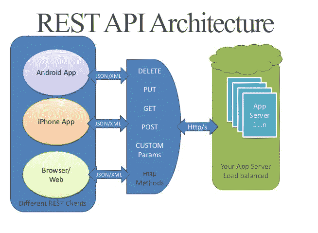

# 什么是 API，它是如何工作的？

> 原文：<https://towardsdatascience.com/what-is-an-api-and-how-does-it-work-1dccd7a8219e?source=collection_archive---------0----------------------->

## 包括几种不同的类型和它们的作用

[https://images.app.goo.gl/Jm3fL1oRmpfhLHRr8](https://images.app.goo.gl/Jm3fL1oRmpfhLHRr8)

大多数人从未听说过 API，更不用说它是做什么的了。他们可能认为这是一个很酷的新缩写，像 LOL 或 LMAO 一样使他们的短信更容易。

他们不知道这是一项强大的技术，能够成就大事。如今，我们每天使用的应用程序都在使用它。像 Yelp 这样的公司用它来定位附近的餐馆。人们一直在使用 API，而他们自己却不知道。每当你想分享一篇博文或一篇文章或一份食谱，点击脸书、Twitter 或 LinkedIn 的小图标(通常在顶部或边栏)来分享这些信息时，你就在使用 API。

现在你已经对 API 的使用有了一些了解，让我们来看看 API 到底是什么。

# 什么是 API？

API 是应用程序编程接口的首字母缩写，软件使用它来访问数据、服务器软件或其他应用程序，并且已经存在了相当一段时间。

通俗地说，就是让两个应用互相对话的软件中介。可以把 API 想象成两个人之间的翻译器，这两个人说的不是同一种语言，但是可以通过中间人进行交流

API 非常通用，可以在基于 web 的系统、操作系统、数据库系统和计算机硬件上使用。

开发人员使用 API，通过重用以前的代码，只更改与他们想要改进的流程相关的部分，使他们的工作更有效率。一个好的 API 使得创建一个程序更加容易，因为构建模块已经就位。API 使用已定义的协议，使开发人员能够快速、大规模地构建、连接和集成应用程序。

现在你对 API 有了更好的理解，让我们看看它们是如何工作的。

# API 是如何工作的？

API 通过一组规则进行通信，这些规则定义了计算机、应用程序或机器如何相互通信。API 充当任何两台机器之间的中间人，这两台机器为了一个特定的任务想要相互连接。

一个简单的例子是，当你从手机登录脸书时，你告诉脸书应用程序你想访问你的帐户。移动应用程序调用 API 来检索您的脸书帐户和凭证。然后，脸书将从其服务器之一访问这些信息，并将数据返回给移动应用程序。

这些类型的 API 称为 web APIs，是最常见的，但仅限于 web。几乎每台机器或系统都有与其他机器或系统交互的 API。

API 已经存在很长时间了，但是直到最近才开始流行。公司使用这种技术通过寻找更有效的方法来更快地检索信息以服务于客户，从而获得相对于其他公司的优势。

正如我前面提到的，web APIs 并不是唯一存在的。我们将在下一节深入探讨其中的一些。

# 原料药的类型

Web APIs 是使用最多的，但是还有其他的 API 你应该知道。这些和 web API 一样可靠和高效，但并不广为人知。

**REST (RESTful) API** —代表具象状态转移，使用轻量级 JSON 格式传递数据。大多数公共 API 都使用它，因为它的快速性能、可靠性以及通过重用模块化组件而不影响整个系统的伸缩能力。

这个 API 通过使用一组统一的预定义操作来提供对数据的访问。REST APIs 基于 URL 和 HTTP 协议，并基于以下 6 个架构约束:

**1。基于客户端-服务器的** —客户端处理前端流程，而服务器处理后端流程，两者可以相互独立替换。

**2。统一接口** —定义了客户端和服务器之间的接口，简化了架构，使各部分可以独立开发

**3。无状态** —从客户端到服务器的每个请求必须是独立的，并且包含所有必要的信息，以便服务器能够理解并相应地处理它。

**4。可缓存的** —维护客户端和服务器之间的缓存响应，避免任何额外的处理

**5。分层系统** —分层排列各层，以便每个层只能“看到”与其交互的相应层。

**6。按需编码** —允许通过下载和执行小程序和脚本形式的代码来扩展客户端功能。这通过减少需要预先实现的功能数量来简化客户端。

一旦你遵循了这些定义的约束，你创建的 API 就是 RESTful 的。

**SOAP** —简单对象访问协议比 REST 稍微复杂一点，因为它需要更多关于如何发送消息的前期信息。这种 API 自 20 世纪 90 年代末就已经出现，并使用 XML 来传输数据。它需要严格的规则和需要更多带宽的高级安全性。

这种协议没有缓存的能力，具有严格的通信，并且在考虑处理任何呼叫之前需要关于交互的每一条信息。

**XML-RPC**——可扩展标记语言——远程过程调用。这种协议使用特定的 XML 格式来传输数据，比 SOAP 更古老也更简单。客户端通过向实现 XML-RPC 的服务器发送 HTTP 请求并接收 HTTP 响应来执行 RPC。

JSON-RPC —与 XML-RPC 非常相似，除了这个协议使用 JSON 而不是 XML 格式之外，它们的工作方式是一样的。客户端通常是调用远程系统的单个方法的软件。

# 结论

这是对这个许多人不知道的外国首字母缩略词的快速介绍。他们可能听说过这个术语，但不清楚这项技术到底是什么。我们讨论了它们是什么，它们是如何工作的，甚至讨论了目前使用的不同类型的费用。

API 已经存在了很长一段时间，只要企业将它们作为运营的一部分，它将继续存在。它们非常通用，并且可以快速实现。我们不应该被 API 吓倒，因为我们已经对它们是什么以及它们是如何工作的有了更好的理解。