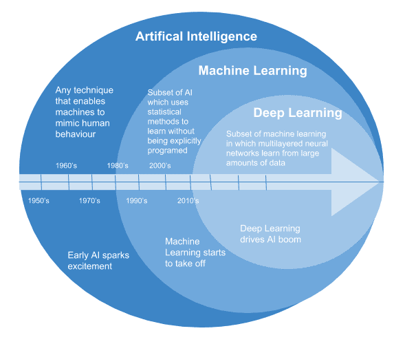

# 人工智能到底是怎么回事？

> 原文：<https://towardsdatascience.com/what-is-artificial-intelligence-all-about-anyway-b57c7eb75f5f?source=collection_archive---------13----------------------->

## 人工智能

## 人工智能概述

人工智能(AI)是未来。人工智能只属于电影。人工智能已经是你日常生活的一部分。所有这些都是正确的，这取决于你指的是什么样的人工智能。

如果你认为人工智能是未来的事情，我想给你举个例子来说明人工智能多年来是如何被使用的。我们都依赖应用程序出行，普通人依靠物理地图浏览城市、国家和大陆已经过去很长时间了。一个非常受欢迎的应用是谷歌地图。谷歌使用你在智能手机上的位置数据。并且可以分析运动的速度和方向。它可以在任何给定时间通过实时交通更新为您指明方向。

数据是人工智能的关键，在未来，数据将成为政府、企业和组织的新货币。没有数据，人工智能将是不可能的…在谷歌地图的情况下，数据被收集，人工智能算法被训练，以通过减少时间来改善你的日常通勤。

在媒体上，他们可能会交替使用人工智能、深度学习和机器学习等术语来描述这些技术进步，但它们并不完全相同，我将在另一篇博客中解释它们的区别，但总的来说，主要区别如下图所示。

人工智能是封装机器和深度学习的更大的圆圈。人工智能被归类为智能机器，在给定特定问题的情况下，它会导致最优或次优的解决方案。

维基百科对人工智能程序给出了以下定义，即任何能够感知其环境并采取行动以最大化其成功实现目标的机会的设备。

属于人工智能而不是机器学习的程序往往是可以利用决策树进行逻辑的程序，或者是为可能出现的潜在问题建立规则和指令的程序。

例如，如果你在一个“刚去过”或“远离家乡”的国家用信用卡购物，那么你的银行可以也应该标记所有交易以供审查。一些银行甚至会完全冻结你的卡，直到你确认你在另一个国家使用过你的卡(这对欺诈很有好处，但当你在旅行时，它可能会成为你生活的贝恩……因为当你访问每个国家时，你必须不断更新你的银行)。这个可能没有训练数据，所以不会有机器学习；这是程序员编写的简单规则。

另一方面，其他事情可能由 ML 处理:例如，电子邮件地址中的位数、与电子邮件的域相结合、与 IP 网络相结合、与交易的时间相结合，这些都可能是将 ML 系统推到边缘以拒绝在线交易的特征。

正如你从图表中看到的，人工智能是一个广泛的概念，是在 20 世纪 50 年代建立的。人工智能可以根据人工智能的能力进一步归纳成不同的类别。这些是人工狭义智能、人工广义智能和人工超智能。

*人工狭义智能*专攻一个领域。例如，有一种人工智能可以在脸书的图片上识别你的脸，但这是它唯一能做的事情。如果你让它开车，它不知道从哪里开始。

*人工通用智能*指的是一台计算机在一系列领域像人一样聪明。一般智能意味着机器可以完成人类可以完成的任何智力任务。实现这一点比人工狭义智能要困难得多，而且还没有人做到过，所以我们离 iRobot 还有很长的路要走，不要担心！一台机器必须具备人类的素质，比如能够计划、解决问题、快速学习、从经验中学习、一次性学习、抽象思维等等，才能拥有一般的智能。

*人工超级智能*由人工智能思想家和牛津哲学家定义为“在每个领域都比最优秀的人类大脑聪明得多的智力，包括科学创造力、智慧和社交技能。”人工超级智能的范围从比人类稍微聪明一点的计算机到比人类聪明一倍的计算机。

人工狭义智能早已存在，在日常生活中无处不在。就像工业革命一样，很多人把 AI 称为开启了一场智能革命。在那里，人工智能将从狭义人工智能转变为广义人工智能，然后在智能水平上指数级提高到超级智能。