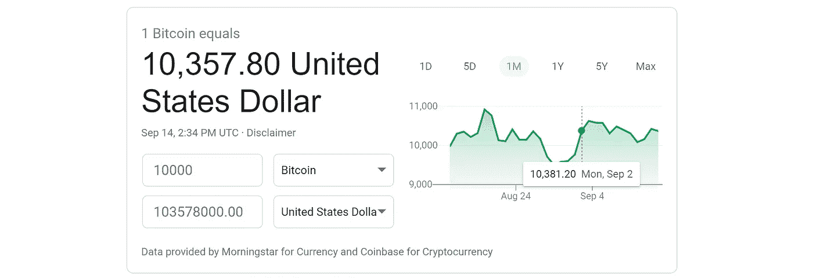
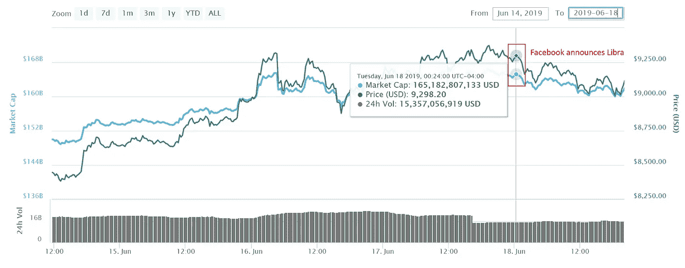
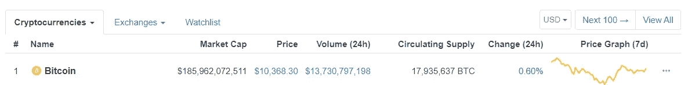

# 比特币是用来做什么的？

> 原文：<https://towardsdatascience.com/what-is-bitcoin-used-for-e3b0745d0b80?source=collection_archive---------12----------------------->

Photo by [Icons8 team](https://unsplash.com/@icons8?utm_source=medium&utm_medium=referral) on [Unsplash](https://unsplash.com?utm_source=medium&utm_medium=referral)

## 比特币价格波动背后的一瞥

# 卑微的出身

在 2008 年的万圣节，在全球金融危机的最后阶段，一个化名为 T2 中本聪 T3 的个人或团体发布了 T4 比特币白皮书 T5。几个月后，2009 年 1 月 9 日，[比特币向全世界发布](https://en.wikipedia.org/wiki/History_of_bitcoin)，任何人都可以下载一份客户端来托管分布式账本的副本。四天后，哈尔·芬尼收到了第一笔比特币交易——中本聪给了哈尔 10 个比特币。

慢慢地，在 2009 年到 2013 年间，收养继续蔓延。2010 年，Laszlo Hanyecz 进行了世界上最著名的比特币购买；向任何愿意给他买两个披萨的人支付[10000 比特币](https://qz.com/1285209/bitcoin-pizza-day-2018-eight-years-ago-someone-bought-two-pizzas-with-bitcoins-now-worth-82-million/)。这 10，000 个比特币当时价值约 30 美元。相比之下，在写这篇文章的时候，藏起来的比特币价值 1.036 亿美元。这个著名的购买日已经作为[比特币披萨日](https://www.investopedia.com/news/bitcoin-pizza-day-celebrating-20-million-pizza-order/)载入史册。

Source: [Google Finance](https://www.google.com/finance)

除了买披萨，比特币还作为一种支付方式而出名。到 2012 年第三季度，允许商家接受比特币的支付处理器 bit pay[已经有 1000 家商家注册使用这项服务](https://www.americanbanker.com/news/bitpay-signs-1-000-merchants-to-accept-bitcoin-payments)。凭借其匿名性的价值主张，比特币迅速成为黑暗网络上的一种流行支付选择。2013 年， [FBI 查封了黑暗网站丝绸之路](https://techcrunch.com/2013/10/02/fbi-seize-deep-web-marketplace-silk-road-arrest-owner/)，收缴了[26000 比特币；随后，它又从“丝绸之路”的创始人和前所有者](https://en.wikipedia.org/wiki/Silk_Road_(marketplace))[罗斯·乌布里希特](https://en.wikipedia.org/wiki/Ross_Ulbricht)手中没收了另外 14.4 万枚比特币。

虽然比特币的历史充满了不同潜在用例的轶事，但事实仍然是，加密货币仍然在努力实现一个目标。批评者强调了这个问题，并认为比特币(和其他加密货币)试图解决一个并不存在的问题。数字货币的支持者声称，比特币将在未来解决世界上所有的金融问题。从品牌问题到技术障碍，十年后，比特币的使用案例仍然只是理论上的。

# 盲目转向的副作用

比特币对未来做出了许多承诺，但其 1857 亿美元的市值目前仅由投资者的信心支撑。看涨的比特币估值充斥着加密货币新闻领域，例如[这篇发表于 2019 年 6 月的文章](https://cointelegraph.com/news/bitcoin-price-could-see-20k-in-two-weeks-100k-this-year-predicts-market-analyst)声称比特币到 7 月中旬可能达到 2 万美元，到年底可能达到 10 万美元。无论是[比特币交易所交易基金](https://www.cnbc.com/2019/09/12/bitcoin-etf-like-product-just-hit-the-marketheres-how-it-works.html)还是[脸书的 Libra](https://blockgeeks.com/guides/understanding-facebooks-cryptocurrency-libra/) 都没有显著提升比特币的价值，尽管狂热分子可能会这么说。

The Bitcoin market did not react to Facebook’s Libra announcement. (Source: [Coin Market Cap](https://coinmarketcap.com/currencies/bitcoin/#charts))

当预测价格被强调时，除了“如果它继续它的抛物线轨迹”之外，很少或没有关于价格如何到达那里的路线图被提及；换句话说，如果人们继续以目前的速度购买，比特币价格将会上涨(显然)。这种推理对机构投资者来说永远行不通——比市场如何表现更重要的是，市场为什么会以那种方式表现。

也就是说，信仰是一种强大的燃料。它为宗教、现有货币、政府提供动力，并将每枚比特币的价格推高至 1 万美元。但由于只有有限的采用(不到 1500 亿美元的市值)，仅用信心刺激市场会导致价格波动。

如果没有用例，比特币主要存在于两个地方:集中交易所和信徒的冷藏钱包。不过，这些地点很受欢迎，因为它们允许比特币社区通过投机实践自己的信仰。虽然冷藏钱包将一定量的比特币供应挡在了市场之外，但集中式交易所提供了一个考验信心的舞台。

在撰写本文时，比特币的 24 小时美元交易量约为 137 亿美元。按每比特币 10.4 万美元计算，这大约相当于 24 小时内有约 130 万比特币被交易。相比之下，这一数量与公开交易市场上的[Planet Fitness](https://finviz.com/quote.ashx?t=KDP&ty=c&p=d&b=1)的数量相似。相比之下，行星健身的市值只有 58 亿。

Source: [Coin Market Cap](https://coinmarketcap.com)

然而，与 Planet Fitness 所在的证券交易所不同，比特币的交易所不受监管，这意味着清算资产的规则较少。例如，如果 Planet Fitness 的一名董事会成员想要出售一批股票，就需要向市场公布，通常会在提交给 SEC 的 10-K 报告中注明。另一方面，比特币巨鲸可以随时清算，不需要任何解释。因此，比特币价格的大幅上涨或下跌比股票市场更常见；毕竟，一旦投资者失去信心，他们可以立即匿名清算他们所有的比特币。

# 比特币作为交易货币的局限性

虽然它被设计为一种进行数字化、点对点交易的方式，但该技术目前还不具备可扩展性。它在很大程度上依赖于所谓的工作证明，这是一种用于证明交易发生的方法。

使用这种方法的好处是，比特币网络上的用户不需要相互了解或信任，也不需要依赖第三方作为对交易拥有最终决定权的中央机构。这种方法的好处来自于[速度的代价，尽管](/the-blockchain-scalability-problem-the-race-for-visa-like-transaction-speed-5cce48f9d44)。比特币网络每秒只能处理 7 笔交易。如果您想了解更多关于工作证明事务速度问题的细节，请查看下面我以前的文章:

 [## 区块链的可扩展性问题&类似 Visa 的交易速度竞赛

### 是的，区块链有一个可扩展性问题。这就是问题所在，这就是人们正在解决的问题。

towardsdatascience.com](/the-blockchain-scalability-problem-the-race-for-visa-like-transaction-speed-5cce48f9d44) 

更准确地说，每 10 分钟，一批交易(称为交易块，因此称为“块”链)被验证。然而，问题是这个批处理的容量只够容纳这么多的交易。例如，如果你去星巴克，用比特币购物，在最好的情况下，如果星巴克足够慷慨，只接受 1 次验证，你购买的咖啡将被放入下一批，并在 10 分钟内得到验证(只接受 1 次验证有风险，但我们不会在本例中深入讨论)。

另一方面，如果您前面有一个很长的交易列表，您的咖啡交易可能无法进入下一批。最终发生的情况是，您的事务排队等待下一批。事务正在等待的队列被称为[内存池](https://www.blockchain.com/charts/mempool-size)。所以现在你要等上一批交易完成后再等 10 分钟；也就是说，你必须等待 20 分钟。即使这样，也不能保证。希望到现在为止，你已经明白了这一点，并且明白了用比特币买一杯咖啡会有多麻烦。

然而，如果你在任何集中的交易所交易，你可能会认为比特币的速度几乎是即时的，但这是一种错觉。在中央交易所，所有的比特币都储存在一个地方。你的比特币和我的在一起。该交易所只是管理一个数据库，根据每笔交易增加和减少你拥有的比特币记录。这就是为什么比特币最大主义者认为[你不会真正拥有你的比特币，除非它在你的钱包里](/what-is-proof-of-keys-and-6-ways-to-participate-mindfully-7687c4cd1888)；如果它在交易所交易，你就有风险。交易所可能有一天会带着你所有的硬币消失，或者干脆拒绝给你你购买的硬币。

# 作为价值储存手段的比特币

在比特币目前的状态下，我认为它唯一的实质性用途是价值储存，类似于黄金。它是一种投机性资产，因为除了承诺未来价值之外，它没有任何实际价值。大多数人持有比特币是因为这种前景，而少数人可能会进行短期交易以对冲这种押注。

作为价值储存手段，比特币有几个有利的属性。首先，它可以被拥有，并且易于存储。与黄金不同，比特币可以存储在 u 盘上，不管你拥有多少。黄金占据物理空间，持有大量黄金会变得引人注目。比特币也是有固定金额的。总的来说，全球可用的比特币不会超过 2100 万个。黄金虽然稀有，但仍在继续开采，供应量也在不断增加。比特币也很难模仿。它是无法伪造的，尽管骗子可以卖给无知的买家。另一方面，受过教育的买家比假黄金或假现金更容易发现假比特币——他们只需检查区块链，那里有流通中的每一枚比特币的公共记录。

最后，比特币越来越被广泛理解——人们很好奇。谷歌搜索趋势表明，搜索词[“比特币”今天的受欢迎程度是 2016 年这个时候的 3 倍](https://trends.google.com/trends/explore?date=2016-09-14%202019-09-14&geo=US&q=bitcoin)(在 2017 年末，最近的泡沫期间，受欢迎程度达到顶峰)。虽然比特币与黄金相比还远未普及，但它的普及程度正在提高，随着越来越多的人开始获得比特币，它作为价值储存手段的地位变得更加可信。

随着比特币社区继续开发更多技术来构建比特币区块链，未来数字货币的使用案例可能会增加。目前，它仍然是一种投机性的、不可扩展的资产，目前被作为价值储存手段持有。