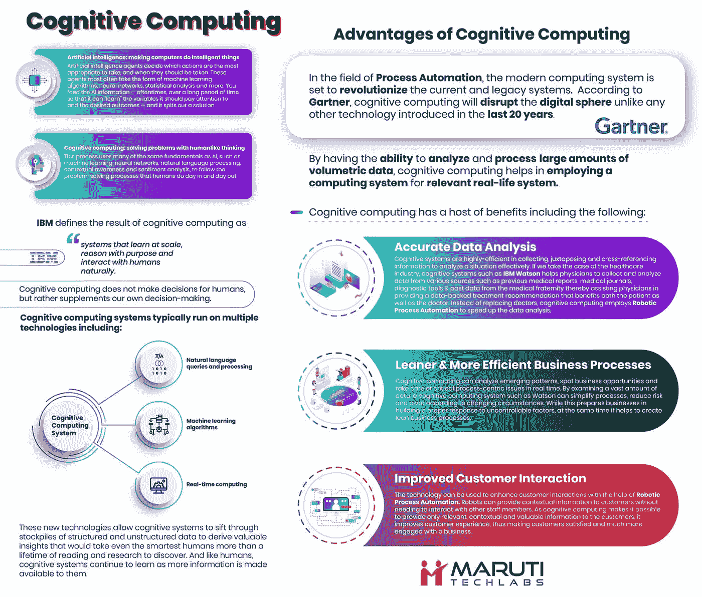

# 什么是认知计算？企业如何从认知技术中获益？

> 原文：<https://towardsdatascience.com/what-is-cognitive-computing-how-are-enterprises-benefitting-from-cognitive-technology-6441d0c9067b?source=collection_archive---------2----------------------->

自从计算的概念提出以来，人工智能确实是一个遥远的目标，随着新的认知计算模型的出现，我们似乎每天都在离这个目标越来越近。

来自认知科学的融合，并基于模拟人类思维过程的基本前提，认知计算的概念以及[应用必将不仅对我们的私人生活产生深远的影响，还会对医疗保健、保险等行业产生深远的影响。认知技术的优势确实超越了传统的人工智能系统。](https://www.marutitech.com/advantages-of-cognitive-computing/)

根据最先进的认知计算框架 IBM Watson 总经理[大卫·肯尼](https://money.cnn.com/2016/04/13/technology/watson-david-kenny/index.html)的说法，“人工智能只能和教它的人一样聪明。”对于最近的认知革命来说，情况并非如此。

认知计算过程使用人工智能、神经网络、机器学习、自然语言处理、情感分析和上下文感知的融合来解决日常问题，就像人类一样。 [IBM 将认知计算](https://www.ibm.com/blogs/internet-of-things/iot-cognitive-computing-watson/)定义为一种高级系统，它可以大规模学习，有目的地推理，并以自然的形式与人类互动。

# **认知计算与人工智能**

虽然人工智能的基本用例是实现解决问题的最佳算法，但[认知计算](https://www.marutitech.com/cognitive-computing-features-scope-limitations/)则更进一步，试图通过分析一系列因素来模仿人类的智力和智慧。与人工智能相比，认知计算是一个完全不同的概念。

*   **认知计算学&模仿人类思维过程**

与只处理给定问题的人工智能系统不同，认知计算通过研究模式来学习，并建议人类根据其理解采取相关行动。在人工智能的情况下，系统完全控制一个过程，并采取措施通过使用预定义的算法来完成任务或避免某个场景。

相比之下，认知计算是一个完全不同的领域，它充当助手，而不是完成任务的人。通过这种方式，认知计算赋予人类更快、更准确的数据分析能力，而不必担心机器学习系统做出的错误决策。

*   **认知计算并没有将人类排除在外**

如上所述，认知计算的主要目的是帮助人类做决策。这赋予了人类在分析中卓越的精度，同时确保一切都在他们的控制之下。为了说明，让我们以医疗保健系统中的[人工智能为例。一个人工智能支持的系统将在不咨询人类医生的情况下做出所有关于治疗的决定，而认知计算将利用自己的一组数据和分析来补充人类诊断，这有助于提高决策的质量，并为关键流程添加人情味。](https://chatbotsmagazine.com/is-conversational-ai-the-future-of-healthcare-658a3d8e9dd5)

# **走向认知:认知计算的优势**

在过程自动化领域，现代计算系统将彻底改变当前和遗留系统。根据 Gartner 的说法，认知计算将颠覆数字领域，这与过去 20 年中引入的任何其他技术都不一样。通过具有分析和处理大量体积数据的能力，认知计算有助于将计算系统用于相关的现实生活系统。认知计算有许多优势，包括:

*   **精确的数据分析**

认知系统在收集、并置和交叉引用信息以有效分析情况方面效率很高。如果我们以医疗保健行业为例，IBM Watson 等认知系统帮助医生收集和分析各种来源的数据，如以前的医疗报告、医学期刊、诊断工具以及来自医疗界的过去数据，从而帮助医生提供数据支持的治疗建议，使患者和医生都受益。认知计算没有取代医生，而是采用[机器人流程自动化](https://www.marutitech.com/robotic-process-automation-vs-traditional-automation/)来加速数据分析。

*   **更精简&更高效的业务流程**

认知计算可以分析新兴模式，发现商业机会，并实时处理关键的以流程为中心的问题。通过检查大量数据，像沃森这样的认知计算系统可以简化流程，降低风险，并根据不断变化的环境进行调整。虽然这为企业建立对不可控因素的适当响应做好了准备，但同时它也有助于创建精益业务流程。

*   **改善客户互动**

通过[实施机器人流程自动化](https://www.marutitech.com/successful-rpa-implementation/)，该技术可用于增强客户互动。机器人可以向客户提供上下文信息，而无需与其他员工互动。由于认知计算使得仅向客户提供相关的、上下文相关的和有价值的信息成为可能，因此它改善了客户体验，从而使客户满意并更多地参与到业务中。

# **工作中的认知计算:全球组织如何利用这项技术**

根据技术专家的说法，认知计算是未来。许多成功和成熟的企业已经将该技术集成到他们的日常业务中。有许多成功的用例场景和认知计算示例向世界展示了如何高效地实现认知计算。让我们来看看该技术的一些成功使用案例:

*   **Cora-苏格兰皇家银行智能代理**

在 IBM Watson 的帮助下，[苏格兰皇家银行开发了一个智能助理，能够在一天内处理 5000 个查询](https://www.insider.co.uk/news/rbs-cora-ai-messaging-app-12688390)。利用认知学习能力，该助理使 RBS 能够分析客户投诉数据，并创建一个常见问题库。该助理不仅分析查询，而且还能够提供 1000 种不同的回答，并理解 200 种客户意图。

这位数字助理学会了客户如何询问一般问题，如何处理查询，如果太复杂，如何转给人工代理。

*   **Welltok 的健康护理门房**

Welltok 开发了一种高效的医疗保健门房——caféWell，它通过处理大量医疗数据来更新客户的相关健康信息。 [CaféWell](https://www.welltok.com/cafewell-2/) 是一种全面的人群健康工具，健康保险提供商使用它来帮助他们的客户获得改善健康的相关信息。通过从各种来源收集数据和最终用户对问题的即时处理，CaféWell 提供智能和定制的健康建议，以提高健康商数。

Welltok 的首席执行官 Jeff Margolis 在讨论 CaféWell 时说:“我们必须超越当前为患者建立的‘疾病护理’系统，转变为优化每个消费者健康状况的系统。要做到这一点，该行业需要一种实用但完全不同的方法来吸引全国 85%的人口，他们每天都在做出影响他们健康的选择。”

*   **从个人旅行规划师到简化旅行计划的开拓者**

由认知技术驱动， [WayBlazer 的旅行规划器通过用自然语言提问](https://www.wayblazer.ai/)，让旅行者更容易规划旅行。礼宾员询问基本问题，并通过收集和处理旅行数据以及对旅行者偏好的洞察来提供定制结果。

这种类型的认知驱动工具有助于旅行者节省搜索航班、预订酒店和计划活动的时间，而无需在最终确定旅行之前研究几个网站。旅行社已经成功地使用了这种工具，同时帮助他们增加了收入和客户满意度。

*   **Edge up 的智能工具，通过手机 App 管理梦幻足球队**

梦幻足球是全球 3300 多万人非常喜爱的娱乐消遣方式。在认知学习和计算的帮助下， [Edge Up Sports 开发了一个工具，并与他们的移动应用程序集成，帮助用户通过问简单的问题来起草他们的幻想团队](https://www.ibm.com/blogs/client-voices/cognitive-fantasy-sports-edge-up-sports-fantasy-football/)。

这些问题用自然语言起草，让用户更容易做出决定，然后由系统通过浏览社交媒体和新闻报道中关于球员的数据进行分析，并评估用户情绪，帮助球队经理做出更好的决定。

# **认知计算的问题:更美好未来的挑战**

每项新技术在其生命周期中都面临一些问题。尽管由于认知计算的内在优势，创新有可能改变生活，但由于害怕改变，创新正受到人类的抵制。人们发现了认知计算的几个缺点，这给更广泛的采用带来了巨大的挑战，例如:

*   **安全**

当数字设备管理关键信息时，安全性问题就自然而然地出现了。由于能够处理大量数据并对其进行分析，认知计算在数据安全和加密方面面临着重大挑战。

随着越来越多的互联设备进入市场，认知计算将不得不通过开发一个完全可靠的安全计划来考虑与安全漏洞相关的问题，该计划还具有识别可疑活动以促进数据完整性的机制。

*   **领养**

任何新技术成功道路上的最大障碍是自愿采用。为了让认知计算取得成功，有必要对新技术如何让流程和业务变得更好制定一个长期愿景。

通过技术开发人员、企业、政府和个人等各利益相关方之间的合作，可以简化采用流程。与此同时，有一个数据隐私框架来进一步推动认知计算的采用是至关重要的。

*   **变革管理**

变化管理是认知计算必须克服的另一个关键挑战。人们抵制改变是因为他们天生的人类行为&由于认知计算具有像人类一样学习的能力，人们担心有一天机器会取代人类。这已经对增长前景产生了很大的影响。

然而，认知技术是为了与人类同步工作而构建的。人类将通过向系统输入信息来培育技术。这使得它成为人们必须接受的人机交互的一个很好的例子。

*   **漫长的开发周期**

最大的挑战之一是通过认知计算开发基于场景的应用所投入的时间。认知计算目前正被开发为一种通用解决方案，这意味着如果没有强大的开发团队和大量的时间来开发解决方案，该解决方案就无法在多个行业领域实施。

漫长的开发周期使得小公司更难独立开发认知能力。随着时间的推移，随着开发生命周期趋于缩短，认知计算肯定会在未来获得更大的舞台。

# **包装**

作为数字进化周期的一部分，认知技术的采用始于识别可以使用该技术自动化的手动流程。许多公司，如 IBM，已经成为认知技术领域的先驱，推动了全球几个真正的数字组织。

随着时间的推移，越来越多的数据被分析，以深入了解过去的事件并改进当前和未来的流程。认知技术不仅有助于之前的分析，还将有助于通过预测分析更准确地预测未来事件。

作为一种强大而灵活的技术，B2B 和 B2C 领域的未来可能性和途径是巨大的。IBM Watson 已经在金融和医疗领域利用了认知计算的能力和优势。在未来，人们相信这种技术将帮助人类变得比以前更有效率，委托世俗的分析和专注于创造性的工作。

在不到 5 年的时间里，认知技术对组织的影响肯定会大幅增长。所有行业/领域的利益相关者都需要了解是否、如何以及在哪里投资应用认知技术。

为了从认知计算中获得最大收益，组织需要对其流程、数据、人才模型和市场进行全面分析。我们认为，除了降低成本，认知技术的最大潜力之一在于创造价值，以及通过简化大量流程来重组工作和提高效率的能力。

尽管面临各种挑战和障碍，但认知技术的[益处不容忽视。这将有利于所有的组织和人类，从总体上来说，开始过渡进程，并采用创新技术，为一个光明和更有效的未来。](https://www.marutitech.com/advantages-of-cognitive-computing/)

为了充分利用像认知技术这样的创新突破的潜力，你需要一个了解现代趋势的[有弹性的认知计算技术合作伙伴](http://www.marutitech.com)&正在开发尖端的商业解决方案。如果您想了解我们如何帮助您在业务中采用人工智能&认知技术，请写信给 hello@marutitech.com&的我们，了解我们如何通过独创性和创新来帮助改善关键的业务流程。