# 什么是数据清洗？如何处理数据进行分析和机器学习建模？

> 原文：<https://towardsdatascience.com/what-is-data-cleaning-how-to-process-data-for-analytics-and-machine-learning-modeling-c2afcf4fbf45?source=collection_archive---------8----------------------->

数据清洗在数据管理、分析和机器学习领域都扮演着重要的角色。在本文中，我将尝试给出关于数据清理的重要性和不同数据清理过程的直觉。

# 什么是数据清洗？

数据清理是指识别数据中不正确、不完整、不准确、不相关或缺失的部分，然后根据需要对其进行修改、替换或删除的过程。数据清理被认为是基础数据科学的基础元素。

数据对于分析和机器学习来说是最有价值的东西。在计算或商业中，到处都需要数据。当涉及到真实世界的数据时，数据可能包含不完整、不一致或缺失的值。如果数据被破坏，那么它可能会阻碍进程或提供不准确的结果。让我们看一些例子来说明数据清理的重要性。

假设你是一家公司的总经理。贵公司收集购买贵公司产品的不同客户的数据。现在你想知道人们对哪些产品最感兴趣，并据此增加该产品的产量。但是如果数据被破坏或者包含丢失的值，那么你将会被误导做出正确的决定，你将会有麻烦。

归根结底，机器学习是一种数据驱动的人工智能。在机器学习中，如果数据不相关或容易出错，就会导致错误的模型构建。

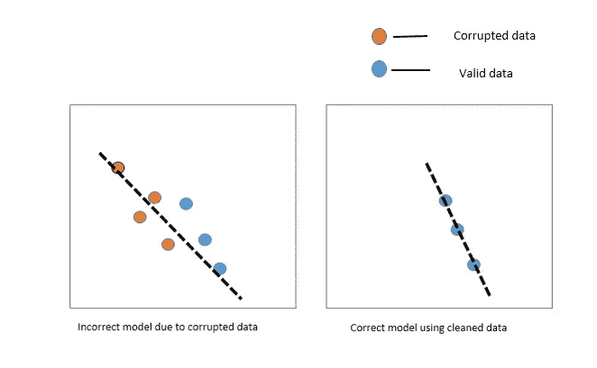

Figure 1: Impact of data on Machine Learning Modeling.

只要你清理了你的数据，只要你能做出更好的模型。因此，我们需要在使用数据之前对其进行处理或清理。没有高质量的数据，期待任何好的结果都是愚蠢的。

# 清理数据的不同方式

现在，让我们仔细看看清理数据的不同方式。

## **列不一致:**

如果您的**数据框(**数据框是一个二维数据结构，即数据以表格的形式排列成行和列 **)** 包含不相关的列或者您永远不会使用它们，那么您可以删除它们，以便更加关注您将处理的列。让我们看一个如何处理这样的数据集的例子。让我们使用 **pandas** DataFrame 创建一个学生数据集的例子。

```
import numpy as np # linear algebraimport pandas as pd # data processing, CSV file I/O data={'Name':['A','B','C','D','E','F','G','H']
      ,'Height':[5.2,5.7,5.6,5.5,5.3,5.8,5.6,5.5],
      'Roll':[55,99,15,80,1,12,47,104],
      'Department':['CSE','EEE','BME','CSE','ME','ME','CE','CSE'],
      'Address':['polashi','banani','farmgate','mirpur','dhanmondi','ishwardi','khulna','uttara']}df=pd.DataFrame(data)
print(df)
```

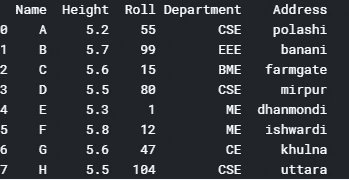

Figure 2: Student data set

这里如果我们想删除“身高”列，我们可以使用 python [**pandas。DataFrame.drop**](https://pandas.pydata.org/pandas-docs/stable/reference/api/pandas.DataFrame.drop.html) 从行或列中删除指定的标签。

```
DataFrame.**drop**(*self*, *labels=None*, *axis=0*, *index=None*, *columns=None*, *level=None*, *inplace=False*, *errors='raise'*)
```

让我们去掉高度栏。为此，您需要在 column 关键字中加入列名。

```
df=df.drop(columns='Height')
print(df.head())
```

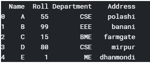

Figure 3: “Height” column dropped

## **缺失数据:**

很少有真实世界的数据集没有任何缺失值。当您开始处理真实世界的数据时，您会发现大多数数据集包含缺失值。处理缺失值非常重要，因为如果您让缺失值保持原样，它可能会影响您的分析和机器学习模型。因此，您需要确定数据集是否包含缺失值。如果您在数据集中发现缺失值，您必须处理它。如果您在数据集中发现任何缺失值，您可以对其执行以下三项任务中的任何一项:
1。保持原样
2。填补缺失值
3。删除它们
为了填充缺失的值，我们可以执行不同的方法。例如，图 4 显示空气质量数据集有缺失值。

```
airquality.head() #  return top n (5 by default) rows of a data frame
```

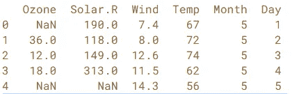

Figure 4: missing values.

在图 4 中，NaN 表示数据集在该位置包含缺失值。在你的数据集中找到丢失的值后，你可以使用 [*熊猫。DataFrame.fillna*](https://pandas.pydata.org/pandas-docs/stable/reference/api/pandas.DataFrame.fillna.html) 来填充缺失的值。

```
DataFrame.**fillna**(*self*, *value=None*, *method=None*, *axis=None*, *inplace=False*, *limit=None*, *downcast=None*, ***kwargs*)
```

你可以根据自己的需要，使用不同的统计方法来填补缺失值。例如，在图 5 中，我们将使用统计平均值方法来填充缺失值。

```
airquality['Ozone'] = airquality['Ozone'].fillna(airquality.Ozone.mean())airquality.head()
```

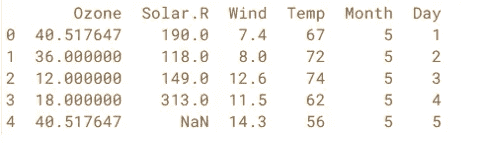

Figure 5: Filling missing values with the mean value.

你可以看到“臭氧”一栏中缺少的数值被该栏的平均值所填充。

您还可以删除找到缺失值的行或列。我们删除包含缺失值的行。在这里，您可以借助 [**熊猫来删除丢失的值。DataFrame.dropna**](https://pandas.pydata.org/pandas-docs/stable/reference/api/pandas.DataFrame.dropna.html#pandas.DataFrame.dropna) **。**

```
airquality = airquality.dropna() #drop the rows containing at least one missing valueairquality.head()
```

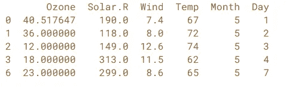

Figure 6: Rows are dropped having at least one missing value.

这里，在图 6 中，您可以看到 Solar 列中的行缺少值。r 掉了。

```
airquality.isnull().sum(axis=0)
```

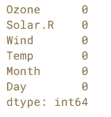

Figure 7: Shows the numbers of missing values in column.

## **异常值:**

如果你是数据科学新手，那么你脑海中出现的第一个问题是“这些离群值意味着什么”？让我们先讨论离群值，然后我们将讨论数据集中这些离群值的检测，以及检测到离群值后我们将做什么。
根据维基百科的说法，
*在统计学中，一个* ***离群值*** *是与其他观测值有显著差异的数据点。* "
这意味着离群值表示一个数据点明显不同于数据集中的其他数据点。由于实验中的误差或测量中的可变性，会产生异常值。让我们看一个例子来澄清这个概念。

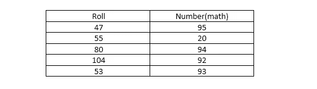

Figure 8: Table contains outlier.

在图 4 中，数学列中的所有值都在 90–95 之间，只有 20 与其他值有显著差异。这可能是数据集中的输入错误。所以我们可以称之为离群值。这里要补充一点——***不是所有的离群值都是坏数据点。有些可能是错误，但其他是有效值。***

所以，现在的问题是我们如何检测数据集中的异常值。
为了检测异常值，我们可以使用:
1。箱线图
2。散点图
3。z 分数等。
我们将在这里看到散点图方法。让我们画一个数据集的散点图。

```
dataset.plot(kind='scatter' , x='initial_cost' , y='total_est_fee' , rot = 70)
plt.show()
```

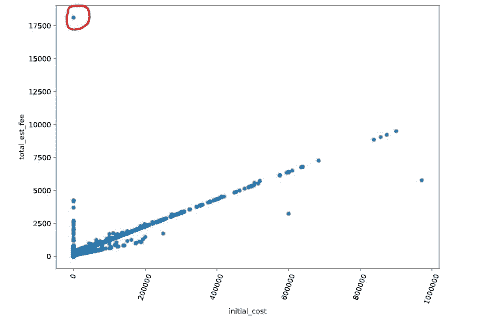

Figure 9: Scatter plotting with outlier.

在图 9 中，有一个带有红色轮廓的异常值。检测到这一点后，我们可以将其从数据集中移除。

```
df_removed_outliers = dataset[dataset.total_est_fee<17500]df_removed_outliers.plot(kind='scatter', x='initial_cost' , y='total_est_fee' , rot = 70)plt.show()
```

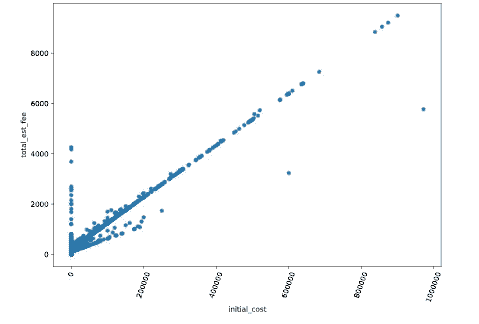

Figure 10: Scatter plotting with removed outliers.

## ***重复行:***

数据集可能包含重复条目。删除重复行是最容易的任务之一。要删除重复的行，可以使用—
***dataset _ name . drop _ duplicates()。*** 图 12 显示了具有重复行的数据集的示例。

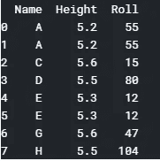

Figure 11: Data having duplicate rows.

```
dataset=dataset.drop_duplicates()#this will remove the duplicate rows.print(dataset)
```

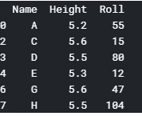

Figure 12: Data without duplicate rows.

## ***整理数据集:***

整齐的数据集意味着每一列代表单独的变量，每一行代表单独的观察值。但是在混乱的数据中，每一列代表的是数值而不是变量。整齐的数据有助于解决常见的数据问题。你可以使用[***pandas . melt***](https://pandas.pydata.org/pandas-docs/stable/reference/api/pandas.melt.html)***将杂乱的数据变成整齐的数据。***

```
import pandas as pd
pd.melt(frame=df,id_vars='name',value_vars=['treatment a','treatment b'])
```

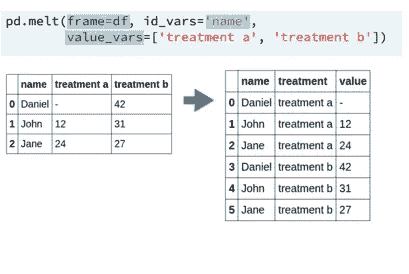

Figure 13: Converting from Untidy to tidy data.

还可以看 [***熊猫。DataFrame.pivot***](https://pandas.pydata.org/pandas-docs/stable/reference/api/pandas.DataFrame.pivot.html) 用于解冻整齐的数据。

## ***转换数据类型:***

在 DataFrame 中，数据可以有多种类型。例如:
1。分类数据
2。对象数据
3。数字数据
4。布尔数据

某些列的数据类型可能由于某种原因而改变，或者具有不一致的数据类型。您可以使用 [***pandas 从一种数据类型转换为另一种数据类型。data frame . astype***](https://pandas.pydata.org/pandas-docs/stable/reference/api/pandas.DataFrame.astype.html)***。***

```
DataFrame.**astype**(*self*, *dtype*, *copy=True*, *errors='raise'*, ***kwargs*)
```

## ***字符串操作:***

数据清理最重要和最有趣的部分之一是字符串操作。在现实世界中，大多数数据都是非结构化数据。字符串操作是指改变、解析、匹配或分析字符串的过程。对于字符串操作，你应该有一些关于正则表达式的知识。有时候你需要从一个大句子中提取一些价值。在这里，字符串操作给了我们很大的好处。比方说，
*“这把伞花了 12 美元，他从他妈妈那里拿了这笔钱。”*
如果你想从句子中提取“$12”的信息，那么你必须构建一个正则表达式来匹配这个模式。之后你就可以使用 python 库了。python 中有许多用于字符串操作的内置和外部库。

```
import repattern = re.compile('|\$|d*')result = pattern.match("$12312312")print(bool(result))
```

这将给你一个显示“真”的输出。

## ***数据拼接:***

在当今的数据科学时代，数据量与日俱增。由于数据量大，数据可能存储在单独的文件中。如果您处理多个文件，那么为了简单起见，您可以将它们连接起来。您可以使用以下 python 库进行 concatenate。

```
pandas.**concat**(*objs*, *axis=0*, *join='outer'*, *join_axes=None*, *ignore_index=False*, *keys=None*, *levels=None*, *names=None*, *verify_integrity=False*, *sort=None*, *copy=True*)
```

让我们看一个如何连接两个数据集的例子。图 14 显示了从两个不同文件加载的两个不同数据集的示例。我们将使用[***pandas . concat***](https://pandas.pydata.org/pandas-docs/stable/reference/api/pandas.concat.html)来连接它们。

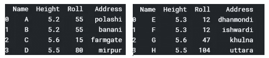

Figure 14: Dataset1(left) & Dataset2(right)

```
concatenated_data=pd.concat([dataset1,dataset2])
print(concatenated_data)
```

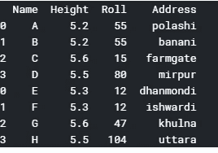

Figure 15: Concatenated dataset.

# 结论:

数据清理对于使您的分析和机器学习模型无错误非常重要。数据集中的一个小错误会给你带来很多问题。你所有的努力都可能白费。因此，请务必保持数据的整洁。

# 参考资料:

1.[数据帧](https://www.tutorialspoint.com/python_pandas/python_pandas_dataframe.htm)
2。[data camp-清理 python 中的数据](https://campus.datacamp.com/courses/cleaning-data-in-python/case-study-5?ex=1)
3。[处理缺失数据](https://pandas.pydata.org/pandas-docs/stable/user_guide/missing_data.html)
4。[如何用熊猫](https://nextjournal.com/schmudde/how-to-remove-outliers-in-data)
去除数据中的离群点 5。[检测和去除离群点的方法](/ways-to-detect-and-remove-the-outliers-404d16608dba)6
。[离群点去除 clustring](https://haridas.in/outlier-removal-clustering.html)7。从数据中剔除异常值的 3 种方法。[熊猫。data frame . astype](https://pandas.pydata.org/pandas-docs/stable/reference/api/pandas.DataFrame.astype.html)9。 [pandas.concat](https://pandas.pydata.org/pandas-docs/stable/reference/api/pandas.concat.html)
10。熊猫。data frame . melt11。[整理数据](https://cran.r-project.org/web/packages/tidyr/vignettes/tidy-data.html)

# 最后，感谢您的阅读。