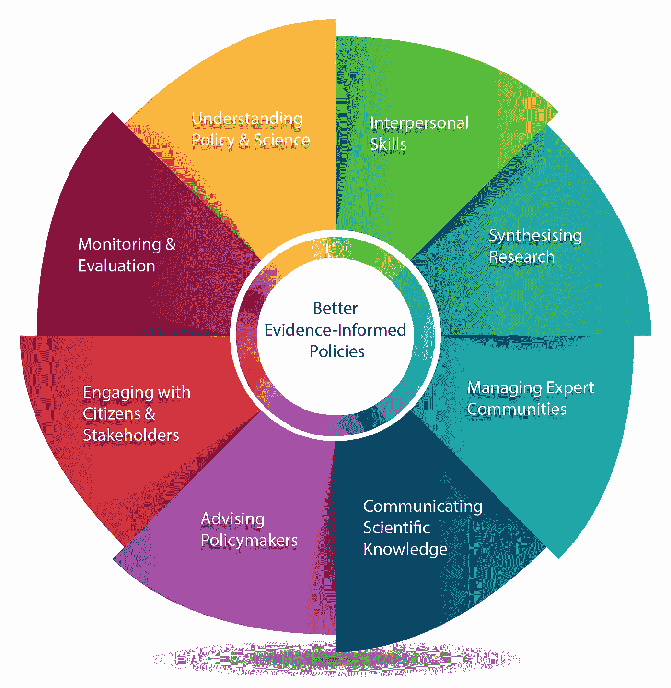
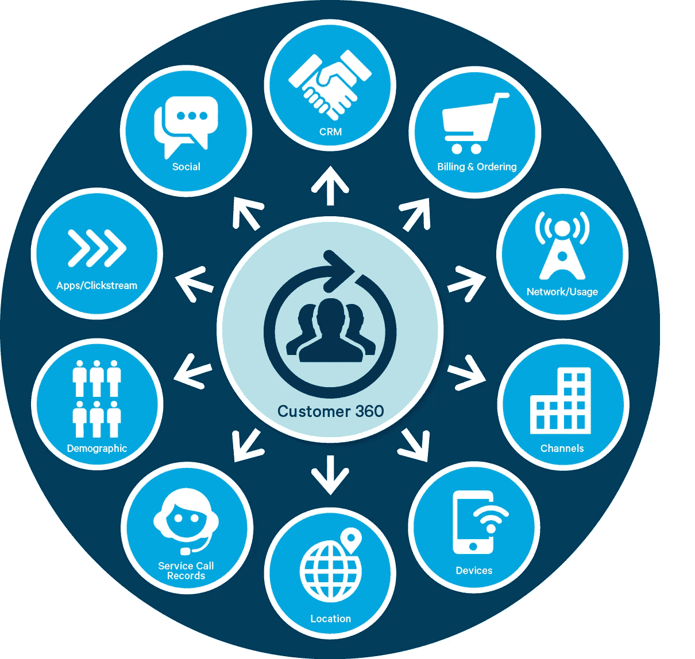
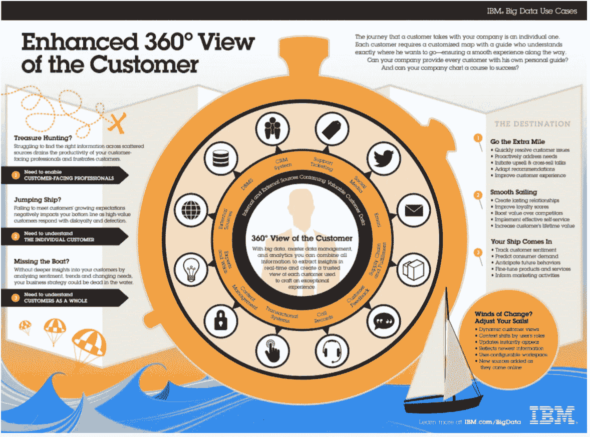

# 什么是数据科学？

> 原文：<https://towardsdatascience.com/what-is-data-science-7b059ba97543?source=collection_archive---------16----------------------->

*作者:本杰明·曼宁博士*

*完全披露:这篇博客的部分内容摘自我为以前工作过的公司写的一篇文章，但内容是我的，没有任何限制。*

前言:在你花几分钟时间阅读这篇文章却发现它不是一个教程之前，我现在就通知你；不是的！然而，如果你是一个有点“非技术”的人，甚至是管理人员，需要好好阅读关于你可以用数据科学“做什么”的书籍，那么你就来对地方了。

早在 1999 年，我就开始了我的机器学习职业生涯，在 2007 年我将自己的公司转型为现在所谓的“数据科学”之前，我喜欢从事各种软件工程，甚至一些网站开发工作。是的，我已经存在了一段时间，看到了许多技术和方法来来去去，但我访问的公司越多，我就越清楚地看到 ***理解数据科学甚至利用内部数据和资源*** 的问题随着时间的推移正在成为一个永远难以解决的问题。

我经常被学生和同事问及我对数据科学的最佳定义。作为一名资深数据科学家，在指导了数百名该领域的专业开发学生多年后，你可能会认为这对我来说是一项容易解决的任务，但我越想越觉得答案越复杂，我认为这正是支持行业中大量困惑的中间派概念。

What is Data Science? source: [https://ec.europa.eu/jrc/communities/sites/jrccties/files/skills_map_v4_1.png](https://ec.europa.eu/jrc/communities/sites/jrccties/files/skills_map_v4_1.png)

这肯定是一个悖论，因为随着时间的推移，大多数行业通过更高层次的理解开始成熟，但数据科学似乎是一只独角兽，至少在放置我们都可以遵循的通用定义的更精细点的意义上。

> ***在我看来，数据科学不应该围绕它是什么来定义，而更应该围绕我们用它做什么来定义— Ben Manning***

在这样做的过程中，人们可以很容易地确定有许多不同类型的数据科学家在扮演许多不同的角色，尽管可以说数据是所有这些的核心，但我认为事实并非如此。我认为 ***值*** 是数据科学中所有不同角色的 ***公分母*** 。

每个人和每个角色都应该带来价值

为公司带来价值是我们在组织中扮演的每一个角色都要做的事情。数据科学家没有什么不同，只是我们有不同的工作介质，我们处理各种形状、大小和形式的数据，这也带来了许多新的支持角色。

数据翻译员、数据工程师、ML 工程师、AI 工程师和一大堆其他新职位目前正在涌入，以填补我们新发现的分析更大和新(更)类型数据的能力所创造的空白。

***让我们看一个典型的例子‘如何’获得这个值***

我拥有两家公司，一家是数据科学企业培训公司( [UpLearn.io](http://uplearn.io) )，另一家是数据科学工程咨询公司( [EdgeLearn.ai](http://EdgeLearn.ai) )，我们经常有客户带着大量数据来找我们，但他们根本没有从中获取价值的起点。这也是我创办企业培训机构的原因之一(不要脸的塞入境！)

随着我们会见越来越多的客户，我们很快发现大多数企业，无论大小，对数据科学到底是什么以及如何利用它都知之甚少。事实证明，这不是一个操作问题，而是一个教育问题，所以我们已经转移我们的重点来解决它，并开始 [UpLearn.io](http://UpLearn.io) 。

我们与许多来到 EdgeLearn.ai 网站的客户合作的一个共同领域是更好地了解他们的客户，或者对他们最重视的人进行 360 度全方位的观察。

Customer 360 Lifecycle | source: [https://2s7gjr373w3x22jf92z99mgm5w-wpengine.netdna-ssl.com/wp-content/uploads/2017/11/customer-360.png](https://2s7gjr373w3x22jf92z99mgm5w-wpengine.netdna-ssl.com/wp-content/uploads/2017/11/customer-360.png)

> ***简单来说:一个企业越了解它的客户；就能更好地为他们服务。***

在构建我们的客户 360 解决方案时，我们使用数据分析、机器学习和大数据来满足许多不同的领域，但大多数都围绕四个主要领域:

1.  了解客户——即谁是我们的典型客户？
2.  预测一个或一组产品的性能或销售。
3.  汇总以前未知的可能交叉销售机会。
4.  为我们的客户构建“假设”场景，提供更多关于最佳和最有可能花费他们宝贵金钱的地方的详细信息。

***为了这篇文章的目的，我已经将所有这些领域简化并合并到建立客户档案中。***

客户档案里有什么？

客户是任何企业的生命线，了解我们所服务的客户的一切不仅可以让我们提供更好的服务，还可以建立品牌忠诚度，甚至简化供应链。来自历史购买的简单人口统计数据可以提供大量信息，如购买行为、品牌偏好，甚至可以更好地描述客户可能购买或不购买产品或服务的具体原因。

例如，我们可以分析包含超过 500，000 次购买的简单数据集，以及简单的人口统计数据，如性别、年龄、邮政编码等。、以及通常通过让顾客注册积分卡和其他营销工具来收集的其他变量。通常，我们还知道产品细节，如价格、功能，有时甚至知道交易中购买的其他产品。

从这些简单的数据中，我们可以使用数据科学来构建客户 360°购买档案，以便更好地了解谁在何时购买了什么。

但是如果我们已经从历史数据中知道了，这又有什么用呢？

***用数据科学实现价值***

数据科学方法让我们能够发现与客户相关的变量之间可能存在的以前未知的关系，这不仅可以帮助我们更好地了解谁买了什么，甚至可能使相关性更好地描述为什么，尽管因果关系不是数据科学的最终目标；正如我们已经说过的，价值是。

Customer Profile | Source: [IBM.com](https://miro.medium.com/max/1400/1*KD8jPYyu4ehSYYiRoPYG-w.png)

更好的是，我们可以使用这些新学到的规则来“模拟”客户的购买行为，不仅预测他们接下来可能会购买什么，还预测他们可能会购买什么。我们还可以更好地理解和模拟我们的营销工作在单个集中领域或支出领域的效果——这意味着什么？这意味着我们可以“模拟”公司在某个过程中花费资金的各个领域的表现。

> 这是数据科学真正带来价值的地方，这又回到了通过我们用它做什么来定义它，通过让我们更好地了解过去，并以比我们以前通常实现相同目标更快、更高效、更可靠和可重复的方式将我们学到的知识应用到未来。

最后，我们正在了解以前我们根本没有能力分析的业务和流程，在许多情况下，我们甚至没有这样做所需的数据。云技术的快速发展消除了基础设施工作，并提供了一种更简单、更简化的方法来处理多个领域的技术，包括多样化数据集、弹性计算、低成本存储、数据共享、ML/AI 打包和更易于使用的可视化工具，这使得发现比以往任何时候都更容易理解和验证，我们只是看到了开始。

> 产生的数据越多，数据科学就变得越相关，我们最终就会更好地理解它是什么，以及我们可以用它来做什么，以更好地服务于我们的企业和社区。

Benjamin Manning 博士来自佐治亚州雅典市，在过去的 25 年里，他一直是一名机器学习顾问和系统工程师。他现在是 IBM 的高级数据科学家，之前是佐治亚大学计算机系统工程学院的成员，目前在许多大学指导数据科学专业发展学生。2017 年，他获得了 O-Reilly 人工智能多样性奖学金和谷歌物联网(IoT)技术研究奖。2018 年，他在佐治亚大学完成了计算机系统工程博士学位，重点是使用深度学习和计算机视觉来改进太阳预测模型。

*你可以在* [*LinkedIn*](https://www.linkedin.com/in/atlsoftware/) *上和他联系。*