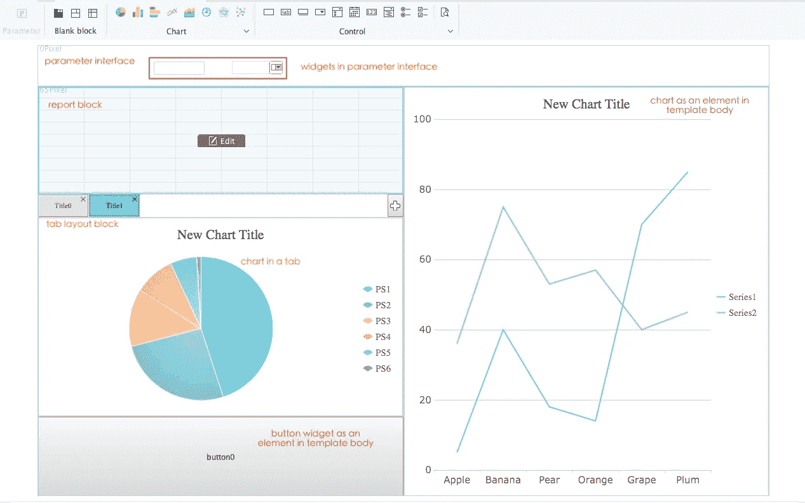
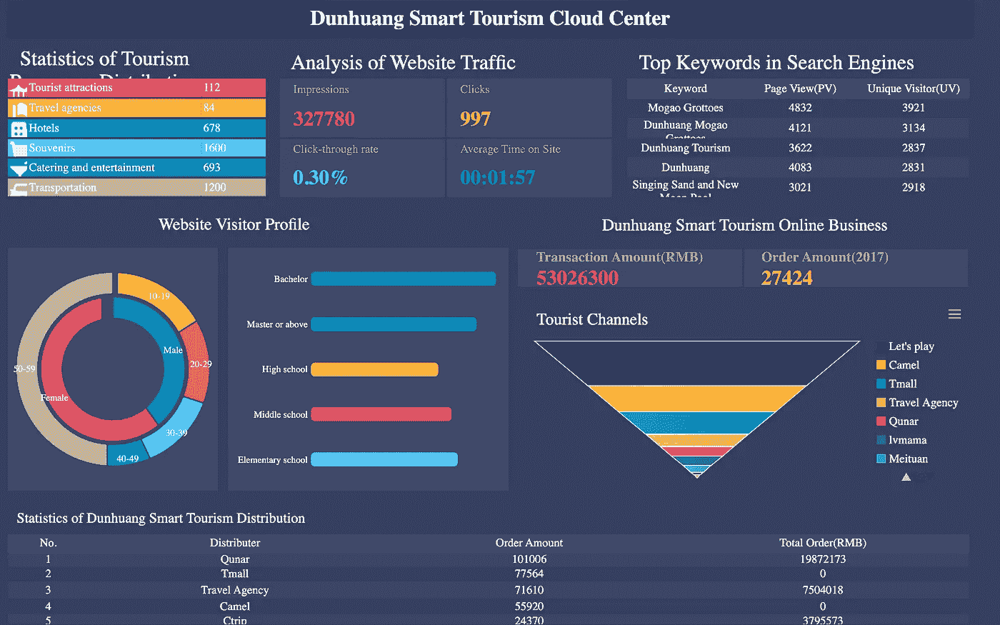

# 什么是大屏幕数据可视化，如何实现？

> 原文：<https://towardsdatascience.com/what-is-data-visualization-for-large-screen-and-how-to-implement-it-1d79cf07783?source=collection_archive---------10----------------------->

# **1。什么是数据可视化？**

在大数据时代，[可视化仪表盘](http://www.finereport.com/en/data-visualization/a-beginners-guide-to-business-dashboards.html?utm_source=medium&utm_medium=media&utm_campaign=blog&utm_term=What%20is%20Data%20Visualization%20for%20Large%20Screen%20and%20How%20to%20Implement%20It%3F)已经成为商业决策的重要工具。

将复杂抽象的数据以一种更容易理解的形式直观地呈现出来的一系列手段被称为[数据可视化](http://www.finereport.com/en/data-visualization/9-data-visualization-tools-that-you-cannot-miss-in-2019.html?utm_source=medium&utm_medium=media&utm_campaign=blog&utm_term=What%20is%20Data%20Visualization%20for%20Large%20Screen%20and%20How%20to%20Implement%20It%3F)。数据可视化旨在使人们快速理解数据背后的含义。

数据可视化除了具有可视化的特性，还具有交流和交互的特性。

# **2。什么是大屏幕数据可视化？**

以大屏幕为主要显示载体的可视化仪表盘设计称为大屏幕数据可视化。它的特点是大面积、酷炫的动态效果和丰富的色彩。大屏幕仪表盘可用于信息显示、数据分析、监控和预警。

# **3。大屏在企业中有哪些应用场景？**

为了让大家更好的理解大屏数据可视化的概念，我将列举一些大屏在企业中的应用场景。

## 3.1 实时监控中心

From FineReport

From FineReport

## 3.2 战略指挥总部

From FineReport

From FineReport

## 3.3 展览中心

From FineReport

## 3.4 会议中心

From FineReport

From FineReport

## 3.5 活动中心

From FineReport

# **4。大屏数据可视化如何入门？**

这里我以数据可视化工具[**FineReport**](http://www.finereport.com/en/?utm_source=medium&utm_medium=media&utm_campaign=blog&utm_term=What%20is%20Data%20Visualization%20for%20Large%20Screen%20and%20How%20to%20Implement%20It%3F)**为例，教你一些基本的技巧，让你快速有效的学会制作一个炫酷的大屏幕仪表盘。**

**FineReport 为企业提供数字大屏幕解决方案。无需特殊定制即可轻松打造炫酷的大屏仪表盘，支持多场景大屏集中控制。而且它的个人版是完全免费的，你可以 [**下载它**](http://www.finereport.com/en/?utm_source=medium&utm_medium=media&utm_campaign=blog&utm_term=What%20is%20Data%20Visualization%20for%20Large%20Screen%20and%20How%20to%20Implement%20It%3F) 放心地练习可视化技术。**

**现在，让我们从仪表板设计的基础开始。**

## ****4.1 了解仪表板设计的基础知识****

## ****①描述****

**[FineReport](http://www.finereport.com/en/?utm_source=medium&utm_medium=media&utm_campaign=blog&utm_term=What%20is%20Data%20Visualization%20for%20Large%20Screen%20and%20How%20to%20Implement%20It%3F) 采用画布风格的操作界面，专为大屏幕和移动终端设计。它可以帮助用户通过简单的拖放操作构建一个强大而全面的“管理驾驶舱”。FineReport 的仪表板设计模式有很多优点:**

**1)多种布局方式:自适应布局、绝对布局、Tab 布局；**

**2)丰富的可视化组件:报表块、图表和小部件；**

**3)组件联动:点击一个组件，其他相应重载数据；**

**4)数据监控:可以自动检测后端数据的变化，仪表板会刷新以更新变化；**

**5)轮播:不同的图表可以在同一个组件中以轮播方式切换。**

## ****②仪表板界面****

**打开设计器，点击**文件>新建表单**创建一个新的仪表板模板，如下图所示。**

****

**仪表板有许多组件，如参数界面、空白块、图表等。为了帮助您理解每个组件的含义，我将所有组件添加到同一个界面中。**

****

****-参数界面:**将该元素拖动到画布上，会得到一个过滤报表块和图表中数据的面板。您可以向面板添加小部件。**

****-空白块:**空白块包含页签布局块、绝对布局块和报表块。**

**选项卡布局块可以在选项卡中显示不同组件，并以轮播模式实现组件切换。**

**绝对布局块使元素的大小固定。**

**报告块类似于常规报告，数据显示在组件范围内。**

****-图表:**常规报表支持的所有图表类型都可以拖到画布上进行数据可视化。**

****-Widget:**Widget 是过滤数据的组件。它可以作为参数界面的一部分添加，也可以作为单独的组件添加。**

## ****4.2 根据指标选择图表类型****

*   **进行业务需求研究，提取基于业务场景的关键指标。**
*   **根据关键指标确定[图表类型](http://www.finereport.com/en/data-visualization/top-16-types-of-chart-in-data-visualization.html?utm_source=medium&utm_medium=media&utm_campaign=blog&utm_term=What%20is%20Data%20Visualization%20for%20Large%20Screen%20and%20How%20to%20Implement%20It%3F)。**

****

**数据可视化的最终目的是更清晰地传达信息，也就是用什么图形来呈现数据是很重要的。我们确定了一个数据关系类型后，就可以根据数据的使用场景，找出对应的图表和使用建议，并从中进行选择。**

********

**From FineReport**

**如果想了解更多各种图表的使用场景，可以阅读本文 [***数据可视化中的 16 大图表类型***](/top-16-types-of-chart-in-data-visualization-196a76b54b62) 。**

## ****4.3 大屏幕设计布局****

**设计布局就是把大屏幕按照大小分成几个区域，每个区域放置一个业务指示器。根据数据可视化的目的提取指标，分为一级指标和二级指标。一级业务指标通常安排在中间位置，占用面积较大，其余指标围绕一级指标进行。以下是大屏幕的常见布局设计。**

********

**From FineReport**

*   **主要指示器:大多位于屏幕中央。您可以添加动态效果来增强视觉效果。**
*   **次要指标:大多在屏幕两侧，一般是各种类型的数据或图表。**

## ****4.4 考虑配色方案****

**合理的布局可以让商业内容更有层次，合理的配色可以让浏览者更舒服。大屏幕的仪表盘背景色通常遵循两个原则:深色调和一致性。如下图，我给你看几个推荐的配色。**

****

**单个元素的背景应该与整体背景颜色一致，以避免突兀。建议用透明色搭配一些单独的组件元素。**

****

**From FineReport**

## ****4.5 添加动态效果****

**动态效果的范围很广，可以从多个角度解读，比如背景动画、刷新加载动画、轮播动画、图表闪烁动画、地图流动动画等。，都属于动态效果的范畴。**

****

**From FineReport**

**动感的增加可以让大屏幕看起来活灵活现。然而，过多的动态使观众眼花缭乱，导致大屏幕仪表盘失去了商业显示器的价值。既要平衡酷炫的效果，又要突出内容。**

**如下图高速公路监控仪表盘，动态显示路况下通行费缴纳数值，关键信息一目了然。**

****

**From FineReport**

# ****最终****

**现在，你明白什么是大屏幕数据可视化以及如何实现它了吗？如果你想要一个更详细的大屏幕仪表盘制作教程，本文 [***一步一步制作销售仪表盘***](/a-step-by-step-guide-to-making-sales-dashboards-34c999cfc28b) 将对你有所帮助。而且我觉得可视化工具 [**FineReport**](http://www.finereport.com/en/?utm_source=medium&utm_medium=media&utm_campaign=blog&utm_term=What%20is%20Data%20Visualization%20for%20Large%20Screen%20and%20How%20to%20Implement%20It%3F) 对于那些初学者来说是个不错的选择。**

# **您可能也会对…感兴趣**

**[*2019 年你不能错过的 9 个数据可视化工具*](/9-data-visualization-tools-that-you-cannot-miss-in-2019-3ff23222a927)**

**[*数据分析师需要掌握的 6 项关键技能*](/6-key-skills-that-data-analysts-need-to-master-df1d82257b9)**

**[*商业仪表盘入门*](/a-beginners-guide-to-business-dashboards-981a8192a967)**

**[*新手如何设计酷炫的数据可视化？*](/how-can-beginners-design-cool-data-visualizations-d413ee288671)**

**[*2019 年 6 大数据分析工具*](/top-6-data-analytics-tools-in-2019-4df815ebf82c)**

**[*数据可视化十大地图类型*](/top-10-map-types-in-data-visualization-b3a80898ea70)**