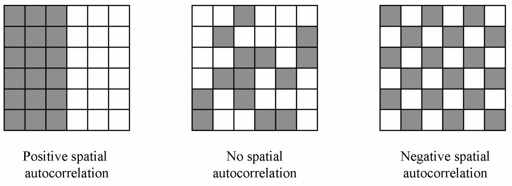
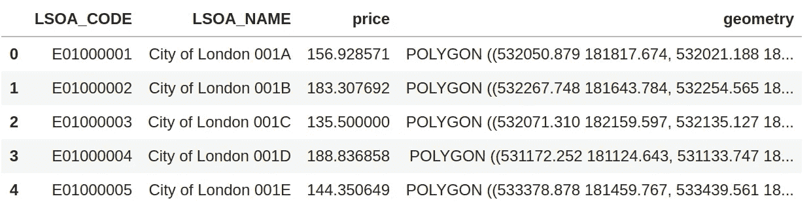
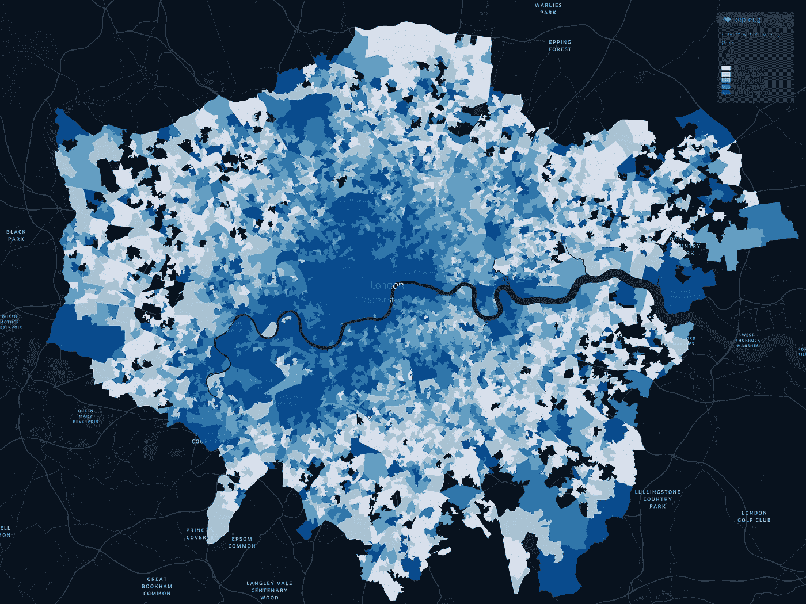
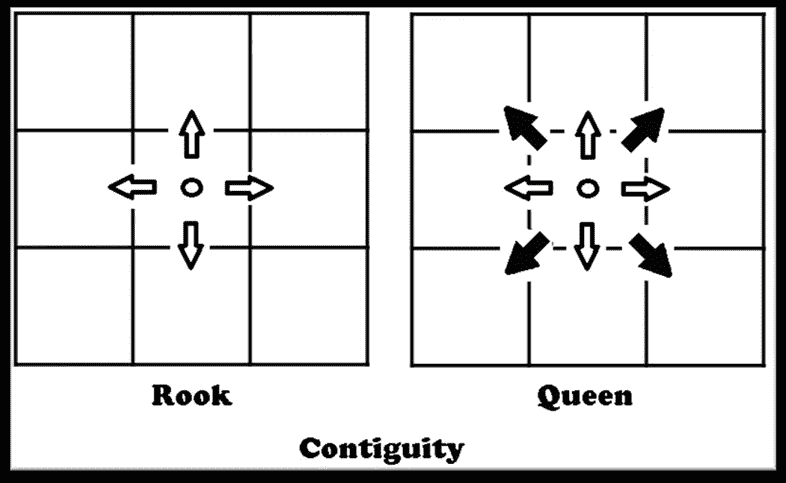
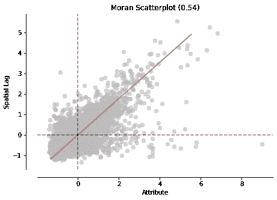
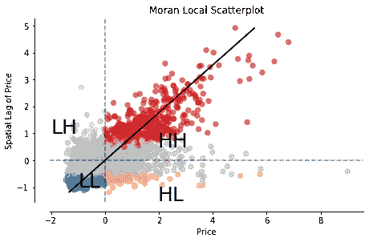
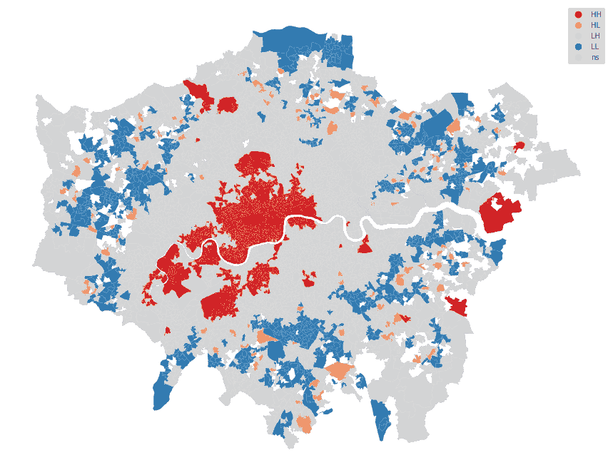

# 什么是探索性空间数据分析(ESDA)？

> 原文：<https://towardsdatascience.com/what-is-exploratory-spatial-data-analysis-esda-335da79026ee?source=collection_archive---------9----------------------->

## 提示:不是通常的 EDA。关于如何使用空间探索性数据分析(空间自相关)从数据中获得洞察力的指南


Photo by [fabio](https://unsplash.com/@fabioha?utm_source=medium&utm_medium=referral) on [Unsplash](https://unsplash.com?utm_source=medium&utm_medium=referral)

当您想要从基于位置的数据中探索模式时，您会怎么做？你怎么知道你的位置数据不是随机的？用相关性就够了吗？或者有没有其他的统计方法用于这种探索性的数据分析。

在本教程中，我将向您展示如何使用 Python 通过简单易行的步骤对您的位置数据执行探索性数据分析。Github 中也有本教程的代码。

## 探索性空间数据分析

在数据科学中，我们倾向于在进行任何建模或处理任务之前探索和研究数据。这有助于您识别模式、总结数据的主要特征或测试假设。传统的探索性数据分析并不明确调查数据集的位置成分，而是处理变量之间的关系以及它们如何相互影响。相关统计方法常用于探讨变量之间的关系。

相比之下，探索性空间数据分析(ESDA)将特定变量与位置相关联，同时考虑邻域中相同变量的值。用于此目的的方法称为空间自相关。

空间自相关描述给定变量中存在(或不存在)空间变化。像传统的相关方法一样，空间自相关具有正值和负值。正空间自相关是指彼此靠近的区域具有相似的值(高-高或低-低)。另一方面，负的空间自相关表示相邻区域不同(低值紧挨着高值)。



Spatial Autocorrelation: [Source](http://emilkirkegaard.dk/en/wp-content/uploads/SAC_illu.png)

探索性空间数据分析(ESDA)主要有两种方法:全局和局部空间自相关。全局空间自相关侧重于数据集中的总体趋势，并告诉我们数据集中的聚集程度。相比之下，局部空间自相关检测数据集中的可变性和发散性，这有助于我们识别数据中的热点和冷点。

## 获取数据

在本教程中，我们使用 Airbnb 数据集(点数据集)和伦敦的图层超级输出区域-LSOA-邻域(面数据集)。我们进行空间连接，将 Airbnb 房源的每个点连接到邻近区域。如果您想了解并在工作流中使用强大的空间连接工具。我这里有个教程:

[](/how-to-easily-join-data-by-location-in-python-spatial-join-197490ff3544) [## 如何在 Python 中通过位置轻松连接数据—空间连接

### 如何在 Python 中轻松地进行空间连接，以及为什么它是数据科学中经常被忽略的强大工具。

towardsdatascience.com](/how-to-easily-join-data-by-location-in-python-spatial-join-197490ff3544) 

我们使用的数据集是空间连接的伦敦 Airbnb 房产，带有每个本地区域(街区)的房产平均价格。

对于本教程，我们使用 Pandas、Geopandas 和 [Python 空间分析库(Pysal)](https://pysal.readthedocs.io/en/latest/) 库。所以让我们导入这些库。

```
import pandas as pd
import geopandas as gpd
import matplotlib.pyplot as pltimport pysal
from pysal import esda, weights
from esda.moran import Moran, Moran_Localimport splot
from splot.esda import moran_scatterplot, plot_moran, lisa_cluster
```

我们可以读取 Geopandas 中的数据。

```
avrg_price_airbnb = gpd.read_file(“london-airbnb-avrgprice.shp”)
avrg_price_airbnb.head()
```

以下是伦敦 Airbnb 房产均价的前 5 行。



由于我们有一个几何列(纬度和经度)，我们可以映射数据。这是每个街区平均价格的 choropleth 图。



choropleth map — average prices of Airbnb properties in London.

有了这张 choropleth 地图，我们可以看到分箱的价格范围，但这并没有给我们任何统计数据，我们可以确定是否存在空间自相关(正或负，甚至热点和冷点在哪里。这就是我们接下来要做的。

## 空间权重和空间滞后

在执行任何空间自相关之前，我们首先需要确定空间权重和空间滞后。

空间权重是我们确定区域邻域的方式。有多种不同的统计方法用于确定空间权重，除此之外，本文将对每种方法进行深入解释。最常用的空间权重方法之一是我们使用的皇后邻接矩阵。这是一个解释女王邻接矩阵如何工作的图表(也包括车邻接矩阵)



Contiguity Matrix [Source](https://www.researchgate.net/figure/Rooks-vs-Queens-Contiguity_fig8_304782766)

为了计算皇后邻接空间权重，我们使用 Pysal。

```
w = weights.Queen.from_dataframe(avrg_price_airbnb, idVariable=”LSOA_CODE” )w.transform = "R"
```

另一方面，空间滞后是给定变量(在我们的例子中是价格)的空间权重矩阵的乘积。空间分支对行进行标准化，并获取每个加权邻域中价格的平均结果。

```
avrg_price_airbnb[“w_price”] = weights.lag_spatial(w, avrg_price_airbnb[“price”])
```

现在，我们在表中创建了一个新列来保存每个街区的加权价格。

## 全球空间自相关

全局空间自相关决定了数据集中的整体模式。这里我们可以计算是否有趋势，并总结感兴趣的变量。Moran 的 I 统计通常用于确定全局空间自相关，因此让我们来计算一下。

```
y = avrg_price_airbnb[“price”]
moran = Moran(y, w)
moran.I
```

我们得到这个数据集的数字 **0.54** 。这个数字是什么意思？这个数字总结了数据集的统计数据，就像非空间数据的平均值一样。莫兰的 I 值范围从-1 到 1。在我们的案例中，该数字提供了该数据集中存在正空间自相关的信息。请记住，我们仅使用 Moran 的 I 统计量来确定全局自相关。它并没有告诉我们这个正的空间自相关存在于哪里(我们接下来会这样做)。

我们使用 Moran 的 I 图来显示全球空间自相关，这与其他散点图相同，使用线性拟合来显示两个变量之间的关系。

```
fig, ax = moran_scatterplot(moran, aspect_equal=True)
plt.show()
```



Moran’s I Scatter Plot

Moran 的 I 散点图和 Moran 的 I 散点图都显示了数据集中不同位置的正相关观察值。让我们看看数据集中哪里有空间变化。

## 局部空间自相关

到目前为止，我们只确定了邻近地区的房地产价格与其位置之间存在正的空间自相关。但是我们还没有探测到星团在哪里。空间关联局部指标(LISA)就是用来做这个的。LISA 将区域分为四组:高值接近高值(HH)，低值接近低值(LL)，低值在其邻域内具有高值，反之亦然。

我们已经计算了权重(w ),并将价格确定为我们感兴趣的变量(y)。为了计算 Moran 局部，我们使用 Pysal 的功能。

```
# calculate Moran Local 
m_local = Moran_Local(y, w)
```

和 plot Moran 的局部散点图。

```
# Plot
fig, ax = moran_scatterplot(m_local, p=0.05)
ax.set_xlabel(‘Price’)
ax.set_ylabel(‘Spatial Lag of Price’)
plt.text(1.95, 0.5, “HH”, fontsize=25)
plt.text(1.95, -1.5, “HL”, fontsize=25)
plt.text(-2, 1, “LH”, fontsize=25)
plt.text(-1, -1, “LL”, fontsize=25)
plt.show()
```

正如我们提到的，散点图将这些区域分为四组。



Moran Local Scatter Plot — LISA

现在，这很酷，我们可以看到所有的值被分为四组，但令人兴奋的是看到这些值在地图上聚集在一起。同样，Pysal (splot)中有一个函数可以绘制 LISA 结果的地图。



LISA Cluster Map -Airbnb Average price per neighborhood.

上面的地图显示了 Airbnb 房产平均价格的变化。红色表示聚集在一起的社区，这些社区的物价很高，周围也很高(主要是市中心)。蓝色区域表示价格低的地方，周围也是低价值价格的区域(主要是外围)。同样有趣的还有低-高和高-低面积浓度。

与我们从本教程开始的 Choropleth 地图相比，LISA 更加清晰，并提供了数据集的清晰图片。探索性空间数据分析(ESDA)技术是帮助您识别可应用于任何给定变量的空间自相关和局部聚类的强大工具。

## 结论

在本教程中，我们探讨了如何对空间数据执行探索性数据分析(EDA)。本教程的代码可以在 GitHub 的笔记本和数据中找到。

[](https://github.com/shakasom/esda/blob/master/Exploraty_Spatial_Data_Analysis.ipynb) [## shakasom/esda

### 此时您不能执行该操作。您已使用另一个标签页或窗口登录。您已在另一个选项卡中注销，或者…

github.com](https://github.com/shakasom/esda/blob/master/Exploraty_Spatial_Data_Analysis.ipynb) 

您也可以从这里直接运行 Google Colab 笔记本:

[](https://colab.research.google.com/drive/1R8hzFFX50qnfipoXcdXi4zCmG0zvTXD5) [## 谷歌联合实验室

### 编辑描述

colab.research.google.com](https://colab.research.google.com/drive/1R8hzFFX50qnfipoXcdXi4zCmG0zvTXD5)