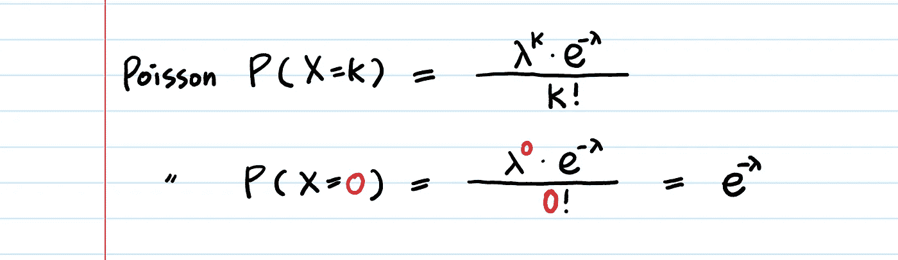
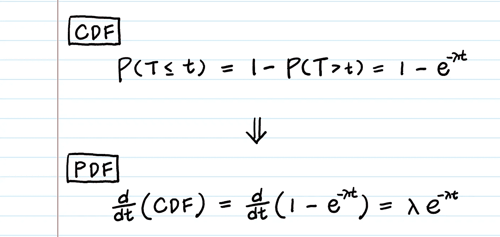
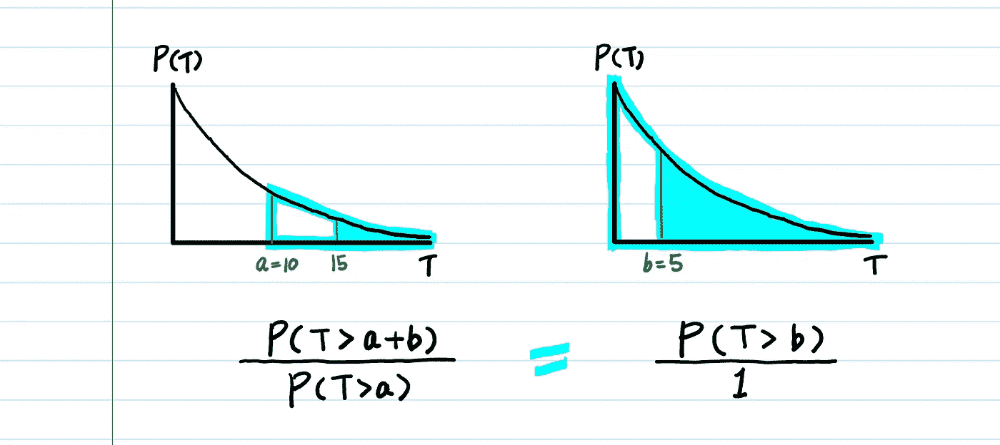
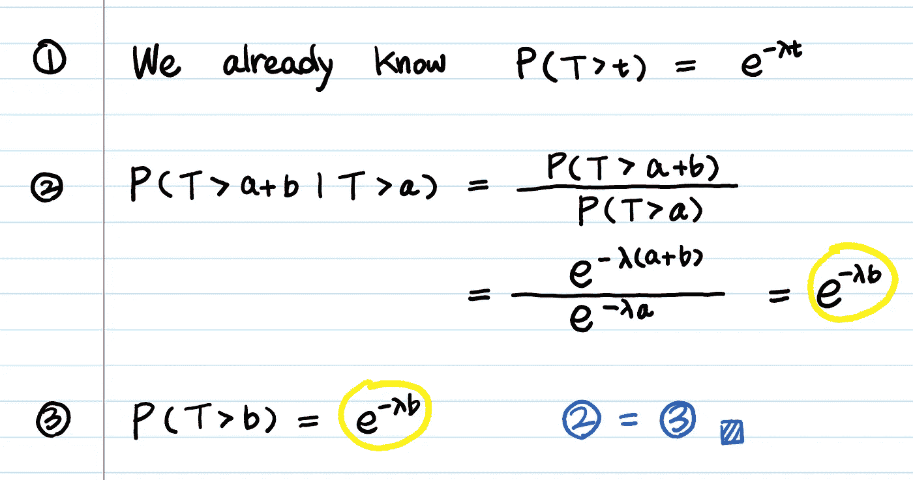
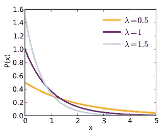

# 指数分布——直觉、推导和应用

> 原文：<https://towardsdatascience.com/what-is-exponential-distribution-7bdd08590e2a?source=collection_archive---------1----------------------->

## 何时使用指数分布

我们总是从“为什么”开始，而不是直接进入公式。如果你明白其中的原因，它会一直伴随着你，你会更有可能把它应用到你自己的工作中。

# 1.为什么我们必须发明指数分布？

**预测直到下一个事件(即成功、失败、到达等)的等待时间。).**

例如，我们希望预测以下内容:

*   **到**顾客完成浏览并在您的商店实际购买商品的时间 **(成功)。**
*   **AWS EC2 上的硬件出现故障****之前的时间。**
*   ****你需要等待**的时间****直到**公交车到达(到站)。****

****那么，我的下一个问题是这样的:**为什么λ * e^(−λt)是下一个事件发生之前的时间的 PDF？******

****接下来的问题是:**X ~ Exp(0.25)是什么意思？** 参数 **0.25** 是指 **0.25** **分钟**、**小时**还是**天**，还是指 **0.25** **事件**？****

****从这一点开始，我假设你对泊松分布了如指掌。如果你没有， [*这篇文章*](https://medium.com/@aerinykim/poisson-distribution-intuition-and-derivation-1059aeab90d) *会给你一个清晰的思路。*****

******X～Exp(λ)**👉**泊松中的指数参数λ和λ一样吗？******

****关于 **X ~ Exp(0.25)** 有一点可以让你免于混淆，那就是记住 0.25 是 ***而不是*持续时间**，但它是**事件** **速率，**与 [**泊松过程**](https://medium.com/@aerinykim/poisson-distribution-intuition-and-derivation-1059aeab90d) **中的参数λ相同。******

****例如，你的博客每天有 *500 名访客*。那是一个**率**。*一个小时内到店的顾客数量，每年的地震次数，一周内的车祸次数，一页的错别字数量，在 Chipotle 发现的头发数量等。、*都是单位时间的**率(λ)**是泊松分布的参数。****

****然而，当我们对事件之间的**经过时间建模时，我们倾向于用**时间**来代替速率，例如*计算机可以无故障开机的年数是* ***10 年*** *(而不是* *说* ***0.1 故障/年，*当你看到**时，术语——指数分布的“均值”——1/λ就是它的意思。**********

当你看到术语****衰变参数****或者更糟糕的术语****衰变率****时，困惑就开始了，这个术语在指数分布中经常使用。*衰变参数*以**时间**表示(例如，每 10 分钟、每 7 年等。)，它是泊松中速率(λ)的**a**倒数(1/λ)。想一想:如果你每小时得到 3 个客户，就意味着你每 1/3 小时得到一个客户。****

**所以，现在你可以回答如下: **“X ~ Exp(0.25)”是什么意思？****

**意思是**泊松比** **会是 0.25。**在一个**单位时间**(可以是分钟、小时、年)**内，事件平均发生 0.25 次**。把这个转换成*时间项*，假设你的单位时间是一个小时，那么事件发生需要 **4 个小时**(0.25 的倒数)。**

```
***** Confusion-proof : Exponential‘s parameter λ is the same as that of Poisson process (λ).****
```

# **2.让我们从零开始推导指数的 PDF！**

**我们的第一个问题是:**为什么λ * e^(−λt)是直到下一个事件发生的时间的 PDF？****

**指数分布的定义是一个 [*泊松过程*](https://medium.com/@aerinykim/poisson-distribution-intuition-and-derivation-1059aeab90d) *中的****事件之间的时间*的概率分布。*******

*想想看， ***事件*发生前的时间量**是指**在等待期间，没有一个事件发生。***

*换句话说，这就是**泊松(X=0)。***

**

***Poisson(X=0)**: the first step of the derivation of Exponential dist.*

*关于泊松 PDF 需要记住的一点是**泊松事件(X=k)发生的时间周期仅仅是一(1)个单位时间。***

*如果你想对“在 ***持续时间* *t*** ，*不仅仅是在* ***一个单位时间内*，**什么都不发生”的概率分布建模，你会怎么做呢？*

```
***P(Nothing happens during t time units)**= P(X=0 in the first time unit) 
  * P(X=0 in the second time unit) 
  * … * P (X=0 in the **t-th** time unit) 
= e^−λ * e^−λ * … * e^−λ = **e^(-λt)***
```

*泊松分布假设事件的发生相互独立。所以我们可以通过将 P( **X** =0 在单个单位时间内) **t** 乘以，计算出在 **t** 单位时间内零成功的概率。*

```
***P(T > t)** **= P(X=0 in t time units) = e^−λt*** **T** : **the random variable of our interest!
     ** the random variable for **the waiting time until the first event**
* **X** : **the # of events in the future which follows the Poisson dist.*** **P(T > t) :** The probability that the waiting time until the first event is greater than **t** time units
* **P(X = 0 in t time units) :** The probability of zero successes in **t** time units*
```

*PDF 是 CDF 的衍生物。
既然我们已经有了指数的 CDF， **1 - P(T > t)，**就可以通过微分得到它的 PDF。*

**

*The probability density function is the derivative of the cumulative density function.*

# *3.无记忆属性*

```
***Defintion:****P(T > a + b | T > a) = P(T > b)***
```

*这意味着…*

**

*给我看看证据？*

**

> ***无记忆是“有用”的属性吗？***

*使用指数分布对机械设备的寿命建模是否合理？*

*例如，如果设备已经使用了九年，那么无记忆意味着它将继续使用三年(因此，总共 12 年)的概率与一台全新的机器继续使用三年的概率完全相同。*

```
***P(T > 12|T > 9) = P(T > 3)***
```

*你觉得这个等式合理吗？*

*对我来说，没有。根据我的经验，设备越老越容易坏。为了对这一特性建模，例如，我们可以使用[威布尔分布](https://en.wikipedia.org/wiki/Weibull_distribution)。*

> *那么，什么时候使用指数分布比较合适呢？*

*车祸。如果在过去的五个小时里没有人撞到你，这不会增加或减少你发生车祸的几率。这就是为什么 **λ通常被称为危险率。***

> *还有谁拥有无记忆属性？*

*指数分布是**唯一的**连续分布，它是无记忆的(或者具有恒定的失效率)。几何分布，它的离散对应物，是唯一无记忆的离散分布。*

# *4.应用程序 IRL🔥*

***a)等待时间建模***

*指数随机变量的值有更多的小值和更少的大值。你正在等的公共汽车可能在接下来的 10 分钟内到达，而不是接下来的 60 分钟。*

> *使用指数分布，我们可以回答下面的问题。*
> 
> *1.公共汽车平均每 15 分钟来一趟。(假设从一辆公交车到下一辆公交车的时间呈指数分布，这意味着一小时内到达的公交车总数呈泊松分布。)而我刚好错过了公交车！司机不友好。我一到，司机就关上门走了。如果下一班公共汽车在十分钟内没有到达，我必须打电话给优步，否则我会迟到。下一辆公共汽车不到十分钟到达的可能性有多大？*
> 
> *2.90%的公共汽车在前一辆公共汽车几分钟内到达？*
> 
> *3.两辆公共汽车平均需要多长时间到达？*
> 
> **如果你想看看你的答案是否正确，请在评论中发表你的答案。*

***b)可靠性(故障)建模***

*既然我们可以模拟成功的事件(公共汽车的到达)，为什么不能模拟失败——产品持续的时间？*

> *AWS 硬件在需要重启之前可以运行的小时数呈指数分布，平均为 8000 小时(大约一年)。*
> 
> *1.您没有备份服务器，需要不间断运行 10，000 小时。不重启服务器就能完成运行的可能性有多大？*
> 
> *2.服务器在 12 个月到 18 个月之间不需要重启的概率是多少？*

*请注意，有时指数分布可能不合适——当故障率在整个生命周期内变化时。然而，它将是唯一一个具有这种独特性质的分布——恒定危险率。*

***c)服务时间建模(排队论)***

*代理的服务时间(例如，Chipotle 员工为我做墨西哥卷饼需要多长时间)也可以建模为指数分布变量。*

*流程的总长度——几个独立任务的序列——遵循 [Erlang 分布](https://en.wikipedia.org/wiki/Erlang_distribution):几个独立的指数分布变量之和的分布。*

# *5.概述:泊松分布和指数分布之间的关系*

*如果单位时间内的事件数量遵循泊松分布，则事件之间的时间量遵循指数分布。*

*假设事件之间的时间不受之前事件之间的时间的影响(即，它们是独立的)，那么单位时间内的事件数量遵循泊松分布，比率为 **λ** **=** **1/μ** 。*

# *6.锻炼*

*我发现我对数学题目的理解大部分来自于做题。所以，我鼓励你也这样做。尝试完成下面的练习，即使它们需要一些时间。*

1.  *设 U 是 0 到 1 之间的均匀随机变量。那么指数随机变量 **X** 可以被生成为*

```
***X = -1/λ * ln(U)***
```

*证明原因。*

*2.PDF 的 *y* 轴上的最大值为 **λ** 。为什么会这样呢？*

**

*[Probability Density Function of Exponential Distribution](https://en.wikipedia.org/wiki/Exponential_distribution)*

*3. **X1** 和 **X2** 是独立的指数随机变量，速率为 **λ** 。*

***X1 ~ Exp(λ)
X2 ~ Exp(λ)***

*让 **Y=X1+X2** 。*

***Y** 的 PDF 是什么？这个分布可以用在哪里？*

*[答案在这里。](https://medium.com/@aerinykim/sum-of-exponential-random-variables-b023b61f0c0f)*

## *你可能喜欢的其他直观的文章:*

*[](/poisson-distribution-intuition-and-derivation-1059aeab90d) [## 泊松分布直觉(和推导)

### …为什么泊松会发明这个？…](/poisson-distribution-intuition-and-derivation-1059aeab90d) [](/beta-distribution-intuition-examples-and-derivation-cf00f4db57af) [## 贝塔分布——直觉、例子和推导

### …二项式和贝塔式的区别在于前者模拟成功的次数，而后者模拟成功的概率…](/beta-distribution-intuition-examples-and-derivation-cf00f4db57af)*