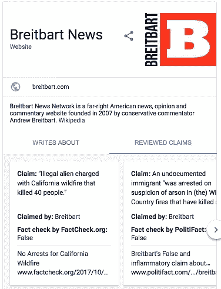

# 对于自动事实核查来说，什么是“足够好”呢？

> 原文：<https://towardsdatascience.com/what-is-good-enough-for-automated-fact-checking-4454ace645c7?source=collection_archive---------22----------------------->

## 自动化事实核查即将到来，但我们无法就基本定义和标准达成一致。

虽然事实审查员总是很忙，但选举季节不可避免地增加了他们的工作量。因此，事实核查社区中的许多人梦想有一天自动事实核查系统能够在总统辩论等重要事件中实时显示事实核查。

但是什么是自动事实核查呢？出于本文的目的，自动事实核查系统依靠计算方法来 1)减少有问题的陈述(索赔)和更正(事实核查文章)之间的滞后时间，以及 2)增加与事实核查相关的索赔数量。

最常讨论的(和资助的)开发自动化事实检查的策略依赖于“声明匹配”。主张匹配系统从政治辩论、演讲、推文等中提取文本。并标识已经被事实检查过语句，并将已经创建的事实检查文章链接到“有问题的”文本片段。这种方法理论上有助于核实更多内容，因为演讲、辩论、推特等中有许多不真实或误导性的陈述。重复的说法可能已经被事实证实(例如，奥巴马不是在美国出生的，疫苗会导致自闭症)。

# 示例:已审核的索赔

索赔匹配系统的一个实现是谷歌的短命审查索赔功能，它出现在新闻出版商的谷歌搜索结果页面的子集上。该功能将新闻出版商文章中的声明与已经存在的事实核查文章相匹配。

该专题发布两个月后，保守派新闻媒体抱怨称，他们受到了该专题不公平的攻击。谷歌删除了这一功能，并向[波因特](https://www.poynter.org/fact-checking/2018/google-suspends-fact-checking-feature-over-quality-concerns/)解释说，他们“在我们将事实核查映射到出版商的系统中遇到了挑战，经过进一步检查，很明显我们无法为用户提供我们想要的质量。”

Image of the Reviewed Claims feature that appeared on some news publisher search result pages from November 2017 to January 2018\. Reviewed Claims was removed by Google after conservative media backlash and amid quality concerns.

虽然我不确定审查索赔系统是如何设计的，但谷歌研究人员在 2018 年[发表了一篇论文](https://www2.kbs.uni-hannover.de/fileadmin/institut/pdf/webscience/2019/1_p525-wang.pdf)，概述了一个解决“索赔相关性发现问题”的系统，即识别包含(并支持)事实核查声明的在线文章。如果这听起来相似，基本上就是前面描述的索赔匹配。谷歌的论文描述了一种准确率约为 82%的方法。

过去一年来,“已审核索赔”案例研究吸引了我，并促使我考虑以下两个问题:

**1。对于一个公开发布的自动化事实检查工具，什么是合适的准确度分数(和相关的度量标准)？**

**2。我们应该如何定义“相关的”索赔匹配？**

我怀疑(事实核查社区的许多其他人也怀疑)我们是否接近自动化事实核查系统接近完美的准确性水平，因此我们需要坦率地讨论令人满意的精确度，并回忆这些系统的分数，因为我们计划将这项研究转移到公共领域。这种对话对于构建工具的事实核查组织、试图根据事实核查文章的存在来了解消息来源可信度的用户，以及其收入流被推荐算法改变的新闻出版商来说非常重要，推荐算法会考虑出版商的内容是否已被事实核查人员标记。

然而，如果我们不理解*何时*一个声明*应该*与事实核查相匹配，那么关于适当指标的讨论是没有用的。概括地说，事实核查文献已经建立了一个“良好的”自动权利要求匹配系统，将有问题的权利要求与相关的*事实核查文章进行匹配。*

*虽然这看起来很简单，但确定相关性实际上比乍看起来要复杂得多。换句话说，是的，在自动事实核查中没有一个“足够好”的共同定义，但是，更根本的是，我们没有一个“相关”索赔匹配的共同定义。*

# *确定相关性:一个思维实验*

*这里有一个快速练习来说明在索赔匹配中确定相关性的困难。**思考以下哪个标题应与事实核查“疫苗不会导致自闭症”的说法相匹配(即*相关*)***

*   ***“疫苗*可能*导致自闭症:“**注意，这篇文章并没有说疫苗*导致*自闭症。标题用“可能”这个词来修饰疫苗和自闭症之间的联系。*
*   ***“关于疫苗的效果，我们并不知道我们应该知道的一切”:**这个标题是第一个的更极端版本。为了增加复杂性，让我们想象这篇文章甚至没有在文章的任何地方提到自闭症这个词，但它确实建议父母尽可能久地等待给孩子接种疫苗，因为潜在的风险。*
*   ***“杰西卡·贝尔称疫苗可能导致自闭症”:**这篇文章没有对疫苗是否会导致自闭症表明立场，这位新闻发布者似乎只是在报道一位名人所说的话。*
*   ***“疫苗可能导致乳腺癌:“**这篇文章没有提到自闭症，但确实说 MMR 疫苗和乳腺癌之间有直接联系。*
*   ***“疫苗导致自闭症，我是英国女王”:**这篇文章多次提到疫苗导致自闭症，但本意是讽刺。*

*确定“疫苗不会导致自闭症”是否是这些文章中每一篇的相关主张匹配简单吗？我的研究表明，对大多数人来说，事实并非如此。我对本科生和亚马逊机械土耳其工人进行了一项小规模定性研究，其前提与上述思想实验相似。我发现本科生在这项任务上经历了一段具有挑战性的时间，但在和解过程之后，最终彼此达成了适度的一致。然而，亚马逊土耳其机械公司的员工对相关索赔匹配的定义要比本科生宽松得多。这一初步发现还需要进一步的研究。*

# *在事实核查文献中，关联性是如何定义的？*

*我发现，关于定义相关性的定义挑战，目前的出版物和自动事实核查系统的描述对这些基本定义缺乏重视。我在下面提供了两个例子，但还有其他例子。*

*   *在 Google 关于“索赔相关文档发现”的研究论文中，有两条关于相关性的评论。一个是技术定义:“给定一篇带有权利要求 *c* 的事实核查文章，权利要求相关文档是一个处理 *c* 的相关文档。”我个人认为这个定义并不充分。更能说明这一困境的是作者在引言中的评论:“权利要求相关性发现问题不需要在文档中出现字面上或精确的权利要求，而是旨在找到那些看起来在精神上一致的权利要求。”*

*主张只需要“精神上一致”就可以成为相关匹配的想法有点说明问题，因为它可能意味着第一个带项目符号的假设性主张“疫苗可能导致自闭症”，我上面概述的应该被标记为与事实检查“疫苗不会导致自闭症”相关，但这个定义仍然留下了如何解决其他几个主张的问题。*

*   *ClaimBuster 是一个端到端的自动事实核查系统，具有索赔匹配组件。据我所知，这是自动化的事实核查系统，在学术场所被写得最多。在讨论“索赔匹配器”组件如何工作时，给出了下面的解释:“索赔匹配器搜索事实检查库，并返回那些与索赔匹配的事实检查…系统有两种方法来测量索赔和事实检查之间的相似性…一个 Elasticsearch 服务器被部署用于基于标记相似性搜索知识库，而一个语义相似性搜索工具包 Semilar 被应用于基于语义相似性的搜索。我们将两者的搜索结果结合起来，寻找与给定声明相似的事实核查。”*

*我也认为这种确定相关性的解释是不充分的。对一个系统所采用的技术方法的描述并不能解决任何关于相关性定义的细微差别的遗留问题。它也不允许我们以一种有意义的方式将这个系统与谷歌论文中的“精神一致”指南进行比较。*

# *最后…*

*其他人呼吁在过度承诺自动事实核查的能力时要谨慎，我认为这些担忧是有根据的。然而，我提出了一些不同的建议:我认为事实核查社区需要确保我们批判性地思考当谈到自动事实核查系统时，“足够好”和“相关”意味着什么。我有兴趣听听其他人对这些问题的想法，请随时联系。*

**感谢* [*埃尼·穆斯塔法拉杰*](https://medium.com/u/82d778d27ffe?source=post_page-----4454ace645c7--------------------------------) *他的反馈极大地改善了这篇博文的发展轨迹。**