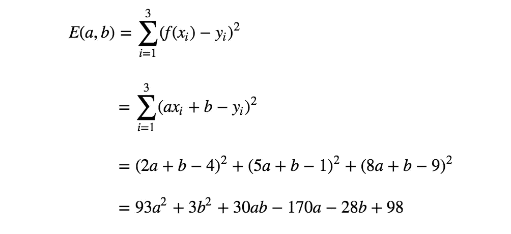

# 什么是“线性”回归模型？

> 原文：<https://towardsdatascience.com/what-is-linear-regression-model-f24f1a24f9bb?source=collection_archive---------19----------------------->

## 线性回归模型背后的线性假设以及为什么线性很重要

线性回归模型是机器学习和统计学领域中最简单的模型之一。也就是说，线性回归背后的线性假设经常被误解。

例如，下面的 2 个模型都是线性回归模型，即使右边的线看起来也不像线性的。

Figure 1\. Two different linear regression models for a data set

如果是惊喜，这篇文章送给你。在这篇文章中，我试图解释线性回归模型背后假设的是什么样的线性，以及为什么线性很重要。

为了回答这些问题，让我们通过两个简单的例子来一步步了解线性回归是如何工作的。

## 示例 1:最简单的模型

让我们从最简单的例子开始。给定下面的训练数据— 3 对( *x* 、 *y* ) — *(2，4)、(5，1)、(8，9)* ，我们想要找到一个对目标变量 *y* 和输入变量 *x* 之间的关系进行建模的函数。

Figure 2\. A training data set to use in this article

我们的第一个模型是最简单的模型，如下所示。

所以我们尝试用这个非常简单的线性函数来模拟 *x* 和 *y* 之间的关系。这里需要注意的是，该函数不仅与输入变量 *x* 成线性关系，而且与参数 *a、b* 成线性关系。

现在，我们的目的是确定最符合训练数据的参数 *a* 和 *b* 的值。
这可以通过测量每个输入 *x* 的实际目标值 *y* 和模型 *f(x)* 之间的失配来实现，并使失配最小化。这种不匹配被称为误差函数。

误差函数有许多不同的选择，但最简单的一个是 RSS，即每个数据点 *x* 的模型 *f(x)* 与相应目标值 *y* 之间的误差平方和。

利用误差函数的概念，我们可以将“确定最适合训练数据的参数 *a，b* 重新表述为“确定最小化误差函数的参数 *a，b* ”。

让我们计算训练数据的误差函数。

好的，上面的等式是我们想要最小化的误差函数。但是我们如何找到使这个函数最小化的参数 *a，b* 的值呢？为了得到一个概念，让我们想象这个函数。

Figure 3\. Error function of the first model

从上面的 3D 图中你可以本能地猜测，这个函数是一个**凸函数**。凸函数的优化(寻找最小值)比一般的数学优化简单得多，因为任何局部最小值总是凸函数的全局最小值。(非常简单的解释就是凸函数只有一个极小点，比如“U”形)由于凸函数的这个特性，可以通过简单地求解如下的偏微分方程来找到使函数最小的参数。

让我们解决我们的案子。

通过解上面的方程，我们得到 *a = 5/6，b = 1/2。*因此，我们的第一个模型(最小化 RSS)如下所示。

Figure 4\. The first model

## 示例 2:简单的曲线模型

现在，对于相同的数据点，让我们考虑另一个模型，如下图所示。

如你所见，这不再是输入变量 *x* 的线性函数了。然而，这仍然是参数 *a，b* 的线性函数。

让我们看看这种变化如何影响模型拟合的过程。我们将使用与上一个例子相同的错误函数— RSS。

如上所述，等式看起来与前一个非常相似。(系数的值不同，但方程的形式相同。)观想如下。

Figure 5\. Error function of the second model

形状看起来也差不多。这还是一个凸函数。这里的秘密是，当我们用训练数据计算误差时，输入变量被给定为具体值(例如，在我们的数据集中， *x* 的值被给定为 2，5 和 8——*(2，4)，(5，1)，(8，9)* )。因此，无论输入变量的形式有多复杂(例如， *x，x，sin(x)，log(x)* 等)，误差函数中的值都是常量。

由于第二个模型的误差函数也是凸函数，我们可以通过与前一个例子完全相同的过程找到最佳参数。

通过求解上述方程，我们得到 *a = 61/618，b = 331/206。*所以，我们的第二个模型得到如下。

Figure 6\. The second model

## 结论:线性回归模型背后的线性

即使一个与输入变量 *x* 成线性关系，一个与 *x* 成非线性关系，上述两个例子也可以用完全相同(且非常简单)的程序解决。这两个模型的共同特点是两个**函数都与参数** *a、b* 成线性关系。这是线性回归模型背后假定的线性，也是线性回归模型数学简单性的关键。

上面我们只看到了两个非常简单的模型，但是一般来说，模型对其参数的线性度保证了它的 RSS 总是一个凸函数。这就是为什么我们可以通过求解简单的偏微分方程得到最优参数的原因。这就是线性度很重要的原因。