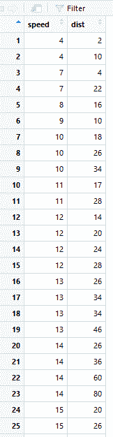
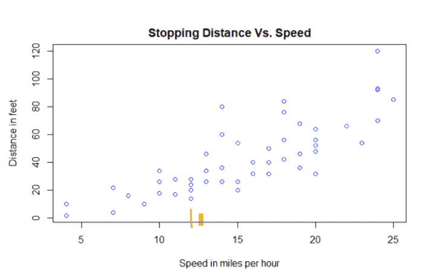
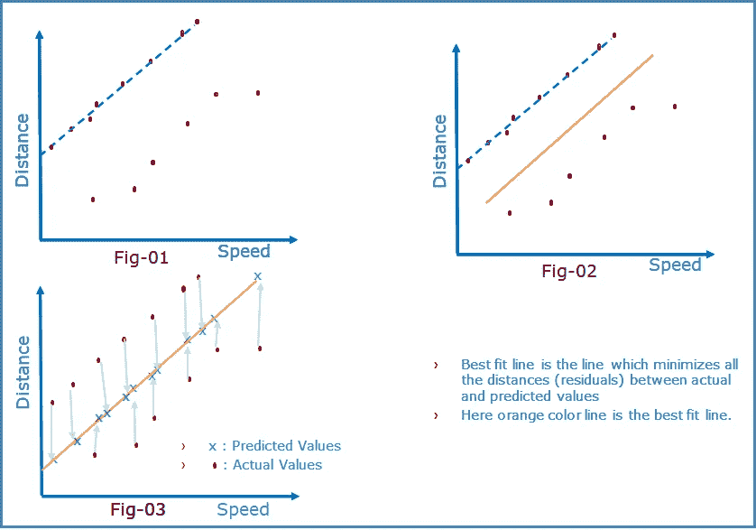
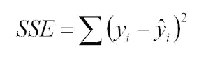
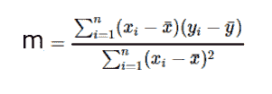
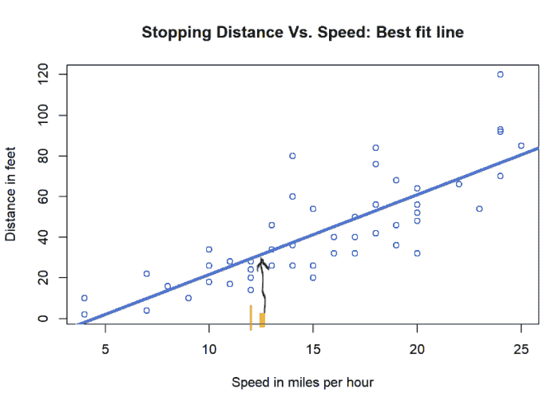

# 什么是线性回归？第二部分

> 原文：<https://towardsdatascience.com/what-is-linear-regression-part-2-83bcb711e465?source=collection_archive---------20----------------------->

在任何企业中，都有一些容易衡量的变量，如年龄、性别、收入、教育水平等。还有一些难以衡量的变量，如贷款金额、病人住院天数、10 年后的房价等。因此[回归](https://ashutoshtripathi.com/machine-learning/what-is-linear-regression/)是一种技术，它使你能够在易于测量的变量的帮助下确定难以测量的变量。

推荐:[什么是线性回归？零件:1](https://ashutoshtripathi.com/machine-learning/what-is-linear-regression/)

线性回归是一种回归技术，可定义如下:

> *“线性回归是一个研究领域，它强调两个* ***连续变量*** *之间的********预测变量*******响应变量*** *”。
> (注:当有一个以上的预测变量时，则成为多元线性回归。)******

*   预测变量通常表示为 x，也称为自变量。
*   响应变量通常表示为 y，也称为因变量。

让我们借助 R 中的一个例子来理解它。R 中有一个内置的数据集“cars ”,它包含 50 对速度(英里/小时)与停车距离(英尺)的数据点，这些数据点是在 1920 年收集的。我截取了前 25 个数据点的截图，让你对数据集有所了解。



在上面的数据集中，如果我们仔细观察，我们会发现不同的汽车在相同的速度下有不同的停车距离。这可能有多种因素。一些因素可能是不同的天气条件、轮胎质量、车型、道路质量、交通状况等。

为了理解线性回归，我们要避开所有其他因素，只关注汽车的速度。因此，我们的目标是找出速度和停车距离之间是否存在任何线性关系，并将绘制该关系，然后预测所有数据点的平均停车距离。

通过观察协方差和相关系数，我们可以对这种关系有一些直觉，如下所示:

# [共方差](https://ashutoshtripathi.com/2019/01/15/covariance-and-correlation/):

```
cov(cars_data$dist, cars_data$speed) #covariance
## [1] 109.9469
```

距离和速度之间的协变是 109.9469。它的值是正的，这告诉我们变量在同一个方向上一起运动。(负值时相反)。

# [关联:](https://ashutoshtripathi.com/2019/01/15/covariance-and-correlation/)

为了了解变量如何一起移动的强度，将协方差标准化为无量纲量，即相关性。相关系数 r 是一个介于-1 到+1 之间的数字，它告诉我们(回归)线与数据的拟合程度。

```
cor(cars_data$speed, cars_data$dist)      # Correlation
## [1] 0.8068949
```

*   车速与距离的相关系数为 0.8068949。
*   由于该值接近于 1，并且具有+ve 符号，因此我们可以得出变量正相关的结论。

推荐文章:[协方差和相关性详解](https://ashutoshtripathi.com/2019/01/15/covariance-and-correlation/)

**让我们通过绘制散点图**来可视化数据集。

*   独立变量(预测变量)—速度(mph) —绘制在 X 轴上。
*   因变量(响应变量)—停车距离(英尺)—绘制在 Y 轴上。

```
plot(cars_data$speed,cars_data$dist,xlab="Speed in miles per hour",ylab="Distance in feet",main="Stopping Distance Vs. Speed", col= "blue")
```



## 散点图的观察结果:

*   红色标志点，同一速度有多个停车距离。这是可能的，因为不同的汽车，不同的道路，不同的天气条件等。
*   因此，如果我们取红色标记处所有这些点的平均值，那么它将给出该点的平均停车距离，但如果我们想知道黄色标记处的停车距离呢？我们没有给出这个黄点的任何数据。
*   因此，如果我们取所有的点，并以某种方式估算黄色标记点的平均值，这将是该点的停车距离，而不是关注任何局部点。

如何做到这一点，如果我们画一条穿过所有数据点的直线，这将给出作为速度函数的停车距离的样本平均值。

这条线方程看起来像是: **y = m*x + c** m:斜率，c:y 处的截距

所以如果我们改变 m 和 c，那么它会给我们所有可能画出的线。

为了得出结论，我们需要找到斜率 m 和截距 c 的最佳值，这将产生最佳拟合线。所以让我们来了解一下什么是最佳拟合线。

# 最佳拟合线:



Best Fit Line

因此可以说，通过大多数数据点的线是最佳拟合线。但是现在如果我们看到 fig-01，我们还会说它是最佳拟合线吗？不。如果我们记得我们的中学时代，被要求画一条最佳拟合线，那么我们会画一条类似于图-02 中橙色线的线。我们的大脑如何识别它为最佳拟合线。令人惊讶的是，它没有通过任何数据点。所以它是如何被画出来的，也许是通过把所有数据点的距离最小化的点连接起来。

先来了解一下背后的一些数学。

*   y 是数据点 x 的实际值。
*   ŷ = m*x + c (ŷ读作 y-hat，这是使用我们试图找出的一些 m 和 c 对数据点 x 的预测值)

差值 **y — ŷ** 是一个误差项，也称为残差。考虑到所有的数据点，这将是**σ(y(I)—ŷ(i)).**这被称为所有数据点的平均距离，需要最小化，但是最小化意味着什么呢？我们是否也考虑误差的负值，如果是的话，那么如果两个数据点有+2 和-2 的误差，它们将在求和计算总误差时被抵消？因此，最小化残差的最佳方法是最小化误差平方和，即:



现在有两个未知数 m 和 c。因此，使用微积分，如果我们对 m 和 c 求偏导数，并使它们等于 0，然后求解这两个方程，我们将得到斜率 m，如下所示:



其中 xbar 是 x 值的平均值，ybar 是 y 值的平均值。

截距 c 可以通过将(xbar，ybar)点代入公式 y = m*x + c 来计算，以代替 x 和 y，因为我们知道最佳拟合线将通过 x 和 y 的中点，即 xbar 和 ybar。并且已经计算了 m 的值。

这种拟合最佳直线的方法称为**最小二乘回归**

然而在实践中，我们不需要手动计算所有这些，幸运的是我们有 R 个内置函数来做这件事。让我们看看这些功能:

*   lm 函数用于拟合线性模型

```
LinearReg = lm(dist ~ speed, data = cars_data)
coefficients(LinearReg)
##  (Intercept)      speed 
##  -17.579095    3.932409## c = -17.579095
## m = 3.932409## Summary of the linear model: 
summary(LinearReg)## 
## Call:
## lm(formula = dist ~ speed, data = cars_data)
## 
## Residuals:
##     Min      1Q  Median      3Q     Max 
## -29.069  -9.525  -2.272   9.215  43.201 
## 
## Coefficients:
##             Estimate Std. Error t value Pr(>|t|)    
## (Intercept) -17.5791     6.7584  -2.601   0.0123 *  
## speed         3.9324     0.4155   9.464 1.49e-12 ***
## ---
## Signif. codes:  0 '***' 0.001 '**' 0.01 '*' 0.05 '.' 0.1 ' ' 1
## 
## Residual standard error: 15.38 on 48 degrees of freedom
## Multiple R-squared:  0.6511, Adjusted R-squared:  0.6438 
## F-statistic: 89.57 on 1 and 48 DF,  p-value: 1.49e-12
```

让我们使用内置函数绘制最佳拟合线，如下所示:

```
plot(cars_data$speed,cars_data$dist,xlab="Speed in miles per hour",ylab="Distance in feet",main="Stopping Distance Vs. Speed: Best fit line", col= "blue")
abline(LinearReg,col="steelblue",lty=1,lwd=4)       # The function adds straight line to a plot
```



因此，从上面的最佳拟合线，我们可以确定人口数据中任何数据点的停止距离。当两个连续变量之间存在线性关系时，线性回归是预测响应变量的值的一种非常强大的技术。

请在下面的评论区分享你的想法/想法。

本文首次出现在“[科技隧道](https://ashutoshtripathi.com/)”博客上，网址为[https://ashutoshtripathi . com/2019/01/06/what-is-linear-regression-part 2/](https://ashutoshtripathi.com/2019/01/06/what-is-linear-regression-part2/)