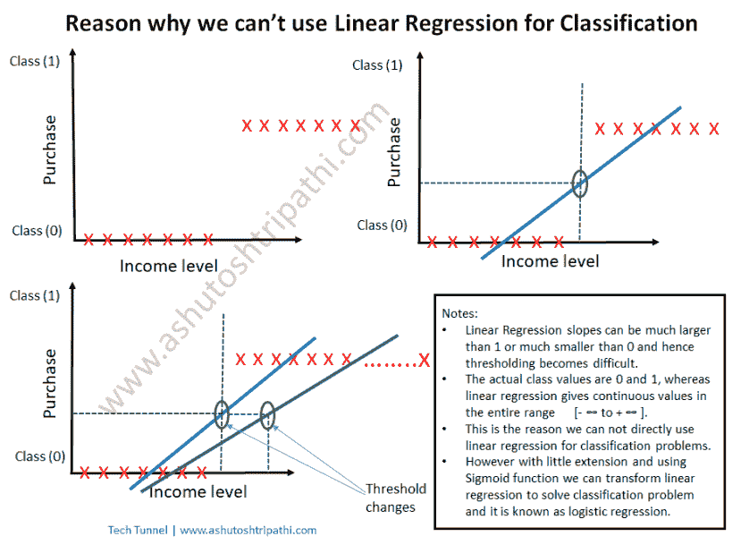
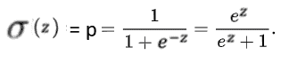
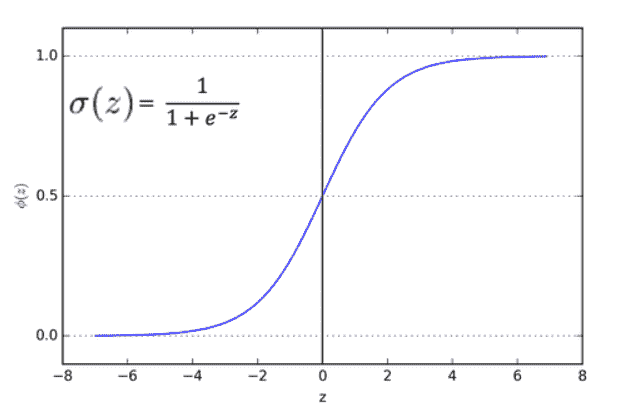
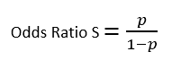
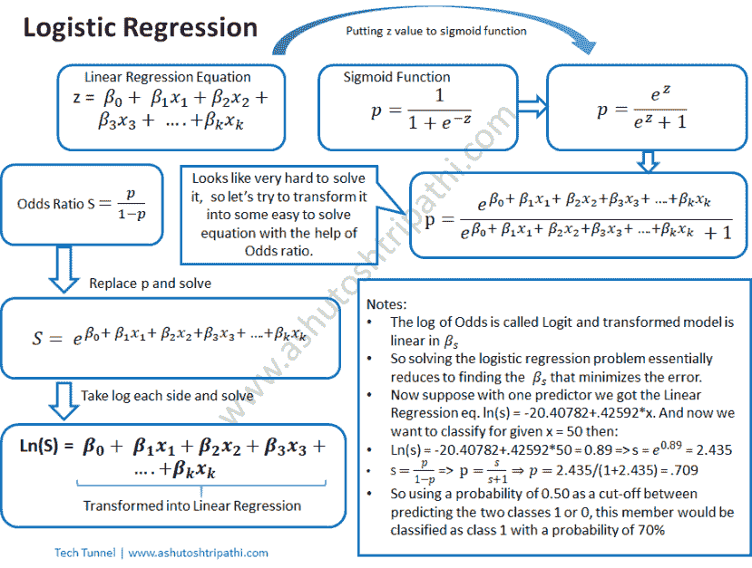
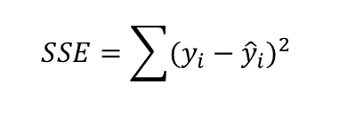
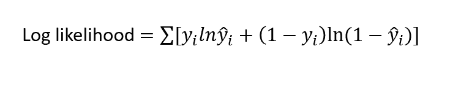

# 什么是逻辑回归？

> 原文：<https://towardsdatascience.com/what-is-logistic-regression-60a273e6bd91?source=collection_archive---------24----------------------->

逻辑回归是分类问题中使用最广泛的机器学习算法。在其原始形式中，它用于只有两个类别要预测的二元分类问题。然而，通过很少的扩展和一些人脑，逻辑回归可以很容易地用于多类分类问题。在这篇文章中，我将解释二进制分类。我还将解释最大化对数似然函数背后的原因。

为了理解逻辑回归，需要很好地理解[线性回归](https://ashutoshtripathi.com/2019/01/06/what-is-linear-regression-part2/)的概念及其成本函数，它只不过是最小化误差平方和。我在之前的文章中已经详细解释了这一点，我建议你在深入研究逻辑回归之前刷新一下[线性回归](https://ashutoshtripathi.com/2019/01/06/what-is-linear-regression-part2/)。假设你对线性回归有很好的理解，让我们开始深入研究逻辑回归。然而，又出现了一个问题，为什么我们不能用线性回归来解决分类问题。让我们先理解这一点，因为这将是理解逻辑回归的一个非常好的基础。

# 分类问题为什么不能用线性回归？

线性回归产生[- ∞到+ ∞ ]之间的连续值作为预测问题的输出。因此，如果我们定义了一个阈值，那么我们可以说，在阈值之上它属于一个类别，在阈值之下，它是另一个类别，这样，我们可以直观地说，我们可以使用线性回归来解决分类问题。然而，故事并没有到此结束。问题出现了，如何设置阈值，添加新记录不会改变阈值怎么办？我们通过查看最佳拟合线和添加新记录集来计算阈值，最佳拟合线会发生变化，从而进一步改变阈值。因此，我们不能肯定地说，一个特定的记录属于哪一类，因为我们没有一个确定的阈值。而这也是我们不能直接用线性回归来解决分类问题的主要原因。

下图用一个例子描述了整个概念。

如果我们扩展线性回归的概念，将输出[- ∞到+ ∞]的连续值的范围限制为[0 到 1]，并有一个函数计算属于特定类的概率[0 到 1]，那么我们的工作就完成了。幸运的是，**s 形**或**逻辑**功能为我们完成了这项工作。因此，我们也说逻辑回归是使用 Sigmoid 函数的线性回归的变换。

# Sigmoid 函数

一个**S 形函数**是一个数学函数，它有一个特征“S”形曲线或**S 形曲线**。通常， *Sigmoid 函数*是指第一张图中所示的[逻辑函数](https://en.wikipedia.org/wiki/Logistic_function)的特例，由公式定义(来源:维基百科):

所以 Sigmoid 函数给出了我们进入 1 类或 0 类的概率。因此，通常我们将阈值取为 0.5，并且如果 p >.5，则它属于类 1，并且如果 p <.5 then="" it="" belongs="" to="" class="" however="" this="" is="" not="" a="" fixed="" threshold.="" varies="" based="" on="" the="" business="" problem.="" and="" what="" threshold="" value="" should="" be="" we="" can="" decide="" with="" help="" of="" aic="" roc="" curves.="" which="" i="" will="" explaining="" later="" in="" post="" target="" mostly="" how="" logistic="" regression="" works.=""/>

# How Logistic Regression works:

As I have already written above that logistic regression uses Sigmoid function to transform linear regression into the logit function. Logit is nothing but the log of Odds. And then using the log of Odds it calculates the required probability. So let’s understand first what is the log of Odds.

# Log of Odds:

The odds ratio is obtained by the probability of an event occurring divided by the probability that it will not occur. and taking the log of Odds ratio will give the log of Odds. So what is the significance log of Odds here?

Logistic function or Sigmoid function can be transformed into an Odds ratio:

Let’s do some examples to understand probability and odds:

*   odds s = p/q, p is prob of winning, q is prob of losing that is 1-p. then if s is given then prob of winning p = numerator/(numerator + denominator) and prob of losing q = denominator/(numerator + denominator). Now let’s solve some examples.
*   If the probability of winning is 5/10 then what are the odds of winning? p = 5/10, => q = 1-p => q = 5/10，则 s = p/q => s = 1:1
*   如果赢的赔率是 13:2，赢的概率是多少？中奖概率 p =分子/(分子+分母)=> p = 13/(13+2) = 13/15。
*   如果赢的赔率是 3:8，那么输的概率是多少？丢失 q 的概率=分母/(分子+分母)=> q = 8/(3+8) => q = 8/11
*   如果输 q 的概率是 6/8，那么赢的几率是多少？s= p/q，(1-q)/q => s = 2/6 或 1/3。

# 逻辑模型

在下面的信息图表中，我解释了逻辑模型的完整工作过程。

这里还要注意的一点是，逻辑回归使用最大似然估计(MLE ),而不是线性模型中使用的最小化误差的最小二乘法。

# 最小二乘法与最大似然估计

在线性回归中，我们最小化 SSE。

在逻辑回归中，我们取而代之的是最大化对数似然。这背后的主要原因是 SSE 不是凸函数，因此找到单个最小值并不容易，可能有多个最小值。然而，对数似然是一个凸函数，因此找到最佳参数更容易。最佳值可以是最大值或最小值，在对数似然的情况下，它是最大值。

现在让我们了解对数似然函数对于目标变量的两个类别 1 和 0 是如何表现的。

**情况 1:** 当实际目标类别为 1 时，我们希望预测的目标 y hat 值接近 1。让我们理解对数似然函数是如何实现这一点的。

放 y_i =1 会使方程的第二部分(在+之后)为 0，只剩下 ln(y_i hat)。y_i 在 0 到 1 之间。ln(1)为 0，ln(小于 1)将小于 0 表示负。因此，对数似然的最大值将是 0，并且只有当 y_i 接近 1 时才是这样。因此，最大化对数似然相当于获得一个接近 1 的 y_i hat，这意味着它将清楚地将预测目标识别为 1，这与实际目标相同。

**情况 2:** 当实际目标类为 0 时，我们希望预测目标 y hat 接近 0。让我们再次理解，在这种情况下，最大化对数似然将产生更接近于 0 的 y_i hat。

设 y_i = 0 将使方程的第一部分(在+号之前)为 0，只剩下(1-y_i)ln(1-y_i hat)。1-y_i 将再次为 1，因为 y_i 为 0，因此在进一步简化后，等式将保持为 ln(1-y _ I hat)。所以现在 1-y_i hat 将小于 1，因为 y _ I hat 将在 0 到 1 之间。所以 ln(1 — y_i hat)的最大值可以是 0。意味着 1-y_i hat 应该接近 1，这意味着 y _ I hat 应该接近 0。这是意料之中的，因为实际值 y_i 也是 0。

这就是我们最大化对数似然的原因。

这就是逻辑回归的全部内容。在下一篇文章中，我将解释一个使用 python 的逻辑回归的完整例子。

视频解释:

希望它已经让你很好地理解了逻辑回归背后的概念。请在下面的评论区分享你的想法。另外，你可以订阅我的 youtube 频道:[科技隧道](https://www.youtube.com/channel/UC0VU1uXWEYCpVGFSZ0OQD5g)

谢谢大家！

关于回归的推荐文章:

*   [数据科学基础统计第一部分](https://ashutoshtripathi.com/2019/04/18/basic-statistics-for-data-science-part-1/)
*   [什么是线性回归？零件:1](https://ashutoshtripathi.com/2019/01/16/what-is-linear-regression-part1/)
*   [什么是线性回归？零件:2](https://ashutoshtripathi.com/2019/01/06/what-is-linear-regression-part2/)
*   [协方差和相关性](https://ashutoshtripathi.com/2019/01/15/covariance-and-correlation/)
*   [什么是决定系数| R 平方](https://ashutoshtripathi.com/2019/01/22/what-is-the-coefficient-of-determination-r-square/)
*   [回归模型中的特征选择技术](https://ashutoshtripathi.com/2019/06/07/feature-selection-techniques-in-regression-model/)
*   [R 中的“stepAIC”是什么？](https://ashutoshtripathi.com/2019/06/10/what-is-stepaic-in-r/)
*   [什么是 R 中的多重共线性？](https://ashutoshtripathi.com/2019/06/13/what-is-multicollinearity/)

*原载于 2019 年 6 月 17 日*[*http://ashutoshtripathi.com*](https://ashutoshtripathi.com/2019/06/17/logistic-regression-with-an-example-in-r/)*。*