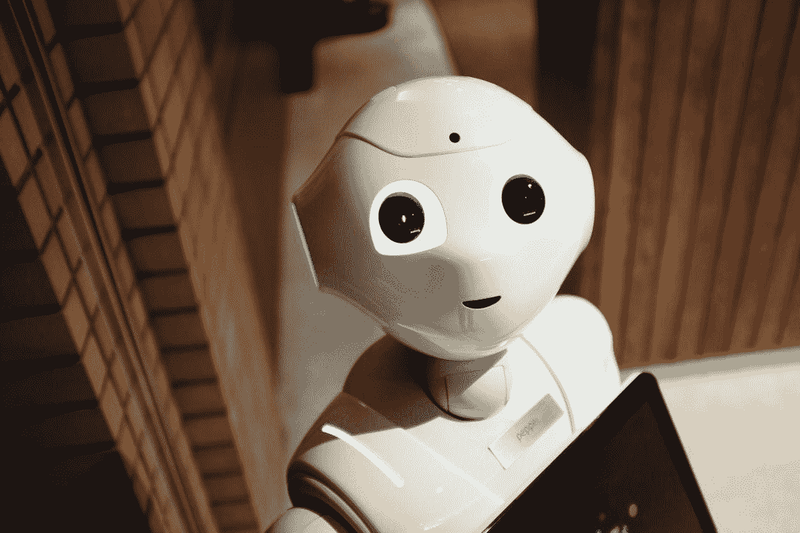
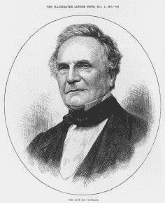

# 什么是机器学习:崩溃

> 原文：<https://towardsdatascience.com/what-is-machine-learning-breakdown-3bc849b803a0?source=collection_archive---------33----------------------->

一本有用的指南，下次有人问你“什么是机器学习”时会让你大吃一惊。

Prefer to listen to your articles? Press the play button above!

你有没有问过或者被问过一个非常著名的问题“什么是机器学习”？你可能会陷入一个兔子洞，里面有你从未真正回答过的其他问题。你的定位定义变成了 Tom Mitchell 的定义:“如果一个计算机程序在某类任务 *T* 和性能度量 *P* 中的任务性能(由 *P* 度量)随着经验 *E* 的增加而提高，那么这个程序就可以说是在从经验 *E* 中学习。这个定义让你有点困惑，但是如果你记住了它，你会觉得很聪明。你会发现它基本上意味着一种算法，它有学习的能力，而不需要通过经验明确编程。

我们将从什么是机器学习这个问题中回答一些在对话中经常出现的问题。

# 它是怎么来的？

拟人化或把人类的特征或行为归因于非人类物体。人类有这种惊人的自我意识能力。我们知道我们在生活，我们试图寻找生命的意义，我们看着一个出口，看到一张惊讶的脸在看着我们。当我们发现自己的思想时，我们对自己知识的缺乏不断推动我们走向人工智能。

我们一直在努力寻找比我们更强大、可能比我们更好的东西。自 18 世纪初以来，一台体现我们是谁的机器就一直在人们的脑海中。文学作品，如[《格列佛游记】](https://computerhistory.org/blog/gullivers-engine/)，谈到了与我们现代计算机密切相关的全知机器。

## **第一台计算机** **和编码器**

在 19 世纪早期，计算机之父查尔斯·巴贝奇创造了一种能进行数学计算的机器，称为差分机或分析机。并非巧合的是，他是第一位计算机程序员阿达·洛芙莱斯的朋友。她发表了一篇文章，解释如何扩展巴贝奇的差异引擎。这篇文章描述了包括字母和符号的代码，而不仅仅是数字。

Ada Lovelace (left) and Charles Babbage (right)

## **第二次世界大战**

快进到 20 世纪初。二战期间传输的加密信息很容易被敌人截获。德国人使用“谜”码，这被证明很难破译。艾伦·图灵和他的团队用一种叫做[炸弹机](http://home.bt.com/tech-gadgets/cracking-the-enigma-code-how-turings-bombe-turned-the-tide-of-wwii-11363990654704)的设备破解了它。艾伦·图灵是英国数学家、计算机科学家、逻辑学家、密码分析学家、哲学家和理论生物学家。他为机器学习奠定了基础。机器可以理解人类，但人类自己不能完全理解数据。

庞贝机器启发了艾伦·图灵的测试，人们亲切地称之为图灵测试。这个测试是在图灵 1950 年的论文[“计算机械和智能”](https://www.abelard.org/turpap/turpap.php)中介绍的，本质上是一个模仿游戏。简而言之，它涉及两个人和一台机器。一个人在一堵墙后面，与机器和其他人没有接触。孤独的人通过电子方式向机器和人提问。如果询问者不能区分人和机器，机器就被认为是“智能的”。

## **艾夏**

20 世纪 50 年代是大量人工智能研究的时代。Ferranti Mark 1 是一台机器，它只是通过使用它的算法来玩跳棋。人工智能之父约翰·麦卡锡开发了可以用符号计算的 LISP 程序语言。人工智能是在麦卡锡组织的达特茅斯会议上创造的。

## **艾冬**

然后在 20 世纪 60 年代，取得了雄心勃勃的进展。这引发了一场 AI 寒冬。该技术无法计算应用程序所需的大数据。研究开始停止，计算机硬件的工作开始了。

## **互联网与现代进步**

在 20 世纪 90 年代初，互联网被发布，随着计算机能力的增强，对人工智能的研究可以再次开始。网络泡沫中的数据被储存起来，这些数据被用来与计算机一起工作，寻找用户的模式。

2011 年——IBM Watson 击败了两次 Jeopardy！冠军和 Siri 发布。

2015 年——deep mind alpha Go 在围棋上击败了一名人类棋手

2016 年——汉森机器人公司(Hanson Robotics)索菲亚(Sophia)发布，拥有展现人类表情、视觉和交流的能力。她是第一个机器人公民。

2017 年——脸书人工智能研究实验室创造了两个聊天机器人来相互交谈，它们最终创造了自己的语言。

2019-自动驾驶汽车和转移学习的进步

# 为什么这么重要？

能够像人一样思考和说话的计算机是如此重要的原因！一旦我们充分利用了机器的能力，我们作为一个物种将会取得巨大的进步。量子计算机正在向我们走来，有了这种不可思议的技术，我们将迈向终点。最终是让我们和机器人一起工作，还是上传成为机器人，只有时间能告诉我们。

# 机器学习可以用来做什么？

在未来，人类能做的任何事情。可能减去悲伤、快乐、爱情等情绪。它将能够识别和模仿情绪，但它可能无法体验潘多拉的盒子。它将能够做出准确的医疗诊断，比人类更好地驾驶汽车，并在没有人类的情况下创造和经营企业。

在现在，主要是模式识别。该算法被赋予大量的数据进行分类，并找出是否有任何相关性。计算机视觉就是在图像中寻找模式，并疯狂地发展。面部识别、驾驶汽车和预测某人是否会摔倒都是为了找到图像像素内的模式。

# 它是如何学习的？

现在，它通过在给定的数据中寻找模式来学习，也通过奖励来学习。在大数据中寻找模式是它如何确定新输入(无论是图像还是一些文本)将被分类的。通过奖励来帮助一个算法学习是耗时的，并且充满了试错。基本上，大脑会通过在一个环境中移动来学习，并根据它的行为触发一套奖励系统。如果它做了一件好事，它会得到积极的回报，而做了一件坏事，它会得到消极的回报。是的，你可以过度惩罚它，以至于它甚至不会动，因为它想要积极的回报。

If you look closely, you will see that it is made up of numbers.

# 有哪些职业侧重于此？

许多职业道路侧重于机器学习和人工智能。目前它主要是在研究中，但随着研究的公开，它将需要实施。下面是一个快速列表:

*   数据科学家
*   机器学习工程师
*   商业智能开发人员
*   大数据工程师/架构师
*   机器学习、人工智能、NLP(自然语言处理)或深度学习的研究科学家
*   深度学习工程师
*   计算机视觉工程师
*   软件开发人员

职称实际上只是工作要求的表面。基本上任何职位的人都可以做。如果你在这个领域找工作，一定要看看任何一个技术类的工作，因为机器学习可能就藏在它的描述里。

# 我该怎么学？

学习人工智能可以通过互联网进行。使用 MOOCs(大规模开放在线课程)，如果你投入时间，你可以在一个月内学会机器学习的基础知识。这并不容易，但如果你坚持不懈，你会看到一些回报。

我有一个帖子可以帮助回答这个问题:[学习机器学习的 5 个简单步骤](https://medium.com/analytics-vidhya/5-easy-steps-to-master-machine-learning-18621ac795d7)。在帖子中，有你可以使用的书籍和课程，以及我推荐你采取的步骤，这样你就不会变得不知所措。

以下是一些被证明是有益的其他来源:

*   Datacamp.com(美元)
*   [机器学习 A-Z:Udemy 上的数据科学实践 Python&R](https://www.udemy.com/course/machinelearning/?LSNPUBID=vedj0cWlu2Y&ranEAID=vedj0cWlu2Y&ranMID=39197&ranSiteID=vedj0cWlu2Y-Jovglpt9yJfZPEZHktelGw)
*   [在 Udemy 上用 Python 进行机器学习、数据科学和深度学习](https://www.udemy.com/course/data-science-and-machine-learning-with-python-hands-on/)

有一些免费的机器学习课程，但它们免费是有原因的。我发现免费课程漏洞百出，而且不如付费课程相关。在他们被释放后，创作者(许多，但不是全部)倾向于将他们抛在身后，专注于他们的付费课程。如果你预算有限，[吴恩达的机器学习](https://www.coursera.org/learn/machine-learning?utm_source=gg&utm_medium=sem&utm_content=07-StanfordML-US&campaignid=685340575&adgroupid=52515609594&device=c&keyword=machine%20learning%20mooc&matchtype=b&network=g&devicemodel=&adpostion=1t1&creativeid=243289762946&hide_mobile_promo&gclid=CjwKCAjw9L_tBRBXEiwAOWVVCYezCBGOExD-xwe2ykuv-Gdva_7cBVIWvelrqGcZuSZwZuguUpkDVxoC3-gQAvD_BwE)课程是免费的，没有证书和评分。优达城的课程大减价，大约 10 美元。如果你手头拮据，一定要检查一下。爱看书？你当地的图书馆可能有你感兴趣的书。

如果你有工作，和你的上司谈谈，看他们是否愿意支付你的部分教育费用。你可能会感到惊讶。他们可能会说是。

# 机器学习的未来是怎样的？

不可阻挡。神经网络将会出现在手机上，更深层次的个性化将会出现，医疗保健系统将会被破坏。机器学习将彻底改变我们的生活和行为方式。我们将拥有增强视力的眼镜，这样我们就可以拥有超过 20/20 的视力，汽车将检测我们何时沮丧或快乐，并成为我们的朋友，人类医生将从处理患者的日常医疗需求过渡到支持晚期病例。

量子计算将在其增长中发挥重要作用。政府和公司在这方面投入了数百万美元。在现代硬件上几乎不可能解决的算法在量子计算机上只需几分之一秒就能解决。这些算法的准确性和速度将在医疗保健领域最引人注目。即使是训练有素的专家也很难确定患者是否患有癌症，是恶性还是良性，或者处于哪个阶段。随着机器学习与量子计算相结合，它将变得快速而准确，因此患者将能够快速获得他们需要的药物。

# 仅仅是炒作吗？

不，不是的。深度学习早已从机器学习进化而来。随着研究的继续，算法和模型将继续进步。人工通用智能是目标。不管这让你感到恐惧还是兴奋，根据当前的技术趋势，它预计将在下一个 50 年内出现。

据预测，一个人工智能的冬天即将来临。在那段时间里，关于人工智能和人工智能的讨论将逐渐平息，但研究(有资助和无资助)仍将继续。尽管流行的“炒作”会逐渐消失，但它所产生的影响将会持续并增长。现在需要对它进行讨论和宣传，以便建立一个伦理研究和发展的基础。

# 神经网络真的是答案吗？

它们只是答案的一部分。除了神经网络，还有许多不同的模型。有随机森林、线性/逻辑回归、支持向量机、朴素贝叶斯、k-最近邻等等。神经网络是在计算机中模拟人类神经元的一个飞跃。这可能也不会是最后一次飞跃。随着量子计算机的出现，我相信会有另一种突破性的算法产生。

所以…

# 什么是机器学习？

一种无需明确编程即可学习的算法。这可以通过模式识别或奖励系统来实现。我们将看到机器学习在医疗保健领域的巨大影响，从患者互动到药物发现。这不仅仅是炒作，这是改变生活，甚至可能改变物种。一旦量子计算到来，这个领域的进展很可能会有巨大的飞跃。

在我们重新学习之前，

