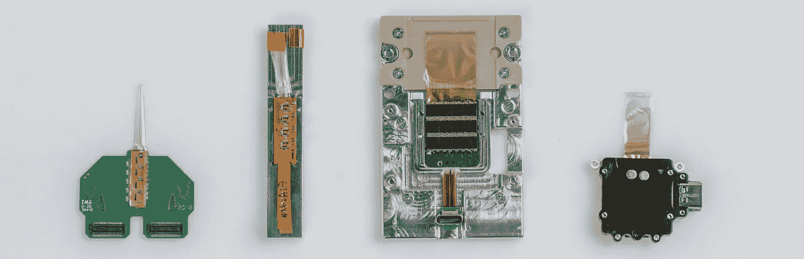
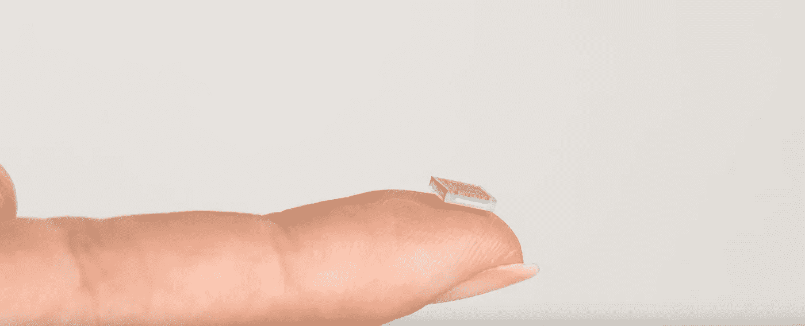
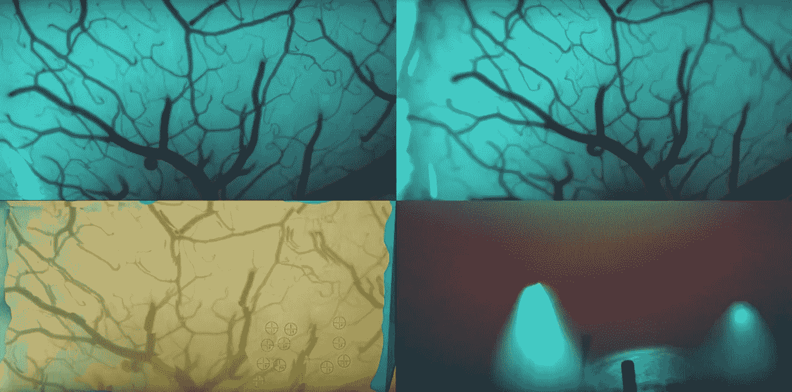

# 什么是 Neuralink:看看它是什么，它想要成为什么，以及它可能成为什么

> 原文：<https://towardsdatascience.com/what-is-neuralink-a-look-at-what-it-is-what-it-wants-to-be-and-what-it-could-become-2acf32b51dc5?source=collection_archive---------1----------------------->

## 向你的第六感问好

Can’t read right now? You can listen to the podcast of this episode.

当我第一次在小学上科学课时，我们学习了五种感官。也许在不久的将来，这些信息可能会像太阳系九大行星(抱歉，是冥王星)一样过时。这可能要感谢 Neuralink 公司，该公司因其有争议的大脑芯片接口而成为头条新闻。2019 年 7 月 17 日，该公司终于在 [YouTube 直播流](https://www.youtube.com/watch?v=r-vbh3t7WVI)中揭开了它的辛勤工作。

当你第一次听到它时，Neuralink 的追求听起来像是直接来自一个疯狂的天才的日记；当然，在埃隆·马斯克执掌公司的情况下，这一形象可能并不遥远。但是，如果你看起来超越了科幻恐怖电影，你可以瞥见一个完全不同的人类未来——一个拥有新的第六感:神经链接的未来。

Neuralink Prototypes: the company has gone through years of research prior to its public announcement (Source: [Neuralink Launch Event on YouTube](https://youtu.be/r-vbh3t7WVI?t=7096))

# Neuralink 现在是什么？

Neuralink 是一种首先用于帮助截瘫患者完成简单任务的设备，如使用 iPhone 和在计算机上点击鼠标——无需身体运动。明确一点，人体试验还没有开始；Elon Musk 和他的团队对 2020 年底开始持乐观态度，但他们认为 FDA 的批准并不容易。据 Musk 称，迄今为止，Neuralink 原型已经在啮齿动物身上进行了测试，显然甚至在[一只猴子身上进行了测试。](https://www.iflscience.com/technology/elon-musks-neuralink-has-connected-a-monkey-brain-to-a-computer/)

## 大脑中的那部分

Neuralink 确实包括通过手术将一些组件植入你的大脑表面。但是大脑植入并不新鲜——自从 20 世纪 70 年代以来，研究和开发一直在进行，测试和使用。只是以前，大脑植入不被认为是增强；毕竟，我们的大脑[仍然是一个大谜团](https://medium.com/@wandererli/the-origins-future-of-intelligence-part-1-4ed4da8bf4af)，我们只是最近才开始解码我们智力的[遗传起源。](https://medium.com/@wandererli/the-origins-of-intelligence-chapter-3-1c42da5ea372)

理想情况下，我们希望保持这个神圣房间的神圣性——我相信埃隆·马斯克(以及他的团队)也希望如此。不过，在这一点上，这是不可能的。他们通过使用电极进行测试来实现这一点，电极是用于检测电场的设备(在大脑中，当神经相互发送信息时就会产生电场——即 Neuralink 使用电极来检测神经何时相互发送信息)。

其中一个电极(我们称之为 1 号电极)被放置在神经元的正上方。因为它直接在神经元上，它将能够检测到由于神经元放电而产生的任何电场。然后，他们将另一个电极(我们称之为电极 2)放在更远的地方，看看它是否仍然可以检测到神经元放电产生的电场。如果可以，他们将它移动得越来越远，直到电极 2 不再能够检测到神经元的电信号——在这一点上，电极 1 将报告神经元正在放电，但电极 2 将无法确认它。换句话说，电极 2 离神经元太远了。这个距离是 60 纳米。不用深入研究，事实是 60 纳米意味着它必须在头骨内部，而不是外部。

至少，电极需要位于头骨下面。这正是他们要做的。电极和一个小接收器将被安装在头骨下面。不，你不会有一根天线从你的头上伸出来，不，杆子不会刺穿你的大脑。

N1 Sensor, the first version of the human-embedded chip (Source: [Neuralink Launch Event on YouTube](https://youtu.be/r-vbh3t7WVI?t=7162)) without the outer mold. The mold is a cylindrical 8mm diameter, 4mm tall. Each has 1,204 electrodes.

伸出你的食指，试着想象芯片放在上面。现在你意识到它有多小了——它肯定比我现在耳朵里的 AirPods 小，后者在我的大脑陷入交叉火力的情况下来回发射信号。它将被放置的圆柱形外壳直径为 8 毫米，高 4 毫米。

从外壳中出来的将是 1024 个看起来像细丝的微小电极。当我说微小时，我们看到的是大约 6 纳米的直径。为了比较，想象一下你头发的直径，然后用这个直径除以 10。它是如此之小，以至于相对来说像人手那么大的东西都无法将其安装到大脑上。这就是为什么 Neuralink 也创造了一个机器人外科医生。

The robotic surgeon that places Neuralink N1 electrodes into the brain (Source: [Neuralink Launch Event on YouTube](https://www.youtube.com/watch?v=r-vbh3t7WVI&t=14s))

这个机器人有能力做出必要的精确动作，将螺纹安装到你的大脑中。这听起来像是一个简单的任务，但在线程的小范围内，它变成了一个与太空火箭安全返回地球一样复杂的任务——马斯克太熟悉了。

> 这些东西真的非常非常小。你真的不能用手操纵它们。机器人一次剥下一根线，放入大脑…所以我们必须制造一个手术机器人…没有机器人手术是不可能的。
> 
> - Max Hodak，Neuralink 的总裁

这是因为，在那个尺度上，还有其他因素需要考虑；比如呼吸和心跳。两者都是非自愿的。当然，一个没有完全镇静的人可以在长达一小时的过程中屏住呼吸，但他或她能屏住心跳吗？我想没有人会推荐这个。

你可能想知道戳大脑是否会导致剧烈的头痛。答案是否定的，首先大脑没有任何[痛觉感受器，所以你不会有任何](https://www.brainline.org/author/brian-greenwald/qa/can-brain-itself-feel-pain)的感觉。其次，电极这么细。如果头发的类比不够直观，可以这样想:这些电极比蚊子的长鼻(当它想吸你的血时伸出的长针)还要细——它嘴巴的内部，阴唇，直径约为 [40 纳米](https://pdfs.semanticscholar.org/2f2b/01136c8ae9d844dc4d40c74defc8a773313d.pdf)(相比之下，电极的直径为 6 纳米)。你上一次感觉到蚊子咬你是什么时候？

Take a look at the Neuralink surgical robot in action (Source: [Neuralink Launch Event on YouTube](https://youtu.be/r-vbh3t7WVI?t=7668))

Neuralink 手术机器人在确定放置每个电极的正确区域时会考虑这些变量，从而将触及血管的可能性降至最低——这对大脑不好。在上图中(你可以点击 source 链接，直接进入直播流中播放该视频的位置)，顶部的两段视频显示了一个模拟大脑的运动，其中有心跳和呼吸等变量，而左下角的一段视频显示了机器人在考虑这些变量后看到的东西——一个看似静止的大脑。

## 大脑之外的部分

将仿生超级大脑芯片自动植入你的大脑是我们大多数人都会认为一生只有一次的经历。马斯克和他的团队希望保持这种状态。软件更新已经很不方便了，总是在我们不希望的时候发生。每当软件想要运行更新时，都必须去一趟当地的神经外科医生那里，这种想法让我们对拥有超级大脑可能带来的吸引力有所了解。因此，一大块 Neuralink 驻留在头骨外部，作为耳朵后面的可穿戴设备。

The Neuralink wearable named the Link ([source](https://gulfnews.com/technology/musk-shows-off-progress-on-brain-machine-interface-1.1563350681915))

这款可穿戴设备名为 Link，内置软件和电池。这样，当你只有 5%的电池续航时间时，你可以直接移除设备进行充电。软件更新也是如此，处理发生在链路上。

# Neuralink 想成为什么

它希望成为每个人大脑中的一台电脑——一台我们不必随身携带的电脑，并且在使用时不会被察觉的电脑。尽管埃隆·马斯克(Elon Musk)可能喜欢帮助截瘫患者的想法，但似乎没有什么比给我们未来的人工智能霸主腰带以下一脚更让他挠痒痒的了。他相信 Neuralink 会给你致命一击。

在[不可测量的]未来，他将 Neuralink 的大脑芯片视为选择性手术。这意味着它在美国不在保险范围内。抱歉，最后一句话是对美国医疗保健这个笑话的不着边际的讽刺挖苦。严肃地说，这意味着人们想要它，而不是需要它。它可能会比整形手术在世界范围内变得更加普遍(也许贝弗利山是个例外)。

> 【Neuralink】不是强制的东西。这是你想拥有就可以选择拥有的东西。我认为这在文明层面上非常重要。
> 
> -埃隆·马斯克

有趣的是，马斯克说 Neuralink 不会是强制性的，尽管如果你周围的每个人都有一个量子计算机速度的大脑，如果你想竞争那时人类可能仍然存在的任何工作，你自己可能也需要一个。在 Neuralink 的帮助下，[约翰·康纳](https://terminator.fandom.com/wiki/John_Connor)——呃，我是说，马斯克，相信我们有机会对抗不可避免的天网。

# Neuralink 可以成为什么

嗯，从资本主义的角度来看，比苹果或任何其他现有的科技巨头都大(可能除了亚马逊，因为否则我们会用我们的思想去哪里购物？).当你脑子里已经有了这一切的时候，你为什么还需要 iPhone 或者 Apple Watch(实际上，你现在甚至还需要 Apple Watch…)！Neuralink 的成功将改变未来创新的轨迹。曾经看起来非常创新但仍然遥不可及的东西(例如，增强现实眼镜)现在在想象 Neuralink 的未来时似乎有点过时。

但是 Neuralink 可以远远超越增强现实的新奇事物[太空入侵者](https://devpost.com/software/ar-space-invaders)。例如，心灵感应不再那么牵强。毕竟，电极接收的信号可以无线传输到电子设备，而 Link 耳机本身就是一个电子设备。将信息从一个链接设备传输到另一个链接设备类似于在 iPhones 之间空投图像。再加上一点[量子纠缠](https://futurism.com/the-byte/capture-first-image-quantum-entanglement)，也许我们可以给我们的火星家庭打一些心灵感应电话。在这个时候，Neuralink 的技术可能无法从你的神经元中的小放电中创建完整的句子，但它可以被训练成将某些放电模式翻译成图像。或者单个单词。这种类型的功能可以随着时间的推移而改进。

交流的速度也会提高。现在，当我打字时，我交流的速度被限制在我的手指优雅地穿过 QWERTY 星球的速度之内。当我用手机的时候，我的拇指能织多快。即使我在说话，我也只能在舌头打结之前说得很快。但是思想是瞬间的。Neuralink 最终可能能够捕捉那些即时的想法，并将其转录为即时通信，速度比我说出的话还要快。

另一个更前卫的用途可能是作为药物的替代品——让我们从更容易接受的娱乐性药物开始吧。你不需要再喝咖啡、抽烟或喝酒来达到它们的效果。这些业务可能最终会成为行业的坟墓，被售价 0.99 美元(考虑到通货膨胀，可能为 50 美元)的应用程序版本所取代。其他的，更不合法的，也可能以数字方式被滥用。这种潜力确实引发了关于 Neuralink 打算如何监管其软件使用的问题，包括第三方开发。然而现在，政府似乎正忙着处理脸书的天秤座，所以这是一个他们不得不在晚些时候处理的问题。

## 未来的担忧

谈到担忧，也有一个清单。勒索病毒(Ransomware)是一种病毒，它会锁定你电脑中的文件，并一个接一个地删除它们，直到你支付赎金(通常是比特币)，这是当今计算机网络的一个严重威胁。现在想象一下你的大脑。黑客、软件漏洞和硬件缺陷可能会威胁到你的日常生活。

在不久的将来，另一个问题是 Neuralink 不仅能够读取信号，还能发出自己的信号——它本质上能够代表你的神经元工作。但是大脑是非常敏感的——它会在一生中对不同的刺激做出反应，包括化学物质和[神经元如何相互交流](https://medium.com/@wandererli/the-origins-and-future-of-intelligence-chapter-2-c10097b362ca?source=your_stories_page---------------------------)。在等式中加入 Neuralink 可以改变我们大脑的发展方式。

Neuralink 不可否认是一个创新项目——这是埃隆·马斯克(Elon Musk)的预期。他倾向于关注未来，而不是今天存在的可感知的局限性，这引导其他人看到这项技术或类似技术的强大潜力。我非常渴望想象它将为人类智能的未来带来更多的东西。我会尝试第一版吗？在这一点上，可能不会，但我不能代表未来的我。