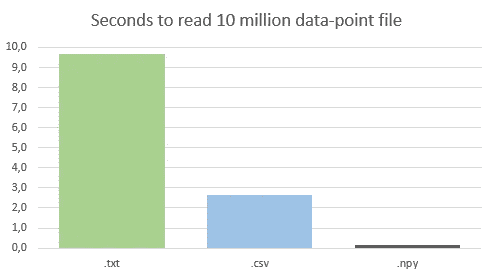
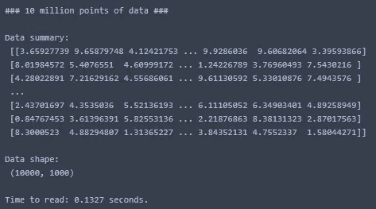
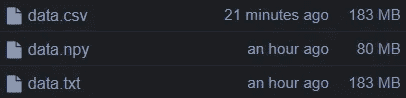
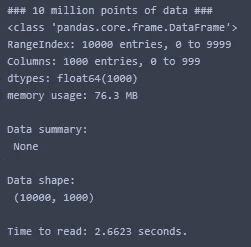
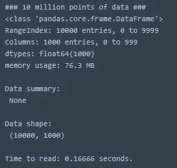

# 什么是。npy 文件以及为什么应该使用它们…

> 原文：<https://towardsdatascience.com/what-is-npy-files-and-why-you-should-use-them-603373c78883?source=collection_archive---------5----------------------->

## 为什么你应该总是保存你的数据。npy 而不是。战斗支援车


An accurate depiction of the feeling you get when loading data from .npy files.

# 介绍

首先，非常感谢我的粉丝们在过去的几个月里一直支持我，我一直非常忙，没有太多的时间来写文章。我决定对此的部分补救方法是做一些更短更容易消化的文章，这样更容易产生！因此，这是我第一次尝试写一篇简短扼要的文章。
希望你觉得有用！

如果你喜欢这篇文章并想看更多，请务必 [**关注我的简介**](https://medium.com/@peter.nistrup) ！

# TL；博士:

从存储器中读取一千万个数据点文件:



The results speak for themselves.

## 🥇第一名:。npy 文件用时:0.13 秒

这是目前最快的数据加载方法。

## 🥈第二名:。csv 文件用时:2.66 秒

熊猫证明了这一点。csv 文件不是没用，但还是速度不够。

## 🥉第三名:。txt 文件用时:9.67 秒

和其他的相比，这个太慢了，很痛苦。

# 为什么。npy 和 Numpy？

如果你曾经用 Python 做过任何类型的数据处理，你肯定会遇到 **Numpy** 和 **Pandas** 。这些是 Python 中**数据科学的巨人，是许多其他包的基础，也就是说 **Numpy** 提供了像 **Scikit-Learn** 和 **Tensorflow** 所使用的基本对象！**

那么，为什么我要谈论这些包，为什么特别是 **Numpy** 呢？你可能知道，关于数据文件的行业标准是*。csv* 文件。现在，虽然很方便，但是与其他选择相比，这些文件已经高度优化了，比如 T31。npy 文件由 **Numpy 提供。**

> “管他呢，让我们看看代码和证据！”

好吧，继续表演！

# 代码

首先，我们简单地创建 1000 万个随机数据点，并将其保存为逗号分隔值:

现在，让我们通过传统方式加载，并对数据进行简单的整形:

这是我得到的输出:


**Almost 10 seconds to load!**

现在，您可能会认为整形会阻止更快的加载，但即使我们不做任何整形，我们也会得到类似的时间！

## 现在我们有了 10000 乘 1000 的数组，让我们继续将它保存为。npy 文件:

```
np.save('data.npy', data_array)
```

对，那很简单，对吧？现在我们有了数组。npy 格式让我们看看我们能以多快的速度阅读它:

这给了我以下输出:



**Wow! More than 70x faster!**

快得多，还要注意，我们不需要重塑数据，因为该信息包含在。npy 文件。



使用的另一个“次要”特性。npy files 是文件占用的减少的存储空间。在这种情况下，它的大小减少了 50%以上。这可以警惕很多，但一般来说。npy 文件更易于存储。

> “熊猫和它们的后代怎么样？csv 处理？”

## 让我们来了解一下！

首先让我们创建一个合适的。csv 文件供熊猫阅读，这将是最有可能的现实生活场景。

```
data = pd.DataFrame(data_array)
data.to_csv('data.csv', index = None)
```

这只是将我们之前创建的“data_array”保存为一个标准。没有索引的 csv 文件。

现在让我们加载它，看看我们得到了什么样的时间:

这给了我以下输出:



2.66 seconds.. Faster than the standard .txt read but still snails pace compared to the .npy file!

现在你可能会认为这是作弊，因为我们也在加载一个熊猫数据帧，但事实证明，如果我们像这样读取，时间损失可以忽略不计:

```
data_array = np.load('data.npy')
data = pd.DataFrame(data_array)
```

和时间，我们得到以下结果:



Almost no different from loading without a DataFrame.

# 外卖

您可能习惯于将数据加载和保存为。但是下次你做数据科学项目的时候，试着养成加载和保存的习惯。改为 npy 文件！当你等待内核加载你的文件的时候，它会帮你节省很多停机时间和烦恼！


# 结束语

我希望这篇短文对你有所帮助！

如果你想多看多学，一定要 [**跟着我上媒**](https://medium.com/@peter.nistrup) 🔍和 [**碎碎念**](https://twitter.com/peternistrup) 🐦

[](https://medium.com/@peter.nistrup) [## 彼得·尼斯特鲁普-中等

### 阅读彼得·尼斯特拉普在媒介上的作品。数据科学、统计和人工智能...推特:@PeterNistrup，LinkedIn…

medium.com](https://medium.com/@peter.nistrup)