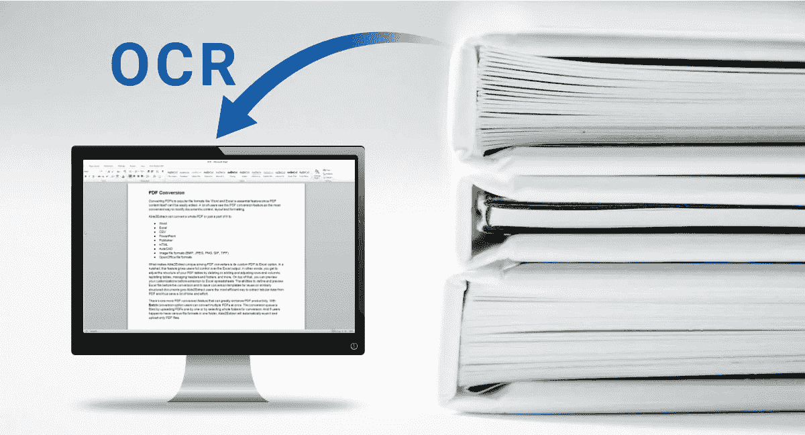
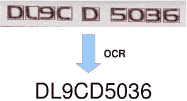
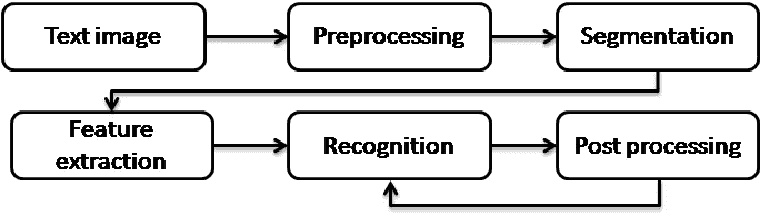
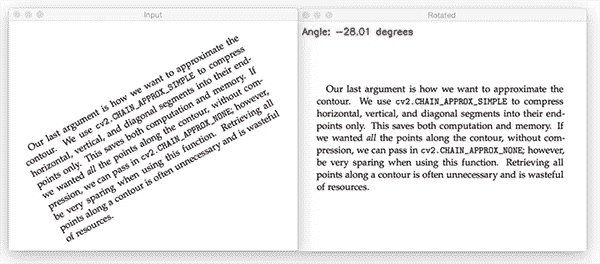
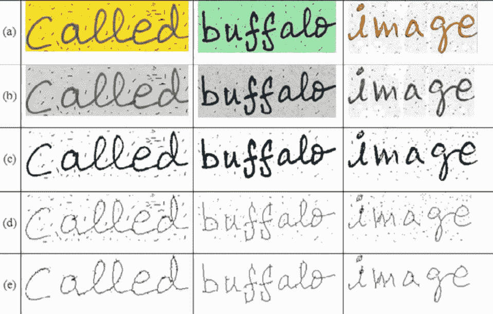

# 什么是 OCR？？

> 原文：<https://towardsdatascience.com/what-is-ocr-7d46dc419eb9?source=collection_archive---------11----------------------->

## 光学字符识别系统工作的基本理论概述。

**Source:** [**investintech.com**](https://www.investintech.com/resources/articles/ocrprogram/)

在当今时代，数字化的必要性正在迅速增加。由于信息和通信技术(ICT)的发展以及手持设备的广泛使用，人们通常更喜欢数字化内容，而不是包括书籍和报纸在内的印刷材料。此外，利用许多先进的技术，如人工智能等，可以更容易地组织数字化数据，并出于各种目的对其进行分析。因此，为了跟上当前的技术发展，有必要将目前所有印刷格式的信息转换成数字格式。

OCR 来了…我们的救世主💪 💪这有助于我们完成单调乏味的信息数字化工作。OCR 代表 ***光学字符识别*、**，其主要工作是*识别图像中的印刷文本*。一旦我们在 OCR 的帮助下识别出印刷文本，我们就可以用各种类型的信息。

Recognizing the text on Number Plate. **Source:** [**scholorworks**](https://scholarworks.sjsu.edu/cgi/viewcontent.cgi?article=1726&context=etd_projects)

## 你打算学什么？

这是一个由 3 部分组成的系列文章，解释了 OCR 系统的各种概念和阶段。让我们看看你将在每一部分学到什么

*   ***第一部分*** (本文)，OCR 系统工作的高级理论概述
*   [***part-I***](https://medium.com/@susmithreddyvedere/pre-processing-in-ocr-fc231c6035a7)***I:***在 ***预处理阶段*** 执行的不同步骤以及代码示例
*   [***part-III***](https://medium.com/@susmithreddyvedere/segmentation-in-ocr-10de176cf373)***:***不同类型的 ***分割*** 可以在一张 ***预处理过的图像上执行。***

## 我们走吧…

下图显示了 OCR 系统工作流程的不同阶段。

Phases of OCR. **Source: Reference [4]**

让我们简要讨论一下上图中显示的每个阶段:-

**A. *图像采集***

这包括扫描文档并将其存储为图像，在该图像上必须执行识别。

**B. *预处理***

我们不能直接为 OCR 系统输入图像。必须对图像进行一些预处理，以便 OCR 能够比较容易地识别图像中的信息。这就像根据场合穿上衣服一样。

图像预处理包括:

1.  *倾斜校正*:从上一阶段获得的图像可能没有正确定向，可能以任何角度对齐。因此，我们需要执行倾斜校正，以确保转发到后续
    阶段的图像方向正确。

Skew Correction. **Source:** [**pyimagesearch.com**](https://www.pyimagesearch.com/) **by** [**Adrian Rosebrock**](https://www.pyimagesearch.com/author/adrian/)

*2。二值化*:将*彩色图像*转换为*二值图像*(仅包含黑色&白色)。通常，在实践中，这种从*彩色图像*到*二值图像*的转换是通过中间的*灰度图像*来完成的。

> 彩色图像→灰度图像→二值图像

这可以使用不同的方法完成，如
→自适应阈值处理
→ Otsu 的二值化
→局部最大值和最小值方法

我更喜欢*自适应阈值*，因为它用某个阈值对图像进行二值化，这个阈值是根据它在图像中的位置动态计算的。

3.*去噪*:在*图像采集过程中，由于相机清晰度低、图像上有阴影等各种原因，扫描图像时容易引入噪声(小点或前景成分)。
这种噪声应该被去除，以便图像将是干净和均匀的。*

*4.*细化和骨架化*:不同图像的文字笔画宽度不同。在手写单词的情况下，这种可变性非常高。骨架化是一种技术，使用这种技术我们可以使所有的笔画有一个统一的宽度(可能 1 个像素宽或几个像素宽)*

**

*(a) Original Image. (b) Converted to Grayscale. ©Binarized image. (d) Thinning and Skeletonization are done. (e) Noise Removed. **Source: Reference [3]***

***C. *分割****

*一旦一幅 ***干净的*** 图像被获得，在预处理阶段之后，下一个阶段就是 ***分割*** 。这是一种将整个图像分解成子部分以进一步处理它们的技术。
OCR 中可以做三种类型的 ***切分***:-
→行级切分
→词级切分
→字符级切分*

***D. *特征提取****

*在这一阶段，我们从上一阶段获得的分段子组件中提取一些*独特特征*。有许多技术，我们可以通过它来提取特征，如形状，笔画等。
但是现在，对于特征提取，我们主要依赖于机器学习模型，该模型使用一堆 CNN、RNN(递归神经网络)、LSTM(长短期记忆)层。*

***E. *分类****

*这是 OCR 系统的决策阶段。分类使用在特征提取阶段提取的特征来识别文本片段。像 SVM 这样的算法可以用于分类。*

*除了这些阶段，为了提高 OCR 的性能，我们还可以在分类阶段之后执行可选的*后处理*步骤。*

***F. *后处理****

*OCR 系统中最有可能出现的错误是由于*分类*阶段的错误预测(这可能是由于较差的特征提取、图片中的大量噪声等)。在大多数情况下，这些预测错误会导致小的拼写错误，因为错误地预测了一个单词中的一个或两个字母(就像单词“ball”被预测为“boll”)。因此，这些类型的拼写错误可以使用语言模型、Word2Vec 模型(如 CBOW 和 skip-gram)等来纠正。*

*哇呜……现在你知道 OCR 系统的基本工作流程了。*

# *进一步阅读*

*   *[***第二部分***](https://medium.com/@susmithreddyvedere/pre-processing-in-ocr-fc231c6035a7)***—***OCR 预处理*
*   *[***第三部分***](https://medium.com/@susmithreddyvedere/segmentation-in-ocr-10de176cf373)***—***OCR 中的分割*

*快乐学习！！！！*

*欢迎任何质疑、建议、指正。😃*

# ****参考文献:****

*[1] P. Dhande 和 R. Kharat，“草书英文手写字符的识别”， *2017 年电子与信息学趋势国际会议(ICEI)* ，Tirunelveli，2017 年，第 199–203 页，doi:10.1109/icoei . 2017.8300015 . 202005*

*[2]哈马德、卡雷兹和卡亚、穆罕默德。(2016).光学字符识别技术详细分析。国际应用数学、电子学和计算机杂志。4.244–244.10.18100*

*[3] Choudhary，Amit & Rishi，Rahul & Savita，Ahlawat。(2013).一种新的脱机手写草书字符分割方法。计算机科学。17.88–95.10.1016 年 5 月 13 日*

*[4]布里德、优素福和苏哈尔、阿卜杜勒哈尼和埃尔克塔尼、优素福。(2017).基于阿拉伯语的特异性和独特性的手写字符识别。国际交互式多媒体和人工智能杂志。4.45–53.10.9781/伊吉迈 2017.446*