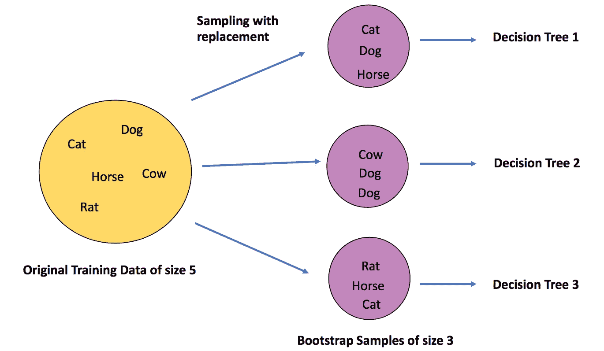
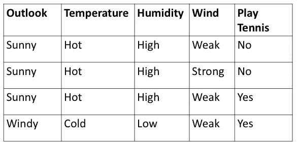
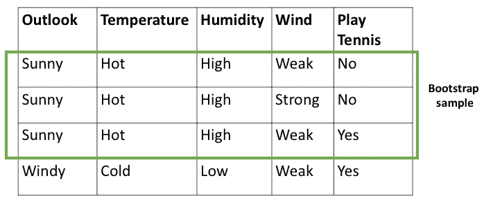
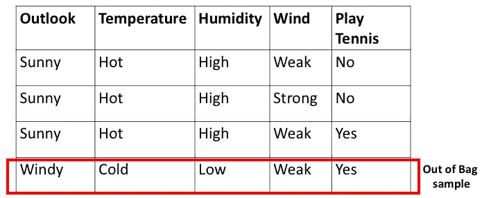
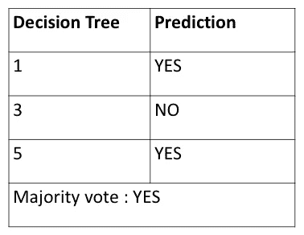
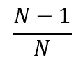
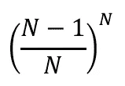

# 《随机森林》中的“出袋”(OOB)分数是多少？

> 原文：<https://towardsdatascience.com/what-is-out-of-bag-oob-score-in-random-forest-a7fa23d710?source=collection_archive---------1----------------------->

*本博客试图解释 oob_score 在“Scikit learn”框架中的“*[*【RandomForestClassifier】*](https://scikit-learn.org/stable/modules/generated/sklearn.ensemble.RandomForestClassifier.html#sklearn.ensemble.RandomForestClassifier)*”设置为 true 时的内部功能。这篇博客描述了随机森林中 OOB 分数背后的直觉，它是如何计算的，以及它在哪里有用。*

在需要模型良好可解释性的应用中，DTs 工作得非常好，尤其是当它们深度很小时。但是，具有真实数据集的 DTs 可能有很大的深度。深度较高的 DTs 更容易过度拟合，从而导致模型中的方差较高。随机森林模型探讨了 DT 的这一缺点。在随机森林模型中，原始训练数据是**随机**替换采样生成的小数据子集(见下图)。这些子集也称为引导样本。然后，这些引导样本将作为训练数据提供给许多深度较大的 DTs。这些 DTs 中的每一个都在这些引导样本上被单独训练。这种 DTs 的集合称为随机森林集合。集合模型的结论结果是通过对来自所有 DTs 的多数投票进行计数来确定的。这个概念被称为 Bagging 或 Bootstrap 聚合。由于每个 DT 采用不同的训练数据集作为输入，因此原始训练数据集中的偏差不会影响从 DT 聚合中获得的最终结果。因此，bagging 作为一个概念减少了方差，而不改变整个系综的偏差。

Generation of bootstrap samples with replacement. “Sampling-with-replacement” here means that if a data point is chosen in the first random draw it still remains in the original sample for choosing in another random draw that may follow with an equal probability. This can be seen in the image above as “Dog” is chosen twice in the second bootstrap sample.

**随机森林里的出袋分是多少？**

袋外(OOB)评分是验证随机森林模型的一种方式。下面是一个简单的直觉，它是如何计算的，然后描述它如何不同于验证分数，以及它在哪里是有利的。

为了描述 OOB 分数计算，让我们假设在从 1 到 5 标记的随机森林集合中有五个 dt。为简单起见，假设我们有一个简单的原始训练数据集如下。

假设第一个引导样本由该数据集的前三行组成，如下图绿色框所示。该引导样本将被用作 DT“1”的训练数据。

然后，原始数据中“遗漏”的最后一行(见下图中的红框)被称为袋外样本。此行将不会用作 DT 1 的培训数据。请注意，实际上会有几行这样的行被遗漏，这里为了简单起见，只显示了一行。

在对 DTs 模型进行训练之后，这个剩余的行或 OOB 样本将作为看不见的数据提供给 DT 1。DT 1 将预测这一行的结果。设 DT 1 正确预测这一行为“是”。类似地，这一行将被传递给所有在其引导训练数据中不包含这一行的 DTs。让我们假设除了 DT 1 之外，DT 3 和 DT 5 在它们的引导训练数据中也没有这一行。下表总结了 DT 1，3，5 对此行的预测。

我们看到，通过 2“是”对 1“否”的多数票，这一行的预测是“是”。注意，通过多数投票，该行的最终预测是**正确预测**，因为该行的“打网球”栏中最初也是“是”。

类似地，OOB 样本行中的每一行都通过在其引导训练数据中不包含 OOB 样本行的每个 DT，并且为每一行记录多数预测。

最后，OOB 得分计算为**，即袋外样本中正确预测的行数。**

**OOB 分数和验证分数有什么区别？**

既然我们已经了解了 OOB 分数是如何估算的，让我们试着理解它与验证分数有什么不同。

与验证分数相比，OOB 分数是根据不一定用于模型分析的数据计算的。而对于计算验证分数，在训练模型之前，实际上留出了原始训练数据集的一部分。此外，仅使用不包含其引导训练数据集中的 OOB 样本的 dt 的子集来计算 OOB 分数。而验证分数是使用集合的所有 dt 来计算的。

**OOB 评分能派上什么用场？**

如上所述，只有 DTs 的子集用于确定 OOB 分数。这导致装袋中总聚集效应的降低。因此，总的来说，对一个完整的 DTs 集合进行验证比用一个 DT 子集来估计分数要好。然而，有时数据集不够大，因此留出一部分用于验证是负担不起的。因此，在我们没有大型数据集，并希望将其全部用作训练数据集的情况下，OOB 分数提供了一个很好的权衡。然而，应该注意的是，验证分数和 OOB 分数是不同的，以不同的方式计算，因此不应该进行比较。

在理想情况下，总训练数据的大约 36.8 %形成 OOB 样本。这可以显示如下。

如果训练数据集中有 N 行。那么，在随机抽取中没有选中一行的概率是

使用替换抽样，在随机抽取中不选取 N 行的概率为

其在大 N 的极限下变得等于

因此，总训练数据的大约 36.8 %可用作每个 DT 的 OOB 样本，因此它可用于评估或验证随机森林模型。