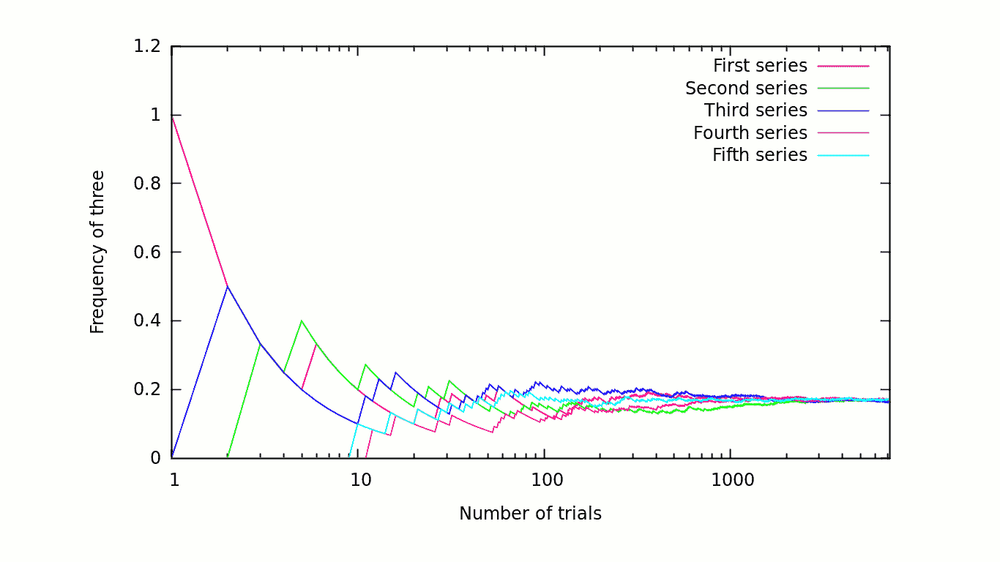
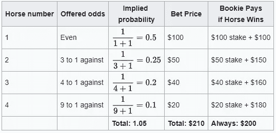
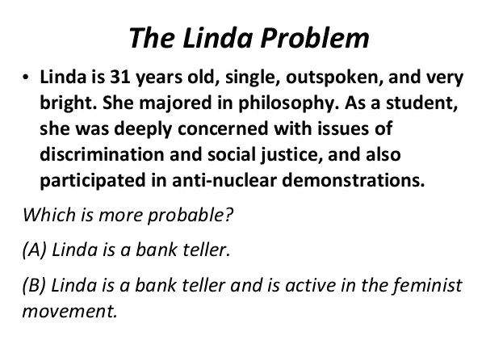

# 概率是什么？

> 原文：<https://towardsdatascience.com/what-is-probability-175b189c0498?source=collection_archive---------10----------------------->

## 理解概率的解释

Photo by [Jonathan Petersson](https://unsplash.com/@grizzlybear?utm_source=medium&utm_medium=referral) on [Unsplash](https://unsplash.com?utm_source=medium&utm_medium=referral)

# 介绍

从很小的时候起，我们就被教导概率——通常是通过使用简单的例子，如掷硬币或掷骰子。

然而，**概率**的实际定义是什么？对于像上面这样的基本例子，这似乎是显而易见的；然而，对于许多其他情况，它是模糊的。

例如，我们如何确定只发生一次的事件的概率？或者，我们如何确定涉及一组(可能是无限的)考虑因素的事件的概率，例如一个给定的人发生车祸的概率？除此之外，我们的个人信仰和经历如何影响概率？

在概率哲学领域的历史上，已经产生了各种各样的解释。每种方法都以不同的方式解决上述问题。在本文中，我将讨论概率的四种常见解释:**古典**、**频率主义者**、**主观**、**公理化**。

# 经典的

经典解释是第一次严格定义概率的尝试。它是在简单的概率游戏的背景下发展起来的，比如掷硬币或掷骰子，它关注的是有着同样可能的、互斥的结果的事件。其主要思想是**无差别原理**，该原理指出，如果存在 **N** 个互斥且集体穷尽的可能结果，那么任何一个个体结果的概率都应该是 **1 / N** 。所以，对于一个事件 **A** 对应于可能结果的 **N_A** ，那么**P(A)=****N _ A**/**N**。

## 优势

这种方法在概念上很简单，对于简单的实际例子很有用。对于没有数学或统计学背景的人来说，这是迄今为止最容易理解并应用于基本现实世界示例的方法。

## 限制

这种解释的简单性在几个方面限制了它。它不能处理具有无限可能结果的事件。它也不能处理各种结果不尽相同的事件，比如投掷一个有重量的骰子。这些限制使它不适用于更复杂的任务。

# 频率论者

接下来是频率主义者的解释，这是目前统计学中最常用的解释。频率主义者的方法关注的是一个事件在大量试验后发生的频率。形式上，如果 **N_A** 是事件 **A** 在 **N** 试验中出现的次数，那么当 **N** 接近无穷大时，比率 **N_A / N** 等于 **P(A)** 。

[https://lotharlorraine.wordpress.com/2014/01/10/knowledge-dependent-frequentist-probabilities/](https://lotharlorraine.wordpress.com/2014/01/10/knowledge-dependent-frequentist-probabilities/)

## 优势

这种方法解决了传统方法的一些问题。频率主义方法能够处理结果不尽相同的情况，因为它只关注事件的发生。这种方法也能够处理不涉及单一结果的概率。例如，如果事件是“一个随机选择的正整数是偶数”，即使没有感兴趣的特定结果(因为有无穷多个整数)，事件的概率仍然可以通过采样越来越多的整数来确定。随着我们采样越来越多的数字，概率会接近 1/2。

## 限制

尽管这种方法改进了传统方法，但它仍然有一些限制。

**【无限次】重复** 无限次重复一个实验的概念是一个思想实验，而不是实际可以做的事情。我们可以进行大量的试验，但是当然，永远不会有无限的试验。因此，当我们试图估计概率时，所获得的量不会收敛，而是围绕事件的“真实”概率振荡。如果不循环使用概率，很难量化这种程度的不确定性。

另外，频率主义者的方法没有明确的方法来处理只会发生一次的事件。并非所有概率都与可重复试验中发生的事件有关。例如，如果事件关系到一只股票明天的开盘价，就没有办法获得一个以上的样本。

# 主观的

主观解释采取了与前两种不同的方法。主观方法不是关注频率或计数，而是假设概率来源于一个人对特定事件将会发生的个人(主观)相信程度，基于他们可获得的所有相关信息。这种观点与贝叶斯统计一致，贝叶斯统计描述了随着信息的增多，人们如何调整自己的信念。

[https://www.investopedia.com/terms/s/subjective_probability.asp](https://www.investopedia.com/terms/s/subjective_probability.asp)

## 优势

这改进了先前的解释，因为它允许我们创建任何事件的概率。显然，一个人能够对任何事件有一定程度的信任，不管它发生的频率如何或者相关的结果是什么。在这种情况下，主观方法可以*包括*其他方法，因为在相关情况下，没有什么特别的原因可以解释为什么我们的个人信仰不能与频率主义者或古典方法保持一致。例如，即使在主观解释下，大多数人仍然*相信*掷硬币有 50%的机会正面朝上，因为没有证据表明硬币的任何一面更有可能。

## 限制

即使这种方法允许我们产生任何事件的概率，围绕这些概率的有效性和它们的有用性仍然存在问题。

**参考类问题** 由于概率是个人的相信程度，每个人对不同事件的概率可能不同。这可能是由于个人观点和/或不同信息的可用性。这个问题涉及到[引用类问题](https://en.wikipedia.org/wiki/Reference_class_problem)，它指的是确定某个事件的相关在先事件是什么的任务。例如，如果我们想确定某个特定的人在 2019 年发生车祸的概率，我们需要从一些相关类别的人开始。不同的人会提出不同的引用类。你可以使用一个宽泛的词，比如“美国的所有司机”，或者你可以使用一个非常具体的词，比如“该州这个城市的所有司机在这个时间驾驶那种类型的车……”。基于您决定使用的引用类，您将有不同的概率。这与贝叶斯统计中选择先验概率的任务直接相关。

**连贯性
接下来，为了让这些主观概率有用，它们必须是连贯的。为了一致，它们必须满足基本的概率定律。比如，即使在我们的主观信念中， **P(A)** 一定是 **≤ P(A 或 B)** 。这可以通过[荷兰书](https://en.wikipedia.org/wiki/Dutch_book)的论证来更好的理解。在赌博中，荷兰式赌注是一组赔率和潜在的结果，庄家保证从中获利。有人认为，为了不被赌注登记经纪人“荷兰预订”，一个理性的代理人的个人信仰程度必须是一致的。**

[https://en.wikipedia.org/wiki/Dutch_book](https://en.wikipedia.org/wiki/Dutch_book)

不管这个论点如何，已经有许多研究表明人们的个人信仰并不一致。比如[合取谬误](https://en.wikipedia.org/wiki/Conjunction_fallacy)已经被多次实验观察到，其中人们认为 **P(A) < P(A 和 B)** 。在阿莫斯·特沃斯基和丹尼尔·卡内曼的作品《T4》中，他们创造了著名的琳达问题。

显然，基于概率的公理，答案是 a。然而，通过实验，**大多数参与者选择了 B** 。我们的大脑在决策过程中使用的各种启发式方法导致参与者犯了这个错误，因为他们将社会正义的描述与积极参与女权运动的属性联系起来。一般来说，人们往往很容易陷入这些谬误。因此，在许多情况下，主观概率可能实际上是不一致的，尽管荷兰书中的例子提出了这样的观点。

# 公理的

最终的“解释”是**统一**以上三者的要求。它将相干性的定义转化为明确的数学形式。由于主观概率需要一致性，并且主观概率可以包含频率主义者和经典解释，公理化方法是包罗万象的。

这种解释由 3 个概率公理组成:

1.  对于任何事件 E，0 ≤ P(E) ≤ 1。
2.  “某个事件发生”的概率是 1。至少必须发生一个事件。
3.  互斥事件联合的概率是单个事件概率的总和。

这些公理可以用来推导许多其他事实。通过这些公理，我们可以发展一种不受主观解释影响的概率理论。