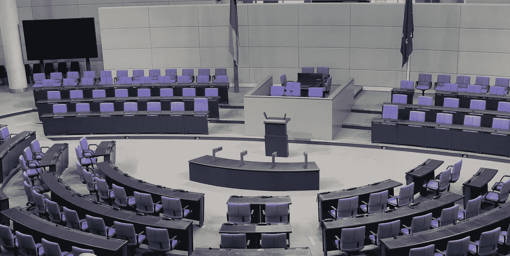
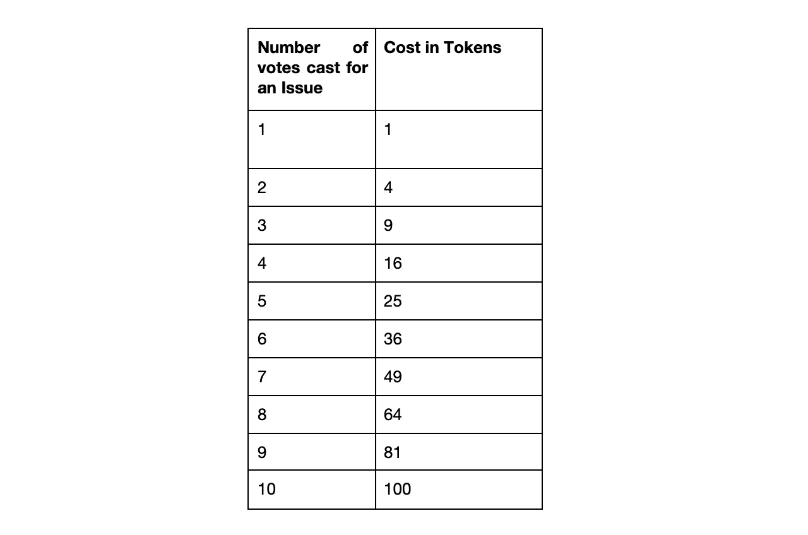

# 什么是二次投票？

> 原文：<https://towardsdatascience.com/what-is-quadratic-voting-4f81805d5a06?source=collection_archive---------8----------------------->

二次投票是一种集体决策的方法，参与者不仅投票支持或反对某个问题，还表达他们对该问题的强烈感受。它有助于保护那些深切关注特定问题的选民小团体的利益。二次投票可用于民主制度、公司治理和区块链式的集体决策。

**为什么是‘二次’？**

在二次投票中，每个参与者都被给予一定数量的信用点数，这些信用点数可用于对某个问题进行投票。然而，为一个问题投一票以上的成本是二次的，而不是线性的。所以，每增加一票的边际成本都远远高于前一票。

下面是二次投票公式:投票人的成本=(votes)^2 的数量

想象一下，对一个问题的投票通常花费 1 美元，而你有 100 美元的投票信用。你想为保护濒危物种投票。投一票将花费你 1 美元。然而，为同一问题投两票将花费您 4 美元，为同一问题投三票将花费您 9 美元，为同一问题投 10 票将花费您全部 100 美元的信用。

因此，当你每多投一票就增加了你的议题获胜的机会时，投票的二次性质确保了只有那些深切关心议题的人才会多投他们一票。

**在科罗拉多州使用**

在民主党于 2018 年赢得科罗拉多州州长和该州两院后，他们使用二次投票来决定首先资助哪些拨款法案。由于立法者可能会提出自己的法案并投票支持，民主党核心小组寻求一种方法来衡量哪些法案得到了所有人的支持。

最初，科罗拉多州民主党人给每位议员分配了 15 个代币，用于他们喜欢的 15 张钞票上。在这种方法不奏效后，他们与微软经济学家 Glen Weyl 进行了交谈，他解释了二次投票如何提供一种解决方案。

Weyl 认为二次投票是解决“多数暴政”问题的一个办法。常规投票假设每个人都平等地关心一个问题，但事实很少如此。现实情况是，一些立法者不关心某些问题，适度关心其他问题，深切关心少数问题。

因此，每个立法者都得到了 100 枚代币。如果一个立法者对几个问题各投一票，那么他们每个人就要花费一个代币。然而，立法者可以对一个问题投一票以上，其代币费用如下:

科罗拉多州的二次投票实验基本上是成功的。

**二次投票和传统的投票系统有什么不同？**

***:****在大多数民主国家采用的“得票最多者当选”制度中，候选人不需要获得大多数人的选票就可以获胜。假设候选人 A 获得 35%的选票，B 获得 30%，C 获得 24%，D 获得 11%。a 赢了，但是我们知道大多数人投票给了 a 以外的人。*

****比例投票* :** 为了解决这个问题，一些司法管辖区采用了比例投票制。在这里，如果 35%的选民投票给某个政党，那么立法机构中 35%的席位将给予该政党，以此类推。虽然这些系统可以被看作是“得票最多者当选”系统的“进化”版本，但当必须做出二元(是或否)决定时，它们就不起作用了。*

****排名选择投票* :** 在排名选择投票(加州多个辖区都在使用)中，每个投票人都会对自己喜欢的候选人进行排名。每轮投票中得票最低的候选人将被淘汰，该候选人的选票将在下一轮投票之前重新分配给下一位候选人。尽管排序选择投票有其优势，但它是一个复杂且耗时的系统。*

****二次投票* :** 尽管二次投票也很复杂，但它可以说更好地保护了那些深切关注特定问题的小投票群体的利益。通过增加每一张额外选票的成本，它抑制了那些不关心问题的选民投他们几票的积极性。它还允许选民通过投几票来显示他们对某个特定问题的支持程度——以牺牲他们对其他问题的投票能力为代价。*

***结论***

*现代民主国家在选举和立法过程中普遍实行一人一票。公司通常采用更复杂的投票机制(例如，允许股东指定其他人代表他们投票)。复杂但更民主的投票系统，如比例投票和排序选择投票，由于其复杂性，还没有被广泛接受。*

*现在，区块链支持的集体决策允许以透明、公开的方式跟踪投票，因此可以采用更复杂的投票系统。通过允许选民不仅表达他们的偏好，而且表达这些偏好的强度，二次投票保护了深深关心某些问题的小选民群体的利益。*

*—*

*[陕雷](http://www.shaanray.com)*

*关注兰萨尔研究公司的媒体，了解最新的新兴技术和新的商业模式。*