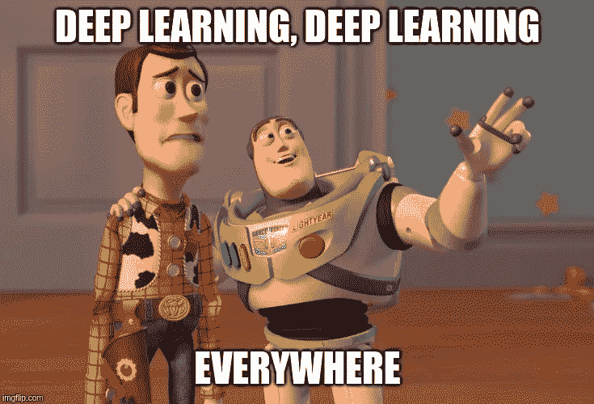
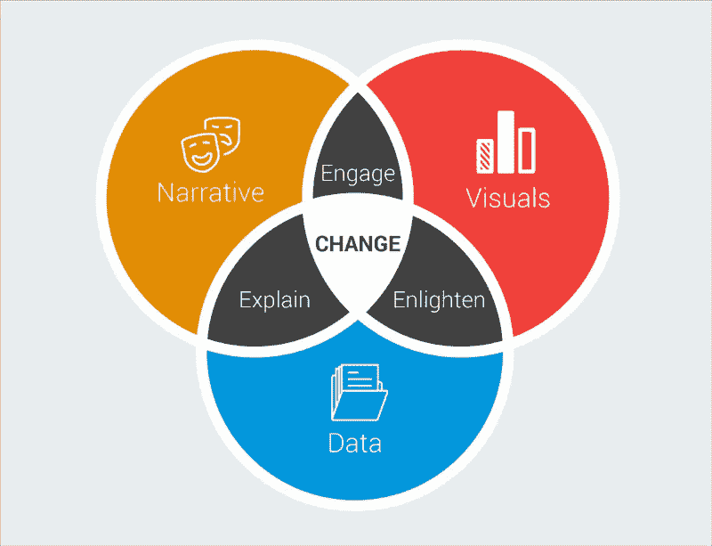

# 数据到底是关于什么的？

> 原文：<https://towardsdatascience.com/what-is-really-data-about-a60a2af1cfaa?source=collection_archive---------21----------------------->

Photo by [Helloquence](https://unsplash.com/photos/5fNmWej4tAA?utm_source=unsplash&utm_medium=referral&utm_content=creditCopyText) on [Unsplash](https://unsplash.com/search/photos/computer?utm_source=unsplash&utm_medium=referral&utm_content=creditCopyText)

# 数据科学基本思想

现在大部分文章都倾向于表现出很多执行力，一点探索。就像 Conor Deway 在他的[文章](/data-scientists-are-thinkers-a36cc186d570)上写的:

> 与工程师、设计师和项目经理不同，数据科学家是探索优先，而不是执行优先。

此外，考虑到数据科学的历史，这是相当公平的。

## 一点数据科学历史

数据科学始于“从数据挖掘到数据库中的知识发现”的数据挖掘[1]，用于发现数据中有用的知识。然后在 2001 年，威利安·s·克里夫兰试图将可用的计算能力与数据挖掘结合起来以改进统计分析，开始使用“数据科学”术语[2]。今天，数据科学涵盖了很多领域，包括数据工程师、数据分析、机器学习工程师等等。此外，最近数据科学被称为“[21 世纪最性感的工作](https://hbr.org/2012/10/data-scientist-the-sexiest-job-of-the-21st-century)”。

数据科学家的主要工具当然是数据。然而，几乎每个人都从 Kaggle 获得一些数据，运行一个复杂的模型，如 CNN 和 BOOM。我们有了一位新的数据科学家。在不了解背景以及如何正确理解数据和模型的情况下使用所有这些花哨的工具是浪费时间，或者说对于学习如何使用这些技术来说是恰到好处的。

# 数据到底是关于什么的？

这打开了一个窗口，让我们在数据问题上更进一步。数据是什么？是关于制作复杂模型的吗？很酷的可视化？写代码？统计分析？特征工程？

数据不是关于机器学习、可视化、统计和争论的。
数据关乎理解。了解问题，以及如何使用数据和您选择的任何工具或技术来解决问题。

> 理解问题。了解数据。其余的将会流动。

## 数据科学家的目标不是制造一个好的模型

如果有问题，数据科学家会尝试用机器学习来解决。我们怎么知道他是否成功了？答案可能是使用正确的指标，对吗？然而，我们必须深入挖掘。真正的衡量标准不是精度、召回率和所有这些统计指标。

> 关键指标是影响力。

作为数据科学家，我们必须利用我们的数据对我们的公司产生尽可能大的影响。这种影响可以是多方面的。这两个是看到影响的一些基本形式。

*   **洞察力**:提取有用的知识来指导你的项目开发，提供方向。例如，通过对房地产市场数据的探索性分析，您发现大约 80%的买家是男性。然而，他们的妻子最终选择了房子里的大部分东西。该信息有利于将广告导向正确的人。
*   **数据产品**:开发利用数据提供某种回报(通常是金钱)的产品。例如，可以预测糖尿病人的葡萄糖水平的产品。有了它，这个人就可以利用这些知识在正确的时间进食和使用胰岛素。

我可以使用什么工具来产生影响？

> 任何，没人在乎。

确定使用哪种技术最重要的是**理解数据**。那就让数据来说说它是怎么运作的。数据科学家需要知道如何将数据拟合到模型中，而不是将模型拟合到数据中(效果更好的模型)。Rachel Tatman 有一个很好的关于“那么你应该使用什么方法呢？”，她用他的一句话结束了她的演讲:

> 如果它是愚蠢的，但它是有效的，它就不是愚蠢的。

这意味着，如果我们的模型是简单明了的(就像 90 年代手工建立的规则),并且仍然运行良好，那么它一点也不愚蠢。

然后，让我们想象我构建了一个可以产生巨大影响的应用程序。怎么卖？例如，您正在处理来自您公司的数据集，并且您发现了一个没有人看到的模式。如何呈现给你的团队？

# 数据叙事

作为数据、叙述和视觉的结合，**数据叙事**是每个数据科学家在不久的将来都需要的热门新技能之一。

对于需要向他人解释他或她的思路的数据科学家或数据分析师来说，数据故事是一项基本技术，无论他们是否具备技术知识。在那一刻，你的沟通技巧将非常重要。毕竟，没有人喜欢看到一个蹩脚的演示文稿或阅读一篇令人讨厌的文字，对吗？

简而言之，数据故事是解释你做了什么，你是如何做的，以及你为什么这样做的行为，这一切都是为了让你的读者或听众参与进来。

> *人们听到的是统计数据，感受的却是故事。(* [*【福布斯】*](https://www.forbes.com/sites/brentdykes/2016/03/31/data-storytelling-the-essential-data-science-skill-everyone-needs/#35f9e50752ad) *)*

数据故事的目标是讲述你的数据的故事。它是人类对数据的理解。将数据拟人化为生活场景，让别人感同身受地理解数据，而不仅仅是统计。它可能涉及三个关键要素的组合:*数据*、*视觉*和*叙事*。

当叙述与数据相结合时，它有助于**向你的观众解释**数据中发生了什么，以及为什么某个特定的见解很重要。要深刻理解一部作品，通常需要大量的上下文和注释。当视觉应用于数据时，它们可以**启发**观众的洞察力，如果没有图表或图形他们是看不到的。如果没有数据可视化的帮助，数据中许多有趣的模式和异常值将隐藏在数据表的行和列中。

Source: [Forbes](https://www.forbes.com/sites/brentdykes/2016/03/31/data-storytelling-the-essential-data-science-skill-everyone-needs/#3101f7ac52ad)

最后，当叙事和视觉融合时，它们可以吸引甚至娱乐观众。毫无疑问，我们每年在电影上花费数十亿美元，让自己沉浸在不同的生活、世界和冒险中。当您将正确的视觉效果和叙述与正确的数据相结合时，您就有了一个可以影响和推动**变化**的数据故事。

大多数情况下，你必须使用叙事、视觉和数据来简化复杂的事物。用它来让每个人理解一个模糊的观点，并思考，“我以前怎么没有看到这一点？”。

## 更好地讲述数据故事的技巧

已经有一些关于数据讲故事技巧的文章和故事。其中一些如下:

 [## 带领你的老板踏上数据之旅的 10 种方式

### “人们听到的是统计数据，感受的却是故事。”福布斯，2016 年 3 月

towardsdatascience.com](/10-ways-to-take-your-boss-on-a-journey-through-the-data-14a3fdbb3503)  [## 掌握数据叙事:创建有说服力的图表的 5 个步骤

### 数据讲故事是那些“时髦词汇”中的一个，实际上并不是真正的时髦词汇——它反映了一种必要的…

www.crazyegg.com](https://www.crazyegg.com/blog/data-storytelling-5-steps-charts/)  [## 更好地讲述数据的 10 个技巧

### 作者比尔·山德。

medium.com](https://medium.com/@Infogram/10-tips-for-better-data-storytelling-3808d823bde3)  [## 来自数百年数据可视化的 7 个数据故事技巧

### 尽管信息图的复兴引发了它的复兴，但数据可视化并不是什么新鲜事。对于数百个…

www.columnfivemedia.com](https://www.columnfivemedia.com/7-data-storytelling-tips-from-centuries-old-data-visualization) 

我想在这里补充最后一点。我相信是最重要的一条。

> 阅读，很多。

阅读对于理解我们社会的功能和历史至关重要。通过发现新事物来发展我们的思维是至关重要的。此外，当我们谈论想象力和好奇心时，阅读是一个至关重要的方面。

你读得越多，你就越能理解你所读的主题。现在将它与数据科学联系起来，数据就是一切。读者可以更快地学习他所阅读的任何东西的概念。这可以让数据有意义，让数字有必要的背景，这样数字就可以变成想法和见解。

> 你读得越多，你知道的东西就越多。你学得越多，你去的地方就越多。-苏斯博士

# 参考

[1]法耶兹，乌萨马，格雷戈里 Piatetsky-夏皮罗，和帕德拉克史密斯。"从数据挖掘到数据库中的知识发现."*艾杂志* 17，第 3 期(1996):37–37。

[2]William s . Cleveland，“数据科学:扩大统计领域技术领域的行动计划”*《国际统计评论》* 69，第 1 期(2001 年):第 21–26 页。

 [## 数据科学家是思想家

### 执行与探索及其对您的意义

towardsdatascience.com](/data-scientists-are-thinkers-a36cc186d570)