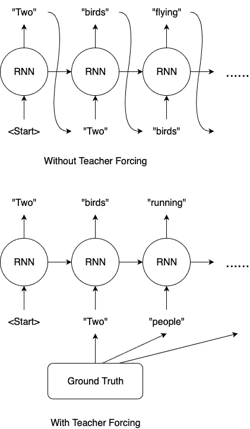

# 什么是老师逼？

> 原文：<https://towardsdatascience.com/what-is-teacher-forcing-3da6217fed1c?source=collection_archive---------5----------------------->

## 训练*递归神经网络*的常用技术

Photo by [Jerry Wang](https://unsplash.com/@jerry_318?utm_source=medium&utm_medium=referral) on [Unsplash](https://unsplash.com?utm_source=medium&utm_medium=referral)

大量的*递归神经网络*在*自然语言处理*(例如在图像字幕、机器翻译中)在训练过程中使用*教师强制*。尽管*老师逼*盛行，但大部分文章只是简单描述了它是如何运作的。比如 TensorFlow 关于[神经机器翻译的教程关注](https://www.tensorflow.org/tutorials/text/nmt_with_attention#training)只说“*老师强制*是将*目标词*作为*下一个输入*传递给解码器的技术。”在这篇文章中，我们将回顾一下*老师强迫*的细节，并回答一些常见的问题。

## 教师强制是如何起作用的？

你是否遇到过由多个部分组成的数学考试题，其中(b)部分的计算需要(a)部分的答案，而(c)部分需要(b)部分的答案，等等？我总是格外关注这些问题，因为如果我们(a)部分出错，那么所有后续部分也很可能出错，即使公式和计算是正确的。老师强迫补救如下:在我们获得(a)部分的答案后，老师会将我们的答案与正确答案进行比较，记录(a)部分的分数，并告诉我们正确答案，以便我们可以用它来做(b)部分。

输出序列的*递归神经网络*的情况非常相似。假设我们想要训练一个图像标题模型，上面图像的真实标题是“两个人在看书”。我们的模型在预测第二个单词时出错，我们在第一个和第二个预测中分别有“Two”和“birds”。

*   如果没有老师的强迫，我们会把“鸟”送回我们的 RNN 去预测第三个单词。假设第三个预测是“飞行”。尽管我们的模型预测“飞行”是有意义的，因为输入是“鸟”，但这与地面事实不同。
*   另一方面，如果我们使用*教师强制*，我们将在计算并记录第二次预测的损失后，为第三次预测将“人”喂给我们的 RNN。

## 教师强制的利弊

## 优点:

用*老师逼*训练收敛更快。在训练的早期阶段，模型的预测非常糟糕。如果我们不使用*老师强制*，模型的隐藏状态会被一系列错误预测更新，误差会累积，模型很难从中学习。

## 缺点:

在推断过程中，由于通常没有实际情况可用，RNN 模型需要将自己之前的预测反馈给自己，以便进行下一次预测。因此，训练和推理之间存在差异，这可能导致模型性能差和不稳定。这在文献中被称为*曝光偏差*。

## 实现示例

*   TensorFlow:注意看[神经机器翻译的“训练”环节](https://www.tensorflow.org/tutorials/text/nmt_with_attention#training)
*   PyTorch:参见 [NLP 的“训练模型”环节从无到有:从序列到序列网络的翻译和注意力](https://pytorch.org/tutorials/intermediate/seq2seq_translation_tutorial.html#training-the-model)

## 常见问题

问:既然我们通过 RNN 模型传递整个基本事实序列，那么该模型有可能通过简单地记忆基本事实来“作弊”吗？

答:没有。在时间步 *t* 时，模型的输入是时间步 *t - 1* 的地面真值，模型的隐藏状态已经被时间步 *1* 到 *t - 2* 的地面真值更新。模型永远无法窥视未来。

问:有必要在每个时间步更新损失吗？

答:不。另一种方法是将所有时间步长的预测存储在一个 Python 列表中，然后一次性计算所有损失。

问:*老师强制*是用在*自然语言处理*之外吗？

答:是的。它可以用于任何输出序列的模型，例如时间序列预测。

问:*老师强制*是在*递归神经网络*之外使用的吗？

答:是的。它用于其他自回归模型，如 Transformer。

## 进一步阅读

1.  已经发明了许多算法来减轻*曝光偏差*，例如*预定采样* [1】和*并行预定采样* [3】，*教授强制* [5】，以及*光束搜索* [2]，[6]。
2.  [4]的结果表明*暴露偏差*可能不像假设的那样显著。

## 参考

1.  南本吉奥、o .维尼亚尔斯、n .贾伊特利和 n .沙泽尔。[递归神经网络序列预测的预定采样](http://papers.nips.cc/paper/5956-scheduled-sampling-for-sequence-prediction-with-recurrent-neural-networks) (2015)，NeurIPS 2015。
2.  R.科洛伯特、a .汉南和 g .辛纳伊夫。[一种全微分波束搜索解码器](http://proceedings.mlr.press/v97/collobert19a/collobert19a.pdf) (2019)，ICML 2019。
3.  D.杜克沃斯，a .尼拉坎坦，b .古德里奇，l .凯泽和 s .本吉奥。[平行预定抽样](https://arxiv.org/abs/1906.04331) (2019)，arXiv。
4.  T.何，张军，周，格拉斯。[量化神经语言生成的暴露偏差](https://arxiv.org/abs/1905.10617) (2019)，arXiv。
5.  A.Lamb、A. Goyal、Y. Zhang、S. Zhang、和 Y. Bengio。[强迫教授:训练递归网络的新算法](https://papers.nips.cc/paper/6099-professor-forcing-a-new-algorithm-for-training-recurrent-networks) (2016)，NeurIPS 2016。
6.  南怀斯曼和拉什。[作为波束搜索优化的序列间学习](https://www.aclweb.org/anthology/D16-1137/) (2016)，EMNLP 2016。