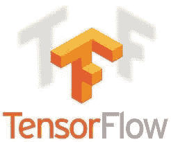
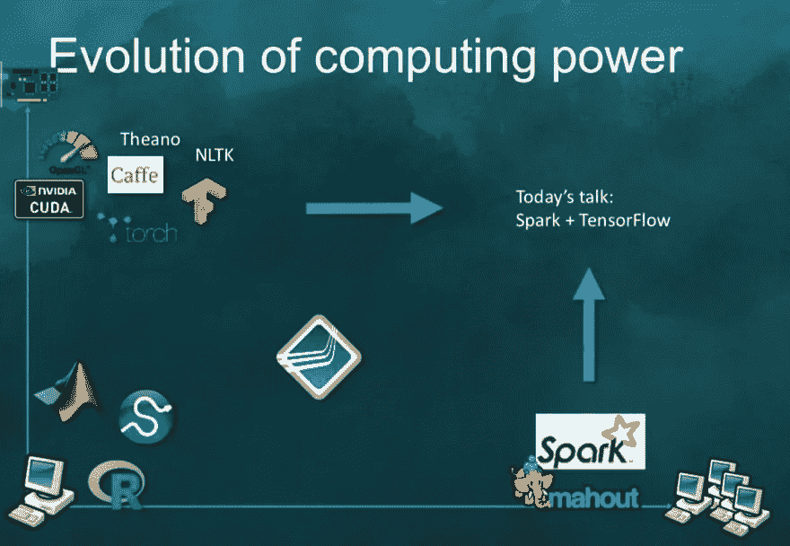
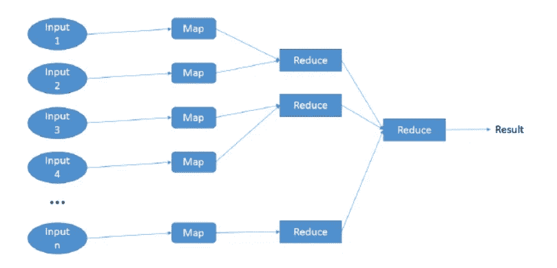
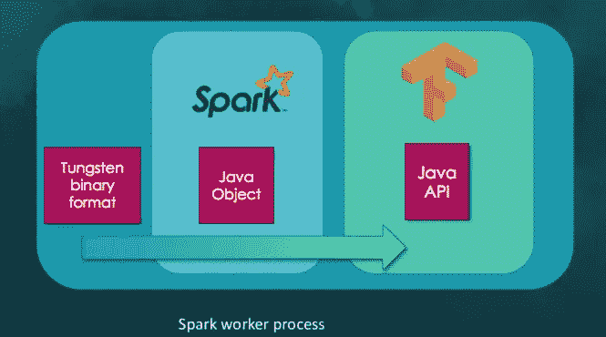

# 什么是张量框架？TensorFlow + Apache Spark

> 原文：<https://towardsdatascience.com/what-is-tensorframes-tensorflow-apache-spark-a385ec4bc1d5?source=collection_archive---------24----------------------->


**首先，什么是张量框架？**

TensorFrames 是由 Apache Spark 贡献者创建的开源软件。其函数和参数的命名与 TensorFlow 框架中的相同。它是 Apache Spark 数据帧的 Apache Spark DSL(特定领域语言)包装器。它允许我们用 TensorFlow 功能操作数据帧。而且不，它是**而不是** [熊猫数据帧](https://www.tutorialspoint.com/python_pandas/python_pandas_dataframe.htm)，它是基于阿帕奇 Spark 数据帧。

**..但是等等，TensorFlow (TF)是什么？**

TensorFlow 是一个开源软件库，用于数据流和跨一系列任务的差异化编程。它是一个符号数学库，也用于机器学习应用，如神经网络。



**..还有阿帕奇 Spark？**

Apache Spark 是一个开源的分布式通用集群计算框架。


## 关于规模的一句话

今天当我们提到规模时，我们通常会谈到两种选择；水平缩放和垂直缩放。

*   **水平刻度** —添加额外的具有大致相同计算能力的机器
*   **垂直比例** —为我们目前使用的机器增加更多资源。它可以是从 CPU 升级到 GPU 的处理器、更多内存(RAM)等等。

有了 TensorFrames，我们可以两者兼得，更多的处理器计算能力，更多的机器。在只有 TensorFlow 的情况下，我们通常专注于通过垂直扩展来增加更多功能，现在有了 Apache Spark 支持，我们可以同时进行垂直和水平扩展。但是，我们怎么知道我们实际上需要多少呢？要回答这个问题，我们需要了解应用程序的全部使用情况，并相应地进行规划。

对于每个变化，比如增加一台机器或从 CPU 升级到 GPU，我们都有*停机时间。*在云中，调整集群大小或增加更多计算能力只需几分钟，而在本地，我们需要添加新机器和升级机器处理器，这可能需要几天，有时甚至几个月。

因此，更灵活的解决方案是公共云。

在下图中，水平缩放是 X 轴，垂直缩放是 Y 轴。



* * Apache Spark conf 上蒂姆·亨特演示的幻灯片

# 在开始函数之前，让我们了解一些重要的张量流词汇:

## 张量

一个静态类型的多维数组，其元素属于泛型类型。

## GraphDef

`Graph`或`Computional Graph`是 TensorFlow 呈现计算的核心概念。当我们使用 TensorFlow 时，我们首先创建自己的`Computation Graph`，并将`Graph`传递给 TensorFlow。`GraphDf`是`Graph`的连载版。

## 操作

对张量执行计算的图形节点。操作是`Graph`中的一个节点，它将零个或多个`Tensors`(由图中的其他操作产生)作为输入，并产生零个或多个`Tensor`作为输出。

## 身份

当我们想要在设备之间显式传输张量时(例如，从 GPU 到 CPU)，使用`tf.identity`。该操作将节点添加到图中，当输入和输出的设备不同时，该操作会生成一个副本。

## 常数

常量有以下参数，可以根据需要调整这些参数以获得所需的函数。它和变量一样，但是它的值不能改变。常数可以是:

*   `value`:输出类型`dtype`的常量值(或列表)。
*   `dtype`:结果张量的元素类型。
*   `shape`:结果张量的可选维度。
*   `name`:张量的可选名称。
*   `verify_shape`:允许验证值的形状的布尔值。

## 占位符

为数据分配存储空间(例如，在输入期间为图像像素数据分配存储空间)。初始值不是必需的(但可以设置，见`tf.placeholder_with_default`)。相对于变量，你需要声明初始值。\

# 一些 Apache Spark 词汇

## 数据帧

这是一个*分布式的*数据集合，这些数据被组织成命名的列，这些列提供过滤、分组或计算集合的操作。Dataframe 数据通常分布在多台机器上。它可以在内存数据中，也可以在磁盘上。

## RelationalGroupedDataset

由 [groupBy](http://maxpumperla.com/java-book/api/scala/org/apache/spark/sql/Dataset.html#groupBy(col1:String,cols:String*):org.apache.spark.sql.RelationalGroupedDataset) 、 [cube](http://maxpumperla.com/java-book/api/scala/org/apache/spark/sql/Dataset.html#cube(col1:String,cols:String*):org.apache.spark.sql.RelationalGroupedDataset) 或 [rollup](http://maxpumperla.com/java-book/api/scala/org/apache/spark/sql/Dataset.html#rollup(col1:String,cols:String*):org.apache.spark.sql.RelationalGroupedDataset) 创建的一组在`DataFrame`上聚合的方法。

主要方法是`agg`函数，它有多个变量。为了方便起见，该类还包含一些一阶统计量，如`mean`、`sum`。

现在我们更好地理解了术语，让我们看看功能。

# 功能— TensorFlow 版本 0.6.0

众所周知，Apache Spark 是一个大规模数据分析平台，与 TensorFlow 一起，我们得到了 TensorFrames，其中包含三类数据操作:

让我们来了解一下每个功能。

```
-1- Mapping
```

映射操作将列转换和/或添加到给定的数据帧中。

每个功能都通过两个 API 来访问，一个接收 Operation，另一个接收 DataFrame、GraphDef 和 ShapeDescription。

公开的 API:

## 映射行

`def mapRows(o0: Operation, os: Operation*): DataFrame`

对于用户来说，这是更常用的函数，因为没有创建 GraphDef 和 ShapeDescription 对象的直接请求。对于有经验的 TensorFlow 开发人员来说，这种方式更具可读性:

mapRows 接收两个参数 operation 和 operation*，这意味着第二个操作可以是操作的集合。随后，它将它们转换成一个序列，并将其转换成一个图形，它从图形中创建 ShapeDiscription，并将其与数据帧一起发送给一个内部函数。其中它根据图中给出的变换逐行变换分布式数据。图中的所有输入都应该用给定数据帧或常数中的一些数据填充。意思是，我们不能用 null。最后，该函数返回一个带有新模式的新数据帧，该模式将包含原始模式**以及与图形输出相对应的**新列。ShapeDiscription 提供了输出的形状，它在幕后用于优化和绕过内核的限制。

## 地图块

执行与`MapRows`类似的任务，但是，因为它是针对压缩优化的，所以它在数据块中应用图形转换器，而不是逐行应用。

`def mapBlocks(o0: Operation, os: Operation*): DataFrame`

经常使用的函数是:

代码示例:我们创建类型为 DataFrame 的 *val df* ，有两行，一行包含值 1.0，第二行包含值 2.0。列名是 x。

*val x* 是输出占位符的声明， *y* 是从 CPU 到 GPU 或从机器到机器传输张量的标识，它接收 *val x* 作为它的值。

*z* 是计算函数本身。这里，`df.MapBlock` functions 得到两个操作， *y* 和 *z* ，并返回一个名为 *df2* 的新数据帧，多了一列 *z* 。 *z* 列是输出中的 *x+x.* 之和，*列 x* 是原始值，*列 y* 是相同值，*列 z* 是图形的输出。

## 地图区块规划

这与`MapBlock`相同，但是，它从结果数据帧中删除了原始数据帧列。这意味着输出数据帧将只包含计算出的列。

`def mapBlocksTrimmed(o0: Operation, os: Operation*): DataFrame`

让我们来看看:

代码示例:我们创建一个名为 *df* 的 DataFrame，其中两行的值分别为 3.0 和 4.0。**注意**我们创建了一个名为 *out* 的常数，值为 1.0 和 2.0，这个常数是 TensorFrame dsl 功能，模拟 TensorFlow 功能。然后我们叫`df.MapBlocksTrimmed`。输出模式将只包含名为“out”的结果列，在我们的例子中，它只包含常量值 1.0 和 2.0。

**重要提示**在第一行代码中，我们导入 TesnorFrames dsl，并将其命名为 tf，代表 TensorFlow，我们这样做是因为这是 TesnorFlow 用户过去使用它的方式，并且我们坚持 TensorFlow 的最佳实践。

```
-2- Reducing
```

归约操作合并一对或一组行，并将它们转换成一行，然后重复相同的操作，直到剩下一行。在幕后，TensorFrames 通过首先减少每台计算机上的所有行，然后通过网络发送剩余的行来执行最后的减少，从而最大限度地减少了计算机之间的数据传输。

`f(f(a, b), c) == f(a, f(b, c))`

transforms 函数必须被归类为[态射](https://en.wikipedia.org/wiki/Morphism):它们完成的顺序并不重要。在数学术语中，给定一些函数`f`和一些函数输入`a`、`b`、`c`，以下必须成立:



通过 [Christopher Scherb](https://www.researchgate.net/profile/Christopher_Scherb) 映射 reduce 模式

reduce 功能 API，和其他的一样，我们每个功能有 2 个 API，接收操作的那个更直观，但是在 TensorFlow 中没有直接的 reduce rows 操作，而是有很多 reduce 操作，比如`tf.math.reduce_sum`和`tf.reduce_sum`。

## 减少行数

该功能使用 TensorFlow 操作将两行合并在一起，直到剩下一行。它接收数据图表、图形和形状描述。

`def reduceRows(o0: Operation, os: Operation*): Row`

用户界面:

在下一个代码示例中。我们创建一个 DataFrame，在中有一个名为*的列和两行。dtype 和 x 的占位符 x1 和 x2——这是 x1 和 x2 的加法运算。reduceRows，返回一个值为 3 的行，该值为 1.0 和 2.0 之和。*

## 减少块

与`ReduceRows`的工作原理相同，但是，它是在行的向量上工作，而不是逐行工作。

`def reduceBlocks(o0: Operation, os: Operation*): Row`

更多使用的功能:

代码示例:这里我们创建一个包含两列的 data frame—*key 2*和 *x* 。一个占位符名为 *x1* ，一个 reduce_sum 张量流操作名为 *x* 。reduce 功能根据 reduce_sum 以其命名的所需列返回 DataFrame 中各行的总和，即 *x* 。

```
-3- Aggregation
```

`def aggregate(data: RelationalGroupedDataset, graph: GraphDef, shapeHints: ShapeDescription): DataFrame`

聚合是 Apache Spark 和 TensorFlow 的额外操作。它不同于 TensorFlow 中的聚合功能，使用 RelationalGroupedDataset。API 功能:

Aggregate 接收一个 RelationalGroupedDataset，这是一个 Apache Spark 对象，它包装数据帧并添加聚合功能、一系列表达式和一个组类型。

聚合函数接收图形和 ShareDescriptiom。它使用分组数据的归约变换将行聚合在一起。当数据已经按键分组时，这很有用。目前，只支持数字数据。

代码示例:在这个示例中，我们有一个包含两列的 DataFrame， *key* 和 *x* 。 *x1* 作为占位符， *x* 作为名为 *x* 的 reduce_sum 功能。

使用 *groupby* 功能，我们按键对行进行分组，之后，我们用操作调用 *aggregate* 。我们可以在输出中看到，聚合是根据*键*计算的，对于值为 1 的键，我们接收 2.1 作为*列 x* 的值，对于值为 2 的键，我们接收 2.0 作为*列 x* 的值。

# 张量框架基本过程



在所有 TensorFrames 功能中，数据帧与计算图一起发送。DataFrame 表示分布式数据，这意味着在每台机器上都有一大块数据要经过图形操作/转换。这将发生在每台有相关数据的机器上。钨二进制格式是经过转换的实际二进制内存数据，首先转换到 Apache Spark Java 对象，然后从那里发送到 TensorFlow Jave API 进行图形计算。这都发生在 Spark worker 进程中，Spark Worker 进程可以旋转许多任务，这意味着在内存数据上同时进行各种计算。

# 值得注意的

*   scala 的 DataFrames 目前是 T21 的一个实验版本。
*   Scala DSL 只有张量流变换的一个子集。
*   TensorFrames 是开源的，可以支持[这里](https://github.com/databricks/tensorframes)。
*   Python 是 TensorFlow 支持的第一种客户端语言，目前支持大多数特性。越来越多的功能被转移到 TensorFlow 的核心(用 C++实现)，并通过 C API 公开。后来通过其他语言 API，如 Java 和 JavaScript 公开。
*   有兴趣与 Keras 合作吗？查看 [Elephas:使用 Keras & Spark](https://github.com/maxpumperla/elephas) 的分布式深度学习。
*   对公共云上的 TensorFrames 项目感兴趣？检查[这个](https://docs.microsoft.com/en-us/learn/paths/azure-fundamentals/?WT.mc_id=devto-blog-adpolak)和[这个](/get-started-with-apache-spark-and-tensorflow-on-azure-databricks-163eb3fdb8f3)。

**现在你对 TensorFrames 有了更多的了解，你将如何推进它？**

在 [Twitter](https://twitter.com/AdiPolak) 上关注我，很乐意接受您的话题建议。